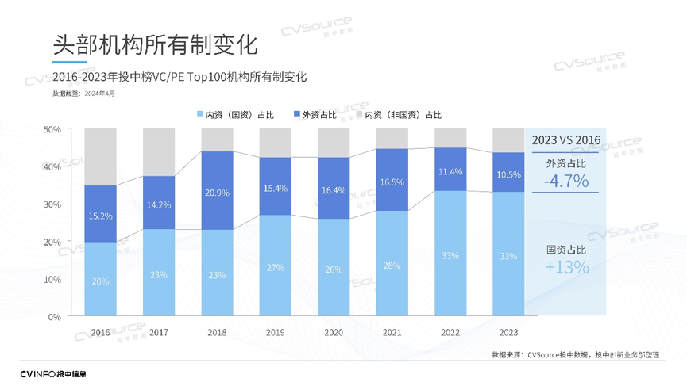
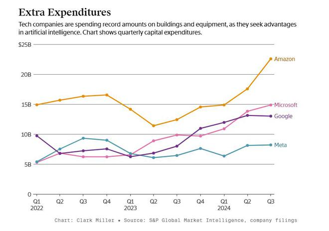
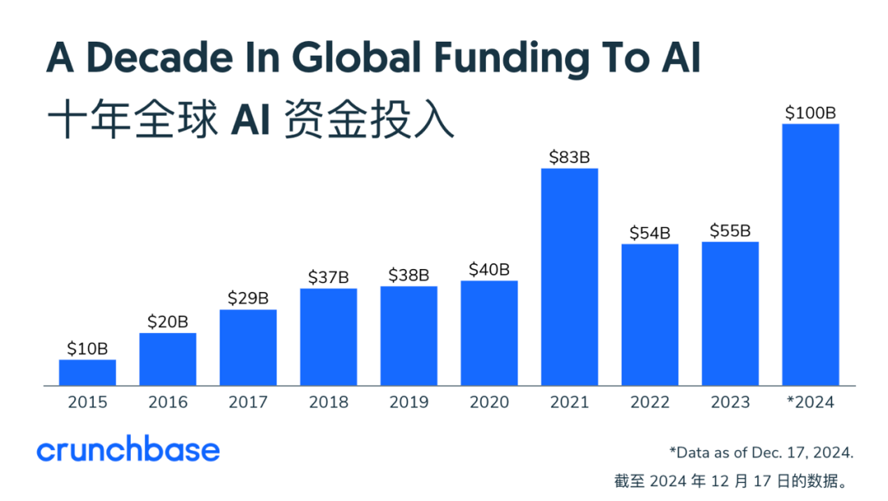
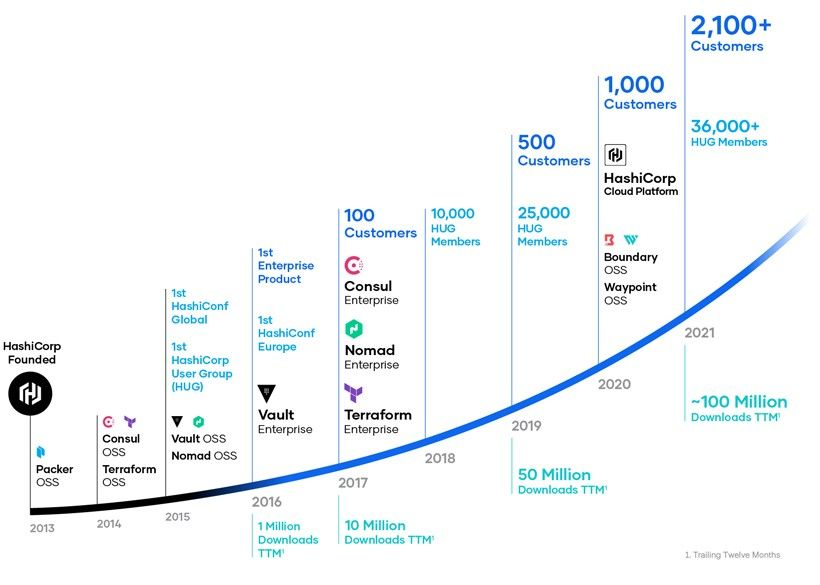
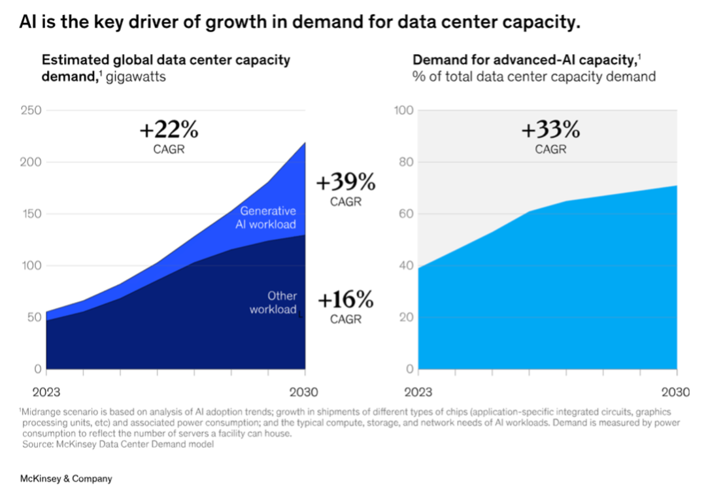
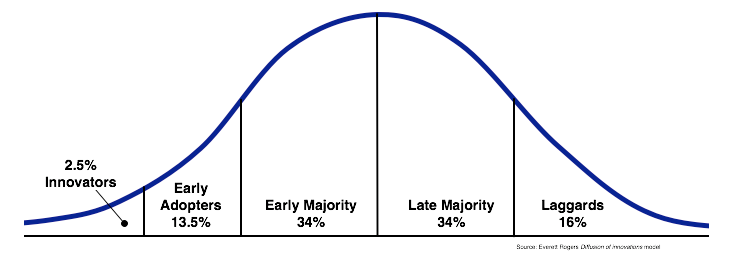
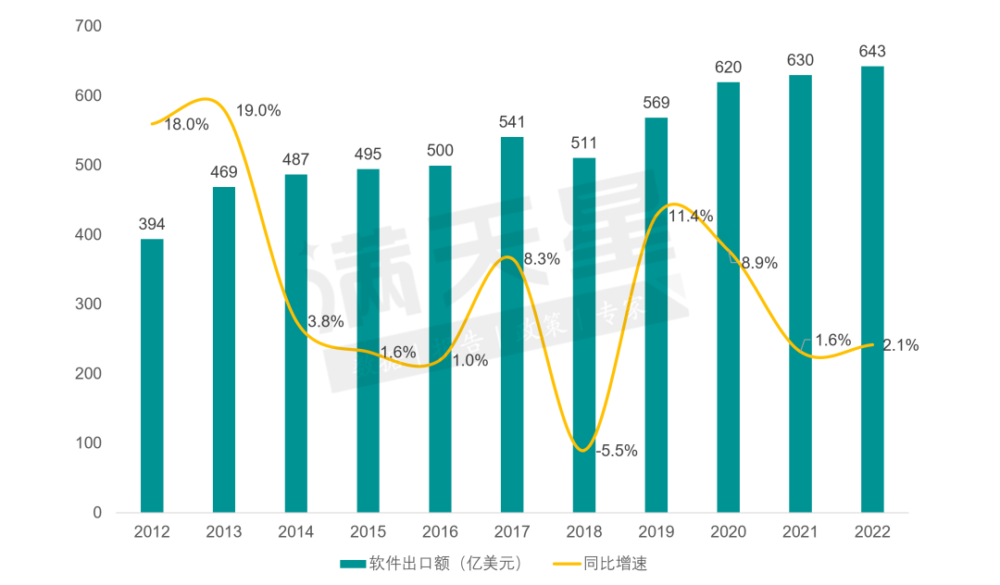
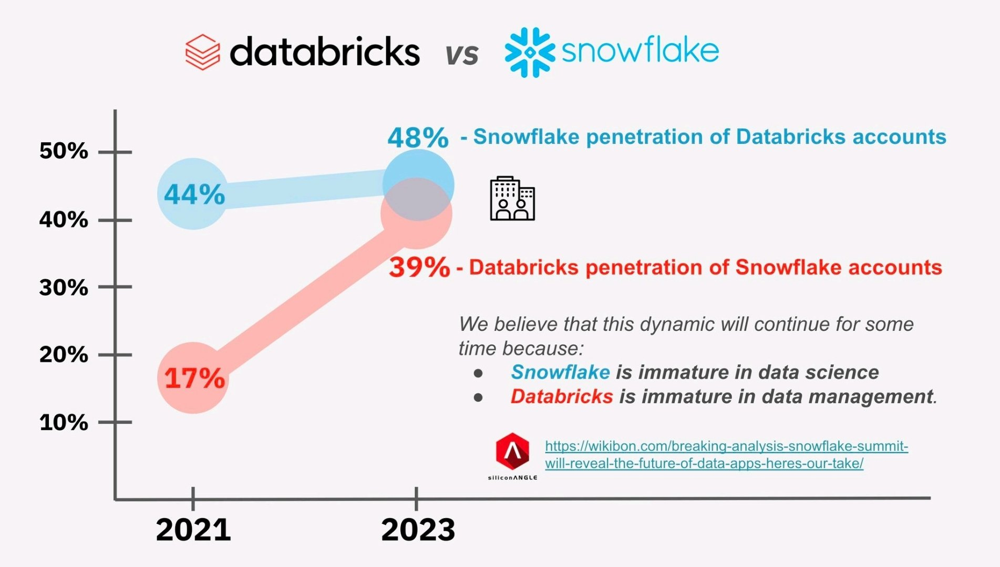
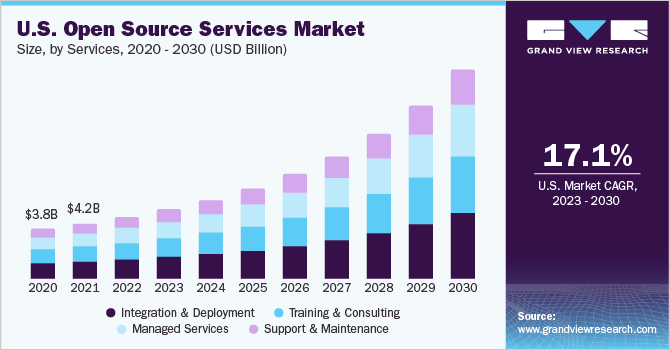
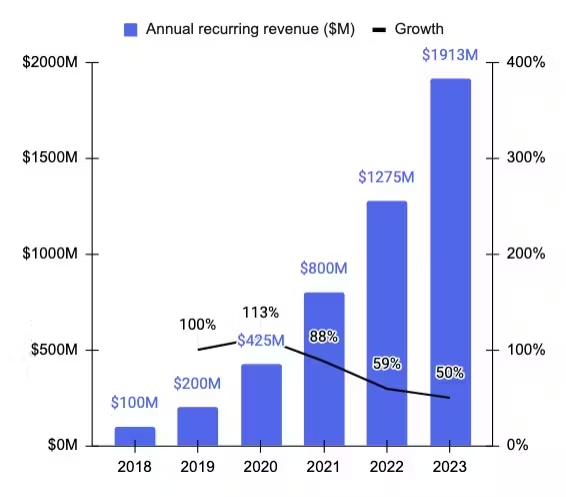

# オープンソースビジネス編
### 概要：

オープンソースソフトウェアの商業化とは、オープンソースソフトウェアを基盤として、さまざまな戦略やビジネスモデルを通じて、その技術やサービスなどを収益化可能な事業に転換し、経済的価値と持続可能な成長を実現するプロセスを指します。オープンソースソフトウェアの商業化能力は、ソフトウェアとそのエコシステムの持続可能な発展における重要な原動力であり、同時にオープンソースソフトウェア企業が成長過程で直面する最も困難な課題の一つです。

過去のオープンソース年報では、商業化に関する内容は総合的な研究報告書形式で発表され、当時クラウドクイキャピタルの投資家であった徐至行氏が執筆を担当。内容の充実度、客観性、洞察の深さは高く評価され、中国オープンソース産業の研究に重要な資料を提供してきました。

今年はインタビュー形式で商業化編の内容を構成し、オープンソース技術、基礎ソフトウェア、クラウドサービスに特化した4名の投資・融資専門家をインタビューしました。彼らは**徐至行（国方創新）、劉景媛（徳聯資本）、丁寧（INP）、劉超（Atypical Ventures）**です。インタビューでは、過去数年間のオープンソースソフトウェア分野の発展をまとめ分析し、今後の資本市場への展望を述べました。 また、彼らは自身のキャリアにおける同分野への理解と洞察、およびオープンソース企業の商業化と成長に関する経験と見解を率直に共有しました。

## 「オープンソースをツールとして活用し、内功を磨いて寒波を乗り切る」
### インタビューゲスト： 徐至行（国方創新）

_徐至行氏との今回のインタビューでは、インフラストラクチャ、クラウドサービス、オープンソース技術など複数の重要なテーマをカバーし、投資動向、ソフトウェア開発の未来、人工知能技術の応用と発展について議論されました。また、彼が理解する資本熱と経済サイクルの関係、現在のビジネス環境がスタートアップ企業とベンチャーキャピタルに与える課題についても言及されました。_

_また、徐至行は米中間のソフトウェア商業化とユーザー課金習慣の主要な違いを強調しつつ、AIとオープンソースソフトウェアが寒波の中での希望をもたらすと指摘しました。彼は、ソフトウェアの未来は伝統的なビジネスモデルを超え、よりスマートなサービスとアプリケーションへと移行する可能性があると強調しました。多くの課題に直面しつつも、徐至行はテクノロジー業界の未来に楽観的であり、継続的なイノベーションと技術進歩が業界発展の鍵となるだろうと述べました。_

### 最近の資本市場におけるオープンソースへの投資は冷静化傾向にあるが、その要因は何か？将来は積極的か？

現在の資本は経済サイクルと密接に関連している。多くの要因は商業起業自体に影響を与えるだけでなく、全体的な経済環境とも密接に関連している。例えば、2008年の金融危機以来、中国の対外貿易状況とグローバル化のプロセスも著しい変化を遂げた。現在、全体的な商業環境は良好ではなく、企業は慎重な姿勢をとり、信用環境は明らかに緊縮傾向にある。

AI技術には広範な可能性がありますが、北米は金融市場と経済状態が比較的良好であり、現在利下げサイクルにあるため、相対的に有利な状況にあります。また、十分なイノベーションリソースを保有しています。

一方、国内では基盤となるイノベーションリソースの投入が不足しており、慎重な姿勢が広まっているため、持続的な成長が可能な分野は限定的です。したがって、長期的に見ると、イノベーションを推進する上で相当な課題が存在します。

### 企業と起業チームは新たなリソース支援をどのように探すべきでしょうか？

まず、リスク投資の分野において、私は深い実感を持っています。中国のリスク投資市場、特に株式投資市場は、現在大きな変革の真っ只中にあります。

この変化は周期的なものではありません。なぜなら、一部の金融モデルは固定された形態下で周期的なものだからです。私たちは多くのビジネスモデルを分析し、中国の一次市場でも顕著な変化が起きていることを確認しました。過去には、シリコンバレーのモデルを模倣したり、そのまま採用したりする典型的な手法が主流でした。ベンチャーキャピタル、特にテクノロジー分野のベンチャーキャピタルはシリコンバレーで生まれました。過去には、このビジネスモデルを継承し、ドル資金を使用し、その資金も米国から調達し、米国の投資論理に従ってプロセスを継続してきました。

しかし、現在の状況は過去と比べていくつかの違いがあります。まず、国内の科学技術イノベーション企業の成長サイクルが変化し、米国科学技術企業との成長サイクルが同期しなくなっています。さらに、米中関係の緊張は科学技術分野にも波及しています。今年初めの法案はドル投資に深刻な影響を与え、国内の一部分野で資金不足が発生しました。しかし、これは科学技術イノベーション分野の投資需要が減少したわけではなく、むしろ新たな支援方法を探求している最中であることは、皆が認識しています。

国内経済力の成長に伴い、国内の人民元建てテクノロジー投資機関が台頭し始めています。これにより、投資手法がドル投資から人民元投資へと変化しています。人民元投資は現在困難と課題に直面していますが、地方政府の支援が徐々に増加する中で、この転換は進行中です。これは探索的なプロセスであり、国内の一次市場株式投資の将来の形態は予測困難な状況となっています。 一次市場で議論されている「定額投資」現象と同様に、投資家が退出時に得られるリターンは、彼らのビジネスモデル、販売する製品、原材料コストなどの要因に依存します。

国内の二次市場と金融環境の変化は、この現象にさらに影響を及ぼしています。したがって、私はこの変化が国内の早期テクノロジー分野において、どのような資金やエネルギーの注入を求めるか、という形で表れていると考えています。

人民元ファンドは人民元を主体とする傾向が強く、これも一種の探索です。明らかに、これは過去のドル投資のモデルに従うものではなく、プロセス全体を最適化する新たな方法を探る必要があり、これが現在の業界関係者にとっての課題です。全体として、一次市場のこれらの変化は資金不足を引き起こし、過去数年間と比べて状況は大きく異なっています。

では、リスク投資に頼らない場合、何に頼るのかという問題は、非常に重要な問いとなります。私は、段階的には実際のビジネスサイクルの下流が提供するユーザーニーズにも依存するでしょう。

**私は、中国の資本市場と早期テクノロジー投資分野は変革を遂げるでしょう。これは私たち全員が共同で探求すべき課題です。投資は単なる投資機関の行為ではなく、被投資企業と共に成長するプロセスです。中国の実情に合った発展の道筋を共に探求する必要があります。**

したがって、この時点では、人々の見解に明確な違いが現れています。例えば、起業家が現在海外市場に焦点を当てた純粋な海外進出戦略を採用するというのは、一つの探索方法です。しかし、中国市場への参入可能性を残したい場合、中国市場は巨大な市場であり、独自の特性を持つため、**中国市場での発展経路と投資リソースの連携問題**は、私たち共同で探求すべき課題です。

### つまり、できるだけ早く商業化計画を立てるべきですか？

私は早期に商業化を進めるべきだと考えますが、商業化という言葉は使わない方がいいかもしれません。以前はPMF（Product-Market Fit）や財務モデルの確立を指していました。最近、北米のチームとも議論しましたが、経済環境が良好でも皆現実的になっています。毕竟、インターネットバブルなどの経験もあるからです。

現在、投資対象のプロジェクトは主に2つのカテゴリーに分けられます。米国では、非常に優秀な創業者やチームを除き、大多数のプロジェクトは実際の成長ポテンシャルを重視されます。つまり、一定期間運営した製品のデータがどうなっているかを確認するのです。

北米のビジネス環境が優れているのは、多くの小規模企業がシードユーザーを比較的容易に見つけられるためです。YCの多くのプロジェクトは、短期間の運営で有料化を開始できる基盤があります。その後、将来の収入拡大の可能性を評価し、創業者だけの夢ではなく、現実的なビジネスモデルが確立されているかが重要です。

国内でも同様で、段階的に少量の検証を行った後、次のステップである「スケールアップ」を検証する必要があります。チームがまだ小さい段階では、成長の傾向を見極め、発展過程で投資家の資金に依存せず、多角的な支援を受けることが重要です。資金調達により初期段階でファンドからの優位性は得られますが、ユーザーが有料化を必要としない習慣を定着させないよう注意が必要です。 以前には、投資家が初期段階を支援するため、ユーザーがすべてのリソースを無料で利用し、プラットフォームが成功してから支払うという誤った期待が生まれました。

現在の環境が不変の場合、リソースと資金にはコストが伴います。このような条件下でどう対応するかを考える必要があります。もちろん、将来は変化する可能性もあります。興味深いのは、変化自体が新たな機会を提供することです。

### 過去1年間、基礎大モデルの間で「無料」「価格戦争」の形で開発者や顧客を惹きつける動きが見られましたが、これはソフトウェアの有料化に「無料利用」の暗示を与える可能性はないでしょうか？

確かに、これは典型的な現象です。Cエンドには独自のビジネスモデルがあります。多くの企業向けソフトウェアはBエンド市場をターゲットにしていますが、中国の中小Bエンド顧客が中心となるコア市場には、いわゆる「小BがCをサービスする」モデルや、専門開発者が専門ユーザーを対象とする中間層が存在します。この中間層の存在は市場変革の要因の一つです。 例えば、サービスがC端に近づくと、「無料利用」現象に直面し、これはサービス提供者の生存を脅かすだけでなく、彼らの有料利用意欲を低下させます。しかし、市場環境が改善し、これらのサービス提供者の収益や経営状況が好転すると、彼らは有料利用意欲を示す可能性があります。

この現象は、中国とアメリカ間の市場差異において特に顕著です。両国の差異の核心はソフトウェアの課金構造の違いにあります。ソフトウェアの次元では、主要な収入は国有企業や中央企業から得られ、逆ピラミッド型の構造を形成しています。これらの企業は課金比率が非常に高いですが、中小規模の機関は数が多いものの、商業への貢献は相対的に限定的です。

この構造により、基盤市場の安定性は頭部企業の支援に依存せざるを得ません。これらの企業の特徴は、強い発言権を有し、より多くのサービス割合を必要とするか、またはカスタマイズされたニーズを持つ点にあり、これらはすべてその強い発言権から生じる差異に起因しています。一方、北米市場の課金構造は必ずしも正のピラミッド形ではありませんが、少なくとも中堅企業の規模が大きく安定しているため、強い複利効果を有しています。

オープンソースが存在するのは、本質的にソフトウェアだからです。しかし、私たちが今日議論しているのは、単なるオープンソースソフトウェアではなく、国内のソフトウェアエコシステムが直面する課題です。なぜソフトウェアの粗利益率が高いと感じるのでしょうか？これは、製造業と比べてソフトウェアは理論上、高い複製性を持つからです。コードやコピーを全員に提供しても、追加コストはかかりません。これが粗利益率が高い理由です。 しかし、この複製性は主に横方向の複製シーンに存在し、トップ企業間では複製性が低くなります。

本質的に、ソフトウェアの生産コストにおける優位性はそれほど顕著ではありません。北米の正の金字塔型モデルでは、中間層の状態が良好です。 しかし国内ではこの部分が小さく、安定性が低く、ユーザー習慣の変更が必要となります。国内は市場化度が低く、理論上は適者生存の原理が働き、劣るものは淘汰されます。しかし需要は依然存在するため、新たな代替品が生まれる可能性があります。

### AI分野にさらなる機会は存在するでしょうか？

まず基礎となる大規模モデルです。現在、オープンソースモデルとクローズドソースモデルの両方が継続的に注目すべき対象です。

その上層には中間層に位置する「AIインフラストラクチャ」と呼ばれる層があります。これはモデルの上位、アプリケーションの下位に位置し、開発者の参画度が高い典型的な層です。オープンソースは開発者エコシステムに有利なため、この層でのオープンソース活動は比較的活発です。

さらに上層にはオープンソースのアプリケーション、つまりAIを活用したアプリケーションが存在します。現在、AIアプリケーション分野では一部のオープンソースプロジェクトが存在しますが、まだ多くはなく、さらなる発展が期待されます。

基礎ソフトウェア分野において、伝統的な中間層に類似する部分では、特に国内と海外の事業を区別する際、海外市場は実際には非常に活発です。この活況の背景には、AIインフラが普及する以前から、北米地域で商業化が比較的成功した事例が存在した事実があります。これらの事例は、業界に明確な発展の道筋と潜在的な機会を提供しました。この層は従来のデータインフラと一部類似していますが、より細分化され垂直的な分野にも及ぶことがあります。

**それでも、エコシステムが成熟するまで、成熟した製品体系が形成される可能性は低いでしょう。そのため、国内市場はより大きな課題に直面するでしょう。**これは私の個人的な見解ですが、このような環境下でもスタートアップ企業は一定の熱気を維持しており、積極的に資金調達を模索し、多くの資本から評価を受けています。今後、この分野のトップ企業の動向に注目していく必要があります。

### AI分野の中間層には多くの細分化された方向性があります。企業やチームは、短期的な中間的な解決策ではなく、長期的に有効な方向性をどのように見極めるべきでしょうか？将来、大手クラウドベンダーに独占される可能性はありますか？

私は、**これは必ずしも大手クラウドベンダーとの競争を意味するわけではありませんが、最終的には差別化された競争が生まれるでしょう。あなたは特定の企業とだけ競争するのではなく、大手クラウドベンダーやアプリケーションベンダー、開発者とも競争することになります。**これは、HashiCorpのような米国企業のように、製品ポートフォリオを構築し、ブランドと認知度を基盤に商業化を推進する戦略に似ています。 では、国内でこのような統合を実現し、より包括的な製品体系を構築することで、中間層で優位性を確立する機会はあるでしょうか。もし単一の製品に留まり、他の企業がより優れた体系やエコシステムを構築した場合、その価値や意義は低下するでしょう。例えば、Data Infra分野では、国内で明確なリーダーがまだ存在していません。

この問題が解決されない場合、つまりAIインフラストラクチャの分野では、これは大手クラウドベンダーだけの問題ではなく、大規模なモデル企業や他の典型的なIT企業がこれらを包含する可能性もあります。したがって、これは依然としてユーザーエコシステムの問題であり、鍵は誰がより早く体系的なものを構築できるかです。開発者はユーザー視点で問題を見ます。私の最初の要求は効果と実用性です。効果が類似している場合、使いやすさやエコシステム支援の度合いなどが重要になります。 実は非常にシンプルで、ユーザーが何を必要としているかです。

初期段階では、先発優位性が存在します。つまり、他者や企業がまだその製品を実現していない状態です。例えば、市場に選択肢が少なく、国内のプレイヤーが多くの選択肢を持たない状況です。または、効果の段階で一部の製品が一定の水準に達している場合、これが先発優位性となります。ただし、これらの初期の優位性にもかかわらず、継続的な進化が不可欠です。

したがって、核心問題はソフトウェアの本質に戻ることです。 私は、オープンソースソフトウェアの本質も、ソフトウェアが迅速にイテレーションする必要にあると考えています。過去、ユーザーはソフトウェアを一度購入し、コピーを取得するだけでした。しかし、ユーザーはコピーを持つだけでは満足せず、ソフトウェアが継続的にイテレーションされることを期待するようになりました。ソフトウェア開発とアジャイル開発の加速に伴い、サブスクリプションモデルが台頭しました。ユーザーが購入するのはソフトウェアの使用権だけでなく、継続的なサービスとアップデートだからです。

**オープンソースソフトウェア企業にとって、提供するものは初期のコードや関連製品だけでなく、継続的なイテレーション能力です。** 一部の起業家は、オープンソースプロジェクトを購入する人は、実際にはチームのイテレーション能力やアジャイル開発のイテレーション能力を購入していると考え、これがソフトウェアの本質的な部分だと指摘しています。

以前の話題に戻りますが、中間層がHashiCorpのような特徴を備える必要がある場合、それは継続的なイテレーションと拡張性を維持する必要があります。より興味深いのは、上層のアプリケーションが実際に変革と破壊的イノベーションを経験している点です。私の見方では、従来「SaaS」（Software as a Service）と呼ばれてきたものの核心的な問題は、「サービス」と「ソフトウェア」をどう区別するかです。 多くの企業は SaaS を提供していますが、顧客が購入しているのは依然としてソフトウェアです。重要なのは、ユーザーがどのようにそのソフトウェアを操作し、活用するかです。

### 将来の起業環境全体について、楽観的な見方をしていますか？どの分野が急速な成長の可能性があると考えますか？

AI 時代が上層アプリケーションに与える影響について、私は楽観的です。AI は破壊的な機会をもたらす可能性があると信じています。 この概念は過去「ソフトウェア2.0」と呼ばれていましたが、本質はソフトウェアが提供する価値をサービスだけでなく、より高度な機能や知能化に拡張することです。SaaSを例に取ると、従来のシナリオではユーザーはソフトウェアの操作方法を理解する人材を必要とし、プロセスを設計・運用する必要がありました。しかし未来ではAIがより正確に複数の工程を自動化し、人間オペレーターや専門家の役割を一部代替し、中級ユーザーにサービスを提供できるようになります。

特に国内では、国内のソフトウェア企業が海外に劣る理由として、労働コストが低くアウトソーシングモデルが典型的な点が挙げられます。しかし、AIは一部の外注サービスをソフトウェアに統合し、より効率的に活用する可能性を秘めています。当然、コスト効果の検討は不可欠です。

なぜ海外と比較するのか？海外の人件費が高いため、早期に一定のコストパフォーマンスを達成したからです。しかし、AIの能力向上により、国内のソフトウェア企業はソフトウェア能力を通じて逆転の仕組みを築く可能性があります。これにより、過去にはアウトソーシングや開発に特化していた企業が、現在ではより多くの価値を提供できるようになります。私はAIがアプリケーション層でソフトウェアの生態系を変革し、特にソフトウェアアプリケーション分野に多くの機会をもたらすと考えます。これには基盤となるモデル能力の継続的な更新と、全体的なソフトウェア設計の改善が不可欠です。

### 最も注目されているAIプログラミングの方向性にはどのような観察がありますか？

AIプログラミングは2つの側面から分解できます：一是AIプログラミングがプログラムに与える影響；二是AIプログラミングが製品として存在する応用状態。プログラマーにとって、彼らの仕事がコンパイラ段階の使用に限定されている場合、AIプログラミングは主にコスト削減と効率向上のツールとして機能します。 AIの能力が向上し、効率が開発パラダイムレベルまで向上した場合、先ほど述べたパラダイムの変化が起き、新たな課題が生じます。一般的なプログラマーは、このパラダイムの変化に応じて、自身の価値の出力ポイントを見つけるか、またはアップグレードを迫られることになります。

確かに、AIはサービス向上を推進するだけでなく、ある意味ではアウトソーシングモデル自体を変革しています。過去、ソフトウェアを開発するには専門知識が必要だったため、アウトソーシングサービスの需要が増加しました。 しかし現在、スマートモデルはこれらの専門知識をアルゴリズムに組み込むことで、アウトソーシングへの依存を軽減しています。現在開発されているのは単なるソフトウェアではなく、ソフトウェア、人材アウトソーシング、関連サービスを統合した総合的なソリューションです。これはソフトウェアエコシステムに革命をもたらしています。同時に、AIコーディングは開発者、すなわちプログラマーの役割に新たな要求を課しており、アウトソーシング開発にも適用されます。

私は常にオープンソースソフトウェアには一定のマーケティング効果があると考えてきました。人々は単にオープンソースであるから使用するのではなく、オープンソース化が開発者エコシステムにおける販売と市場拡大にポジティブな影響を与えるからです。AI分野でも同様の傾向が見られ、対応するエコシステムにおいてオープンソースがシステム的な変化を促すことを示しています。

未来、オープンソース方式と既存のインテリジェント機能を組み合わせることで、ソフトウェアエコシステムが変革されるでしょう。 AI分野におけるオープンソースの問題は、異なるレベルで分析する必要があり、そのため機会は依然として存在しますが、課題も存在します。アプリケーション層は現在まだ初期段階ですが、将来的な発展の可能性は巨大です。商業化面では、AIインフラストラクチャは大きな課題に直面していますが、現段階でも多くの成功事例が存在します。基礎モデルに関しては、現在の状況について徐々にコンセンサスが形成されつつあります。

### 未来、オープンソースはソフトウェア業界に重要な推進力として機能し続けるでしょうか？

その通りです。私はオープンソースの核心は配布のプロセスにあると考えます。オープンソースエコシステムは必ず存在し続けるでしょう。例えば、現在でも様々な形式の展示会が存在するのは、これがビジネス部門にとって最も効果的な顧客獲得手段の一つだからです。

しかし、プログラマーと営業は異なります。開発者エコシステムにおいて、このようなユーザーに効果的にリーチする方法は、製品やソフトウェア企業がエンドユーザーと接続する最も本質的な手段です。 私は常に、オープンソースは単にコードを公開するだけでなく、この方法を通じて最終ユーザー——開発者であろうと他の関係者であろうと——との接続を築くことだと強調してきました。非開発向けのオープンソースプロジェクトは、直接的にビジネス側の最終ユーザーとの橋渡し役を果たします。したがって、私はオープンソースが有効な顧客獲得手段であると考えます。販売と同様に、製品を直接顧客に販売するのではなく、適切なソリューションを提供し成果を納品する必要があります。

顧客と接触した後、重要なのは彼らを忠実なユーザーに転換し、その商業的価値を掘り起こすことです。現在、顧客はバックアップソフトウェアだけでなく、企業が製品を継続的に改善する能力、安定したシステム、安定したサービスを求めています。したがって、オープンソースはマーケティングの終わりではなく、始まりです。オープンソースを通じてより多くの事例を獲得し、これらのよりスムーズなコミュニケーションと接触の機会をどのように活用するか、その後の作業を円滑に進めるために、後続のステップを省略しないことが重要です。 どの企業にとっても、オープンソースは実際にはより高いコスト投入を伴います。財務面から見ると、この分割は困難を伴うように見えますが、依然として開発領域に属するため、この観点からは、投入と成果のバランスを最適化し、有効な販売や配布手段に転換することが鍵です。市場カバー範囲が拡大しても、これらの機会を有効に活用できなければ、その努力は無駄になります。

**したがって、企業にとって、初期段階であろうと成熟期であろうと、オープンソースへの過度な投資は不可欠です。初期段階ではブランド認知度が低く、露出機会も少ないかもしれませんが、それでもわずかな露出機会がシードユーザーを見つけるのに役立ちます。企業が大規模に成熟した段階でも、これらの機会は依然として非常に価値があります。**

大手企業を観察すると、ConfluentやDataBricksなど、これらの企業は毎年さまざまなカンファレンスに参加しています。 カンファレンスでは、ユーザーと接する機会を提供しています。各段階において、このようなインタラクションは不可欠です。しかし、重要なのは単にカンファレンスを開催することではなく、カンファレンスでユーザーのフィードバックを真摯に聞き、彼らのニーズを把握し、製品を継続的に改善するための洞察を得ることです。

サービスであろうと製品であろうと、これがオープンソースの本質であり、オープンソースはプラス要素です。ソフトウェア企業への投資の際、私は単にオープンソースであることだけでプラス評価したり、オープンソースでないことだけでマイナス評価したりはしません。 逆に、チームがオープンソースを戦略として選択した場合、それは手段や武器です。重要なのは、それを効果的に活用し、適切に実行することです。その意識があることを示す証拠を提供する必要があります。これが、あなたが以前に尋ねた「オープンソースが会社の各段階で実際に価値を創造する方法」に対する私の回答です。個人としては、これが私の見解です。

### オープンソースは会社にとって投資であるなら、早期段階の会社はどのようにこの投資をバランスを取るべきでしょうか？

もしあなたが現在スタートアップ企業で、例えば10人程度の開発チームの場合、8~9人が開発に専念しているでしょう。彼らにとって、ビジネス開発、展示会への参加、営業部門との協業など、これらのタスクをこなすためのスキルが不足しています。オープンソースプロジェクトへの貢献は、開発チームにワークロードのバランスを取る課題をもたらします。共有と交流にどの程度の時間を割き、コーディングにどの程度の時間を割くか、その配分が必要です。

**しかし、私たちはオープンソースを単なる顧客獲得ツールと見なすのではなく、生産プロセスの一部として位置付けています。**国内のビジネス環境では、大手企業が当社の製品を購入する際、より安定したバージョンを求め、特定の課題の解決を要望する場合があります。そのため、これらの大口顧客にはオープンソースバージョンへの適応を求め、バグの修正や機能の最適化を並行して進めてもらっています。当社の目標は、高品質なカスタマーサービスを提供することで、これらの顧客からより多くの収益を獲得することです。

国内でも海外でも、大口顧客には特有のニーズがあります。例えばSnowflakeは、大口顧客への投資を販売面でもサービス面でも積極的に行っています。この点において、プロダクトマネージャーの役割は特に重要です。

ニーズのフィードバックを受け取った後、商業化を維持するという目標に基づき、必ず実施すべき事項を議論します。同時に、普遍的な問題と特定のニーズを識別します。後者は機能定義において明確な視点が必要です。 リソースが限られている状況下では、これはバランス問題です。つまり、大口顧客のニーズとより広範なニーズの差をどう調整するかです。理論上は、すべてのニーズは重要ですが、実現するためのリソースが十分かどうかが鍵です。

私個人としては、CEOは最高経営責任者として、いわゆる「大製品マネージャー」の能力を大きく必要とします。なぜなら、彼は会社の舵取り役であり、方向性を決定するからです。 当然、このバランスは CEO が決定します。彼は特定の段階で、現在のビジネス環境下では大口顧客を満足させるだけで十分だと判断するかもしれません。その場合、オープンソースプロジェクトは副次的なものとなり、より多くのリソースは顧客のカスタマイズ要件の対応に割かれるでしょう。もし私の核心目標が、複製可能で配布可能な製品を構築することなら、一時的にオープンソースの磨き上げに注力するかもしれません。

したがって、舵取り役が必要です。そのため、製品はCEOが担当しても、CEOの業務量が多いため、CEOのような役割を担う人物が、この分野に十分な努力を注ぐ必要があると考えます。これは私の個人的な見解です。

## 「アメリカをベンチマークする意味が失われた今、中国のオープンソースは独自のペースを見つけるべき」
### インタビューゲスト：劉景媛（徳聯資本）

_景媛はドルファンドと人民元ファンドの両方の投資環境を経験し、クラウドサービスやインフラストラクチャに豊富な経験を有しています。彼女との対話では、オープンソースプロジェクトとオープンソース精神が現代の技術エコシステムにおける役割と影響を深く分析し、複数のオープンソース企業の事例を挙げながら、オープンソースモデルが製品イノベーションと市場競争力の向上をどう駆動するかを議論しました。_

_さらに、オープンソースプロジェクトの異なる段階における重要な指標、例えばコミュニティの活発さ、ユーザー数の増加、財務の安定性が企業にとっての重要性を評価しました。市場ニーズを重視し、実際の課題を解決することがオープンソースプロジェクトの成功に不可欠であることを強調しました。同時に、オープンソースプロジェクトが商業化プロセスで直面する課題、例えば著作権の認識の違いや市場価値の認識度についても検討しました。 景媛はオープンソース分野に対して楽観的な見方を示しつつも、オープンソースプロジェクトの商業的潜在力を理性的に評価する必要性を強調し、継続的な投資と注目を促しました。_

### 最近の資本市場は冷静化傾向にあり、オープンソースソフトウェアへの注目度も低下しています。この市場動向をどう理解し評価すべきでしょうか？

以前は、海外企業、特にドルを主要な投資通貨とする投資家が、より投機的な手法で企業や業界の調査を行う傾向がありました。彼らは米国における異なる技術レベルの企業を業界分析し、その上で企業の状態を評価していました。この手法は、企業に高い評価を与える根拠を提供していました。

私たちは、彼らが最終的にオープンソースから商用化への良好な転換を遂げたと考え、一定の倍率で評価を行いました。当時、米国株式市場はこのようなオープンソース企業に相当良い評価を与えており、いくつかの企業は良好な成長を遂げていました。これらが私たちの情報源の一部を構成していました。

投資市場では、もう一つの要因は需要と供給の関係によって決定されます。特定の段階では、投資家は特定のオープンソースカテゴリーへの投資が必須だと考え、技術志向の投資を重視します。実際、多くのオープンソース製品は既にインフラストラクチャ製品へと進化しています。

純粋なSaaSアプリケーション製品の場合、オープンソースのコンポーネントが比較的少ないため、インフラストラクチャのような製品の開発サイクルは通常長くなります。起業のハードル自体が较高いため、このようなプロジェクトを立ち上げる創業者の数は限られており、市場に存在するプロジェクトも少ないため、投資家は限られた数少ないプロジェクトで競争を余儀なくされ、資産価格が上昇します。例えば、StarRocksのようなリアルタイムデータウェアハウスプロジェクトは、通常2~3社しか存在せず、私はその中で最も優れた1社に投資する必要があります。 このような状況下で、多くの機関が限られた優良プロジェクトを争奪するため、価格が上昇します。私はこの高価な価格が主に2つの要因に起因すると考えています：一是プロジェクト自体の希少性、二是機関間の激しい競争です。

その後、資本は気づいたのでしょうか。私は PingCap が良い例だと考えています。なぜなら、同社は常に業界のトップに位置しており、広く信頼されてきたからです。**おそらく機関投資家は、オープンソースのインフラ製品に対して過度の期待を抱いていたか、または米国同種の製品を基準に比較するアプローチが適切でないことに気づいたのでしょう。**

主な理由は、投資後に収入がほとんど増加しない点です。投資後は、通常、企業が一定のコンバージョン率と成長曲線を示すことを期待します。 しかし、投資後、会社が予想通りに迅速に変化しない場合、それは技術的なイテレーションに集中している状態かもしれません。その後、会社が商業化を試み始めたものの、実際の商業化速度が予想に届かず、収入が著しく増加せず、数年経っても明らかな成長が見られない状況に気づきました。会社は緩やかな成長傾向を示し、爆発的な成長が欠如していました。

同時に、悪循環のイテレーションプロセスが存在していました。 商業化が明らかな成長をもたらさないため、次のラウンドの資金調達が困難になります。資金の慎重な使用により、PingCapのようなハードコア製品を通じて成長を推進することが難しくなり、PLG戦略だけでは限界に達し、SLG戦略への転換が必要になる可能性があります。SLG戦略を採用する場合、営業や現地ビジネス担当者の採用が必要となり、これには資金投入が不可欠です。資金調達が困難なため、評価額が過大になり、基本状況と乖離するリスクがあり、資金使用がさらに慎重になる可能性があります。

さらに、過度に慎重な財務戦略はビジネス拡大に影響を与え、収入成長の鈍化を招く可能性があります。この状況下では、同社は急速な成長を実現できず、1~2年程度のより長い期間をかけて事業を着実に成長させ、評価額と基本面との認識のギャップを徐々に縮小する必要があります。このプロセスが完了すれば、同社は初期のバブルから脱却し、より健全な資金調達と成長のサイクルに入ることができます。

### 早期段階のオープンソース企業は製品開発に時間とリソースを多く投入します。では、機関投資家は成長サイクルが長いソフトウェア企業をどのように評価するのでしょうか？より早期に商業化を進めて製品を検証することを望むのでしょうか？

この問題は2つの観点から検討できます。まず、投資家がこのプロセスをどう捉えるかです。次に、投資家がプロジェクト自体にどのような期待を抱いているかです。もし投資家がプロジェクトが既に商業化転換点に達し、その後急速な成長が見込まれると想定していた場合、成長率が期待に届かない場合、投資家は失望する可能性があります。これは本質的に期待管理の問題です。

2つ目の問題は、製品自体の複雑さと密接に関連しており、同時に投資家の認識にも依存します。例えば、製品がIaaSカテゴリーに属する場合、3~5年の開発期間を経て大規模な顧客にスムーズにサービスを提供できると期待するのは現実的ではありません。これは不可能な目標であり、問題の原因は性能不足、安定性の欠如、またはコスト管理の不備などにある可能性があります。したがって、市場で一挙に成功を収めることは困難です。 中間層製品（データベース、データウェアハウス、リアルタイムデータウェアハウスなど）の技術的複雑さは明白です。このような製品の開発には、主要顧客と共に長期にわたる改善プロセスを経る必要があり、潜在的な問題を解決し、ターゲット顧客層の商業化を実現する必要があります。明らかに、より複雑な製品の場合、小規模企業は理想的な顧客層ではありません。

これがその難しさです。製品は最初から中堅企業や大企業をターゲットにしなければなりません。例えば、分散型・トランザクション処理を主軸に分析機能を付加したデータベースの場合、ターゲット顧客は明確です。分散型ニーズを持つ顧客は一定規模の企業であり、小規模企業は単一サーバーで十分です。

**したがって、投資家はまず、投資対象プロジェクトの難易度について合理的な認識と評価を持つ必要があります。次に、企業資金調達プロセスにおいて投資家とのコミュニケーションでは、期待管理を徹底する必要があります。これは、企業が自社の成長曲線を正直に共有し、その曲線を理解し共感できる投資家との協業を探すことを意味します。**これにより、双方はより長い期間にわたってより柔軟に協業が可能になります。

### これは機関投資家がオープンソースプロジェクトや基礎ソフトウェアプロジェクトへの投資意欲に影響を与えるでしょうか？

この点については2つの観点から説明します。第一に、この可能性は存在しますが、理論上は影響は大きくないでしょう。なぜなら、基礎ソフトウェアプロジェクトへの投資家は元々少なく、その規模も小さいからです。

なぜインフラ投資家は少ないのでしょうか？これは、この種の投資が利益を上げるのが困難で時間がかかるため、資本の利益追求の本質と矛盾するからです。 第一原理から考えると、その通りです。では、この理由以外に、投資プロジェクトの成長速度が期待に届かず、成長はしているものの投資家が成長が鈍いと考える場合、これが投資家の意欲に影響を与える可能性はあるでしょうか？この点については問題ないと考えています。なぜなら、インフラ投資に専念している投資家は、このような投資の価値を理解し評価しているため、外部要因に左右されず、投資戦略を継続する可能性が高いからです。

個人レベルでは、投資マネージャーがプロジェクトを被動的に見る場合、例えば機関の任務やKPI達成のため業界に注目するのではなく、特定の分野への真の興味や積極的な探求からではない場合、そのような人はその方向性に長期的に注目しない可能性があります。個人としては、これには大きな影響はないと考えます。

一方、これは一部の機関にも影響を及ぼしています。多くの機関は関連する方向への投資を既に中止しています。投資家個人としてその方向に興味を持っていても、その分野を継続する機関に移る必要があります。例えば、私は幸運にも金山雲からこの方向を受け入れるVC機関に移行できました。現在の機関が引き続きこの分野に注目するなら残りますが、そうでない場合は金山雲に残るでしょう。 したがって、私はこのようなプラットフォームを見つけることができたことに幸運を感じています。ここで、興味のある分野に継続して注目し、投資を続けることができます。しかし、多くの友人たちは、この方向を受け入れる機関を見つけることができないかもしれません。

したがって、機関の選択性の問題を解決するためには、より多くの優良な企業が現れ、資本市場、特に二次市場で認められる必要があります。そうすれば、一次市場は再び信頼を回復するでしょう。 例えば、現実的なニーズに即した企業、例えば国産データベース開発企業やオペレーティングシステム開発企業、さらにはミドルウェア企業など、これらの企業がA株市場で上場し、上場後に機関投資家や二次市場ファンドから支持を得れば、市場が当該企業群への信頼を一定程度回復するでしょう。

### 現在の国内の経営環境において、オープンソース企業にとって最も厳しい課題は何でしょうか？

再びオープンソースについてですが、オープンソースプロジェクトは主にインフラストラクチャタイプに属するため、前者との自然な連携があります。しかし、インフラストラクチャ層で直面するすべての困難に加え、オープンソース製品は商業化プロセスで閉ループを形成できない可能性があります。中国ではこの問題が特に深刻です。一方、欧米諸国と比べ、国内の著作権意識が十分ではありません。ライセンス契約で完全なライセンス条項を採用していなくても、商業利用の場合のライセンスアレンジメントが必要です。 しかし、多くの人が私的に使用し、甚至いはそれらを商業製品として他人に販売するケースもあります。これは確かに問題です。

中国では、知識財産権保護の意識が欧米諸国ほど先進的ではなく、または著作権保護の罰則が十分でないため、全体的な使用習慣に問題が生じています。これが一方の要因です。

第二に、国内には顕著な現象が存在します。多くのユーザーは著作権意識を有しつつも、ソフトウェアが創造する価値に対して適切な対価を支払うことが難しいのです。これもまた問題です。 オープンソースソフトウェアであろうと商用ソフトウェアであろうと、企業の問題を解決し、大きな価値を提供する可能性があります。しかし、企業はこれらの製品をソフトウェア製品と見なすため、過大な価格を支払うことをためらうかもしれません。一方、ハードウェアを販売する企業は、提供するソリューションが相対的に小さく、ソフトウェア製品の価値と比べられないにもかかわらず、高い価格で販売できる場合があります。

したがって、これは予算制や固定資産計上可能な仕組みにおいて、システム的な調達傾向をもたらす可能性があります。 したがって、これはオープンソース製品が商業分野での展開に不利な影響を与える可能性があります。

商用ソフトウェアの価格設定は通常高いため、オープンソースソフトウェアの市場価値は顧客にとって評価が困難です。顧客は「無料の選択肢があるのに、なぜ有料のソフトウェアを購入する必要があるのか」と疑問を抱くかもしれません。彼らはオープンソースソフトウェアがもたらす実際の価値を無視し、その価値に見合った費用を支払うことが合理的である点を理解していない場合があります。国内の有料環境やオープンソースソフトウェアの価値評価体系は、依然として健全とは言えません。

#### オープンソースソフトウェアの商業化プロセスで注目すべきポイントは？

まず、オープンソース製品を商業化する際、その後のメンテナンス体制が適切に整備されていることが必須です。つまり、実際には無料の付加価値サービスを提供していることになりますので、この部分のサービス品質を高く保つ必要があります。顧客が有料で利用しても、無料のオープンソース製品と使用感が変わらないような状況は避けなければなりません。

**したがって、無料から有料への移行を体系化した戦略を策定することが第一点です。第二点は、顧客の重要な生産プロセスに焦点を当てることが重要です。**

飛致雲は以前、IT 担当者、特に異なる機能分野の核心 IT 担当者が、各自の分野で最良のツールを保有できるようにするべきだと提言していました。 例えば、運用担当者、テスト担当者、セキュリティ担当者など、各人が自身の機能範囲内で最も優れたツールを使用できるようにするということです。これには2つの重要なポイントがあります：まず、その製品カテゴリーには明確なニーズと市場での必須要件が存在する必要があります。次に、製品自体が優秀でなければなりません。製品が不十分であれば、オープンソースを選択する可能性が高く、有料化の可能性が大幅に低下します。したがって、製品は十分に高品質で、ユーザーが有料化に同意する価値を提供する必要があります。 さらに、このようなツールの価格設定は高すぎないようにする必要があります。ユーザーの有料利用意欲を損なう可能性があるためです。したがって、製品の投入対効果を適切に評価することが極めて重要です。ソフトウェア開発にはイテレーションが必要ですが、運営やアフターサービス体制の構築コストも考慮する必要があります。また、顧客に適切な単価範囲を設定するため、評価が不可欠です。

### オープンソース企業は国際化にリソースを投入するべきか？

確かに、自分たちに制限を設けるべきではありません。**私は、チームが製品における自社の強みを最初から信じていれば、最初からグローバル戦略を採用できると確信しています。** 「Go Global」は確かに難しい問題です。国内企業にとって、真に国際市場に進出することは困難なように見えます。しかし、国際市場に進出することには多くの課題も伴います。

国内のソフトウェア企業の一部は、海外市場への進出において先駆的な役割を果たし、海外の顧客と市場に有益な参考事例を提供してきました。ただし、現在の海外売上高は一定の水準に達しているものの、当初の期待には至っていないようです。したがって、海外進出を目指す技術系ソフトウェア企業は、依然として大きな障壁に直面しています。SLG（ソフトウェア・ライフサイクル・ガバナンス）を実施する必要があるため、このプロセスは迅速に完了できません。

### 将来の段階において、オープンソースソフトウェアの起業と成長は依然として楽観的でしょうか？

私は、市場規模は確かに大きいものの、鍵はこれらの市場をどれだけ占めるかにかかっていると考えます。データベース、データウェアハウス、大規模モデル中間ウェアなど、基礎ソフトウェア市場は技術的な特性上、ITインフラを保有する企業であれば規模に関わらず利用する必要があります。

主力顧客層が中堅企業以上であれば、潜在顧客数は相当な規模です。鍵はこれらの市場でシェアを獲得できるか否かです。 私たちは以前、いくつかの大規模プロジェクトの市場規模について比較的体系的な分析を行いました。これらの市場の容量は十分です。

### 急速に成長している企業やプロジェクトから学ぶべき点は何か

現在の大規模モデルは、アプリケーションとの橋渡しが必要です。特にエンタープライズアプリケーションでは、Cエンド向け製品はモデルの上にフロントエンドを構築するだけで済む場合が多いです。しかし、Bエンドアプリケーションや機能に関しては、モデルを直接呼び出して実現することはできません。これは業界の必然的なトレンドです。 この市場は新規であり、未来を有しています。時間軸や全体規模の観点から、魅力的な市場を構成しています。**次に、先の論理と同様に、市場が巨大であっても、重要なのは市場シェアを獲得できるかどうかです。そのためには、顧客のニーズを明確にし、最良の方法でそれらを満たす必要があります。**

### 製品設計において、現在の現実的なニーズに対応しつつ、一時的な解決策にならないようにするにはどうすればよいでしょうか？

ご指摘の点は、どの機関も極めて重視しています。しかし、本当に懸念すべきかどうかは別の問題です。当社の立場からすると、この製品は投資開始以来、形態が大きく変化してきました。例えば2023年初頭と比べても、機能面で顕著な違いがあります。私は、もし将来的に大モデルの利用や呼び出し方法が根本的に変化した場合、関連企業は迅速にその変化を捉え、製品形態を調整できるべきだと考えています。 これは、彼らが常に顧客と大モデル企業と密接に連携し、顧客のニーズやモデル能力の進化を把握しているからです。彼らが中間層に位置するため、この層の企業が変化に対応できない場合、外部から新たな形態を定義することはより困難になります。

これらの小さなオープンソースプロジェクトの場合、一方では、それらを独立した持続可能なビジネスとして運営し、効果的に投資し改善するための十分な時間とリソースが不足しているからです。 他方、多くの創設者はより高いレベルの認識が不足しており、それらをより堅固なサービスに成長させることに失敗しています。これらの製品に対しては残念に思います。しかし実際、毎年多くの類似した製品が成長過程で徐々に生命力を失っています。

このような状況下では、チームの全体的なリソースと能力と、実施予定のプロジェクトの適合性を評価することが鍵となります。 プロジェクトに必要なリソースがチームの現在の配置と能力を大幅に上回る場合でも、切り口が適切であれば、**私は大企業との早期協力が有効な戦略の一つだと考えます。製品をリリースすることは比較的直接的な方法であり、大企業による買収はより深い関与を意味します。買収プロセスでは、一定の独立性を維持し、オープンソースプロジェクトの継続的な運営を確保し、毎年一定のリソース支援を受けるよう努めるべきです。** これが理想的な協力形態の一つです。 一方、独自性がありニッチな製品の場合、大手プラットフォームの支援に依存する方がより良い選択かもしれません。

### 健康なオープンソースプロジェクトの例はありますか？

最もよく接した例はレッドハットです。非常に典型的です。中国での販売チャネルの構築やオンライン販売プラットフォームの展開など、多くの参考になる事例を提供しています。

### 期待に届かないプロジェクトの特徴は何か？

私は、発展が期待に及ばないプロジェクトについていくつか例を挙げたいと思います。問題の根本はどこにあるのでしょうか？例えば、一部の企業は単一技術の突破に過度に集中し、市場ニーズの性質を無視する傾向があります。現在の経済環境下では、このようなアプローチは極めて危険です。ただし、プロジェクトが公益目的で実施されており、使用価値や有料化の可能性に無関心である場合は例外です。

私が参加したプロジェクトの一部は、まさに「釘を探すためのハンマー」のような状況でした。 **技術力が卓越しているため、非常に使いやすいハンマーを開発しましたが、このハンマーは大多数のユーザーにとって過剰な機能を備えており、顧客はそれほど強力なツールを必要としていません。彼らはむしろ標準的なバージョンのハンマーを必要としています。製品が過剰な機能を備えると、人々はより一般的なバージョンを選ぶ傾向があります。そのため、市場が形成されず、これは明らかに危険で深刻な状況です。**

もう一つ補足したい点があります。あなたが言及した発展が不十分なオープンソースプロジェクトには、確かに一部の創設者がいます。これは私の個人的な期待です。現在、国内で商業化を目指すオープンソースソフトウェアプロジェクトの創設者は、ほとんどが技術背景を持っています。そのため、他者よりも先を行きたいのであれば、商業背景が豊富なパートナーと共同でプロジェクトを立ち上げ、推進することが望ましいです。 このように、あなたが技術的な専門知識を持つことで、プロジェクトが成功しやすくなる可能性があります。純粋に技術的な背景を持つ創設者は、複雑なビジネス環境や厳しい経営環境に対応した経験が不足しており、一人で孤軍奮闘する中で成功を収めるのは容易ではありません。

### Q：プロジェクトを評価する際、重要な参考基準は何ですか？

プロジェクトの段階によって評価指標は異なります。**例えば、プロジェクトの初期段階では、最初の投資段階のため収入の参考データがないため、製品が顧客の基本的なニーズを満たしているかどうかが主な焦点です。プロジェクトが進展するにつれ、コミュニティの運営状況に注目します。財務や業績などの基礎データが重要な指標となるのは、プロジェクトが一定段階に達した後です。**プロジェクトの初期段階では、これらの財務や業績データは重点ではありません。 私は、プロジェクトのどの段階においても、製品がオープンソースである限り、コミュニティの運営状況に重点を置くべきだと考えます。もちろん、すべてのリソースをそこに集中させるのではなく、適切な配分が重要です。

プロジェクトの商業化段階では、顧客の状況に注目します。しかし、プロジェクトの最初の1年または1年近くの間は、商業面には特に重点を置いていません。 私たちの注目点は主にコミュニティ運営の質にあり、その理由はプロジェクトが性能の最適化を継続していたためです。

通常、私たちは一部の一般的な指標を監視します。例えば、料金体系、年間支払い有無、更新率（ユーザー継続率）、その他の一般的な指標です。最も注目すべき指標はMRRARRまたはリピート購入率だと考えます。

## 「単一取引で100万ドルの売上を達成したインフラ企業だけが次のステップを議論できる」
### インタビューゲスト：丁寧（INP）

_過去1年間、資本市場はオープンソースソフトウェアに対する姿勢が特に保守的となり、企業に対する要求もより客観的で現実的になりました。丁寧が所属するINPチームは昨年も複数のプロジェクトの重要な段階での資金調達を無事に完了しました。インタビューでは、オープンソースプロジェクトがソフトウェア企業の成長における役割と直面する商業化課題について深く分析し、オープンソースが持続可能性と露出の重要性について強調しました。 彼は、オープンソースプロジェクトの商業的価値を十分に重視し、その発展経路の持続可能性を確保することが、市場の広範な承認を得るための鍵であると指摘しました。_

_インタビューでは、中国におけるオープンソースプロジェクトの商業化における課題や資本市場のバブル現象にも言及され、初期資金支援を受けた後、どのように持続的に発展していくかが重要な課題であると指摘されました。 丁寧は、企業向けの長期的な製品計画が特に重要だと強調し、製品設計は現在の市場予算規模と将来の需要動向を両立させ、企業の長期的な生存空間と成長可能性を確保する必要があると述べました。企業が市場に参入した後、収入は製品が需要を満たしているか、技術が十分か、企業の組織能力がどうであるかを測る最も単純で明確な指標となります。_

### オープンソースソフトウェアの冷え込み、資本の注目を再び集める次の周期はいつ？

私は今後、以下のいくつかのシナリオが考えられると思います：

一つ目はDatabricksのIPOで、IPO後1週間で1000億ドルの市場価値を直接獲得するケースです。その後、グローバル市場はこの現象に注目し、最終的にその企業の「オープンソース」特性に帰因される可能性があります。 Snowflakeが30億ドルの売上高で成長率が30%未満に減速したのに対し、20億ドルの売上高を有するDatabricksが70%程度の成長率を維持しているという顕著な差異の背景が不明確なため、市場はDatabricksとSnowflakeの具体的な違いを推測する中で、「オープンソース」が要因として指摘される可能性があります。

もう一つの可能性は、私の観察に基づくと、多くの企業向けソフトウェア企業、特に北米で商業化に成功している企業は、オープンソースが企業の商業化プロセスにおいて重要な要因であることに気づくでしょう。オープンソースには商業的価値がないわけではありません。スターの数だけを単純に増やすことは商業的価値と直接的な関連性はありませんが、オープンソース自体がソフトウェアの商業化効率を向上させることは明白です。オープンソースは、製品の商業化能力を強化する「増幅器」のような役割を果たすのです。 製品自体がニーズを満たし、予算のある良い製品であれば、オープンソースはその価値を拡大します。一方、製品自体が予算がなく、または企業のニーズを満たさない場合、オープンソース化後は「評判は良いが売れない」状態になる可能性があります。多くの人が利用しても、企業は有料で利用する意欲が低いでしょう。

### 低調期に企業はオープンソースを活用して成長すべきか？（オープンソースへの信頼を築き、継続的な投資を行う方法）

オープンソースを活用して利益を得たポジティブな例を挙げます：過去1年以上のAIブーム期に、オープンソースのインフラ分野で分析型データベースのスタートアップ企業が、中国の大多数、甚至は米国のAIスタートアップ企業のほとんどを凌駕する収入成長を米国で達成しました。同社は極めて少ない営業活動で可観な収入を挙げると同時に、北米で有名な数十社の大手企業がオープンソースユーザーとなり、その大半が有料ユーザーとなっています。 もし同社がクローズドソースソフトウェアであれば、地方から都市部へ進出す「農村包围都市」戦略を採用し、中小規模の顧客から始める必要があったでしょう。しかしオープンソースだからこそ、Day 1 から世界トップクラスの企業を顧客として獲得することができました。

** 過去の中国オープンソースソフトウェア企業は、なぜ大規模な商業化を実現できた企業が極めて少なかったのか。その主な理由は、製品定位が不明確で、チーム組織能力が十分に整備されていなかったためです。これはオープンソースのせいではありません。オープンソースというツールを、能力の高い創業チームに与えれば、彼らが早期に商業化の突破口を開けば、その後はオープンソースの恩恵を享受できます。 ** しかし、過去のほとんどの創業チームは商業化の突破口を突破できず、その閾値の前で停滞してしまいました。そのため、最初のステップで完全に停滞してしまったのです。例えば、過去数年間で「オープンソース」をコンセプトに掲げて資金調達を目指すチームが数多く存在しましたが、彼らはオープンソースを通じて商業化を加速する方法を真に理解していませんでした。

したがって、中国には応用シーンや技術力は不足していません。欠けているのは良好なビジネス環境とオープンソースに対する正しい理解です。そのため、中国のオープンソース技術について議論することは意味がありますが、中国のオープンソース商業化について議論する場合、実際には中国市場ではオープンソースは製品の開発やイテレーションにしか関係せず、商業化とはほとんど無関係です。オープンソースと商業化を一緒に議論する場合、基本的には高所得国のソフトウェア市場について議論していることになります。

### 企業は各段階においてオープンソースへのリソース配分をどのようにバランスを取るべきか？

要約すると、一言で言えば「オープンソースは単なるレバレッジに過ぎない。まずレバレッジがない状態での商業化方法を明確にし、その後オープンソースというレバレッジを活用して拡大する」ということです。

しかし、中国の多くのオープンソースソフトウェア企業は、実際には正しい成長経路から逸脱しています。 多くの企業は、オープンソースコミュニティを活発にし、ユーザー数、開発者数、スター数を増やせば、顧客は自ずとやってくるだろうと考えています。しかし、実際には、ユーザー数が非常に多い場合でも、皆が有料で利用してくれるかどうかは問題であり、少数の有料顧客の場合、1人あたりの平均利用額も問題となります。また、これらの顧客が今後も長期的に有料で利用し続けるかどうかも問題となります。これらの問題は、実際にはオープンソースとはあまり関係がありません。

彼らは重要な問題を見落としています：顧客はなぜ彼らの製品を購入するのでしょうか？顧客は彼らにどの程度の予算を割いているのでしょうか？

**明確な予算と用途がなければ、プロジェクトが百万スターの注目を浴びても意味はありません。私は、企業がオープンソース戦略を決定する際の核心的な前提条件は、コードをオープンソース化しても、企業初期段階で百万ドルのサブスクリプション契約を締結できるかどうかです。**

### 資本の熱が冷めた後も、十分な資金を確保しながら成長が鈍化するプロジェクトは、どうすればこの状況を打破できるでしょうか？

チームに組織力がある限り、転換は常に可能です。唯一の問題は、最適なタイミングを逃すことです。その後、困難な局面が訪れ、同種の製品が既に台頭している場合、米国市場で初期の展開コストはさらに高くなります。 世界他の地域では、アメリカ以外ではビジネス関係を頼りに事業を展開するしかありません。アメリカ市場のみが、小さな企業が製品で勝負できる場です。

### では、基礎ソフトウェア企業は、自社の技術が所属する分野で継続的に発展する可能性をどう確認すべきでしょうか？

**まず、製品または技術がオープンソースに依存せずに販売可能であり、最初の契約で百万ドルのサブスクリプション顧客を獲得する可能性があれば、オープンソースへの継続投資を検討すべきです。**

単一顧客の百万ドルサブスクリプションは、企業ソフトウェア業界では大きな支出ではないため、合理的な評価基準です。現在、主要なオープンソースプロジェクトであるPingCap、StarRocks、EMQなどはいずれも海外に百万ドル以上の年間サブスクリプション顧客を多数抱えています。

プロジェクトがオープンソースであるからといって、開発期間が長くなるべきだ、または商業化を遅らせるべきだとは考えないべきです。オープンソースを商業化が遅れている言い訳にするのは最大の誤りです。

### 基礎ソフトウェアプロジェクトが商業化検証に要する合理的な期間は？

中国チームは、プロジェクト開始後2~3年以内に、大規模商業化を開始できる製品を保有する必要があります。 さらに、その製品が海外市場でも顧客を獲得し販売を完了できることが、競争力を確保するための条件です。そうでなければ、米国をはじめとするグローバルな競合他社から包囲網を敷かれることになります。中国企業は海外展開において差別を受けることが多いため、この差別を克服するためには自社の努力をさらに強化する必要があります。

米国チームの場合、約5年程度の時間的余裕があるかもしれません。米国社会は包容力が非常に高く、この点は中国と大きく異なります。 アメリカでは、業界は重大なミスを1、2回許容し、甚至いは心を痛めるようなミスを犯しても、企業がそこから教訓を学び成長し、粘り強さを示せば、これがまさにアメリカ市場が重視する点です。

例えば、アメリカ企業の場合、60点に達すればIPOの可能性が生まれるかもしれませんが、華人チームの場合、80点に達しても アメリカのIPO基準に到達できない可能性があります。なぜなら、企業成長の過程で様々な課題や差別に出会うからです。最高の市場は中国ではなく、海外に進出すれば差別は避けられません。中国人起業家にとって、アメリカでIPOを達成するための要件は、アメリカ人が60点なら、中国人には90点が必要なのです。

## 『周期を乗り越え、基礎ソフトウェアが依然として最良の投資対象』
### インタビューゲスト：劉超（Atypical Ventures）

_今回の劉超氏とのインタビューでは、ソフトウェア開発、スタートアップ企業の成長、技術オープンソース戦略、AI 分野におけるイノベーションなど、さまざまなトピックについて深く掘り下げました。議論は、スタートアップ企業にとっての技術的優位性の重要性に焦点を当て、技術革新を商業的価値に変換する難しさについても指摘しました。また、ベクトルデータベースや大規模モデルなどの AI 新技術の応用、およびオープンソースコミュニティや商用ソフトウェアへの影響についても話し合いました。_

_さらに、技術が急速に変化する環境下での起業家の成長戦略、オープンソースとビジネスのバランスを取る方法について議論し、複雑な市場環境において技術系起業家が直面する意思決定と戦略選択の深さと広さを示しました。_

### 2024年はオープンソース技術と基礎ソフトウェアにとってまたしても厳しい年となるでしょう。この年、どのような困難が待ち受けているでしょうか？
私の最初の視点は、クラウド技術が10年以上の歴史を築いた現在、インフラとして機能する基本的な概念やコンポーネントが徐々に歴史の舞台から退場しつつある点です。そのため、スタートアップ企業が直面する課題もより成熟し、固定化されています。あるいは、既存の課題に挑む企業は、単なるハードウェアやソフトウェアの提供ではなく、より鋭い切り口で問題解決に取り組む必要があります。 AP分野において、データウェアハウスを構築したり、包括的なビッグデータソフトウェアを開発する企業は、現在泥沼に陥っています。

この泥沼には2つの側面があります。一つ目は、研究開発に継続的な投資が必要である点です。顧客は成果が見えないリスクを負担したがらず、長期的な投資を求めます。さらに、商業化において、顧客は小規模企業が開発する大規模で重量級のソフトウェアに対して信頼を欠いています。この不信感には理由があります。顧客はコアソフトウェアだけでなく、成熟した周辺製品も必要としているからです。 周辺製品の開発はコアソフトウェア自体よりも複雑で、開発に長い期間を要するため、顧客は製品が未成熟だと判断します。

次に、コストとコンプライアンス要件の面では、小規模企業は大企業と競争するのが困難です。コスト削減については、確かに現在の経済状況下では重要なポイントです。しかし、コスト削減 alone では不十分で、製品レベルのスピードとコンプライアンスも必要です。

中堅企業にとって、私はグローバル化を活用して多くの目標を達成できると考えています。まず、製品が十分に優れており、米国の主要なユーザーが自社の製品を選ぶのではなく、米国産の製品を選ぶ理由を提供する必要があります。これは製品自体の品質だけでなく、全体的なビジネス実行能力にも高い要求が課されます。次に、欧米企業が手を付けないか無視している市場、例えば日本、中東、東南アジアなどへの深い調査が必要です。これらの市場を積極的に開拓することは、理にかなった戦略です。

コスト削減は技術革新を通じて実現すべきであり、単なる価格戦略に依存すべきではありません。価格を単に下げるだけでは、買い手はあなたを選ばず、むしろ自信の欠如と解釈したり、さらに値下げする可能性があると推測し、より躊躇するでしょう。しかし、このレベルに達するには、優れた製品が不可欠です。

### 資本市場は基礎ソフトウェアに対する期待を調整しているのでしょうか？

私は技術ソフトウェアに対して高いスピードを期待しません。開発のどの段階においても同様です。第一に、製品開発自体に時間がかかります。第二に、ユーザーが製品を試用し、フィードバックを出し、意思決定するプロセスにも時間がかかります。私が目にした最も短い開発サイクルでも9ヶ月を下回らず、多くの場合12ヶ月を超えるでしょう。したがって、ソフトウェア開発は速くありません。

データと音声が成熟期に入ると、AI分野のイノベーションが真の源泉となります。毎月、顧客から様々な新技術が話題に上ることは、彼らが異なる製品を試している証拠です。私はAI分野のオープンソース化は、10年前のビッグデータにおけるオープンソース化と非常に類似していると考えます。オープンソースは、新技術の迅速なイノベーションとユーザーの広範な採用を大幅に促進します。

### 基礎ソフトウェア企業はオープンソース化をどう判断すべきか？

私は、山に登る道は一つだけではないと考えています。これには、どのライセンスでオープンソース化するか、またはどの段階でオープンソース化するかの選択が含まれます。多くのコードフォークやライセンス変更が見られますが、これらの変更の背景には、企業のビジネスニーズが反映されています。企業は意思決定時に、ビジネス要件を最優先に考慮します。

**このプロセスにおいて、オープンソース化の目的は多岐にわたります：まずユーザーを獲得するため、次に製品を磨き上げるため、最後に外部開発チームの支援を得るためです。これらの3点は、通常、創業者の頭の中で優先順位付けされています。**したがって、早期オープンソース化、中期オープンソース化、またはクローズドソース化後にオープンソース化するか、特定のニーズはありません。しかし、以下の点については共通の認識が必要です。 まず、世界のソフトウェアをAIと非AI、およびAIの最先端にあるソフトウェアに分類すべきです。実際、AI以前のソフトウェアは極めて成熟した世界であり、ユーザーはオープンソースに対して理性的で、最良の製品を求めています。その製品がオープンソースであるかどうかは関係ありません。同時に、ユーザーは最良の製品に対する期待が非常に高く、これが初期投資の遅延を引き起こしています。

ビッグデータ分野で議論されている各方面について、現在の市場は安定性に対する要求が極めて高いと考えています。10年前と比べ、当時はソフトウェアの安定性にそれほど注目されておらず、手動での運用介入やパッチ適用で運用を維持することが受け入れられていました。絶対的な安定性を保証できない場合、それはクライアント企業の内部エンジニアの意思決定や実行上の問題である可能性があります。そのため、オープンソースソフトウェアの安定性に対する要求は、このレベルまで高まっています。

2つ目は「使いやすさ（easy to use）」とコスト削減です。これらは基本要件であり、いわゆる「クラウド中立性」も最低限の基準です。しかし、安定性とコンプライアンスの要件が最も高いです。この状況下で、ユーザーは安定性とコンプライアンスの要件を向上させたため、徐々に有料化に慣れ、この状態に突入しています。

まず、要約すると、インフラストラクチャ製品については、大規模で成熟し、歴史的な需要がある場合はこのソフトウェアを使用するでしょう。 第二のカテゴリーは、成熟度、安定性、コンプライアンス要件が高く、かつ有料化に前向きな製品です。第三のカテゴリーは、クラウドネイティブ、低コスト、使いやすさを求める製品です。しかし、AIという新興分野では、市場が製品イテレーションの速度に最も高い要求を課しています。ユーザーは最先端の技術を使用したいと考えており、安定性やコンプライアンスの要件は一時的に後回しにされる傾向があります。既に多くの事例が確認されています。

### オープンソース化する部分と、その程度や方法の決定方法は？

**私は、コア技術はオープンソース化し、製品はクローズドソースにすべきだと確信しています。製品の主な価値は人月累積にあり、コア技術の最大の価値は設計とノウハウ、つまり知識と認知にあります。これはインターネット時代では無料です。** なぜなら、それらは非常に迅速に拡散するからです。ある認知や方法が広く認められていない場合、それは壁や優位性にはなりません。 したがって、あるものの本質が認知、ノウハウ、設計、フレームワークである場合、それは本質的にすべての書籍と同様であり、将来的にオープンソース化される可能性が高いと考えます。

「copyleft」という概念が生まれたのは、「copyright」が存在するためです。先ほど述べたように、多くの優秀なエンジニアが数ヶ月から数年かけて蓄積した成果物、例えば家を建てる場合、家を無料で贈ることはできませんが、設計図は無料で提供できます。 このソフトウェアは、その背後の人月積算を考慮すると、当然の成り行きです。さらに、商業ユーザーの一部が有料サービスを求めるニーズを満たすため、課金も合理的な選択です。商業化企業のオープンソース化戦略を議論する際、Databricksは最適な事例です。

企業が共通の目標を確立したり、企業顧客のニーズを満たす必要がある場合、製品ポートフォリオ内で柔軟に調整する必要があります。 ビッグデータ分野のオールラウンダーとして、その異なる層にはオープンソースとクローズドソースが存在し、ライセンスの変更も経験しています。そのため、このケースを深く研究することは、関連する変化を理解する上で役立ちます。当社が創坊と協力して意思決定を行う際、私たちは非常に慎重に検討し、各役割が長時間議論し、議論後に修正を加えます。深く掘り下げた後、再び一歩引いて全体を見直すプロセスを繰り返します。

また、社内にも個性や個人主義が反映されています。 実際、「person」という概念は単なる三角形ではなく、創業者の価値観が会社の方向性に影響を与えています。

### オープンソース化後の効果検証と調整方法は？

商業企業にとって、資本の観点からは本質的に収益が重要です。計算ソフトウェアやオープンソースソフトウェアの場合、プロジェクトの規模に応じて、5年で初期成果、7年で顕著な進展、10年で成果を収穫できると想定しています。 どのようなソフトウェアの開発や起業においても、実は簡単ではありません。

インフラストラクチャの起業プロジェクトの魅力的な点です。まず、挑戦的な技術に基づいている点です。次に、時間がかかるものの、成果が極めて顕著です。クラウドとデータ分野で豊富な経験があれば、当然最適な分野です。さらに、ほぼすべての企業がビジネスとAIの融合を検討しています。

私が特に評価する技術運営人材は、技術に対する広範かつ深い理解から技術の方向性を提案できる人、または研究において優れたセンスを持ち、これが発展の方向性だと判断できる人です。しかし、このような技術的な基盤と創造性を兼ね備えた技術ビジョンは極めて稀で、市場でも極めて希少であり、業界内でも誰もが憧れる存在です。

### 現在の市場環境下で、インフラストラクチャにはどのような注目すべきポイントがありますか？

投資家が最も重視するのは依然として商業価値です。 彼らはインフラストラクチャの価値を認識し、過去にはデータインフラストラクチャやクラウドインフラストラクチャに投資してきました。私はAIインフラストラクチャも非常に成功すると信じています。まず、私はAIに肯定的な立場を取っており、現在の大型モデルが強力な能力と用途を示しており、基盤は既に有用であると考えています。現在、人々はそれがさらに加速して成長し、より強力になるかどうかを発見する必要があります。**したがって、私はインフラストラクチャに肯定的な立場を取っており、経済的価値、社会的影響力、技術的な側面から見ても、これは非常に良いものだと考えています。**

私はどのスタートアップも持続不可能だと考えています。なぜなら、起業そのものが極めて困難で不安定だからです。マラソンを走り続けるように持続できる人はごくわずかです。そのため、段階的な成果が必要です。しかし、2つ目と3つ目の点では、皆さんは教訓を学んだと思います。AI分野では、技術的優位性が直接的に企業価値に結びつかないからです。成熟したデータとクラウドコンピューティング市場では、技術的優位性は、先ほど議論したような要素に転換する必要があります。

技術的優位性は、製品の安定的な成熟した応用へと転換されなければなりません。コスト削減に関しては、次のような言い方があります：「私は理解できるが、購入はしない」。たとえエンジニアが優秀で、創業者の技術が優れており、製品が革新的な場合でも、顧客のエンジニアに説明しても、10人中2人しか理解できず、残りの8人は全く理解できない可能性があります。したがって、技術的優位性は重要ですが、他の形態へと転換されなければなりません。 それは会社の基盤となるべきものですが、この基盤は社内でのこと。対外的には、顧客が理解できる表現に変換する必要があります。

### インフラストラクチャ企業の事業健全性を評価する方法は？

私は、当社の注文は通常複雑であり、SaaS企業のようなトレンドに沿った成長とは異なるため、

技術ソフトウェアや下位層のソフトウェアの場合、顧客数は段階的に蓄積されます。2つ目は、顧客が2年目、3年目に追加購入するかどうかを判断します。 私たちはARRで追跡していますよね？しかし、ARRとライセンスサブスクリプションの違いは、前者が出費が一度きりの一括購入または年次支払いであるのに対し、ARRはライセンスサブスクリプションのように毎年増加する点です。**さらに、優れたインフラストラクチャの年間増加は本質的なもので、通常は5倍から10倍の成長率で評価されます。**

### 周期を理想的な健康状態で乗り越えている企業はありますか？

私は、Databricksを保有し、5~10年の開発期間を投資することが最良の状態だと考えます。さらに、商用製品は豊富で使いやすく、高価値である必要があります。また、販売とマーケティングの執行は完璧でなければならず、衝突が生じても、それは小さなデータベースであり、DatabaseはKafkaです。Confluentは現在、ElasticやMongoDBよりも優れていると考えます。なぜなら、その発展が時代に合わせて進化しているからです。 もし単一製品の開発に専念し、企業向け製品を構築して利益を上げることに注力した場合、多くの企業は停滞してしまう可能性があります。

**例えばElasticやMongoDBがありますが、最も優れた例はDatabricksです。彼らは継続的なイノベーションを通じて、オープンソースの形でソフトウェア業界に大きな進歩をもたらしてきました。**

特にAIのような革新的な分野では、人々の認識がまだ明確でないため、トップダウンのアプローチは適さない可能性があります。このような状況では、ボトムアップのアプローチ、つまり自己組織化メカニズムを通じて実現する方が適切かもしれません。

企業の創設者として、彼の目標は、オープンソースコミュニティのチェアを務めることだけではありません。彼の役割は、まず商業化を最優先し、商業化を中心にチーム、製品、オープンコミュニティを構築することです。したがって、私は彼がオープンソースについて、理想主義的ではなく、ダイナミックで現実的な理解を持っていることを願っています。しかし、プロジェクトがオープンソースであれば、それは素晴らしいことだと思います。kubernetes のようなプロジェクトは、商業的価値を超えた高い価値を持っています。 つまり、商業的価値が全てではありません。企業やベンチャーキャピタルには一定の社会的責任があります。責任

ビジネスにおいては、商業化を実現することを望みます。しかし、その成功の基準は商業化に限定されるべきではありません。例えばIlluminaはオープンソースハードウェアではありません。 この企業は時価総額数百億ドル規模ですが、NVIDIAとの違いは、商業化の成果が大型インターネットプラットフォームに及ばない点です。しかし、Illuminaの低コスト遺伝子解析技術がなければ、その後のがん診断や遺伝的生殖最適化などの応用は存在しなかったでしょう。私は、人類社会への影響は、商業的貢献を遥かに上回ると考えています。

