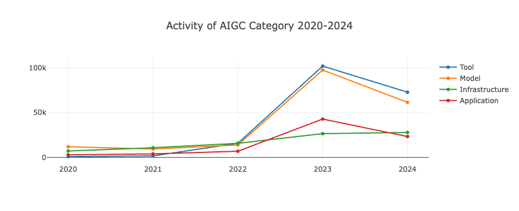

# データ篇

## 概要

**2024 中国オープンソース年度报告**は、包括的で詳細なデータ洞察を中核とし、9つの章で中国のオープンソースエコシステムの活況を全方位的に紹介しています。 
**第1部 マクロ洞察編**では、基礎的な出来事、アクティブなリポジトリ、アクティブなユーザー、プログラミング言語などの観点から、中国がグローバルなオープンソースエコシステムにおける独自の地位と影響力を明らかにします。

**第2部 OpenRank ランキング編**では、グローバルと中国各分野のオープンソースプロジェクト、企業、財団、開発者、協業ロボットのランキングを通じて、業界に権威あるシステム的なOpenRank指標情報を提供し、オープンソース貢献を測る重要な基準となります。

**第3部・第4部 企業洞察編と財団洞察編**では、動的変化図とトレンド分析を通じて、グローバルと中国の企業・財団がオープンソース分野における戦略的展開と進化の道を深く解析します。 

**第5部 技術分野洞察編**では、各分野のトップ10ランキングとプロジェクトの変化に焦点を当て、最先端技術の発展方向とイノベーションのトレンドを正確に捉えます。

**第6部 オープンソースプロジェクト洞察編**では、プロジェクトの種類、分野、テーマの多様性を深く探求し、オープンソースエコシステムの活力とイノベーションの可能性を明らかにします。 

**第7部 開発者洞察編**では、開発者のタイプ、勤務時間分布、地域分布、およびロボットの利用状況の分析を通じて、開発者群の多様性と作業形態を描き出します。

**第8部 商業オープンソース洞察編**では、中国と世界の商業オープンソース企業とプロジェクトの現状に焦点を当て、その成長経路と成功要因を分析します。 

**第9部 大学オープンソース洞察編**では、オープンソース・サマー OSPP 活動と OpenRank コミュニティアルゴリズムを組み合わせ、大学学生のオープンソース活動への参加度と貢献度を明らかにし、オープンソース人材育成の新たなトレンドを提示します。全体として、データ編は豊富なデータ次元と深い分析視点を通じて、2024年中国オープンソースエコシステムの全体像を浮き彫りにし、業界に貴重な洞察と参考を提供します。

### 指標の介绍

**影響力/貢献度（OpenRank）**

**OpenRank 指標**はX-lab オープンラボラトリーが開発したもので、開発者-プロジェクト協業関係ネットワークを基盤に構築され、多角的な評価能力を備えています。プロジェクトの評価においては、OpenRank は「影響力」を核心に据え、プロジェクトの全体的な発展状況とコミュニティ参加度を総合的に測定します。開発者の評価においては、「貢献度」を主要指標とし、オープンソースエコシステムにおける協業価値と活動度を正確に反映します。 さらに、OpenRank は評価対象を**企業、組織、財団**などの上位レベルに集約し、オープンソースエコシステムにおける戦略的地位と協業ネットワークにおける核心的な役割を明らかにします。 現在、OpenRank は産業界と学術界から広く認められ、複数の権威ある基準と実践に採用されています。具体的には、中国標準化研究院のオープンソースガバナンス基準、情報通信研究院のオープンソースガバナンス白書、オープンアトミックオープンソース財団のグローバルオープンソースダッシュボード、および企業オープンソースオフィスのガバナンスツールキットなどに含まれており、オープンソースエコシステムの健康度と協業価値を測定する権威あるツールとして位置付けられています。

OpenRank 参考文献：

[1] [Shengyu Zhao et al: OpenRank Leaderboard: Motivating Open Source Collaborations Through Social Network Evaluation in Alibaba. ICSE, 2024](https://www.researchgate.net/publication/376686121_OpenRank_Leaderboard_Motivating_Open_Source_Collaborations_Through_Social_Network_Evaluation_in_Alibaba)

[2] [赵生宇: 如何评价一个开源项目（三）价值流网络, 2021](https://blog.frankzhao.cn/how_to_measure_open_source_3)

[3] 工业和信息化部标准化研究院: 《信息技术 开源治理 第3部分：社区治理与运营》[T/CESA 1270.3-2023]、《信息技术 开源治理 第 5 部分：开源贡献者评价模型》[T/CESA 1270.5-2023], 2023

**活動度（Activity）**

**活動度** は、X-lab R&D の中核となるメトリクスの 1 つで、プロジェクトや開発者の活動度を定量的に評価するために使用されます。 開発者のアクティビティは、オープンソースエコシステムにおける主要な行動 (課題の提出、PR の作成、コードレビューなど) に重み付けして計算され、参加と貢献の強度を正確に反映します。 プロジェクト活動」は、プロジェクトにおけるすべての開発者の活動の合計に基づいており、プロジェクトの全体的な活動とコミュニティ参加のレベルを測定するために標準化されています。 この指標は、オープンソースのエコシステムの健全性を評価するための科学的かつ定量的な根拠を提供します。

Activity 参考文献：

[1] [Xiaoya Xia et al: Exploring activity and contributors on GitHub: Who, what, when, and where. APSEC, 2023](https://ieeexplore.ieee.org/abstract/document/10043221)

[2] [赵生宇：如何评价一个开源项目（一）——活跃度，2021](https://blog.frankzhao.cn/how_to_measure_open_source_1)

## I. 全体的なマクロ洞察

### 1.1 基本イベント
**基本イベント** は、オープンソースエコシステム分析の中核となるデータソースであり、グローバルな オープンソースコラボレーションプラットフォーム(GitHub、Gitee など)上の開発者の活動によって 生成されたイベントログデータを指します。 これらのイベントの統計分析を通じて、グローバルなオープンソースエコシステムの発展に関するマクロな洞察を得ることができます。 本レポートでは、GitHub と Gitee の両方のデータを取り上げます。

#### 1.1.1 GitHub 全体のイベント傾向

2024年には、GitHub全体のイベントログの総数は**175億**に達し、前年比では約**10%**の成長となっている。 成長率は2018年から2023年の高成長期に比べると鈍化しているが、それでも10%の成長率は、グローバルなデジタルトランスフォーメーションにおけるオープンソースの重要な位置を示している。 この成長を促進する主な要因は以下の通りである：

**GitHub Copilot**のような**AIツールの普及**：AI支援プログラミングツールの普及により、2023年初頭以降、特に南半球でより多くの開発者が集まっている。
* **開発者数の増加**：世界的な開発者数の増加は、イベントログの増加に直接寄与している。

図 1.1 は、GitHub の年度イベント数の増加傾向を示しており、オープンソースのエコシステムにおける継続的な活動を浮き彫りにしています。

図 1.1 GitHub 年度イベント数傾向 

 

#### 1.1.2 GitHub と Gitee のイベント数の傾向の比較

比較のために、GitHub と Gitee の各プラットフォーム**で上位 30,000** のアクティブなリポジトリを選択し、オープンソースの参加に密接に関係する 8 種類のイベント（CommitCommentEvent、PullRequestEvent など）に焦点を当てました。 分析結果は以下の通りです：

* **GitHub**：イベントの数は増加し続けているが、グローバルなプラットフォームの多様性と活動を反映して変動している。
* **Gitee**：イベント数は着実に増加しており、国内オープンソース社の着実な発展と標準化の傾向を示している。

GitHubのイベント数はGiteeのイベント数よりもまだはるかに多いものの、Giteeの着実な成長は、国内の開発者のオープンソースに対する熱意と貢献が高まっていることを示しています。 図1.2は、2つのプラットフォームにおける発生件数の推移を示している。

図 1.2 GitHub と Gitee の活動リポジトリイベント数 

 

#### 1.1.3 セグメンテーション イベントタイプの分析

イベントタイプの分布をさらに分析する（図 1.3、図 1.4）：

* Pull Request と Issue Comment イベントがそれに続き、活発なコードコラボレーションと課題に関する議論を示しています。
* **Gitee**: Pull Request Review Commentイベントの割合が最も高いのは、主にプラットフォームのCI機能の自動レビューメカニズムによるものです。 この傾向は、国内開発者の役割が「フォロワー」から「コントリビューター」へとシフトしていることを反映している。

図 1.3 GitHub イベント別分析 

 

図 1.4 Gitee イベント別分析 

 

### 1.2 アクティブなリポジトリ

#### 1.2.1 GitHub全体のアクティブリポジトリの傾向

GitHubのアクティブリポジトリ数は増え続けているが、その速度は年々緩やかになっている（図1.5）。2020年の流行期にリポジトリが急増したのは在宅勤務とデジタルトランスフォーメーションに後押しされたためであり、2022年以降の鈍化は市場の成熟と競合プラットフォーム（GiteeやGitLabなど）の成長に関係している。

図1.6は、GitHubのリポジトリ活動の全体的な傾向を示しており、2024年は過去最高に近い。

図 1.5 GitHub 年別アクティブリポジトリの状況 

 

図 1.6 GitHub リポジトリのアクティビティまとめ 

 

GitHub リポジトリの活動を支えているのは、**Issue 関連のイベント** (例: Issue Comment) と、**Pull Request 関連のイベント** (例: PR の作成やマージ) です (図 1.7)。 具体的には

* 29.1%の**課題コメントイベント**は、アクティブなイベントの中で最大の構成要素であり、ユーザーが課題解決や改善に関する議論に非常に積極的であることを示しています。
* **プルリクエストイベント**（PRの作成とマージを含む）は46.4%で、アクティブイベント全体の半分近くを占めており、コードの共同作業や貢献においてGitHubが中心的な役割を担っていることがわかります。

図 1.7 は、GitHub リポジトリにおける活動の詳細な構成を示し、オープンソース・プロジェクトの開発を推進する上で、Issue と PR イベントが重要な役割を担っていることをさらに示しています。

図1.7 GitHubリポジトリのアクティビティ構成 

 

GitHubリポジトリの**OpenRank値**は、2018年から2020年にかけて急速な成長期を経験し、この間のGitHubのユーザー拡大とオープンソースプロジェクト活動の二重の爆発を反映して、成長率は2020年にピークに達した。 しかし、**2023**年からは成長率が回復し、2024年には若干低下するものの、全体としては安定した成長を維持しており、世界有数のオープンソースプラットフォームとしてのGitHubの活力と魅力が継続していることを示している。

図 1.8 GitHub リポジトリ OpenRank 

 

#### 1.2.2 Gitee のドメイン全体のアクティブリポジトリの傾向

Giteeのリポジトリ活動は2018年から2020年にかけて急速に成長し、主に国内のオープンソース政策の支援とOpen Atomオープンソース財団の設立の恩恵を受け、2020年にピークに達する。2021年以降は成長率が鈍化するが、それでも2024年に新たなピークに達する（図1.9）。

図 1.9 Gitee リポジトリのアクティビティ概要 

 

Giteeプラットフォームでは、**レビューコメントイベント**が絶対的に優勢で、アクティブなイベント全体の75.6%を占めており、他のタイプのイベント（例：Open Issue、Issue Comment、Merged Pullなど、約7%、Open Pullイベントはわずか5%）よりもはるかに高くなっています。 この分布から、Gitee の開発者はコードレビューに重点を置いており、コード投稿や課題に関する議論は GitHub よりもやや少ないことがわかります。これは、プラットフォームユーザーのコード品質に対する高い関心と、標準化プロセスが徐々に成熟していることを反映しています (図 1.10)。

図1.10 Giteeリポジトリ・アクティビティの構成 

 

Giteeの**OpenRank値**は、2018年から2024年にかけて、特に2019年から2020年にかけて大きく成長し、主に国内のオープンソース生態学的政策の支援とローカライズされたプラットフォームへの開発者の積極的な参加から恩恵を受けている。 2021年以降は成長率が鈍化するものの、Giteeの活動全体は依然として安定した上昇傾向を維持しており、国内のオープンソースプラットフォームの中で地位が向上し、コミュニティへの貢献と活動が継続的に成長していることが確認された。

図 1.11 Gitee リポジトリ OpenRank 

 

### 1.3 アクティブな開発者

#### 1.3.1 GitHub 全体のアクティブユーザーの動向

2024 年の分析では、これまでの調査の手法を引き継ぎ、より詳細でリッチなデータソースに基づいている。 この調査は、GitHub のアクティブな開発者 1200 万人を対象としており、そのうち約 255 万人が正確な位置情報を提供しており、GitHub ユニバースの登録ユーザー総数 (約 1 億 2000 万人) の 2% に相当します。 このサンプルは全ユーザー数のごく一部ですが、データの質が向上したことで、世界中の開発者の地理的分布や地域的なコラボレーションパターンを分析するための、より代表的な視点が提供されるようになりました。

図1.12は、GitHubのアクティブな開発者数の年度ごとの増加傾向を示している。 2020年の1,454万人から2024年には2,511万人と、アクティブな開発者数は概して増加傾向にある。 その中でも

* **2019-2021年**：主に、流行とグローバルなデジタルトランスフォーメーションの加速によるリモートワークの変革の恩恵を受け、急成長。
* **2022年～2023年**年：市場の成熟度とベース効果に関連すると思われ、成長は鈍化。
* **2024年**：成長率は14.1%に回復し、新規開発者数は約311万人となる。

図1.12 GitHubの年度アクティブ開発者数の推移 

 

開発者の成長はリポジトリの成長よりも安定しており、GitHubのユーザーベースが拡大し続けていることを示しています。 成長が鈍化している時期であっても、毎年かなりの数の新規開発者が参加しており、2024 年の回復は、世界をリードするオープンソースプラットフォームとしての GitHub の魅力をさらに証明しています。

#### 1.3.2 開発者の地理的分布

**1.世界の開発者の地理的分布**

統計によると、世界の開発者の地理的分布は非常に集中しており、以下の表に示すように、上位10カ国が世界の開発者総数の60%を占めている：

| 順位 | 国名 | 合計 | 割合 | 開発者の活動状況 |
|------|--------------|---------|---------|------------------|
| 1    | アメリカ         | 435,202 | 17.11%  | 4,301,051.55     |
| 2    | インド         | 252,054 | 9.91%   | 1,099,659.73     |
| 3    | 中国         | 184,085 | 7.23%   | 1,097,116.82     |
| 4    | ブラジル         | 174,811 | 6.87%   | 683,186.08       |
| 5    | ドイツ         | 126,397 | 4.96%   | 1,492,317.89     |
| 6    | 英国         | 103,061 | 4.05%   | 1,140,839.73     |
| 7    | カナダ       | 82,627  | 3.24%   | 821,240.65       |
| 8    | フランス         | 78,288  | 3.07%   | 833,038.24       |
| 9    | ロシア       | 60,735  | 2.38%   | 310,555.47       |
| 10   | 韓国         | 44,006  | 1.73%   | 375,550.82       |

**主な考察**
- **米国**は435,000人の開発者(17.11%)で群を抜いており、その**活動**(4,301,051.55)も世界的にトップであり、オープンソースのエコシステムにおける絶対的な優位性を示している。
- **インド**(9.91%)と**中国**(7.23%)が続いており、中国の開発者数はインドより少ないが、活動レベルはほぼ同じで、中国の開発者のオープンソースプロジェクトへの参加と貢献の密度の高さを示している。
- **ドイツ**は、開発者数では5位であるにもかかわらず、2番目に活発な国（1,492,317.89）として際立っており、開発者の全体的な参加の深さを示している。
- **ブラジルとロシア**は、開発者数は多いものの、一人当たりの活動量は少なく、オープンソースエコシステムへの参加の質にはまだ改善の余地があることを示しています。

#### 中国の開発者の地理的分布
中国における開発者の分布をさらに分析すると、中国の開発者総数は**9,404,966人**で、そのうち**北部、上海、広州、深圳**地域が大きなシェアを占めており、経済的に発展した地域がオープンソース技術に強く惹かれていることを示しています。

| Rank | Provinces | Total | National Share | Actual Total (10,000) |
|------|--------|--------|----------|----------------|
| 1    | 北京   | 38,323 | 22.04%   | 207.20         |
| 2    | 上海   | 28,393 | 16.43%   | 154.86         |
| 3    | 广东   | 24,959 | 14.49%   | 136.28         |
| 4    | 台湾   | 15,894 | 9.53%    | 89.62          |
| 5    | 浙江   | 15,816 | 8.13%    | 76.52          |
| 6    | 江苏   | 9,369  | 4.90%    | 46.10          |
| 7    | 四川   | 8,186  | 4.69%    | 44.03          |
| 8    | 香港   | 6,625  | 3.13%    | 29.44          |
| 9    | 湖北   | 5,732  | 2.95%    | 27.75          |
| 10   | 陕西   | 3,669  | 1.88%    | 17.68          |

**主な考察**
- 北京(22.04%)、上海(16.43%)、広東省(14.49%)が上位3位を占め、その合計シェアは50%を超えており、オープンソースのエコシステムにおけるこれらの経済・技術の中心地の重要性を反映している。 北京は38,323人の開発者（2,072,000人）でトップであり、技術革新と人材プールにおける中核的な強みを示しています。
- **台湾と香港**: 台湾（9.53%）と香港（3.13%）は、オープンソースのエコシステムにおいて突出しており、台湾はそのハイテク産業とオープンな政策環境のおかげで多くの開発者を惹きつけています。
- **長江デルタと珠江デルタの優位性**: 長江デルタ地域(上海、浙江、江蘇)と珠江デルタ地域(広東)の開発者の総数は15万人を超えており、経済的に発展した東海岸の強力なイノベーション能力を示している。
- **中西部の台頭**：四川省（4.69％）、湖北省（2.95％）、陝西省（1.88％）の開発企業数は東部ほど高くないが、全体的な伸びは大きく、中西部の技術革新生態系が徐々に改善され、地域の魅力が高まっていることを示している。

#### 概要と展望
- **グローバルな視点***: 中国はグローバルなオープンソースエコシステムにおいてますます重要性を増しており、開発者の活動や貢献の密度はインドに近づいており、オープンソースエコシステムの急速な成熟を示しています。 ドイツやイギリスのような国々は、一人当たりの活動量が多く、中国が彼らの深い参加パターンから学ぶことは価値があります。
- **国内分布**: 北部、上海、広州、深圳、および沿岸地域は、依然として中国のオープンソース開発者が集まる中心的な場所であるが、中部および西部地域の技術生態系は増加傾向にあり、将来の中国のオープンソースエコシステムのバランスの取れた発展に新たな勢いをもたらしている。
- **開発に関する提言**：
1. 中西部地域の開発者に対する支援とリソースを強化し、バランスの取れた地域発展を促進する。
2. ドイツのような参加者の多い国の経験から学び、開発者のコミュニティへの参加と貢献の深さを高める。
3.グローバルなオープンソースエコシステムにおける中国の競争力をさらに強化するために、政策的インセンティブと技術支援を通じて、より積極的で貢献度の高い開発者を育成する。

<!-- ### 1.4 开源许可证
### **1.4 开源许可证（优化版）**
#### **1.4.1 使用开源许可证的仓库数量**
统计数据显示，GitHub 活跃仓库中采用的开源许可证分布如下：

図 1.12 使用开源许可证的仓库数量占比 
  

**主要观察：**
- **MIT 许可证**占比最高，接近 43%，是最受欢迎的开源许可证。MIT 许可证以其简洁和灵活性著称，提供最小的法律限制，允许开发者自由使用和传播代码。这种特性使其成为全球开发者的首选。
- **Apache 许可证 v2.0**占比从 2023 年的 15.7% 上升至 19.4%，显示出对更严格版权声明的需求逐渐增加。
- 其他主要许可证包括 **GNU 通用公共许可证 v3.0** 和 **BSD 3-Clause 许可证**，它们在开源项目中也有广泛应用。

相比 2023 年，MIT 许可证的占比有所下降，而 Apache 2.0 许可证的比例显著提高，这反映了开源社区对代码修改声明和知识产权保护的关注逐渐上升。

---

#### **1.4.2 开源许可证种类变化趋势**
分析了开源许可证种类的增长趋势，结果如下図所示：

図 1.13 开源许可证种类数量变化趋势 
  

**主要观察：**
- 从 2017 年起，开源许可证的种类呈现持续增长态势。2017-2018 年间，**Eclipse 公共许可证 2.0** 和 **欧盟公共许可证 1.2** 等新许可证的推出推动了增长。
- 2021-2022 年，**木兰系列许可证**和 **CERN 许可证 v2** 等创新型许可证开始崭露头角，进一步丰富了许可证种类。
- 到 2024 年，GitHub 上主流开源许可证的种类已稳定在 **47 种**，表明开源社区对标准化和成熟化的需求逐步提升。

---

#### **1.4.3 使用开源许可证仓库数量变化趋势**
2023 年，约有 **770 万个活跃仓库**使用了各种开源许可证，占所有活跃仓库的 8.76%。以下是对主要许可证的数量变化趋势分析：

**1. MIT 许可证数量变化趋势**  

図 1.14 使用 MIT 许可证的仓库数量变化趋势 
  

**发现：**
- 2023 年，MIT 许可证的活跃仓库数量为 **158 万**，2024 年则减少至不到 **100 万**，出现大幅下降。
- 与此同时，Apache 2.0 许可证的占比上升，表明开发者更倾向于选择需要在代码修改后声明修改的许可证，而非完全自由的 MIT 许可证。
- 总体来看，MIT 许可证的使用减少反映了开源社区对项目代码属性保护的需求逐渐增强。

**2. 其他主要许可证数量变化趋势**  

図 1.15 使用其他许可证的仓库数量变化趋势 
  

**发现：**
- 所有主要许可证（如 Apache、GNU、BSD）的使用数量在 2024 年均有所下降，但许可证头部仍以 MIT、Apache 和 GNU 为主。
- **小众许可证**的使用比例相对稳定，热门许可证的下降比例更为明显，表明开源社区正在逐渐多元化。

---

#### **1.4.4 使用木兰系列许可证仓库数量变化趋势**
以下是对木兰系列许可证（包括“木兰宽松许可证”和“木兰公共许可证”）的使用趋势分析：

図 1.16 使用木兰系列许可证的活跃仓库数量累加図 
  

**主要观察：**
- 木兰系列许可证由北京大学牵头，联合开源社、产学研团队及开源法务团队起草，是中国首个获得 OSI 认可的开源软件许可证。
- 从 2022 年 9 月起，使用木兰许可证的活跃仓库开始显著增长，并在 2024 年 1 月后，每月新增仓库数量稳定在 **50 个以上**。
- 木兰许可证的增长展示了其在中国开源社区和全球市场中的认可度逐步提升，尤其在推动本土开源规范和知识产权保护方面的价值日益凸显。

---

### **总结与趋势洞察：**
1. **许可证偏好变化**：MIT 许可证仍是最流行的开源许可证，但其下降趋势表明社区更关注代码修改声明和知识产权保护，Apache 2.0 的上升则是这一趋势的直接体现。
2. **种类稳定化**：2024 年，主流开源许可证的种类趋于稳定，显示出开源社区对标准化许可协议的需求日益成熟。
3. **木兰许可证崛起**：木兰许可证的使用量持续增长，标志着中国本土开源协议在国际开源社区中的影响力逐步提升，这将为中国开源生态的发展注入更多动力。
4. **发展建议**：
   - 推动更多创新型许可证的研发，满足不同行业和场景的需求。
   - 强化开源许可证知识普及，帮助开发者更好地理解和选择适合项目的许可证。
   - 支持本土许可证的国际化推广，进一步提升中国开源生态的全球影响力。
 -->
 
### 1.4 プログラミング言語

#### 1.4.1 2024年に開発者が使用するプログラミング言語のリスト

プログラミング言語の人気は、開発者にとって常に大きな関心事である。 ここでは、2024年度に開発者に最も人気のあるプログラミング言語のリストを示す：

表1.3 開発者が使用するプログラミング言語のトップ（Top 15） 
  

| ランキング | プログラミング言語 | その言語を使用している開発者数 | その言語を使用しているリポジトリ数 |
|:---:|:-----------------:|:-------:|:-------:|
|  1  | JavaScript       | 591,223  | 654,037  |
|  2  | Python           | 540,751  | 499,644  |
|  3  | TypeScript       | 439,954  | 462,496  |
|  4  | HTML             | 424,901  | 401,084  |
|  5  | Java             | 281,403  | 328,123  |
|  6  | C++              | 143,135  | 106,444  |
|  7  | CSS              | 137,566  | 114,166  |
|  8  | C#               | 131,549  | 163,796  |
|  9  | Go               | 125,521  | 121,209  |
|  10 | Jupyter Notebook | 119,874  | 79,415   |
|  11 | PHP              | 100,984  | 108,019  |
|  12 | Shell            | 93,726   | 76,276   |
|  13 | C                | 84,253   | 60,389   |
|  14 | Rust             | 68,199   | 62,969   |
|  15 | Kotlin           | 53,503   | 48,013   |

**主な考察**
- **JavaScript**は、開発者数59万人、リポジトリ数65万件で、最も人気のあるプログラミング言語としてトップの座を維持している。
- **Python**は、データサイエンス、人工知能、および汎用プログラミングで広く使用されているため、開発者数54万人で僅差に迫っている。
- **TypeScript**は3位で、HTML（42.4万人）を上回る開発者数（43.9万人）を記録しており、フロントエンド開発における継続的な台頭を示している。
- **HTML**は42.4万人、**Java**は28.1万人で4位と5位だが、6位の**C++**から開発者数がほぼ半減しており、プログラミング言語の先頭への集中効果が顕著に表れている。
- ランキング6位から15位までの言語（C++、Rust、Kotlinなど）は、ユーザー数は少ないものの、特定の分野（システム開発、モバイル開発など）では依然として大きな影響力を持っている。

全体として、主流のプログラミング言語はその適用領域をほぼ固めており、ランキングのユーザー数は近年あまり変化していないことから、開発者のこれらの言語の選択には高い安定性があることが示唆される。

---

#### **1.4.2 開発者のプログラミング言語利用動向（2019年～2024年**

以下は、2019年～2024年に開発者が使用するプログラミング言語の傾向を統計的に分析したものである：

  

図1.15 開発者のプログラミング言語使用動向（2019年～2023年 
  

  

図1.16 開発者のプログラミング言語使用動向、2019年～2024年（予測） 
  

**データに関する注意事項:**
データソースが倉庫のメタ情報を提供しなくなったため、2024年10月、11月、12月に関するデータが欠落している。そのため、2024年のデータは2019-2023年のデータと合わせて予測モデルを用いて推定しており、点線は予測結果を示している。

**主な注目点
1.**JavaScript**、**Python**、**HTML**、**TypeScript**、**Java**は、現在最も支配的なプログラミング言語であり、長期にわたってリーダーの地位を維持している。
2.**HTML言語の急成長**：予測によると、HTMLの成長は2024年に加速し、Pythonとの差を大きく縮める。 この傾向は、開発者がプロジェクト・プレゼンテーションの美学や利便性を重視していることと関係していると考えられ、HTMLは今後もフロントエンド開発やコンテンツ・プレゼンテーションにおいて重要であり続けるだろう。
3.**飛躍を続けるTypeScript**：TypeScriptは過去5年間で使用率が急速に伸びており、2021年には次に人気のあるプログラミング言語との差を縮め、開発者にとって中心的な選択肢の1つになると予想されている。TypeScriptの成功は、JavaScriptの上に静的な型チェックを導入したこと、コミュニティの強力なサポート、大規模プロジェクトへの適応性によるものである。
4.JavaScriptとPythonは着実に成長している。

---

### 要約と傾向に関する考察

1.**大きなヘッドライン効果**：JavaScriptとPythonは長い間トップ2に君臨してきたが、TypeScriptの急速な台頭により、フロントエンド開発におけるその地位はさらに強固なものとなった。 同時に、HTMLの成長は、より直感的で使いやすい技術を求める開発者の要望を反映している。
2.**ドメイン主導のトレンド**：C++やRustなどの言語のユーザーベースは小さいが、システム・プログラミングやハイパフォーマンス・コンピューティングなどの特定ドメインにおける影響力は無視できず、今後も垂直ドメインにおけるキーテクノロジーとして機能し続ける可能性がある。
3.**コミュニティとエコシステムは明白な役割を果たす**：TypeScriptの成功は、プログラミング言語の普及におけるコミュニティとエコシステムの重要性を改めて証明している。 言語自身の技術的な優位性と強力なサポートシステムが組み合わさることで、ユーザーの成長を大きく後押しすることができる。
4.**開発のすすめ**：
- 新興プログラミング言語（例：Rust、Kotlin）の開発動向を見据えて、サポートツールやエコシステムを積極的に改善し、より多くの開発者を惹きつける。
- フロントエンドの開発効率と表示効果を向上させるため、開発者がプロジェクトでHTMLやTypeScriptをより多く試すよう奨励する。
- 業界における垂直プログラミング言語（C++やGoなど）の応用の深化を支援し、革新的な技術の実装を促進する。

## II. OpenRank ランキング

2024年度中国オープンソース年次報告書』は、**OpenRankランキング**という独自の視点から、プロジェクト、地域、企業、財団、新興プロジェクトなど、オープンソース社における主要プレイヤーの活動と影響力を紹介しています。 本レポートは、**GitHub**と**Gitee**という国内外の2大プラットフォームのデータを統合し、中国のオープンソースエコシステムの網羅とグローバルな視点からの分析の両方を提供しています。 このランキングを通じて、オープンソース文化の普及とオープンソース技術の応用をさらに促進し、企業や個人がオープンソースプロジェクトに積極的に参加することを奨励することを期待しています。

---

### 2.1 グローバルプロジェクトランキング
  

図2.1 世界のプロジェクトOpenRankランキングトップ30（2024年) 
  

2024年グローバルプロジェクトOpenRankランキングトップ30**によると、**中国のオープンソースプロジェクトOpenHarmony**がOpenRank値**67538.71**でトップとなり、その卓越した活動とオープンソース社における世界的な影響力を示した。 **Azure**と**.Net**はそれぞれ2位と3位にランクインした。 特筆すべきは、**OpenHarmony**と**LVM**のOpenRankスコアが過去1年間で大きく伸びており、特定の技術ドメインやスタックにおける多大な成長の可能性とコミュニティへの影響力を示していることです。

**ランキングの概要
- **オペレーティングシステム**、**クラウドコンピューティング**、**プログラミング言語**、**モノのインターネット**、**ビッグデータ**、**人工知能**、**ゲームエンジン**、**ビジュアライゼーションツール**など、複数のドメインをカバー。
- オープンソース・プロジェクトの幅広さと多様性を示すと同時に、技術分野の焦点とホットな方向性を反映している。

--- --- --- --- --- --- --- --- --- --- --- ---

### 2.2 中国プロジェクトランキング
  

図2.2 OpenRankランキングの中国プロジェクト上位30（2024年) 
  

**中国プロジェクト**の**2024 OpenRankランキング**は、**オペレーティングシステム**（例：OpenHarmony）、**人工知能**（例：MindSpore）、**データベース**（例：openGauss、TiDB）、**ビッグデータ処理**（例：Apache Flink）など、幅広い技術分野をカバーしている。 これは、中国のオープンソース・プロジェクトの多様性と技術力が高まっていることを示しています。

**主な考察**
- **Huawei**は、ランキングのいくつかのポジションを占めており（OpenHarmony、openEulerなど）、中国のオープンソース社における支配的な地位と顕著な貢献を示しています。
- **MindSpore**と**PaddlePaddle**はそれぞれ3位と4位にランクインしており、AI分野における中国の急速な発展を反映している。
- **プライバシー・コンピューティング・プロジェクトの台頭***: **SecretFlow**がプライバシー・コンピューティング分野の代表としてリストに入り、この新興技術分野が広く注目されていることを示している。

---

### 2.3 グローバル企業ランキング
  

図2.3 世界の企業OpenRankランキングトップ30（2024年) 
  

**グローバルエンタープライズOpenRankランキング**は、オープンソースプロジェクトの国際化とグローバル化を示しており、**米国企業**がランキングを独占している。 マイクロソフト**、**グーグル**、**アマゾン**などの技術大手がOpenRankのスコアをリードし、オープンソースにおける世界的なリーダーシップを実証している。

**ハイライト
- **中国企業の台頭***: **Huawei**と**Alibaba**がそれぞれ2位と8位にランクインし、グローバルなオープンソースエコシステムにおける中国企業の影響力の高まりを反映している。
- **新興企業**: **HashiCorp**、**Hugging Face**、**Vercel**、**LangChain**などの新興企業もリスト入りし、オープンソース空間におけるイノベーションが解き放たれていることを示しています。

--- --- --- --- --- --- --- --- --- --- --- ---

### 2.4 中国トップ企業
  

図2.4 OpenRankにおける中国企業上位30社（2024年) 
  

**2024年中国企業OpenRankランキング**は、大企業が上位を占めており、オープンソース・エコシステムの発展を牽引する中国企業の重要な役割を示している。

**主な考察：*** ファーウェイ、アリババ
- **Huawei、Alibaba、Ant Group、Baidu**が上位にランクインしており、オープンソースエコシステムの中核を担う企業であることを示しています。
- Tencent、Baidu、および Alibaba は、国内の優れたパフォーマーであるだけでなく、グローバルなオープンソースプロジェクトにも大きな影響力を持っています。

--- 

### 2.5 オープンソースFoundationランキング
  

図 2.5 2024 年オープンソースFoundation OpenRank ランキング Top 20
  

**OpenAtom Foundation**は、2024年のオープンソース財団のOpenRankランキング**で1位となり、大規模なオープンソース・プロジェクトの推進における中国の重要な成果を実証した。

**ハイライト
- 米国では、**Cloud Native Computing Foundation**、**Apache Software Foundation**、**Linux Foundation**など、ランキング上位の財団が引き続き存在感を示している。
- オランダの**Stichting NixOS Foundation**と**Godot Foundation**は、それぞれ4位と7位にランクインし、オープンソースプロジェクトへのヨーロッパの関与と貢献を示しています。

---

### 2.6 開発者の行政区別グローバルランキング
  

図 2.6 2024 年グローバル地域別開発者 OpenRank ランキング Top 30
  

**行政区の世界ランキング**では、経済的に発展した地域のオープンソース開発活動のレベルが高いことが示されています。
**主な考察**
- カリフォルニア州（シリコンバレー）、ワシントン州（マイクロソフト、アマゾン本社の本拠地）、ニューヨーク州などは、オープンソース活動の世界的な中心地です。
- **北京や上海などの中国***の都市も好調で、グローバルなオープンソースエコシステムにおける地位をさらに強固なものにしている。

---

### 2.7 中国の行政区別開発者ランキング
  

図 2.7 2024 年中国行政区別開発者 OpenRank ランキング Top 34
  

**中国の行政ランキング**によると、北京や上海などの第一級都市が引き続きオープンソース開発を支配している一方、沿海都市や一部の西部地域もより大きな発展の可能性を示している。

---

### 2.8 世界の新勢力プロジェクトランキング
  

図 2.8 2024 年グローバル新势力プロジェクト OpenRank ランキング Top 10
  

**Global Ranking of New Power Projects*** 活発なコアプロジェクトと開発チームを反映し、将来の技術トレンドとイノベーションの方向性を示す。

**ハイライト
- **UVプロジェクト**は、Pythonパッケージ管理ツールとして、非常に多くのアクティブな開発者と緊密な協力体制で1位を獲得した。
- **Valkeyプロジェクト** (第4位): Redisからフォークされたこのプロジェクトは、現在Linux Foundationでホストされており、AWS、Google Cloud、Alibabaなどの大手企業によって支援されている高性能なキーバリューデータストアプロジェクトである。
- **Redot Engine** (#9): Godotエンジンのフォークをベースにした、コミュニティ主導のオープンソースゲーム開発エンジン。
- **KWDBプロジェクト**（10位）：中国からの唯一の新電力プロジェクトとしてランクインしたKWDBは、Open Atom財団によってインキュベートされた中国初のオープンソース分散マルチモーダルデータベースであり、データベース分野における中国の技術革新とオープンソースへの貢献を反映している。

---

### 要約とトレンドの洞察

1.**中国のオープンソースエコシステムの台頭**：OpenHarmonyのようなプロジェクトの世界的なリーダーシップとHuaweiのような企業の傑出した業績は、オープンソース分野における中国の急速な台頭を示している。
2. **グローバル化と多様性**: ランキングは幅広い技術分野と地域をカバーしており、オープンソースエコシステムの国際化と技術的な広がりを完全に反映しています。
3.新興技術による影響**: プライバシーコンピューティング、分散型データベース、コミュニティ主導のゲームエンジンなどの新興分野が、グローバルなオープンソース技術のホットスポットとなっています。
4.**開発に関する提言**：
- 新興プロジェクトのインキュベーションと開発、特に中国プロジェクトの国際的な推進を支援する。
- オープンソース財団とコミュニティへの支援を強化し、グローバルなオープンソースエコシステムにおける協力とイノベーションを促進する。
- より多くの開発者がオープンソースプロジェクトに参加するよう導き、技術的影響力と国際競争力を強化する。

## III. 企業の洞察
オープンソースエコシステムにおける企業の役割と実績は、技術革新能力と業界への影響力を測る上で、ますます重要な次元になりつつある。 グローバル化した技術競争からローカライズされた産業アプリケーションに至るまで、オープンソースは企業のデジタルトランスフォーメーションと技術ブレークスルーを推進する重要なエンジンとなっている。 オープンソースのエコシステムが拡大を続ける中、オープンソース分野における企業の活動、貢献、影響力は、次第に企業の総合力を評価する重要な指標となりつつある。

本セクションでは、過去10年間のグローバル企業と中国企業のOpenRank進化の傾向を分析し、2024年度の活動とOpenRankランキングを組み合わせることで、オープンソース分野における企業のパフォーマンスと業界エコシステムを牽引する役割を深く探ります。 特に、今年の中国企業のダークホースであるDaoCloudについては、データの可視化、コアプロジェクトの生態協力ネットワーク、コミュニティ協力ネットワークの分析を通じて、クラウドネイティブテクノロジーの分野での急速な台頭と戦略的レイアウトを総合的に示し、業界に新たな参考とインスピレーションを提供します。

### 3.1 過去 10 年間のグローバル企業 OpenRank の進化

図 3.1 ここ 10 年グローバル企业 OpenRank 変化 

 

オープンソース分野におけるグローバル企業の影響力は以下のように観察される： 

1. **マイクロソフト**：2008年にオープンソースがレイアウトされて以来、マイクロソフトは2016年に世界のオープンソース影響力のトップに立ち、今のところその地位を揺るがすものはない。
2. **ファーウェイ**：2019年に米国から制裁を受けて以来、オープンソースを重要な戦略方向とし、そのオープンソース影響力は急上昇を続け、2023年にはグーグルとアマゾンを上回ることに成功し、大躍進を遂げた。
3. **アリババ**：2021年まで国内オープンソースのリーダーであったが、現在は世界第8位に定着し、トップの座を維持している。
4. **アント・グループ**：ここ3年で輝きを放ち、2023年に初めて世界トップ15に入り、現在は13位で、オープンソース開発の勢いを示している。
5. **バイドゥ**：国内4位のオープンソース大手として、国内のオープンソース動態の急速な変化により、現在世界12位にランクされている。
6. **Nabu Casa Inc**: 2023年度の世界的なダークホースとして、初めて世界トップ15入りし、現在11位にランクインしている、世界最大のオープンソースホームオートメーションプラットフォームである。
7. **インテル**：今年初めてグローバルTop15入りし、15位にランクインした。
8. **DataDog**：今年初めてTop15入りし、14位にランクイン。クラウド・アプリケーション・モニタリングとデータ分析サービスを提供する大手企業で、オープンソース分野での可能性を示している。

### 3.2 ここ 10 年中国企業 OpenRank 変化

ここ 3.2 近 10 年中国企業 OpenRank 変化 

 

このグラフは、オープンソース戦略における国内企業のレイアウトとトレンドの変化を明確に示している： 

1.**ファーウェイ**：2018年の取り組み開始以来、わずか2年で国内オープンソース1位に躍り出、2023年には世界2位に上り詰め、オープンソース戦略の強力な実行力を示している。

2.**アリババ、アントグループ**：国内オープンソース分野のベテランリーダーとして、この2社は安定した業績を上げており、引き続きトップの地位を維持している。

3.**バイドゥ**：トップ3社の熾烈な競争に影響され、中国でのランキングは4位に後退したが、業界の影響力は依然として高い。

4.**バイトダンス（ByteDance）**：オープンソース分野は近年急速に発展しており、国内のオープンソースエコシステムにおける重要な新勢力となっている。

5.**Espressif（EspressifTechnology）**：地味だが、半導体オープンソースの王者の並外れた強さで、オープンソースの世界で確かな技術貢献で地位を占めている。

6.**Fit2Cloud**：同じく地味で現実的なオープンソース企業で、開発者に支持される様々なオープンソースソフトウェアを持ち、強い実用性と影響力を示す。

7.**新興勢力**：近年、Fit2Cloud、PingCAP、StarRocksなどの新興企業が急速に台頭し、クラウドコンピューティング、ビッグデータ、AI、インフラストラクチャの分野で活躍している。 これらの企業の急速な発展は、国内のオープンソースエコシステムの技術トレンドが徐々にクラウドネイティブとビッグデータに傾いていることを反映している。

全体として、これらの動向は、国内オープンソース分野の多様性と競争力、および主要技術分野における継続的な取り組みの方向性を示している。

### 3.3 2024 年度のグローバル企業 OpenRank の変化

図 3.3 2024年度グローバル企業 OpenRank 変化 

 

- グローバル企業トップ5のうち、2024年に成長した企業は**ファーウェイ**と**メタ**のみで、ファーウェイは極めて大幅な増加（+31,226.88）、メタは（+174.75）となった。
- **マイクロソフト**、**グーグル**、**アマゾン**はいずれもOpenRankの値が減少し、中でもアマゾンの減少が最も大きかった（-8,974.76）。
- 2023年にグーグルとアマゾンを追い抜くことに成功したファーウェイは、2024年も力強い成長を続け、再び記録を更新した。 これは、ファーウェイが将来マイクロソフトの世界第 1 位の座に挑戦する可能性を示すだけでなく、中国企業がグローバルなオープンソース企業利用の構成を加速させ、国際的なオープンソースエコシステムにおける影響力を徐々に高めていることをさらに示している。

### 3.4 2024 年度における中国企業の OpenRank の変化

図 3.4 2024年度中国企業 OpenRank 変化 

 

* 中国企業トップ10のうち、ファーウェイ、アント・グループ、バイトダンス、DaoCloud、ESPRESSIF、Fit2Cloudはすべて2024年に成長しており、特にファーウェイの成長が著しい（+31,226.88）。

* **DaoCloud**は年度成長率で国内のダークホースに選ばれ、成長値は4,846.22、OpenRankの合計値は6,759.34となり、国内で9つ順位を上げて第6位となった。 このパフォーマンスにより、DaoCloudは2024年に最も注目すべき企業の1つとなり、次のセクションで詳しく分析する。

*　**バイドゥ**は2024年に大幅な落ち込みを見せ、年度別下落率は4,911.89と中国企業で最大となった。 バイドゥは世界企業ランキングで9つ順位を下げて19位となったが、これはバイドゥのオープンソースの価値判断と戦略的レイアウトに密接に関連するパフォーマンスであり、オープンソースへの投資と影響力の持続的な成長を維持できなかったことを反映している。

<!-- ### 3.5 2024年度全球企业的活跃度前10

図 3.5 2024年度全球企业的活跃度前10 

 

微软 (Microsoft) 稳居第一，以绝对优势（活跃度 706,985.92）在各项指标上表现最为出色，证明其持续在开源生态中的领导地位。华为 (Huawei) 超越谷歌，上升两位至第二名，展现了其在开源社区中的强劲增长（活跃度增长 147,619.52）。谷歌 (Google) 下滑一位至第三名，活跃度仍维持在较高水平（290,417.81）。亚马逊 (Amazon) 和 Red Hat 分列第四和第五，前者活跃度略有下降。Mozilla 上升一位至第六名，表明其在开源领域的贡献有提升。
其他企业如 Meta、IBM、阿里巴巴 (Alibaba) 和 Elastic 也保持了在前十名中的竞争力。

* 华为的快速崛起：活跃度和贡献指标均显著增长，反映出其对开源生态的持续投入，特别是在 PR 审查和 Issue 评论上的活跃表现。
* RedHat 和 Mozilla 的稳定贡献：作为传统开源社区的领导者，这两家公司继续在开源项目贡献中扮演重要角色，展现了持续的影响力。
* 中国企业的表现：除华为外，阿里巴巴也榜上有名，排名第九。这表明中国企业在全球开源领域的影响力正在逐步上升。
* Microsoft 是开源生态中无可争议的领导者，各项指标均表现优异。
* 华为 和 Google 在开源贡献上的竞争日益激烈。
* 其他老牌开源企业如 RedHat 和 Mozilla 依然保持了在社区中的活跃度和贡献力。
* 从整体上看，这份 OpenRank 榜单反映了全球开源生态中的多样化和竞争格局，以及企业对开源的日益重视。

### 3.6 2024年度全球企业的OpenRank前10

図 3.6 2024年度全球企业的OpenRank前10 

 

* 北美企业的强势地位：前十中，北美企业占据七席，微软、谷歌和亚马逊继续主导开源生态。这些企业在基础设施、AI、云计算等领域贡献巨大，是全球开源的核心推动力。
* 中国企业的崛起：华为的高速增长显示其在开源技术和全球化方面的显著进步。
* 阿里巴巴的排名下降则反映了开源生态中新的挑战。
* 老牌企业的复苏：Red Hat、IBM等传统企业重新发力，显示出老牌技术公司依然具有强大的技术积累和生态价值。
未来趋势：
* 全球企业的开源竞争将更加激烈，各大公司需要在技术贡献、社区互动和生态扩展方面进一步投入。

### 3.7 2024年度中国企业的活跃度前10

図 3.7 2024年度中国企业的活跃度前10 

 

* 华为 (Huawei) 稳居第一，其活跃度（422,865.51）远高于其他企业，展示了在开源领域的绝对领先地位。
* 阿里巴巴 (Alibaba) 和 蚂蚁集团 (Ant Group) 分列第二和第三，显示了阿里系在开源领域的持续深耕。
* 百度 (Baidu) 保持第四，活跃度为 53,851.9。
* DaoCloud 是本次榜单的黑马，上升 10 位至第五名，活跃度大幅增长。
* 其他企业如 字节跳动 (ByteDance)、PingCAP、ESPRESSIF、腾讯 (Tencent) 和 飞致云（Fit2Cloud） 则分列第六至第十名。
* 华为的绝对优势：在所有指标上均位列榜首，充分展现了其在开源社区的主导地位。
* DaoCloud 的强势崛起：活跃度大幅提升，并在创建 Issue 和 Pull Request 上表现出色，成为本年度榜单的一大亮点。
* 阿里系的整体实力：阿里巴巴 和 蚂蚁集团 双双跻身前三，显示出阿里系企业对开源生态的持续投入。
* 中小型企业的竞争力：企业如 ESPRESSIF 和 Fit2Cloud 尽管体量较小，但也展示了显著的开源贡献。

这份榜单体现了中国企业在全球开源领域的强劲表现：
* 头部企业（如华为、阿里巴巴）持续扩大领先优势。
* 新兴企业（如 DaoCloud）快速崛起，带来了更多活力。
* 数据表明，中国企业在开源领域不仅注重贡献代码，还积极参与社区互动和治理，推动了全球开源生态的发展。

### 3.8 2024年度中国企业的OpenRank前10

図 3.8 2024年度中国企业的OpenRank前10 

 

* 华为凭借高额得分和显著增长继续稳居榜首。
* 阿里巴巴和百度依旧占据前列，但受到其他新兴企业的挑战。
* DaoCloud的跃升和Fit2Cloud的新进入，说明中小型企业在开源领域的活跃度逐渐增强。
* 整体来看，榜单中的企业在多样化领域（如云计算、IoT、数据库等）都展现了开源的深度参与。 -->

### 3.5 2024年度中国企業のダークホースDaoCloudの解釈

2024年の中国企業のOpenRankと活動リストで、**DaoCloud**は優れたパフォーマンスでトップ10にランクインすることに成功した。 OpenRankのランキングは昨年より9位も大幅に向上し、中国で6位にランクインした。活動リストは10位も上昇し、中国で5位にランクインし、今年の「ダークホース」にふさわしい。

**2024年6月に大学でDockerのミラーサイトがブロックされたことで、多くの開発者がDaoCloudを利用するようになり、急成長を加速させたことは注目に値する。 ** 

DaoCloudの台頭は、オープンソースと技術革新への長期的な投資によるものだけでなく、コンテナクラウドとマイクロサービスアーキテクチャの分野を深く耕し、普及させたことによるものでもある。 同時に、DaoCloudは、Kubernetesエコシステム、コンテナオーケストレーションツール、クラウドネイティブ開発フレームワークなど、国内外の主流のオープンソースプロジェクトの開発と貢献に積極的に参加しており、これらの努力は、オープンソース社における地位と影響力を大幅に高めています。

DaoCloudの成功は、中国のテクノロジー企業がオープンソース技術開発を探求し、実践してきた成果を示すだけでなく、他の中小企業にも貴重な参照経路を提供している。 技術革新とコミュニティへの参加を通じて、DaoCloud は業界における影響力を高めるだけでなく、中国のオープンソースエコシステムのさらなる繁栄を促進しています。

#### 3.5.1 DaoCloud エンタープライズインサイトビッグスクリーン

図 3.9 DaoCloudエンタープライズインサイトビッグスクリーン 

 

このチャートは、DaoCloudの全体的な貢献、アクティブなプロジェクトのランキング、コントリビューターの分布、およびいくつかの主要なオープンソースの活動指標（Issues、Commits、PRの傾向など）の包括的なビューを提供する**DaoCloud Insights Big Screen**を示しています。 これらのデータは、コミュニティのダイナミクスと発展を分析するための重要な基礎となります。

活動の傾向という点では、DaoCloudのパフォーマンスは特に印象的です。 まず、Issuesの数は**2024年5月**にピークに達しました（60,000件以上）。これは、新バージョンのリリースや大きなイベントによって引き起こされたコミュニティの議論と密接に関係していると考えられます。 その後、コミュニティの効率的な問題解決と対応により、問題を迅速に解決する能力が十分に実証された。 加えて、コミュニティのコミット活動は歴史的に大きな変動を示しており、**2020**年と**2023**年に2つのピークがあるが、これはメジャーバージョンのリリースや機能アップデートに関連していると考えられる。 直近のピークは**2024**年末に発生しており、コミット数が大幅に増加していることから、コミュニティ活動の継続的な増加がうかがえる。 PR（プル・リクエスト）のパフォーマンスに関しては、効率的で整然としたコミュニティ開発活動を反映して、2024年度にオープン、マージ、クローズされたPRの数は全体的に安定している。

DaoCloud コミュニティは、全体的なパフォーマンスにおいて、健全かつ継続的に成長しています。 中心的なプロジェクトである**public-image-mirror**（公開ミラーサービス）と**DaoCloud-docs**（関連文書のコラボレーション）は、コミュニティの主要な活動と影響力に貢献しています。 その中でもpublic-image-mirrorは、開発者に効率的で安定したミラーサポートを提供することに尽力しており、DaoCloudコミュニティの発展を促進するだけでなく、国内外のオープンソースユーザーに重要なサポートを提供しています。 DaoCloud-docsは、ドキュメント共同プロジェクトとして、包括的な技術ドキュメントと開発ガイドを提供することで、新規開発者の学習敷居を大幅に下げ、ドキュメントの内容を継続的に最適化することで、ユーザーエクスペリエンスと技術普及能力を向上させています。

PRとIssuesの効率的な処理によってコミュニティの緊密な連携が浮き彫りになり、コントリビューター数、コミット活動、PR活動の伸びは、コミュニティが現在も急速に成長しており、より多くの開発者を惹きつける力を持っていることを示しています。 多様なコントリビューターの構成、安定した開発活動、活発なプロジェクト管理は、オープンソースのエコシステムにおけるDaoCloudコミュニティの重要な地位をさらに強固なものにしています。 コアプロジェクトの成功を通じて、DaoCloudは業界における影響力を高めるだけでなく、他のオープンソース社の構築に貴重な経験を提供しています。

#### 3.5.2 DaoCloud コアプロジェクトの生態系コラボレーションネットワーク DaoCloud-docs

図 3.10 DaoCloud-docs生態系コラボレーションネットワーク 

 

この図は、DaoCloudコミュニティにおけるDaoCloud-docsプロジェクトの生態系ネットワークを示しており、プロジェクトと他のプロジェクトや組織との相互関係、開発活動やパートナーシップを示すことを目的としています。

主な発見
* Kubernetesとの強いつながり：DaoCloud-docsは複数のKubernetes関連プロジェクト（例：kubernetes/kubernetes、kubernetes/website）と強いつながりがあり、Kubernetesエコシステムにおいて重要な役割を果たしていることが示唆されます。 このようなつながりは、DaoCloudがKubernetesを深く利用したり、拡張したり、Kubernetesに貢献していることに起因しているのかもしれません。
* Istioとのコラボレーション：DaoCloud-docsはIstioプロジェクト（istio/istio、istio/istio.ioなど）とも有意に関連しており、サービスグリッド技術における相乗効果を示唆している。
* その他のパートナー: DaoCloud は、Kubernetes と Istio に加えて、GoogleCloudPlatform、Kubean-io などのいくつかのプロジェクトとも関連しており、マルチクラウドとコンテナ技術における活動を示している。

#### 3.5.3 DaoCloud の中核プロジェクトである DaoCloud-docs のコミュニティ・コラボレーション・ネットワーク

図 3.9 DaoCloud-docsコミュニティ・コラボレーション・ネットワーク 

 

この図は、DaoCloud-docsのプロジェクトコミュニティネットワークを示し、開発活動や組織の関連を通して、プロジェクトコミュニティの分布と構成を分析しています。

主な発見
* コミュニティの中核：中国の開発者と組織がプロジェクト・コミュニティの中核であり、主な貢献者と関連組織は中国から来ている。 開発者のwindsonseaとsamzongがトップ貢献者であり、PRの投稿数は彼らがプロジェクトで主導的な役割を担っていることを示している。windsonseaはまた、今年CNCFコミュニティの年度トップ・ドキュメンタリスト賞（ https://mp.weixin.qq.com/s/tdO2QhvE800TKy5RY7FCWw ）を受賞した。
* 国際的なリーチ：コミュニティの中心は中国だが、米国や韓国など他の国の開発者からも注目されており、DaoCloud-docsプロジェクトがある程度の国際的なリーチを持っていることを示している。
* 組織のコラボレーション: EMCやDaoCloudなど、異なる組織が参加していることは、組織横断的なコラボレーションを示しており、プロジェクトの多様性と影響力に貢献しています。

DaoCloud プロジェクトのコミュニティは、中国の開発者と組織が主な貢献者であり、著しいローカライゼーションを示していますが、国際化の可能性も持っています。

#### 3.5.4 DaoCloud コアプロジェクトの生態学的コラボレーションネットワーク public-image-mirror

図 3.10 コアプロジェクトの生態学的コラボレーションネットワーク public-image-mirror
 

 

強くつながっているプロジェクト
* kubesre/docker-registry-mirrors（接続強度：161）とDigitalPlatDev/FreeDomain（接続強度：176）は、public-image-mirrorプロジェクトと最も強く接続している2つのプロジェクトです。 結果
* kubernetes/kubernetes(71)とalibaba/nacos(52)も有意に関連しており、ミラープロジェクトを利用しているか、依存している可能性が示唆された。
* 複数のツールやミラーリングサービスとの連携：このプロジェクトはimdingtalk/image-mirrorやlangenius/difyなどのミラーリングツールと高いレベルで連携しており、public-image-mirrorプロジェクトがこれらのツールのインフラサポートを提供している可能性を示唆している。
* 他のコアプロジェクトとのコラボレーション: DaoCloud は同じ DaoCloud と密接な関係にある別のコアプロジェクトで、ドキュメンテーションや設定関連の開発でコラボレーションしている可能性があります。

#### 3.5.5 DaoCloud コアプロジェクトのコミュニティコラボレーションネットワーク public-image-mirror

図 3.11 DaoCloud コアプロジェクトのコミュニティコラボレーションネットワーク public-image-mirror 

 

主な貢献者
* wzshimingは多くのPRを提出し(279)、プロジェクトの中心的貢献者である。
* JaredTan95, yank1, cuisongliu などの他の貢献者も、PR や Stars という形でプロジェクトに貢献しています。

主な貢献元
* 中国がコミュニティの主な協力源であり、プロジェクトの地域性を示している。
* 米国と台湾も協力に参加しており、プロジェクトの国際的な広がりを示している。

## IV. Foundationの洞察

非営利のオープンソース組織であるFoundationは、オープンソースプロジェクトやコミュニティの組織化、開発、共同イノベーショ ンを促進する上で不可欠な役割を担っています。 財団は、オープンソースソフトウェアのインキュベーションのために、技術支援、運営管理、法的保護など、あらゆるサービスを提供するだけでなく、コミュニティの構築と運営のために科学的な指導を行い、インキュベーターとアクセラレーターの組み合わせとなり、オープンソースの生態系に継続的な発展の力を注入します。 オープンソースエコシステムの重要なオーガナイザーとして、財団は、その標準化された運営形態とリソースの統合能力により、開発者、企業、コミュニティをつなぐ架け橋の役割を果たしている。 このセクションでは、財団の側面からオープンソースエコシステムの発展を分析し、データによる洞察を通じて、 オープンソースエコシステムにおける財団の中核的な位置づけと実際の貢献を明らかにすることを目的とする。

### 4.1 グローバルFoundationのオープンランク動向分析

図4.1 グローバルFoundationのオープンランク動向分析

 

*注：リナックス・ファウンデーションには、サブ財団は含まれていません。

* OpenAtom Foundationは特に好調で、2024年リストのトップに急浮上し続けている。 OpenAtom財団は好調で、2024年リストのトップに急浮上し続け、その強い生態学的拡張性とプロジェクトの影響力を示している。
* これとは対照的に、CNCF（クラウド・ネイティブ・コンピューティング財団）とApacheソフトウェア財団の成長の勢いは著しく鈍化し、依然として高い影響力を維持しているものの、OpenRankは2024年に若干の下落を示している。これは、クラウドネイティブ技術の成熟と競争の激化を反映しているのかもしれない。 一方、Linux Foundationは、著しく遅いペースで成長を続けている。
* 一方、Linux Foundationは安定した成長を続けており、強い安定性を示している。 また、OpenJS FoundationやHyperledger Foundationなどの財団はほとんど変動していない。

2024年の全体的な傾向を見ると、急成長している財団は革新的なテクノロジーと強力なコミュニティ・エコシステムによって市場からの認知度を高めている一方、成熟した財団は既存の強みを維持しつつ、激化する競争に対処するための新たなブレークスルーを見出す必要がある。

### 4.2 グローバル財団プロジェクトOpenRankトレンド分析

図4.2 グローバル財団プロジェクトOpenRankトレンド分析

* OpenHarmony/docsプロジェクトの影響力が急速に高まっており、OpenRankは2024年に史上最高を記録した。
* これとは対照的に、Kubernetes/kubernetesのOpenRankは2020年以降右肩下がりに減少しており、2024年にはその影響力がさらに弱まっている。
* Apache/dorisも注目すべきプロジェクトであり、そのOpenRankは2024年においても着実に伸び続けている。 これは、データ処理領域における同プロジェクトのパフォーマンスが、ユーザーとコミュニティによって引き続き認められていることを示している。
* 一方、Cilium/ciliumやEnvoyproxy/envoyのような成熟したプロジェクトは、2024年のOpenRankの変動が少なく、比較的安定したパフォーマンスを示している。 これは、これらのプロジェクトが安定した発展段階に入り、その影響力が一定の水準で維持されていることを示唆している。

### 4.3 世界基金の中国プロジェクトの OpenRank のトレンド分析

4.3 世界基金の中国プロジェクトの OpenRank のトレンド分析

 

2024年、Foundationの中国プロジェクトのうち、主要なプロジェクトは急速に成長しており、その他のプロジェクトは着実に発展している。 中国のオープンソースプロジェクトは、さまざまな技術分野で強い影響力と発展の可能性を示しています。
* openHarmony/docsが1位となり、OpenHarmonyの他のコアモジュール（graphic_graphic_2d、interface_sdk-js、xts_actsなど）も1位となり、OpenHarmonyコミュニティがエコロジー構築の推進を非常に重視していることを反映している。 これは、OpenHarmonyがオペレーティング・システム分野で成熟した活発なコミュニティ・エコシステムを構築し、そのコア・コンポーネントが開発者から広く注目され、参加を得ていることを示している。
* 中国プロジェクトは、データベース分野で高い影響力を示している。 分散データ処理とストレージの分野では、高性能分析データベース・プロジェクトとしてapache/dorisが2位にランクインし、ビッグデータと分析シナリオにおける重要な位置を示している。 また、milvus-io/milvus はベクトル・データベースの開発に重点を置き、apache/flink と apache/shardingsphere はリアルタイム・コンピューティングと分散データベース技術の方向における国内開発者の革新的な能力を表している。
* また、openEuler/kernelは、openEulerのコアモジュールとして、国産オペレーティングシステムの代表的なプロジェクトであり、ソフトウェア基礎技術の継続的な進歩とコミュニティ連携の成果を反映しています。 また、openharmony-sig/arkcompiler_runtime_coreは、国産OSのエコシステムがカーネル開発だけでなく、コンパイラやランタイムなどのキーテクノロジーのブレークスルーにも注力していることを示している。

#### Linux財団の中国プロジェクトであるOpenRankのトレンド分析。

図 4.4 中国における Linux Foundation（サブFoundationを含む） OpenRank 趋势

Linux Foundation はグローバルなオープンソース社において重要な組織であり、中国のプロジェクトの参加と発展は、グローバルなオープンソースエコシステムにおける中国の影響力を反映することができる。

* プロジェクトのOpenRank * milvus-io/milvusは急速に成長している。 milvusは、Zillizによって開始され、Linux Foundation AI & Data Foundation（LF AI & Data Foundation）に貢献したオープンソースのベクトルデータベースプロジェクトであり、特に機械学習やAI関連のシナリオのために、非構造化データ（画像、動画、音声、テキストなど）の効率的な保存と検索に焦点を当てている。 非構造化データ（画像、動画、音声、テキストなど）の効率的な保存と検索に重点を置いており、特に機械学習やAI関連のシナリオに適している。milvus-io/milvus 2024 は、Linux Foundation の OpenRank ランキングで 6 位にランクインしており、ビッグデータと人工知能の分野における中国の強い影響力を示しています。
* 全体的に、ほとんどのプロジェクトの OpenRank は低く、あまり変化していません。この違いは、他の中国プロジェクトに教訓を与えています。オープンソースエコシステムで長期的な影響力を維持するためには、技術革新、市場への適応、コミュニティの運営を通じて、プロジェクトの競争力と活力を高める必要があります。

### 4.4 OpenAtom Foundationプロジェクトの OpenRank トレンド分析

図4.5 OpenAtom Foundation 旗下のプロジェクト OpenRank トレンド　

 

* OpenHarmony は、OpenRank の指標において、2023 年比で約 70 パーセントの大幅な伸びを示し、中核プロジェクトとしての強力な魅力を実証し、トップの座を維持し続けています。 この成長は、スマートデバイスとオペレーティングシステムの分野で広く採用されていることと、コミュニティからの継続的なインプットとサポートによるものです。
* OpenRank は着実に成長している。 これは、オープンソース・オペレーティング・システム分野での影響力の継続的な拡大と、クラウド・コンピューティングとエンタープライズ・アプリケーションでのさらなる推進を示している。
* Anolis OSとopenKylinの2024年の業績は比較的横ばいである。 anolis OSはエンタープライズLinux市場にフォーカスし、openKylinは国産OSにフォーカスしており、両者ともターゲットとするユーザーグループから一定の支持を得ている。
* Taro、UBML、PikwiDBなどの他のプロジェクトは、openrankの値が低いが、これはこれらのプロジェクトの生態学的規模が限定的であること、あるいはアプリケーション・シナリオがまだ広く普及していないことを反映している。

## V. 技術領域の洞察

オペレーティングシステムは、常に新しいアーキテクチャに適応し、オープンソース社で進化しています。クラウドネイティブ技術は、企業がデジタルトランスフォーメーションを達成する原動力となり、そのオープンソースプロジェクトエコシステムは活発で急速に成長しています。 データ革新の中核インフラとして、オープンソース技術の幅広い応用が多様なシナリオのブレークスルーを促進し、ビッグデータはオープンソースツールに依存し、インテリジェントな意思決定を強力にサポートし、人工知能はオープンソースフレームワークの助けを借りて、様々な産業における自動化プロセスを加速し、フロントエンド技術はオープンソースプロジェクトを通じてインタラクティブな体験とビジュアルデザインの継続的な強化を促進する。 このセクションでは、影響力と活動の 2 つの指標に基づき、これらのデータインサイトを分析する。

### 5.1 過去5年間の各サブフィールドの動向

図5.1 OpenRank of Technology Category 2020-2024 

 

図5.2 Activity of Technology Category 2020-2024 

 

過去5年間の各分野の変化傾向から見ると、クラウドネイティブの優位性は明らかであり、同分野の倉庫数は他分野と比較して相対的に多い、AIは近年の急速な発展で成長率が大きい、データベースは重要な基本ソフトとして着実に第一線で活躍している、ビッグデータの熱量は2024年にはやや低下している、OS分野の倉庫数は相対的に少ないが、その影響力は年々増加しており、基本ソフトの価値が高いという特徴を示している、フロントエンド分野の影響力は年々低下する傾向を示している。 フロントエンド分野の影響力は年々減少傾向にある。

### 5.2過去5年間のOpenRankトップ10プロジェクトのドメイン別傾向
#### ビッグデータ

図5.3 OpenRank of Big data 2020-2024 

 

図5.4 Activity of Big data 2020-2024 

 

ビッグデータのデュアルメトリクスは全体的に上昇傾向にあり、KibanaとGrafanaは影響力とアクティビティにおいて常にトップ2にランクインしている。 注目すべきは、両者の差が2023年に縮まり、2024年に再び広がり始めることだ。 さらに、クリックハウスとドリスはビッグデータ分野で競合を強めている。

Kibanaはオープンソースのデータ可視化・探索ツールで、ElasticSearchとシームレスに統合し、ElasticSearchデータのクエリ、分析、可視化をサポートする。
Grafanaは強力なオープンソースのデータ可視化ツールで、モニタリングやレポーティングの幅広いシナリオで使用されています。 Prometheus、InfluxDB、Graphiteなど、さまざまなデータソースをサポートしています。さまざまな種類のチャートやダッシュボードを生成でき、ユーザーに柔軟なデータ表示と分析機能を提供します。

#### データベース

図5.5 OpenRank of Database 2020-2024 

 

図5.6 Activity of Database 2020-2024 

 

ClickHouseデータベースは両指標で安定した成長を続けており、ElasticSearchはトップ3に返り咲き、Dorisは成長の鈍化にもかかわらずアクティビティで1位に近づいており、将来的には両指標でClickHouseを追い抜くと予想されている。さらに、YDBはかなりのペースで成長しており、2024年にはトップ10に入るだろう。

ClickHouseは、ロシアのYandexがオープンソース化したMPPアーキテクチャに基づく高性能分析エンジンで、そのベクトル化された実行エンジンにより、豊富な機能と高い信頼性を提供しながら、従来のトランザクション・データベースの100～1000倍の速度を実現している。
Apache Dorisは、オープンソースのMPP分析データベース製品へのバイドゥの貢献であり、シンプルな分散アーキテクチャを持ち、運用と保守が容易で、効率的なリアルタイム分析シナリオで広く使用されています。

YDBは2020年にオープンソースプロジェクトとしてリリースされ、ACIDトランザクションをサポートする効率的な分散データベースソリューションを提供することを目的としており、特に高同時性と分散アプリケーションシナリオに適しています。YDBはヤンデックス独自の技術的課題を解決するために設計・開発され、オープンソース化されたことで、開発者や企業からますます多くの注目を集め、最新の分散データベース分野の一部となりました。 YDBは、最新の分散データベースの世界では初めてのものです。

#### オペレーティングシステム

図5.7 OpenRank Operating System 2020-2024 

 

図5.8 Activity of Operating System 2020-2024 

 

ご覧のように、OpenHarmonyプロジェクトのもと、いくつかのリポジトリがリストのトップ10に入っています。 この洞察は、Giteeプラットフォームからのデータを組み合わせたもので、多くの側面で国産OSの優位性をより直感的に示している。 さらに、OpenEuler Kernelプロジェクトも好成績を収めた。

#### クラウドネイティブ

図5.9 OpenRank of Cloud Native 2020-2024 

 

図5.10 Activity of Cloud Native 2020-2024 

 

LLVM-Projectは大きく成長し、両指標で1位、Grafanaは減速し2位、Kubernetesは両指標で大きく減少し、その他のプロジェクトは激しい競争を繰り広げている。
LLVMは、モジュール化された再利用可能なコンパイラ・フレームワークとツールチェーン技術の集合体であり、過去3年間で活動が急成長し、開発者に人気がある。

#### フロントエンド

図5.11 OpenRank of Frontend 2020-2024 

 

図5.12 Activity of Frontend 2020-2024 

 

Flutterは、両指標とも前年比では減少しているものの、2023年以降好調なNext.jsを大きく引き離している。Next.jsは、かなりの割合で成長しているものの、2024年には減少している。3位から10位までのプロジェクト間の競争は激しく、上位10プロジェクト間の差は比較的小さい。

FlutterはGoogleが開発したフレームワークで、フロントエンドやフルスタックの開発者が単一のコードベースから複数のプラットフォーム向けのユーザーインターフェイスを構築するために使用できる。
Next.jsは、Vercelによって作成されたオープンソースのフレームワークで、Node.jsとBabelをベースに構築され、Reactシングルページアプリケーションフレームワークと連携するように設計されており、プレビューモード、迅速な開発コンパイル、静的エクスポートなどの便利な機能を提供している。

#### 人工知能

図5.13 OpenRank of AI 2020-2024 

 

図5.14 Activity of AI 2020-2024 

 

2020年以降、TensorFlowのデュアル・メトリクスは低下し続け、2024年にはOpenRankリストのトップ10から外れている。 対照的に、PyTorchは着実に成長し、他のプロジェクトとの差を広げている。 LangChainは2022年にオープンソース化されて以来、両指標でトップ3に入っており、2024年には若干人気が落ちたものの、その影響力は依然として大きいことは特筆に値する。 一方、vllmはかなりの勢いで成長しており、LangChainを抜いて2位、Huggingface/Transformersプロジェクトは両指標で安定した成長を維持している。

LangChainは、ハリソン・チェイスが2022年10月に立ち上げたオープンソースプロジェクトで、LLM開発のための最も人気のあるフレームワークの1つとなっている。
vllm-project/vllmは、大規模言語モデル（LLM）のための効率的な推論最適化のために設計された、効率的でスケーラブルな分散推論フレームワークです。 vllm-project/vllmは、過去3年間で著しく活動を拡大し、開発者に人気があります。

### 5.3 OpenRankのドメイン別トップ10リスト

2024年の分野別OpenRankランキングは以下の通り。

図5.15　ビッグデータのOpenRankトップ10リスト 

 

図5.16 データベース領域におけるOpenRankトップ10リスト 

 

図5.17 OpenRankオペレーティング・システム・トップ10リスト 

 

図5.18 クラウドネイティブのためのOpenRankトップ10リスト

 

図5.19 最先端分野OpenRank TOP 10 ランキング 

 

図5.20 人工知能分野のOpenRank TOP 10 ランキング 

 
    
## 6. オープンソースプロジェクトの動向
2024年、オープンソースプロジェクトはAIの大規模モデルや生成AIの急速な発展を経て、徐々に安定した進化の傾向を示し、データベース分野での着実な発展を経て、新たな活力を示しています。本章では、オープンソースプロジェクトの視点から、プロジェクトの多角的なデータを深く分析し、より包括的な洞察を得ます。 オープンソースプロジェクトのトピックを統計的に分析し、2024 年のグローバルなオープンソースコミュニティの共通の関心事を明らかにします。

### 6.1 プロジェクトの種類

このサブセクションでは、GitHub のアクティブ度ランキング上位 10,000 のリポジトリのデータを統計的に分析しています。

#### 6.1.1 プロジェクトの種類別の割合

図 6.1 異なるプロジェクトタイプの数量比率

 

- **アプリケーションソフトウェア**　：青色で表示され、パイチャートの24.3%を占めています。これは、分析対象のデータセットにおいてアプリケーションソフトウェアが相当な割合を占めていることを示し、ソフトウェアエコシステムにおけるその重要性を反映しています。
- **ライブラリとフレームワーク**　：オレンジ色で表示され、最も大きな割合を占め、31.4%に達しています。これは、ライブラリとフレームワークがソフトウェア開発において広く活用されていることを示しており、開発者にアプリケーションを構築するための基盤インフラストラクチャとツールを提供しています。
- **非ソフトウェア**　：緑色で表示され、23.2%を占めています。このカテゴリーには、ソフトウェアの直接的な開発と関連しないプロジェクトが含まれる可能性があります。例えば、ドキュメント、デザインリソース、またはその他の非コード資産などが該当します。
- **ソフトウェアツール**　：赤色で表示され、18.9%を占めます。このツールにはコンパイラ、デバッガー、バージョン管理システムなどが含まれ、ソフトウェア開発プロセスにおいて不可欠な補助ツールです。
- **システムソフトウェア** ：紫色部分、最も小さな割合で2.3%。これにはオペレーティングシステム、ドライバーなどが含まれ、コンピュータシステムの基盤を構成しますが、このデータセットでは割合が小さいです。

#### 6.1.2 異なるプロジェクトタイプのOpenRank合計割合

図 6.2 2024年 OpenRank における異なるプロジェクトタイプの合計割合

 

2024年のOpenRank影響力分析の視点から、これらのカテゴリを再考します：
- 最も大きな変化は、コンテンツリソースタイプ（Non Software）のプロジェクトがアクティブプロジェクトの数では割合が高いものの、2024年の影響力は相対的に低い点です；
- 一方、システムソフトウェアタイプ（System Software）はアクティブプロジェクトの数では割合が非常に低いものの、2024年の影響力割合は相対的に高いです；ソフトウェアツールタイプ（Software Tools）のプロジェクトにも同様の傾向が見られます；
- コンポーネントフレームワークタイプとアプリケーションソフトウェアタイプは大きな変化がなく、いずれも割合の高いカテゴリーに属しています。

#### 6.1.3 異なるプロジェクトタイプにおける過去5年間のOpenRank変化傾向

図 6.3 異なるプロジェクトタイプの過去5年間のOpenRankの変動傾向

 

上記の5年間のOpenRank進化図から、システムソフトウェアの影響力が年々上昇していることがわかります。ソフトウェアツールの影響力は今年やや低下しており、ライブラリとフレームワークおよびアプリケーションソフトウェアは全体的に下降傾向にあります。一方、コンテンツリソースタイプ（Non Software）のプロジェクトの影響力比率は年々低下しています。

### 6.2 プロジェクト トピック分析

本節では、GitHub OpenRank ランキング上位 10,000 のリポジトリデータを選択し、分析を実施。リポジトリ内のトピックタグを取得し、詳細な洞察を行います。

#### 6.2.1 人気のトピック

図 6.4 出現回数上位10位のトピック

 

トップ 10 のトピックは、さまざまな分野を網羅しており、オープンソースコミュニティの幅広い関心を反映しています。そのうち、hacktoberfest は GitHub でのオープンソース活動で、開発者にコードの貢献を奨励するもので、1132 件の出現回数でトップを独走しており、多くのプロジェクトが開発者を歓迎していることを示しています。Python、JavaScript、TypeScript、Java、Rust などのトピックの出現数は、これらの言語がオープンソースソフトウェアの開発で人気があることを示しています。 さらに、kubernetes や machine-learning などは、オープンソースにおいて高い注目度を誇るトピックです。

#### 6.2.2 人気のトピックのレポジトリ総 OpenRank トレンド

図 6.5 出現回数上位10位のトピックのサブディレクトリのOpenRankの変化（2019年~2023年）

 

- 2020年から2024年にかけて、HacktoberfestにおけるOpenRankは著しい成長を遂げ、優れた成果を挙げました。Hacktoberfestの目的は、より多くの人々がオープンソースプロジェクトに参加することを奨励することであり、これは人々におけるオープンソースプロジェクト、コミュニティ参加、および貢献への情熱を反映しています。
- Python と React は着実に上昇しており、その人気を反映しています。JavaScript と TypeScript は安定した成長を示しており、フロントエンドおよびアプリケーション開発の継続的な需要を反映しています。
- Kubernetes と Machine Learning は成長を遂げており、クラウドとAI分野の発展を反映しています。
- Java、Rust、Android などは緩やかな成長を示しており、成熟した技術市場の安定性を示しています。

### 6.3 データベース分野のプロジェクト分析
本節では、データベース分野におけるOpenRank、Activityなどの指標における過去5年間の成長傾向およびトップ10プロジェクトの集中度変化傾向を分析し、［Database of Databases](https://dbdb.io/) および ［DB-Engines Ranking](https://db-engines.com/en/ranking) で公開されているオープンソースデータベース情報を基に、当該分野をデータベースのストレージ構造と用途に応じてRelational、 キーバリュー、ドキュメント、ワイドカラム、検索エンジン、タイムシリーズ、ベクター、グラフ、オブジェクト指向、階層型、RDF、配列、イベント、空間、カラム型、ネイティブXML、コンテンツの18つのサブカテゴリに分類し、GitHub上の対応するデータベースオープンソースプロジェクトのコラボレーションログデータを収集・分析しました。

#### 6.3.1 データベース分野の過去5年間の成長傾向およびトップ10プロジェクトの集中度変化傾向

    図 6.6 データベース分野 2020 - 2024 年の分野におけるOpenRankの変動傾向

 

    図 6.7 データベース分野 2020 - 2024 年の分野における活動動向の推移

 

    図 6.8 データベース分野 2020年~2024年 分野内トップ10プロジェクトのOpenRank集中度変化の傾向

 

    図 6.9 データベース分野 2020年~2024年 分野内トップ10プロジェクトの活動集中度変化の傾向

 

**1、データベース分野の主要プロジェクトの集中度変化分析**

過去5年間、データベース分野の**Top 10 主要プロジェクトのOpenRank集中度**と**Activity集中度**はともに［29%， 35%］の範囲内で推移してきましたが、直近3年間（2022-2024）では2020年と2021年と比較して約3ポイント低下し、2024年に小幅な回復が見られました。詳細を見ると： 
- **OpenRank集中度**は2021年に最高値の**33.9455%**を記録し、2023年に最低値の**29.42372%**まで低下しました。
- **Activity 集中度**は2020年にピークの**34.29604%**を記録し、2022年に最低の**29.96794%**まで低下しました。

この傾向は、データベース分野の主要プロジェクトの集中度がOpenRankとActivityの2つの指標で一致した変化を示しています。 さらに、両指標のピークと谷の年次および変化傾向を比較すると、**OpenRank の変化傾向は Activity にやや遅れており**、遅れの時間差は月次から四半期レベル程度です。この遅延性は、データベースの主要プロジェクトが活発さと影響力の伝播において時系列的な論理関係を有することを反映しています：プロジェクトの活発さの変化が先行し、影響力の変化はその後徐々に顕在化します。

**2、2024年の集中度回復と今後のトレンド予測**

2024年、上位プロジェクトの各種集中度指標はすべて回復傾向を示し、**Activityの集中度の上昇率はOpenRankの集中度よりも高い**。この現象は、データベースの上位プロジェクトの活発度が回復し、影響力の蓄積をさらに促進する可能性を示しています。 過去の傾向から、**2025年にOpenRank集中度が加速的に回復する可能性**があり、トッププロジェクトが全体領域への影響力を著しく強化する見込みです。

トッププロジェクトの影響力が向上する中、この影響力をより高い活動度へ転換し、領域内の地位を固めることが、トッププロジェクトが直面する重要な課題となります。この動態関係は、リソース競争が激化するデータベース領域で優位性を維持する上で特に重要です。

**3、分野競争の激化とリソース配分の課題**

過去5年間のOpenRankとActivityの動向を分析すると、2024年にトッププロジェクトの指標が回復傾向を示したものの、全体的な成長率は鈍化しています。これはデータベース分野におけるリソース競争が強化され、トッププロジェクト間の競争圧力が拡大していることを示しています。この状況下で、既存の優位性を活かし、分野内でのリードを維持することが、トッププロジェクトの今後の発展における重要な課題となるでしょう。

総じて、データベース分野のトッププロジェクトの集中度変化は、活発さと影響力の伝播との間の時系列関係を明らかにし、同時に分野内の競争激化を反映しています。今後、トッププロジェクトはリソース統合と影響力転換にさらに注力し、分野競争に対応しつつ、データベース技術エコシステムにおける核心地位をさらに強化する必要があります。

#### 6.3.2 データベース各サブ分野の過去5年間の成長傾向

    図 6.10 データベースの各サブ分野における 2020 年から 2024 年までの OpenRank の変化傾向

 

    図 6.11 データベースの各サブ分野における 2020 年から 2024 年までの活動動向の推移

 

+ データベースの各サブ分野は比較的安定した発展を遂げており、過去5年間は関係型データベースが圧倒的な優位性を維持してきました。2024年には成長ペースがやや鈍化しましたが、依然として十分な支配力を示しています。
+ キーバリュー型データベースは2024年に影響力と活発さが低下し、一定程度ドキュメント型データベースに追いつかれ、甚至いは追い越される傾向が見られました。
+ ドキュメント行データベースは過去の発展において安定した上昇を維持してきました。上位3つのデータベースサブ分野の2つの指標の合計は、データベース分野の2つの指標の70%以上を占めています。
+ データベースはコンピュータの誕生以来存在し続ける分野であり、過去5年間は安定した成長を維持しています。今後相当な期間、データベースの発展は関係型データベースを主体とし、その他の非関係型データベースが重要な分枝として発展する傾向が続くと予想されます。

#### 6.3.3 データベースサブ分野 OpenRank ランキングと活発度ランキングおよび割合

    表 6.1 データベースサブ分野 OpenRank ランキング

 

| Rank |   サブ分野    |   openrank |   openrank_ratio(%) |
| :--: | :-------------: |-----------:|-----------------:|
|  1   |   Relational    |   55440.5  |       41.334     |
|  2   |    Document     |   18780.1  |       14.0016    |
|  3   |    Key-value    |   18262    |       13.6154    |
|  4   |   Wide Column   |   11285.4  |        8.41389   |
|  5   |  Search Engine  |    7575.18 |        5.64772   |
|  6   |   Time Series   |    7111.37 |        5.30192   |
|  7   |     Vector      |    5187.47 |        3.86755   |
|  8   |      Graph      |    4262.87 |        3.17821   |
|  9   | Object Oriented |    3532.3  |        2.63353   |
|  10  |  Hierarchical   |    1036.42 |        0.772709  |
|  11  |       RDF       |     430.36 |        0.320857  |
|  12  |      Array      |     319.34 |        0.238086  |
|  13  |      Event      |     281.65 |        0.209986  |
|  14  |     Spatial     |     239.08 |        0.178248  |
|  15  |    Columnar     |     228.52 |        0.170374  |
|  16  |   Native XML    |     132.76 |        0.09898   |
|  17  |     Content     |      22.77 |        0.0169763 |

<!-- 

図 6.8 数据库领域各子领域 OpenRank 加总比例
  -->

    表 6.2 データベースのサブ分野 アクティビティランキング

 

| Rank |   サブ分野    | activity  |   activity_ratio(%) |
| :--: | :-------------: |-----------:|-----------------:|
|  1   |   Relational    |  166707    |       40.4575    |
|  2   |    Document     |   58567.1  |       14.2134    |
|  3   |    Key-value    |   57491.4  |       13.9524    |
|  4   |   Wide Column   |   32835.4  |        7.96871   |
|  5   |  Search Engine  |   24881.8  |        6.03848   |
|  6   |   Time Series   |   22610.5  |        5.48727   |
|  7   |     Vector      |   17463.4  |        4.23814   |
|  8   |      Graph      |   13128    |        3.18599   |
|  9   | Object Oriented |   10190.1  |        2.47299   |
|  10  |  Hierarchical   |    3021.28 |        0.733224  |
|  11  |       RDF       |    1405.37 |        0.341064  |
|  12  |      Array      |    1009.34 |        0.244953  |
|  13  |     Spatial     |     812.11 |        0.197088  |
|  14  |      Event      |     735.62 |        0.178525  |
|  15  |    Columnar     |     568.63 |        0.137999  |
|  16  |   Native XML    |     549.4  |        0.133332  |
|  17  |     Content     |      77.83 |        0.0188883 |

データベース分野の各サブ分野における2024年のOpenRankとアクティビティランキングから、以下の点が明らかです：

- リレーショナル、キーバリュー、ドキュメントの3つのサブ分野は、上記の2つの指標でいずれも上位3位を占めており、上位3位のデータベースサブ分野の2つの指標の合計は、データベース分野の2つの指標の70%以上を占めています；
- リレーショナルのすべての指標は2位から5位の合計を上回り、2つの指標はいずれもデータベース分野の2つの指標の40%以上を占め、超大規模なサブ分野となっています。
- コラムナールは新規にランキングに追加されたデータベースプロジェクトとして急成長を遂げています。
- ベクトルデータベースも2024年に著しい向上を遂げています。

#### 6.3.4 データベース分野の各サブ分野におけるプロジェクトのオープンソース象限図
オープンソース象限図は3つの測定指標を基に作成されています：Activity、Openrank、CommunityVolume。そのうちCommunityVolumeはopen-diggerのAttention指標の計算式と同一で、一定期間内の対象プロジェクトのスター数とフォーク数の加重平均です。：`sum(1*star+2*fork)`。

象限図の描画方法：

1. 各データベースのサブクラスから、activity に基づいて上位10件の項目を選択します；
2. `log（openrank）-log（communityvolume）` の `log（x）-log（y）` 散布図を作成します。log の底数はいずれも2とし、それぞれ空間的影響力 openrank と時間的影響力 communityvolume が1に減衰するまでの半減期を表します；
3. 図上のすべての点の横座標の平均値に対応する縦軸を縦軸とし、図上のすべての点の縦座標の平均値に対応する横軸を横軸として、4つの象限に分割する。

データベース分野のサブカテゴリタグは合計18個あり、2023年の活動度割合が1%を超えるカテゴリを9個選択した：Relational、Key-value、Document、Wide Column、Search Engine、Time Series、Vector、Graph、Object Oriented。統計分析を行い、オープンソース象限図を以下に描画する：

<!-- <iframe src="https://birdflyi.github.io/open-digger/notebook/database_analysis/OpenRank-CommunityVolume%20log-log%20quadrant%20diagram.html" width="100%" height="702px" frameborder="0"></iframe> -->

図 6.12 データベースの各サブ領域におけるアクティビティ上位10件の象限図
 

<!--  -->
<iframe src="https://birdflyi.github.io/open-digger/notebook/database_analysis/relational.html" width="100%" height="702px" frameborder="0"></iframe>

図 6.13 Relationalデータベース Activity Top 10象限図
 

<!--  -->
<iframe src="https://birdflyi.github.io/open-digger/notebook/database_analysis/key_value.html" width="100%" height="702px" frameborder="0"></iframe>

図 6.14 Key-valueデータベース Activity Top 10象限図
 

<!--  -->
<iframe src="https://birdflyi.github.io/open-digger/notebook/database_analysis/document.html" width="100%" height="702px" frameborder="0"></iframe>

図 6.15 Documentデータベース Activity Top 10象限図
 

<!--  -->
<iframe src="https://birdflyi.github.io/open-digger/notebook/database_analysis/wide_column.html" width="100%" height="702px" frameborder="0"></iframe>

図 6.16 Wide Columnデータベース Activity Top 10象限図
 

<!--  -->
<iframe src="https://birdflyi.github.io/open-digger/notebook/database_analysis/search_engine.html" width="100%" height="702px" frameborder="0"></iframe>

図 6.17 Search Engineデータベース Activity Top 10象限図
 

<!--  -->
<iframe src="https://birdflyi.github.io/open-digger/notebook/database_analysis/time_series.html" width="100%" height="702px" frameborder="0"></iframe>

図 6.18 Time Seriesデータベース Activity Top 10象限図
 

<!--  -->
<iframe src="https://birdflyi.github.io/open-digger/notebook/database_analysis/vector.html" width="100%" height="702px" frameborder="0"></iframe>

図 6.19 Vectorデータベース Activity Top 10象限図
 

<!--  -->
<iframe src="https://birdflyi.github.io/open-digger/notebook/database_analysis/graph.html" width="100%" height="702px" frameborder="0"></iframe>

図 6.20 Graphデータベース Activity Top 10象限図
 

<!--  -->
<iframe src="https://birdflyi.github.io/open-digger/notebook/database_analysis/object_oriented.html" width="100%" height="702px" frameborder="0"></iframe>

図 6.21 Object Orientedデータベース Activity Top 10象限図
 

検索エンジン分野では二極化が顕著で、OpenRank と CommmunityVolume ともに高いプロジェクト（例：ElasticSearch）と、OpenRank と CommmunityVolume ともに比較的低いプロジェクト（例：lucene-solr と Xapian）が存在します。

第1象限を見ると、relational、document、searchengine、vector、wide_column は OpenRank の影響力が強く、CommmunityVolume の注目度も高いデータベースタイプです。一方、object_oriented と graph は両面で相対的に弱い傾向にあります。

アクティビティ上位9つのサブカテゴリのオープンソース象限図の縦方向の分布から、key_value と search_engine の2つのサブカテゴリの CommmunityVolume は、 meilisearchなどのプロジェクトのコミュニティボリュームはOpenRankよりも高く、コミュニティの声が大きく、他のサブカテゴリに比べてより迅速な発展が期待されています。ベクターサブカテゴリのトップ10プロジェクトのコミュニティボリュームとOpenRankの対数対数値は良好な線形相関を示しており、コミュニティの声が協業影響力と比較的均衡しています。

#### 6.3.5 オープンソースデータベースプロジェクトの活動活発化期間分析

図 6.22 データベースオープンソースプロジェクトの作業時間記録図

 

データベースのオープンソースプロジェクトのピーク作業時間は、主にUTC時間2時~10時に集中しており、活発な活動時間はUTC時間1時~18時に集中しています。これは、多くのデータベース関連プロジェクトが企業背景を有しているためと考えられます。 アクティブUTC時間に基づいて、UTC 2時から1日のアクティブ段階が始まり、UTC 6時にピーク段階に達し、UTC 10時まで継続します。その後、UTC 11時にアクティブ度が急激に低下し、UTC 18時にはアクティブでなくなります。 この2つの異なるピーク時間帯（UTC 2時~6時と6時~10時）は、それぞれアジアとヨーロッパの勤務時間（9時を勤務開始時刻とし、UTC+7~UTC+3の時間帯に対応）に対応しています。その後、勤務時間の重なりが徐々に減少し、勤務ピークが急速に低下します。これにより、アジアとヨーロッパのオープンソースデータベースプロジェクトの協業が、オープンソースデータベース分野において極めて重要であることがわかります。

### 6.4 生成AI分野のプロジェクト分析

新たな年の業界発展を経て、生成AIは新たな発展形態を示しました。全体として、2024年のAIGC分野全体の発展は鈍化期に入りました。これは、生成AI、特に大規模モデル分野の発展が莫大な資金と計算リソースの投入を必要とするためです。2022~2023年の増分競争を経て、2024年はAIの発展が既存市場での競争段階に移行しました。 また、各AI製品の基礎的な構築が完了したため、その発展傾向も製品形態の変化期に入り、拡大期から移行しています。さらに、主要なプロジェクトの実現と応用が進む中、2025年の生成AIの発展も新たな均衡期に入るものと予測されます。

#### 6.4.1 生成AIの各サブ分野における過去5年間の成長傾向

図 6.23 生成式 AI 各子领域 2020 - 2024 年 OpenRank 变化趋势

 

図 6.24 生成式 AI 各子领域 2020 - 2024 年 活跃度 变化趋势

 

+ 異なる種類やカテゴリへの分類分析において、生成AIプロジェクトの活動度と影響力は一定程度低下しています。
+ ツール系のAIGCオープンソースプロジェクトの影響力と活動度は、モデル系とアプリケーション系に比べて著しく高い水準を維持しています。
+ モデル系のプロジェクトの影響力は2022年から急速に増加し、2023年に基礎系を凌駕し、全体的に上昇傾向を示しています。これは2023年が生成AIの革新的な応用開発の爆発的拡大の年であったことを示しており、2024年の発展が鈍化したことは、過去一定期間において生成AIの発展が相対的に安定化傾向にあることを反映している可能性があります。

#### 6.4.2 生成AI分野のプロジェクト OpenRank と活発度 Top 10 の変化傾向

図 6.25 生成式 AI 领域 OpenRank Top 10 项目近 5 年变化趋势

 

図 6.26 生成式 AI 领域 活跃度 Top 10 项目近 5 年变化趋势

 

- vllm は影響力と活動度の両部門で首位を独占し、開発者から大きな注目を浴びています；
- langchain の影響力と活動度は新年度にやや低下しましたが、依然として高い順位を維持しています。
- transformers は登場以来、AIの新たな時代の基盤として、最新年度においても極めて高い注目度を維持しています。新たなアーキテクチャであるmambaなどへの挑戦にもかかわらず、transformerは現在の大規模モデルAIの核心的な存在です。
- stable-diffusion-webuiは2023年に非常に強力な発展勢いを示し、トランスフォーマーの有力な挑戦者と見なされていましたが、2024年の各種指標の成長が鈍化し、トランスフォーマーの地位を揺るがすには至っていません。
- Langchain-Chatchatはローカル展開可能な知識ベースとして、2024年も安定した上昇傾向を維持しています。

#### 6.4.3 2024年生成AI分野のプロジェクトOpenRankとアクティビティ上位10位ランキング

    表 6.3 生成式 AI 领域 OpenRank 度rank

 

| rank | Project名称                          | OpenRank |
| ---- | --------------------------------- | -------- |
| 1    | vllm-project/vllm                 | 4611     |
| 2    | huggingface/transformers          | 4212.26  |
| 3    | langchain-ai/langchain            | 4292.13  |
| 4    | ggerganov/llama.cpp               | 3110.07  |
| 5    | run-llama/llama_index             | 2665.89  |
| 6    | milvus-io/milvus                  | 1955.52  |
| 7    | facebookincubator/velox           | 1641.14  |
| 8    | chatchat-space/Langchain-Chatchat | 1097.79  |
| 9    | microsoft/DeepSpeed               | 983.42   |
| 10   | invoke-ai/InvokeAI                | 971.2    |

    表 6.4 生成式 AI 领域 アクティブ度Rank

 

| Rank | Procject名称                             | OpenRank |
| ---- | ------------------------------------ | -------- |
| 1    | vllm-project/vllm                    | 17556.02 |
| 2    | langchain-ai/langchain               | 16413.39 |
| 3    | huggingface/transformers             | 14454.74 |
| 4    | ggerganov/llama.cpp                  | 10599.61 |
| 5    | run-llama/llama_index                | 10272.5  |
| 6    | milvus-io/milvus                     | 6978.76  |
| 7    | facebookincubator/velox              | 4832.71  |
| 8    | chatchat-space/Langchain-Chatchat    | 4315.73  |
| 9    | AUTOMATIC1111/stable-diffusion-webui | 3782.55  |
| 10   | getcursor/cursor                     | 3579.97  |

## 7. 開発者インサイト

開発者は、オープンソースエコシステムの持続的発展の核心的な推進力です。彼らは技術革新の生産者および推進者であるだけでなく、オープンソースコミュニティの協力メカニズムの重要な基盤でもあります。開発者の総数、貢献の活発さ、および協力の方法は、オープンソースプロジェクトの繁栄と発展に深い影響を与えます。本章では、グローバルな視点に立ち、開発者個々のデータを詳細に分析し、国および地域レベルの比較と組み合わせることで、世界のオープンソース開発者の分布パターンと傾向の変化を明らかにします。

### 7.1 開発者の地域分布

2024年の分析は過去の研究手法を継承しつつ、より豊富で詳細なデータソースを基盤としています。本研究では、GitHub上の1,200万人のアクティブ開発者を対象としたサンプルを分析し、そのうち約255万人が地理位置情報を正確に記入しており、これはGitHubの全登録ユーザー数（約1.2億人）の2%に相当します。 サンプル数は全体登録ユーザーのサブセットに過ぎませんが、データ品質の向上とサンプル数の拡大により、グローバルな開発者の地理的分布と地域協力パターンを分析する上で、より代表的で信頼性の高い視点を提供しています。

#### 7.1.1 GitHub アクティブ開発者の地理的分布

グローバルな視点から見ると、GitHub のアクティブ開発者の分布には顕著な地域的特徴が見られます。以下の図に示す通りです。

図 7.1 2024 グローバル開発者分布

世界的に見ると、開発者は主に人口密集地域でインターネットインフラが整備された地域に集中しています。例えば：
* 中国の沿岸都市圏
* アメリカの東西海岸のテクノロジー集積地域
* ヨーロッパの主要経済国
* インドの高技術産業集積地域
* ブラジル東南部の大都市帯

これらの地域は豊富な技術人材と成熟したテクノロジー産業エコシステムを保有しており、オープンソース開発活動に最適な環境を提供しています。一方、人口が希薄またはインターネット発展が遅れた地域（砂漠、山岳地帯、極地地域など）では、開発者の分布は希薄で、場合によってはほとんど存在しません。この傾向は、技術リソースのグローバルな分布現状を反映するだけでなく、デジタル経済発展の不均衡性も浮き彫りにしています。

注目すべきは、新興経済体の一部地域（東南アジアやアフリカの一部諸国など）で、近年活発な開発者が増加している点です。グローバルなインターネット普及率の向上と科学技術教育の普及に伴い、オープンソース開発活動は伝統的なコア技術地域から新興市場へ徐々に拡大しており、グローバルなオープンソースエコシステムに新たな活力と多様性をもたらしています。
 

図 7.2 2024 中国開発者分布図

 

#### **7.1.2 GitHub アクティブ開発者グローバル / 地区分布**

図 7.3 2024 GitHub グローバルアクティブ開発者 / 地区分布図

 

表 7.1 2024 グローバルアクティブ開発者数量国家 / 地区Rank

 

| Rank | 国家           | 2024年数量 | 2023年数量 | 增长数量  | 增长率 (%) |
|------|----------------|------------|------------|-----------|------------|
| 1    | United States  | 22,233,197 | 18,326,730 | 3,906,467 | 21.32      |
| 2    | European Union | 17,281,528 | 14,086,752 | 3,194,776 | 22.68      |
| 3    | India          | 15,209,709 | 11,443,487 | 3,766,222 | 32.91      |
| 4    | China          | 9,404,966  | 8,863,326  | 541,640   | 6.11       |
| 5    | Brazil         | 4,812,874  | 3,736,602  | 1,076,272 | 28.80      |
| 6    | United Kingdom | 3,796,457  | 3,110,915  | 685,542   | 22.04      |
| 7    | Russia         | 3,404,378  | 2,790,032  | 614,346   | 22.02      |
| 8    | Indonesia      | 3,321,239  | 2,518,881  | 802,358   | 31.85      |
| 9    | Germany        | 3,316,461  | 2,676,735  | 639,726   | 23.90      |
| 10   | Japan          | 3,221,378  | 2,471,377  | 750,001   | 30.35      |

データから明らかなように、2024年の世界主要各国のGitHubアクティブ開発者数は2023年と比較していずれも著しい増加を示しています。これは、グローバルなオープンソースエコシステムの活発化がさらに進んだことを示しており、その成長要因にはインターネット普及率の向上、技術教育の普及、および企業と個人によるオープンソースプロジェクトへの参加意欲の強化などが挙げられます。以下は各国の具体的な動向と注目ポイントの分析です：

1. **世界最大の開発者数を有する国：アメリカ合衆国** 
アメリカは **22,233,197 名のデベロッパー**で世界第1位を占め、増加数は **3,906,467**、増加率は **21.32%**です。アメリカは世界的なテクノロジーリーダーとして、強力な技術インフラと成熟したオープンソース文化を背景に、グローバルなオープンソースエコシステムにおける核心的な地位をさらに強化しています。

2. **最も急速に成長した国：インド** 
インドのデベロッパー数は2024年に**15,209,709**に達し、増加数は**3,766,222**、増加率は**32.91%**と、世界でもっとも急速に増加した国となりました。インドの急成長は、インターネット普及率の著しい向上、豊富な技術人材の蓄積、および政府と企業による技術教育への積極的な支援に支えられています。

3. **成長率が最も低い主要国：中国** 
中国は開発者数で **9,404,966** 人で4位ですが、成長率は **6.11%** と主要国中で最も低く、新規開発者数は **541,640** 人でした。中国は開発者総数では依然として上位にランクインしていますが、成長の鈍化は国内のオープンソースホスティングプラットフォームの台頭とオープンソースエコシステムのローカル化傾向と関連しています。

4. **目立つ地域：欧州連合（EU）**
欧州連合（EU）は **17,281,528 名のデベロッパー**で2位ですが、新規追加は **3,194,776 名**で、成長率は **22.68%**です。複数の先進経済圏を擁する欧州は、オープンソース技術と協業において長年リードを保っており、デベロッパー数の増加は地域内の強力な技術革新能力を反映しています。

5. **新興市場の急成長：ブラジルとインドネシア**
- **ブラジル**：開発者数 **4,812,874名**で5位、増加率 **28.80%**、新規開発者数 **1,076,272名**。ブラジルの高い増加率は、ラテンアメリカ諸国がオープンソース分野で持つ強力な潜在力を示しています。
- **インドネシア**：総数は比較的少ないものの、増加率は **31.85%** と高く、新規開発者は **802,358 名** 増加しました。これは東南アジア諸国がオープンソースエコシステムにおける参加度と影響力を急速に高めていることを示しています。

6. **他の注目すべき国：日本とドイツ** 
- **日本**：開発者数 **3,221,378 人**で10位、成長率 **30.35%** を記録し、強力な技術文化とオープンソースプロジェクトへの継続的な支援を証明しています。
- **ドイツ**：開発者数 **3,316,461 人**で9位、成長率 **23.90%** を記録し、欧州の技術分野におけるリーダーシップをさらに強化しています。

図 7.4 2024 中国 GitHub アクティブ開発者地区分布図

 

表 7.2 2024 中国アクティブ開発者数量地区排名

 

| Rank | 地区  | 2024数量 | 2023数量 | 增长数量 | 增长率 (%) |
|------|------|---------|---------|---------|----------|
| 1    | 北京  | 38,323  | 24,151  | 14,172  | 58.69    |
| 2    | 上海  | 28,393  | 18,215  | 10,178  | 55.86    |
| 3    | 广东  | 24,959  | 16,153  | 8,806   | 54.51    |
| 4    | 台湾  | 15,894  | 8,823   | 7,071   | 80.15    |
| 5    | 浙江  | 15,816  | 10,927  | 4,889   | 44.74    |
| 6    | 江苏  | 9,369   | 5,437   | 3,932   | 72.34    |
| 7    | 四川  | 8,186   | 5,311   | 2,875   | 54.14    |
| 8    | 香港  | 6,625   | 3,344   | 3,281   | 98.10    |
| 9    | 湖北  | 5,732   | 3,273   | 2,459   | 75.13    |
| 10   | 陕西  | 3,669   | 1,993   | 1,676   | 84.11    |

この表は、2023年から2024年までの期間において、中国各地域のGitHubアクティブ開発者数の変化を示しています。具体的には、開発者総数、増加数、および増加率が含まれます。これらのデータは、中国各地域がオープンソースエコシステムへの参画状況とその発展速度を明らかにしています。以下は主なポイントとトレンド分析です：

**1、総数と主要地域分析**
- **北京、上海、広東**は、それぞれ **38,323**、**28,393**、**24,959** 人の開発者を擁し、上位 3 位を堅守しています。この 3 つの地域は、中国のコアテクノロジーおよび経済の中心地として、多くの技術者を惹きつけ、オープンソースエコシステムの主要な貢献者となっています。
- **台湾**と**浙江**が4位と5位に続き、それぞれ **15,894** と **15,816** 名のデベロッパーを擁し、両地域が海峡両岸のテクノロジー発展における重要な地位を浮き彫りにしています。

**2、増加量と増加率の注目点**

- **絶対増加量最多：北京** 
北京では **14,172 名の新たな開発者**が加わり、成長率は **58.69%**で全国首位を維持しています。これは北京が中国の科学技術イノベーションの中心地として、技術人材の拡大を加速し、オープンソースエコシステムにおけるリーダーシップをさらに強化していることを示しています。

- **成長率最高：香港** 
香港の成長率は驚異的な **98.10%** に達し、ほぼ倍増し、新規開発者数は **3,281名** 増加しました。これは香港のオープンソース開発エコシステムが急速に台頭していることを示しており、国際的な科学技術戦略における地位の向上とリソース投入が要因と考えられます。

- **注目すべき地域** 
- **江蘇省**：新規開発者数 **3,932名**、成長率 **72.34%**、長江デルタ地域の技術開発ポテンシャルを浮き彫りにしています。
- **湖北省**：新規開発者数 **2,459名**、成長率 **75.13%**、中部地域の技術力の急速な台頭を示しています。
- **陝西省**：新規開発者数 **1,676名**、増加率 **84.11%**、西部地域の技術エコシステムが全国の発展ペースに急速に追随していることを示しています。

**3、地域別動向**

- **華北、華東、華南：開発者数が絶対優位** 
北京、上海、広東、浙江などはいずれも中国で最も経済が発展した地域であり、インターネット産業が最も成熟した地域です。これらの地域はオープンソース開発に優れた資源と環境を提供しており、開発者数が著しくリードしています。

- **中部・西部地域：成長率が目立つ**
湖北、陝西などの中部・西部地域は開発者総数が比較的少ないものの、成長率はいずれも **75%** を超え、中部・西部地域の技術力の急速な台頭を示しています。 この傾向は、国内のオープンソースエコシステムが沿岸地域から内陸部へ徐々に拡大し、地域間の発展がより均衡化していることを示しています。

全体として、中国のオープンソースエコシステムの地域分布は「核心地域が安定的に成長し、新興地域が急速に台頭する」という二重の特徴を示しています。中西部地域の技術力の急速な拡大と香港など国際化地域の台頭により、中国のオープンソースエコシステムの地域発展はより多様化・均衡化が進むでしょう。

### 7.2 開発者の作業時間分析

本節では、GitHub と Gitee の開発者の作業時間を分析します。本節の時間設定はデフォルトでUTC（グリニッジ標準時）を使用しており、東8時間帯（日本時間）より8時間遅れています。データはデフォルトでmin-max法により［1-10］の区間に縮小されており、時区図の円点面積が大きいほど数値が高いことを示します。

#### 7.2.1 全域開発者の作業時間分布

**1、GitHub 全開発者の作業時間分布**

図 7.5 GitHub 世界デベロッパ作業时间分布

 

GitHub の全開発者の作業時間分布を統計的に分析すると、開発者の活動が最も活発な時間帯は6時から21時までの間に集中しており、特に12時に顕著なピークが見られます。これは定時タスクのトリガーと関連している可能性があります。また、土曜日と日曜日の活動度は相対的に低く、開発者が週末の作業頻度が低下していることが示されています。

**2、Gitee 全開発者の作業時間分布**

図 7.6 Gitee 世界デベロッパ作業时间分布

 

データから明確にわかるように、Gitee プラットフォームのデベロッパーの活動時間は東8時間の時間帯に一致しています。この特徴は、Gitee が中国本土のコードホスティングプラットフォームとしてユーザー層が分布していることと密接に関連しています。Gitee の主要ユーザーは中国および東アジア地域に集中しているため、デベロッパーの活動時間分布は当該地域の一般的な仕事と生活のペースを反映しています。
具体的には、開発者の作業時間のピークは通常、午前9時から午後8時までの間に集中しており、東8区の標準的な作業時間とほぼ一致しています。また、昼食時と夕食時の時間帯には活動度がやや低下しており、これは開発者の作業習慣が東アジア地域の日常の生活リズムと一致していることをさらに示しています。 さらに、グローバルプラットフォーム（例：GitHub）と比べて、Giteeのデータでは週末のデベロッパーの活動度がより顕著に低下しています。これは、中国デベロッパーが週末に休息や仕事以外の活動に時間を割く文化的な特徴を反映している可能性があります。

**3、ロボットを除いた全デベロッパーの時間分布**

図 7.7 ロボットを除いたデベロッパ作業时间分布

 

ロボットデータを除外した後、開発者の作業時間分布はより現実的で自然なパターンを示しました。データによると、開発者の活動が最も活発な時間帯は6時から21時までの間で、この時間帯の活動量が著しく増加し、分布もより均一になっています。これは、自動化行為の干渉を除外することで、開発者の作業習慣と実際の活動パターンがより明確に反映されていることを示しています。
この分布の特徴は、人間の開発者の日常の生活リズムと高度に一致しており、通常は朝から夜までの作業時間帯に対応しています。このパターンは、大多数の開発者が1日の主要な作業時間帯にコードの記述、協業、オープンソースプロジェクトへの貢献を行い、深夜や早朝の時間帯の活動量が明らかに低下することを示しています。さらに、作業時間の均一な分布は、開発者のタスク処理のリズムがより安定しており、特定の時間帯に集中する爆発的な行動を回避している可能性を示唆しています。

#### 7.2.2 プロジェクトの作業時間分布

**1、グローバル GitHub リポジトリ OpenRank 上位4位の作業時間分布**

* [NixOS/nixpkgs](https://github.com/NixOS/nixpkgs)

図 7.8 NixOS/nixpkgs 2024 年作業時間プロット図

 

* [llvm/llvm-project](https://github.com/llvm/llvm-project)

図 7.9 llvm/llvm-project 2024 年作業時間プロット図

 

* [home-assistant/core](https://github.com/home-assistant/core)

図 7.10 home-assistant/core 2024 年作業時間プロット図

 

* [pytorch/pytorch](https://github.com/pytorch/pytorch)

図 7.11 pytorch/pytorch 2024 年作業時間プロット図

 

**2、中国倉庫 OpenRank 上位4社の勤務時間分布**

* **openharmony**

図 7.12 openharmony 2024 年作業時間プロット図

 

* **DaoCloud**

図 7.13 DaoCloud 2024 年作業時間プロット図

 

* **PaddlePaddle**

図 7.14 PaddlePaddle 2024 年作業時間プロット図

 

* **Doris**

図 7.15 doris 2024 年作業時間プロット図

 

### 7.3 開発者の役割分析

このセクションでは、GitHub ユーザーがオープンソースリポジトリで発生させたイベントに基づいて、GitHub ユーザーを「探索者」、「参加者」、「貢献者」、「コミッター」の 4 つの役割に分類します。4 つの役割の定義は、以下の表のとおりです。

 表 7.3 ４つの開発者役割

 

| 役割  | 定義                            | 含まれるもの                   |
|-----|-------------------------------|----------------------|
| 探索者 | 特定のプロジェクトにスターを付けたユーザー | ユーザーが当該プロジェクトに興味を持っていることを示す |
| 参加者 | 特定のプロジェクトに対して Issue または Comment を行ったユーザー | ユーザーがプロジェクトに参加していることを示す |
| Contributor（貢献者） | 特定のプロジェクトに対して Pull Request （PR） を行ったユーザー | ユーザーがプロジェクトの CodeBase に貢献していることを示す |
| Committer（コミッター） | PR-review または merge に参加したユーザー | ユーザーがプロジェクトに深く貢献していることを示す |

一般的には、4つの関係は段階的に進展し、以下の図に示すような構造となっています。定義された役割体系に基づき、GitHubの全プロジェクトにおいてOpenRankランキング上位10位のプロジェクトを、役割の数、時間の経過、開発者の役割の進化という3つの視点から定量化しました。これが第2部で示すプロジェクトランキングリストです。

図 7.16 開発者タイプ関係

 

#### 7.3.1 2024 各年のキャラクターの数量分布

表 7.4 OpenRank 上位10位のプロジェクトにおける各開発者役割の分布

 

| プロジェクト                           | 探索者  | 参加者   | Contributer   | Committer   |
|-------------------------------------|-------|---------|------|------|
| NixOS/nixpkgs                       | 4897  | 3606    | 4339 | 3484 |
| llvm/llvm-project                   | 6789  | 3241    | 2365 | 2092 |
| home-assistant/core                 | 10596 | 7472    | 1300 | 989  |
| pytorch/pytorch                     | 12513 | 2599    | 1424 | 823  |
| digitalinnovationone/dio-lab-open-source | 3813  | 4462    | 21276| 224  |
| odoo/odoo                           | 7659  | 650     | 1035 | 661  |
| microsoft/vscode                    | 14701 | 12522   | 579  | 388  |
| zephyrproject-rtos/zephyr           | 2314  | 1054    | 1276 | 1120 |
| godotengine/godot                   | 15208 | 3314    | 1072 | 678  |
| elastic/kibana   | 1298  |  852 |  437 |  452|

図 7.17 開発者のキャラクター分析

 

結果は以下の通りです。
- dio-lab-open-source： 貢献者数が最も多い（21276人）。このプロジェクトは GitHub プロジェクトに貢献するための教育コースプロジェクトであるため、貢献者が多い。
- microsoft/vscode：最も多くの探検者（14701人）と参加者（12522人）を抱えるが、貢献者（579人）と提出者（388人）の数は少ない。これは、このプロジェクトが非常に高い関心と参加度を誇っているが、中核的な貢献はごく一部の開発者によって行われていることを示しており、開発のハードルが高いか、管理が集中しているかを示唆している。
- home-assistant/core および godotengine/godot：この 2 つのプロジェクトは、探検者の数（10596 人および 15208 人）が多く、参加者も一定規模いますが、貢献者 および 提出者の割合はより低く（貢献者はそれぞれ 1300 人および 1072 人、提出者はそれぞれ 989 人および 678 人）、この分布は、コミュニティの参加度は一定あるものの、実際の開発作業は少数の人々によって行われていることを示しています。

#### 7.3.2 2024 年の各役割の新規追加状況

役割の新規追加の統計基準は、2024 年までに X 役割（貢献者やコミッターの役割など）ではなかったユーザーが、2024 年にこの役割になった場合、X 役割の有効な新規追加数としてカウントする。

例えば：A が 2021 年に B プロジェクトに PR を提出したが、コードレビュー作業には一度も参加しなかった。2023 年に A が B プロジェクトの PR をレビューした場合、A を新規コミッターとしてカウントします。

詳細な役割の増加状況は、以下の図と表に示されています。

表 7.5 OpenRank 上位10位のプロジェクトにおける新規開発者役職の増加数分布

 

| レポジトリ名                             |   新增探索者  |  新增参与者 |   新增贡献者  |  新增提交者  |
|---------------------------------------|---------|--------|-------|-------|
| NixOS/nixpkgs                         |    4836 |   2392 |  2187 |  1605 |
| llvm/llvm-project                     |    6689 |   2191 |  1517 |  1223 |
| home-assistant/core                   |   10483 |   5502 |   819 |   565 |
| pytorch/pytorch                       |   12321 |   1938 |   946 |   496 |
| digitalinnovationone/dio-lab-open-source |    3809 |   4455 | 21254 |   224 |
| odoo/odoo                             |    7559 |    445 |   467 |   239 |
| microsoft/vscode                      |   14416 |  10614 |   450 |   312 |
| zephyrproject-rtos/zephyr             |    2278 |    687 |   690 |   554 |
| godotengine/godot                     |   14774 |   2216 |   738 |   445 |
|elastic/kibana   | 1280   | 472   |155  | 117|

図 7.18 2024 年开源社区新規開発者

 

**1、新規探索者**
- microsoft/vscode に続き、新規探索者数が14,416に達しました。これは、同ツールが世界でも最も人気のあるコードエディターの一つとしての継続的な魅力を示しています。

**2、新規参加者**
- microsoft/vscode は 10,614 人の新規参加者を獲得し、1 位となりました。これは、オープンソースコミュニティにおける同プロジェクトの参加度と人気の高さが引き続き堅調であることを示しています。

**3、新規貢献者**
- digitalinnovationone/dio-lab-open-source は 21,254 人の新規貢献者を獲得し、他のプロジェクトを大きく引き離しました。 これは、このプロジェクトが開発者にとって貢献の面で非常に魅力的であることを示しており、初心者にも参加しやすい環境と豊富な教育リソースが貢献しているものと思われます。
- NixOS/nixpkgs は 2,187 人の新規貢献者数を記録し、2 位にランクインしました。これは、このコミュニティの活発さと開放性が依然として高いことを示しています。

**4、新規コミッター**
- NixOS/nixpkgs は、2024 年に 1,605 人の新規コミッターを獲得し、新規コミッター数で 1 位となりました。これは、そのコアメンテナンスチームが一層拡大したことを示しています。このことは、このコミュニティが多くの貢献者を惹きつけているだけでなく、その貢献を効率的なコミット行動へと変換できることを示しています。
- llvm/llvm-project は、1,223 人の新規コミッターを獲得し、2 位となりました。これは、その強力なコア開発能力とコミュニティの活発さを反映しています。

#### 7.3.3 開発者の進化の見方

開発者の進化とは、オープンソースコミュニティにおいて、ある役割から別の役割に移行した人の数を指します。本レポートでは、ある役割からより深い役割に移行した開発者だけを測定しています。例えば、あるユーザーが 2023 年までは参加者 であった場合、2023 年にそのユーザーが最初の PR を提出したことで、参加者から貢献者に移行したとみなされます。

表 7.6 OpenRank上位10位のプロジェクトにおける役割転換の件数分布

 

| レポジトリ名                            |   贡献者 -> 提交者  | 参与者 -> 贡献者  | 探索者 -> 参与者 |
|---------------------------------------|-------|------|-------|
| NixOS/nixpkgs                         |   287 |  188 |   204 |
| llvm/llvm-project                     |   134 |  289 |   185 |
| home-assistant/core                   |    66 |  103 |   155 |
| pytorch/pytorch                       |    82 |   78 |   168 |
| digitalinnovationone/dio-lab-open-source |     0 |   21 |     3 |
| odoo/odoo                             |    48 |   33 |    28 |
| microsoft/vscode                      |    23 |   50 |   272 |
| zephyrproject-rtos/zephyr             |    62 |   45 |    46 |
| godotengine/godot                     |    67 |  115 |   242 |
| elastic/kibana             |     12 |    26 |     3 |

図 7.19 開発者の役割変化図

 

- 表や図のデータをみると、2024 年の各コミュニティにおける開発者の役割の進化傾向が観察でき、開発者が探求者から参加者、参加者から貢献者、そしてコアなコミッターへと移行する、典型的な漏斗モデルが引き続き見られます。この傾向は、オープンソースコミュニティのメンバーが、初期段階の探求から深い関与へと進化する法則と一致しています。
- 各コミュニティでは、探索者から参加者、そして貢献者、コミッターへと進化する典型的な漏斗モデルが依然として見られます。godotengine/godot を例にとると、2024年には242人の探索者が参加者へと、115人の参加者が貢献者へと、67人の貢献者がコミッターへと進化しています。 この傾向は他のコミュニティでも見られ、メンバーが初期段階の参加から深い貢献へと自然に発展する過程が示されています。
- NixOS/nixpkgs コミュニティでは、貢献者から提出者へと移行する人数が 287 人と多く、コアへの貢献のオープンさと高いコードレビューの要求が、コードの品質とプロジェクトの安定性の向上に貢献していることをさらに示しています。
- さらに、microsoft/vscode や godotengine/godot のようなプロジェクトでは、探求者から参加者への転換が顕著で、それぞれ272名と242名の探求者が役割転換を完了しました。これはこれらのコミュニティが新規開発者への吸引力が高く、参加のハードルが低いことを示しています。
- 一方、digitalinnovationone/dio-lab-open-source の役割転換は依然として少なく、特に前者の進化データが不足しており、コミュニティがまだ初期段階にあることを示しています。同様の傾向が見られる elastic/kibana プロジェクトは、進化データが不足しているものの、成熟したプロジェクトであるため、プロジェクトが成熟すると開発者数が安定化する傾向が確認できます。

### 7.4 机器人アカウントの視点

ロボットアカウントは人工的なタグ付けとコミュニティの貢献により作成されたアカウントで、現在1,410件存在し、昨年比で181件増加しました。そのうち2024年にアクティブなロボットアカウントは965件で、GitHubプラットフォームに930件、Giteeプラットフォームに35件存在します。これらのロボットが参加したリポジトリ内の全イベント数を分析し、ロボットイベントの変化を研究しました。 ロボットアカウントが生成したイベントを全イベントと比較することで、ロボットアカウントの重要性が明らかになります。異なるイベントタイプの比較図と変化率を通じて、2024年のロボットアカウントイベント数変化の原因を把握できます。最後に、ロボットアカウントの7×24時間アクティブヒートマップにより、ロボットアカウントの稼働時間を確認できます。

#### 7.4.1 ロボットアカウントイベントの変化

図 7-8 毎年、ロボットが関与した倉庫ロボットアカウントの事象数と全事象数の比較図

  

図7-8からわかるように、ロボットアカウント関連のイベントの件数は過去数年間で著しく増加しています。特に2020年以降、ロボットイベントの件数は急激な増加傾向を示しています。一方、開発者が関与したイベントの件数も増加傾向にありますが、増加率は比較的低く、変化の傾向は比較的安定しています。

詳細に見ると、2016年から2024年までの間、ロボットアカウント関連のイベント数はほぼゼロから4億回を超え、全イベント数は約1億回から7億回を超えました。ロボットイベントの増加率は全体的なイベントの増加率を明らかに上回っており、これはロボットアカウントがコミュニティにおける役割と影響力を着実に強化していることを示しています。

この増加は、ロボットが自動化タスク、コードレビュー、継続的インテグレーションなどでの活用が拡大し、開発者の負担を軽減し、作業効率を向上させたためと考えられます。開発者の参加件数に大きな変化はないものの、ロボットアカウントの急速な増加がこれを補い、全体的なイベント件数の継続的な増加を保証しています。

2024年のロボットアカウントイベント数は全イベント数の43%を占め、開発者が参加したイベント数は57%を占めました。この比率は、ロボットアカウントのコミュニティにおける重要性をさらに強調しています。ロボットアカウントは数量面で著しく増加しただけでなく、全体イベントにおける割合も拡大しており、ロボットがコミュニティにおける役割をますます重要視されていることを示しています。

#### 7.4.2 ロボットアカウントイベント変化の原因分析

図 7-10 毎年ロボットアカウントの異なるイベントタイプ比較図（2016-2024）

  
図7-10から、異なる種類のイベントが各年度における分布状況が確認できます。ロボットアカウントはMemberEvent、WatchEvent、ForkEvent、PublicEvent、GollumEventに参加しないため、これらのイベントは除外しています。以下は主要な観察ポイントです：

- PushEvent と PullRequestEvent が最も主要なイベントタイプであり、他のイベントタイプを大幅に上回っています。
- PushEvent は2024年に新たなピークに達し、約3億回に迫る件数となっています。
- PullRequestCommentEvent の件数は継続的に増加しています。
- しかし、PullRequestEvent の件数は徐々に減少しています。

ロボットアカウントのコードコミットに関する活動が著しく増加していることは、開発者がコードのコミットに自動化ツールへの依存度を高めていることを示しています。 一方、PullRequestEvent の数は徐々に減少しており、これは自動化ツールやプロセスの最適化により手動でのプルリクエストの必要性が減ったためと考えられます。PullRequestCommentEvent と IssueCommentEvent の数は継続的に増加しており、ロボットアカウントがコードレビューや問題管理への関与を強化していることを示しています。さらに、他のイベントタイプ（CreateEvent、DeleteEvent など）の数も増加しており、ロボットアカウントがプロジェクト管理やメンテナンスにおける多様な活動を行っていることを反映しています。

図 7-11 2024年と2023年の各イベントの変化率

  

図 7-11 は、2024年と2023年の各イベントタイプの変化率を示しています：

- IssuesEvent の増加率が最も高く、783.5%に達し、19,333,491件増加しました。これは、ロボットが問題（Issues）の処理に関する活動が著しく増加したことを示しています。
- PullRequestReviewCommentEvent と PushEvent の増加率はそれぞれ60.1%と56.1%で、1,786,717件と105,177,443件増加しました。
- GollumEvent と DeleteEvent も増加を示し、それぞれ49.0% と 24.3% 増加しました。
CommitCommentEvent と ForkEvent は著しい減少を示し、それぞれ90.2% と 72.3% 減少しました。

これらの変化率は、ロボットアカウントが特定の種類のイベントにおいてより活発になっていることを示しています。特に、問題処理（IssuesEvent）とコードコミット（PushEvent）において顕著です。一方、一部のイベントタイプ（例：CommitCommentEvent と ForkEvent）の減少は、これらのタスクが開発者によって手動で処理されるようになったか、またはこれらのタスクの自動化ニーズが低いことを示している可能性があります。

#### 7.4.3 ロボットアカウントの7×24時間アクティブヒートマップ

24時間アクティブ熱力図から、ロボットアカウントの活動は1日の異なる時間帯で明確な分布の特徴を示しています。以下は主要な観察ポイントです：

- ピーク時間帯：ロボットアカウントの活動は毎日12時（正午）にピークに達します。この現象は、多くのロボットイベントがスケジュールされたタスクであり、通常は正午に実行されるためです。
- 24時間活動:12時がピーク時間帯であるものの、ロボットアカウントは24時間を通じて一定の活動量を示しています。これは、ロボットが24時間体制で稼働し、さまざまな自動化タスクを処理していることを示しています。
- 平日と週末：ヒートマップから、平日（月曜日から金曜日）の活動量が週末（土曜日と日曜日）よりもやや高いことがわかります。これは、平日の方が開発活動が活発で、その結果、より多くのロボットイベントがトリガーされるためと考えられます。

この活動パターンは、ロボットアカウントが自動化タスクにおいて重要な役割を果たしていることを示しています。特に定時タスクや継続的インテグレーション（CI）の分野でその役割は顕著です。固定された時間点でタスクを実行することで、ロボットは開発者の負担を軽減し、作業効率を向上させます。

## 8. 商業オープンソースの洞察

### 8.1 商業オープンソースの定義

商業オープンソースとは、企業がオープンソースソフトウェアを基盤に、付加価値サービス、技術サポート、カスタマイズソリューションの提供などにより商業的な利益を追求するビジネスモデルです。商業オープンソースは、より多くの人の参加によりソフトウェアの欠陥を削減し、機能を充実させる一方で、少数の人物がソフトウェアに不正なバックドアを残すことを防ぎます。 企業はオープンソースのビジネスモデルを通じて直接的な経済利益を得ることができ、オープンソースソフトウェアは最終的に商業に還元され、商業企業がユーザーにより良い製品を提供できるようになります。伝統的なオープンソースとの核心的な違いは、伝統的なオープンソースは主にソフトウェアの自由な使用、改変、配布を促進することを目的とし、コミュニティ主導で技術進歩を推進する点にあります。一方、商業オープンソースはオープンソースの原則を遵守しつつも、主な目的は利益追求にあります。

### 8.2 商業オープンソース企業分析

図 8-1 商業用オープンソース企業 OpenRank トップ20ランキング

 

Grafana Labs の OpenRank ランキングで首位に立ったのは、主にそのコア製品 Grafana の広範な採用と活発なコミュニティ活動によるものです。2024 年、Grafana Labs は資金調達ラウンドを完了し、企業価値が 60 億ドルに達しました。HashiCorp はオープンソース分野で重要な地位を占めていますが、資金調達額は 349.2 百万ドルと比較的低水準です。 これは、HashiCorp のビジネスモデルと収益化方法が他の企業と異なるためかもしれません。同社は主に、オープンソースツールのエンタープライズサポート、サービス、商用版を提供することで収益化を図っています。

### 8.3 商業オープンソースプロジェクト分析

図 8-2 商業用オープンソースプロジェクト OpenRank トップ20ランキング

 

Odoo は、世界ランキング第1位の無料オープンソース PLM 管理システムとして、OpenRank 最高位を獲得し、資金調達額も高い水準にあります。これは、Odoo が強力なコミュニティサポートと活発な活動、および幅広い企業向けアプリケーションモジュールを保有しているため、オープンソースプロジェクトにおいて高い影響力と市場認知度を有しているからかもしれません。 しかし、Bun は技術的には評価されているものの、資金調達額は比較的少ないです。これは、プロジェクトがまだ初期段階にあり、ビジネスモデルが完全に成熟していないか、その商業的潜在力について市場が様子見の段階にあるためと考えられます。今後、プロジェクトが成熟し、市場での認知度が高まるにつれて、Oven の資金調達額は増加すると予想され、同時に、オープンソースコミュニティにおけるその影響力もさらに拡大する可能性があります。

### 8.4 商業オープンソースプロジェクトの過去 5 年間の OpenRank の変化傾向

図 8-3 商業用オープンソースプロジェクトの過去5年間のOpenRank変化傾向

 

過去5年間の商業用オープンソースプロジェクトのOpenRankは全体的に増加傾向を示しており、2020年から2023年にかけて急激に上昇しました。これはオープンソースエコシステムの繁栄と企業支援に支えられた結果です。2023年から2024年にかけては成長が鈍化しており、これは市場が徐々に飽和状態に近づき、プロジェクトの成熟度向上や競争の激化が要因と考えられます。

### 8.5 商業用オープンソース企業の過去5年間のOpenRank変化傾向

図 8-4 OpenRank 商業オープンソース企業トップ5の過去5年間の動向

 

HashiCorp の OpenRank は 2020 年から 2023 年にかけて着実な成長を遂げ、ピークに達した後、2024 年に小幅な下落が見られました。
Grafana Labs は著しい成長を遂げ、2020 年の低い順位から徐々に上昇し、2024 年には HashiCorp とほぼ同水準に達しました。
Vercel は著しい成長を遂げ、2020 年の中位ランキングから徐々に上昇し、2023 年にピークに達した後、やや下落しました。
GitHub は安定した成長を維持し、オープンソースエコシステムの核心プラットフォームとしての重要性を示しています。
Armory は変動が激しく、2020 年から 2021 年にかけてやや下落しましたが、2022 年に急回復し、2023 年にピークに達した後、急速に下落しました。

図 8-5 Grafana Labsの過去5年間のOpenRankの推移と資金調達時期

 
全体として、資金調達ごとに OpenRank は著しい成長を遂げており、Grafana Labs は資金調達を効果的に活用して会社の成長と市場での地位の向上を推進していることがわかります。同時に、OpenRank の成長は、オープンソースコミュニティにおける同社の影響力および認知度の向上も反映しています。

### 8.6 ケーススタディ

このセクションでは、飛致雲を例に、企業のオープンソースの商業化の実践事例を紹介します。 飛致雲のオープンソース商業化実践は、オープンソースのレバレッジを活用し、効率的な「**製品 & ビジネス**」の協業イノベーションを実現し、優れたソフトウェア製品を開発し、継続的に販売する戦略です。飛致雲のビジネスモデルはオープンソースを基盤としたフリーミアムモデルであり、このビジネスモデルの成立には以下の2つの課題を同時に解決する必要があります：一是無料インストールベースの継続的な拡大、二是有料化率の継続的な向上。

図 8-6 オープンソースに基づく無料增值モデル

 

飛致雲の製品観は「良いソフトウェアは反復改善によって生まれる」です。飛致雲はオープンソースを最大限活用し、効率的な配布を実現し、大量のフィードバックを取得し、毎月製品を反復改善してリリースしています。飛致雲のビジネス観は「当社の製品は販売されるのではなく、購入される」です。最終ユーザーがツールソフトウェア製品の購入における主要な意思決定者となりつつある中、飛致雲はオンラインでの顧客獲得を実現し、標準製品を販売し、強力な製品ポートフォリオを通じてクロスセル率を継続的に向上させています。 この「オープンソースでユーザーを惹きつける→ユーザーフィードバックがイテレーションを促進→イテレーションされた製品がより多くのユーザーを惹きつける→より多くのユーザーがより多くの顧客をもたらす→より多くの収入がより大きな研究開発投資をもたらす」という循環が、飛致雲のビジネスモデルが真のフライホイール効果を生み出す鍵となっています。

図 8-7 飛致雲のオープンソース商用化実践

 

飛致雲のオープンソース商業化における段階的な成果は、オープンソースの活発度、オープンソースの影響力、有料企業数、および現金回収額という4つのデータで検証可能です。現在、飛致雲のOpenRankオープンソース活発度は中国企業で10位、世界47位；OpenRankオープンソース影響力は中国企業で9位、 世界第42位です。2024年末時点において、飛致雲のサービスは3,000社を超える企業顧客に利用されており、顧客は金融、製造、エネルギー、交通、医療、通信、メディア、不動産、インターネット、教育など多岐にわたる業界に及んでいます。2024年、飛致雲のオープンソース商業化製品の現金回収件数は2,511件で、年間累計回収金額は1億元人民元を超えています。

## 9. 大学のオープンソース動向

2024 [开源之夏 OSPP ](https://summer-ospp.ac.cn/)大学とオープンソースコミュニティの深い交流の重要なプラットフォームとして、今年度は顕著な成果を上げ、オープンソース技術の発展と大学の人材育成を効果的に促進しました。X-lab オープンラボは、第 1 回 OSPP から深く関わっており、今年度は OSPP 2024 年の関連データについて、以下のデータ分析を行いました。

### **9.1 OSPP 概要分析**

- **OSPP 2024 の基本情報**：今回の OSPP には、オペレーティングシステム、プログラミング言語、人工知能など、さまざまな分野から 168 のオープンソースコミュニティが参加しました。図 9.1 に示すように、世界中のさまざまな大学から 2537 人の学生が 561 のオープンソースプロジェクトに参加し、最終的に 455 の優れたプロジェクトが成功裏に完了しました。

図 9.1 活動参加状況の概要

- **コミュニティの数**：OSPPの初回開催以来、毎年参加するコミュニティの数は著しい増加傾向を示しています。 2024 年には、コミュニティの数は 168 に急増し、2023 年比で大幅な伸びを達成しました。この成長傾向は、主に複数の要因によるものです。一方では、オープンソースのコラボレーションの強力な力を認識する開発者やプロジェクトチームが増え、OSPP 活動に参加するコミュニティがさらに増加しました。他方では、大学がオープンソース教育をますます重視し、オープンソースコミュニティとの協力を強化して、学生に実践のプラットフォームを提供しています。
- **学生と大学の数**:2020年から2023年までの期間、学生の参加数は緩やかな増加傾向を示しました。これは、オープンソース文化が大学に徐々に浸透し、OSPP活動の影響力が持続的に拡大したためです。しかし、2024年には学生の参加数がやや減少して2,537人となりました。 これは、当年度のプロジェクトの難易度と要件が適度に調整されたことや、同時期に他の同様のオープンソース活動との競合により、一部の潜在的な参加者が流出したことが影響している可能性があります。一方、大学参加数の変化については、活動開始以来、学生数の変化とほぼ同じ傾向を示しています。すなわち、2020年から2023年にかけては順調に増加し、2024年には若干減少していますが、その理由は学生数の変化とほぼ同じです。
- **プロジェクト数**:2024年のOSPP活動において、OSPPに参加した総人数は若干減少しましたが、プロジェクト数は561件に達しました。 また、プロジェクトの完了状況では、455件のプロジェクトが完了し、完了率は昨年の70%から81%に大幅に向上しました。この優れた完了率は、多岐にわたる要因に起因しています。まず、活動主催者はプロジェクト管理プロセスを最適化し、プロジェクト開始初期段階で学生と指導教員に対し、プロジェクト計画から技術的課題の解決までを網羅した詳細かつ適切なガイドラインとトレーニングコースを提供しました。 次に、コミュニティの指導者は、今年、より積極的かつ重要な役割を果たしました。彼らは、学生たちに技術的な指導を行うだけでなく、時間管理やチームワークなど、貴重な経験も共有しました。さらに、学生たち自身も、オープンソースプロジェクトへの関心と取り組みを継続的に高め、プロジェクトの開発作業を効率的に完了することができ、完了率が大幅に上昇しました。

### 9.2 OSPP 年度学生大学関連分布状況の分析

- **大学地理分布**：本年度のオープンソース・サマー活動に参加した世界の大学の地理分布は図 9.2 に示され、2023 年の分布状況は表 9.1 に比較示されています。2023 年には、参加大学総数は 592 校で、そのうち国内大学が 489 校、国外大学が 103 校で、国外大学の割合は 17.4% でした。 2024年には、大学総数が498校に減少しました。国内大学は399校に減少し、国外大学は99校となりましたが、国外大学の割合はわずかに上昇し、19.9%に達しました。この変化は、大学参加の全体規模が縮小したものの、国際交流の相対的な比重が増加したことを示しています。 OSPPの国際的影響力が向上するにつれ、より多くの国外の大学が注目するようになりました。絶対数は変動するものの、相対的な割合では国際協力の深化傾向が顕著です。これは、グローバルなオープンソース技術交流と人材育成の国際化融合を促進する上で重要な意義を持ち、OSPPの今後の発展において、国際協力が重要な成長方向と特徴的な強みとなることを示しています。

図 9.2 OSPP 2024 参加大学分布状況

表 9.1 OSPP 2023 年から 2024 年までの国内外の大学分布の変化状況

| OSPP 年度 | 大学総数 | 国内大学総数 | 国外大学総数 | 海外％ |
| --------- | -------- | ------------ | ------------ | ------------ |
| 2024      | 498      | 399          | 99           | 19.9%        |
| 2023      | 592      | 489          | 103          | 17.4%        |

- **学生の学歴分布**：OSPP 2024 参加学生の学歴分布状況は図 9.3 に示されており、2023 年との比較状況は表 9.2 に示されています。中国から多くの優秀な学生が参加しているほか、世界各国から多数の学生が参加しています。全学生のうち、主に参加しているのは学部生と大学院生で、博士課程の学生は少数です。 詳細に分析すると、2023年と2024年のOSPP学生の学歴分布を比較すると、全体的な構造は比較的安定しています。学歴分布の変化は、OSPPプロジェクトが異なる学歴層の学生の間でダイナミックな発展を遂げつつも、安定した状態にあることを示しています。その主な対象層は依然として学部生または修士課程の学生です。

図 9.3 OSPP 2024 参加学生の学歴分布状況

表 9.2 OSPP 2023 年から 2024 年までの参加学生の学歴分布の変化状況

| OSPP 年度 | 学生総数 | 本科/専門学校％ | 修士％ | 博士％ |
| --------- | -------- | ----------------- | ------------ | ------------ |
| 2024      | 2537     | 56%               | 42%          | 2%           |
| 2023      | 3475     | 57%               | 41%          | 2%           |

### 9.3 OSPP の年間貢献度分析

上記の統計データに基づき、OSPP の過去 2 年間の年間貢献度データとコミュニティの OpenRank アルゴリズムを組み合わせて、各参加大学および各コミュニティに参加した学生の貢献度を詳細に分析しました。

#### 9.3.1 大学の貢献度

OpenRank アルゴリズムにより算出された大学の貢献度年間ランキングを図 9.4 および図 9.5 に示します。図 9.4 は OSPP 2024 で最も貢献度の高い 20 大学、図 9.5 は OSPP 2023 に対応する大学ランキングを示しています。

2024年のランキングでは、西安郵電大学がOpenRank値85.13で首位に躍進し、参加学生数は15人、1人あたりのOpenRankは5.68でした。OpenRank値が大幅に向上しただけでなく、参加学生数も比較的多く、1人あたりのOpenRankも高い水準を維持しており、同大学がOSPPにおける総合的な貢献度が著しく向上したことが示されています。 陇東学院はOpenRank値61.37で2位にランクインしましたが、参加学生数は1名のみで、1人あたりのOpenRank値は61.37と非常に高い水準です。これは、同校の当該学生が特定のプロジェクトにおいて独自の技術的優位性や革新的な能力を有し、高価値のプロジェクトタスクを単独で完了できたためと考えられます。 同様に、上海大学はOpenRank値42.21で3位にランクインしていますが、参加学生数は2名のみです。

2023年のランキングでは、上位3校は華中科技大学、浙江大学、北京郵電大学です。これらの大学はOSPPにおける全体的な貢献度が高く、特に華中科技大学は参加学生数が最も多くないものの、1人あたりのOpenRankが優秀で、最高総OpenRank値を獲得しています。 一方、復旦大学、陇東学院、武漢大学、成都情報工程大学などの大学は、学生数は多くないものの、個々の学生の貢献度が高いため、最終的な順位は上位となっています。

- **OSPP 2024年度大学貢献度ランキング**：

図 9.4 OSPP 2024 年度高校貢献度ランキング

- **OSPP 2023 年度大学貢献度ランキング**：

図 9.5 OSPP 2023 年度大学貢献度ランキング

2023年と2024年の大学貢献度ランキングを比較し、ランキングと貢献度など複数の観点からランキングの変化についてさらに分析しました。

まずランキングの変化について、著しく上昇した大学は西安郵電大学と隴東学院です。前者（西安郵電大学）は2023年の6位から2024年の1位に上昇し、大きな飛躍を遂げました。 このランキングの向上は、同大学が開源プロジェクトの実践において急速な発展と積極的な取り組みを遂げたことを反映しています。一方、後者は2023年の12位から2024年の2位に上昇し、そのランキング上昇幅も注目に値します。同大学は2024年にプロジェクトに参加した学生が1名のみでしたが、その学生が極めて高い貢献度を達成しました。

#### 9.3.2 学生貢献度

このセクションでは、OSPP 2023 および 2024 の学生貢献度ランキングのデータとその変化について詳しく分析します。参加コミュニティを見ると、学生たちが参加しているオープンソースコミュニティは多岐にわたっています。Apache Hadoop、MatrixOne、Spring Cloud Alibaba など、さまざまなタイプのコミュニティが網羅されています。これは、OSPP プロジェクトが幅広い技術分野をカバーしており、学生たちにさまざまな方向でオープンソースの実践を行う機会を提供していることを反映しています。 具体的なランキングは、図 9.6 および図 9.7 に示されています。

- **OSPP 2024 年度の学生貢献度ランキング**：

OSPP 2024 年度の学生貢献度ランキング

- **OSPP 2024 年度の学生貢献度ランキング**：

図 9.7 OSPP 2024 年度の学生貢献度ランキング

2024年と2023年の学生貢献度ランキングを比較すると、2024年のランキングでは、陇東学院、上海大学、西安財経大学などの大学の学生が上位にランクインしています。 これは、オープンソースプロジェクトにおいて、伝統的な強豪校の学生だけでなく、比較的知名度の低い大学の学生でも、十分な能力と努力があればランキングで頭角を現すことができることを示しています。 コミュニティ参加の面では、今年のOSPPは2023年と類似しており、学生が参加するコミュニティは依然として多様です。ただし、Spring Cloud AlibabaやMindSporeなどの特定のコミュニティでは、学生の貢献度が著しく向上しています。これは、これらのコミュニティが2024年のプロジェクト需要、開発方向性、および学生の関連技術への関心の高まりと関連している可能性があります。 一方、今年の OSPP の貢献度の集中度は変化が見られ、一部の学生の OpenRank 値が平均を大幅に上回るものの、全体的な格差は2023年に比べて縮小する傾向にあります。これは、OSPP プロジェクトの普及と発展に伴い、より多くの学生が効果的なオープンソースプロジェクトへの参加方法を習得し、自身の貢献度を向上させたため、高貢献度学生間の競争が激化したためと考えられます。

