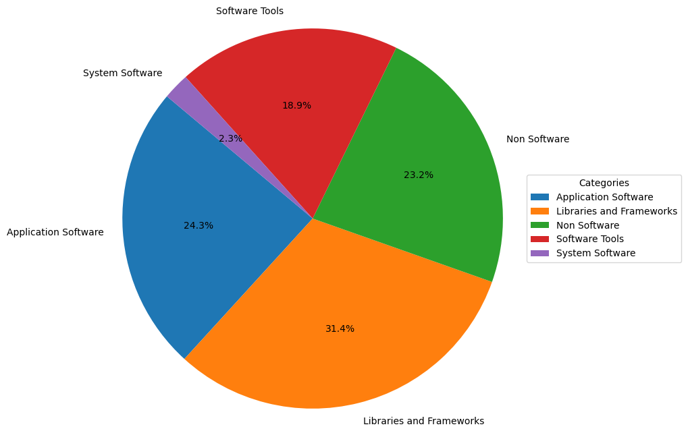
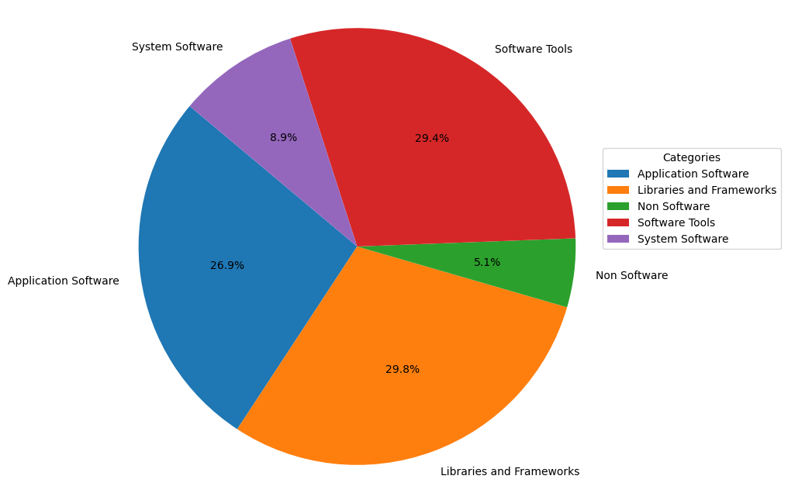
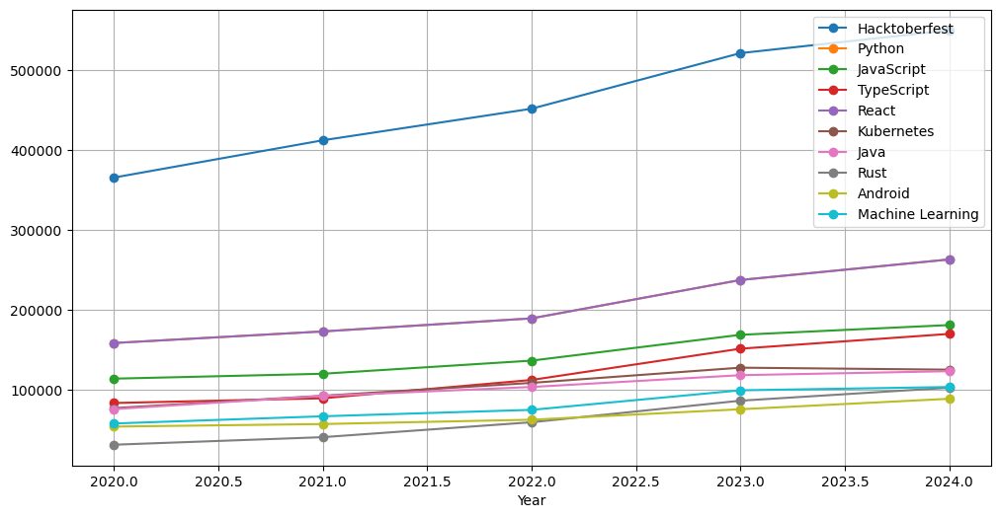

# データ篇

## 概要

**2024 中国オープンソース年度报告**は、包括的で詳細なデータ洞察を中核とし、9つの章で中国のオープンソースエコシステムの活況を全方位的に紹介しています。 
**第1部 マクロ洞察編**では、基礎的な出来事、アクティブなリポジトリ、アクティブなユーザー、プログラミング言語などの観点から、中国がグローバルなオープンソースエコシステムにおける独自の地位と影響力を明らかにします。
**第2部 OpenRank ランキング編**では、グローバルと中国各分野のオープンソースプロジェクト、企業、財団、開発者、協業ロボットのランキングを通じて、業界に権威あるシステム的なOpenRank指標情報を提供し、オープンソース貢献を測る重要な基準となります。
**第3部・第4部 企業洞察編と財団洞察編**では、動的変化図とトレンド分析を通じて、グローバルと中国の企業・財団がオープンソース分野における戦略的展開と進化の道を深く解析します。 
**第5部 技術分野洞察編**では、各分野のトップ10ランキングとプロジェクトの変化に焦点を当て、最先端技術の発展方向とイノベーションのトレンドを正確に捉えます。
**第6部 オープンソースプロジェクト洞察編**では、プロジェクトの種類、分野、テーマの多様性を深く探求し、オープンソースエコシステムの活力とイノベーションの可能性を明らかにします。 
**第7部 開発者洞察編**では、開発者のタイプ、勤務時間分布、地域分布、およびロボットの利用状況の分析を通じて、開発者群の多様性と作業形態を描き出します。
**第8部 商業オープンソース洞察編**では、中国と世界の商業オープンソース企業とプロジェクトの現状に焦点を当て、その成長経路と成功要因を分析します。 
**第9部 大学オープンソース洞察編**では、オープンソース・サマー OSPP 活動と OpenRank コミュニティアルゴリズムを組み合わせ、大学学生のオープンソース活動への参加度と貢献度を明らかにし、オープンソース人材育成の新たなトレンドを提示します。全体として、データ編は豊富なデータ次元と深い分析視点を通じて、2024年中国オープンソースエコシステムの全体像を浮き彫りにし、業界に貴重な洞察と参考を提供します。

### 指標の介绍

**影響力/貢献度（OpenRank）**

**OpenRank 指標**はX-lab オープンラボラトリーが開発したもので、開発者-プロジェクト協業関係ネットワークを基盤に構築され、多角的な評価能力を備えています。プロジェクトの評価においては、OpenRank は「影響力」を核心に据え、プロジェクトの全体的な発展状況とコミュニティ参加度を総合的に測定します。開発者の評価においては、「貢献度」を主要指標とし、オープンソースエコシステムにおける協業価値と活動度を正確に反映します。 さらに、OpenRank は評価対象を**企業、組織、財団**などの上位レベルに集約し、オープンソースエコシステムにおける戦略的地位と協業ネットワークにおける核心的な役割を明らかにします。 現在、OpenRank は産業界と学術界から広く認められ、複数の権威ある基準と実践に採用されています。具体的には、中国標準化研究院のオープンソースガバナンス基準、情報通信研究院のオープンソースガバナンス白書、オープンアトミックオープンソース財団のグローバルオープンソースダッシュボード、および企業オープンソースオフィスのガバナンスツールキットなどに含まれており、オープンソースエコシステムの健康度と協業価値を測定する権威あるツールとして位置付けられています。

OpenRank 参考文献：

[1] [Shengyu Zhao et al: OpenRank Leaderboard: Motivating Open Source Collaborations Through Social Network Evaluation in Alibaba. ICSE, 2024](https://www.researchgate.net/publication/376686121_OpenRank_Leaderboard_Motivating_Open_Source_Collaborations_Through_Social_Network_Evaluation_in_Alibaba)

[2] [赵生宇: 如何评价一个开源项目（三）价值流网络, 2021](https://blog.frankzhao.cn/how_to_measure_open_source_3)

[3] 工业和信息化部标准化研究院: 《信息技术 开源治理 第3部分：社区治理与运营》[T/CESA 1270.3-2023]、《信息技术 开源治理 第 5 部分：开源贡献者评价模型》[T/CESA 1270.5-2023], 2023

**活動度（Activity）**

**活動度** は、X-lab R&D の中核となるメトリクスの 1 つで、プロジェクトや開発者の活動度を定量的に評価するために使用されます。 開発者のアクティビティは、オープンソースエコシステムにおける主要な行動 (課題の提出、PR の作成、コードレビューなど) に重み付けして計算され、参加と貢献の強度を正確に反映します。 プロジェクト活動」は、プロジェクトにおけるすべての開発者の活動の合計に基づいており、プロジェクトの全体的な活動とコミュニティ参加のレベルを測定するために標準化されています。 この指標は、オープンソースのエコシステムの健全性を評価するための科学的かつ定量的な根拠を提供します。

Activity 参考文献：

[1] [Xiaoya Xia et al: Exploring activity and contributors on GitHub: Who, what, when, and where. APSEC, 2023](https://ieeexplore.ieee.org/abstract/document/10043221)

[2] [赵生宇：如何评价一个开源项目（一）——活跃度，2021](https://blog.frankzhao.cn/how_to_measure_open_source_1)

## I. 全体的なマクロ洞察

### 1.1 基本イベント
**基本イベント** は、オープンソースエコシステム分析の中核となるデータソースであり、グローバルな オープンソースコラボレーションプラットフォーム(GitHub、Gitee など)上の開発者の活動によって 生成されたイベントログデータを指します。 これらのイベントの統計分析を通じて、グローバルなオープンソースエコシステムの発展に関するマクロな洞察を得ることができます。 本レポートでは、GitHub と Gitee の両方のデータを取り上げます。

#### 1.1.1 GitHub 全体のイベント傾向

2024年には、GitHub全体のイベントログの総数は**175億**に達し、前年比では約**10%**の成長となっている。 成長率は2018年から2023年の高成長期に比べると鈍化しているが、それでも10%の成長率は、グローバルなデジタルトランスフォーメーションにおけるオープンソースの重要な位置を示している。 この成長を促進する主な要因は以下の通りである：

**GitHub Copilot**のようなAIツールの普及**：AI支援プログラミングツールの普及により、2023年初頭以降、特に南半球でより多くの開発者が集まっている。
* 開発者数の増加**：世界的な開発者数の増加は、イベントログの増加に直接寄与している。

図 1.1 は、GitHub の年度イベント数の増加傾向を示しており、オープンソースのエコシステムにおける継続的な活動を浮き彫りにしています。

図 1.1 GitHub 年度イベント数傾向 

 

#### 1.1.2 GitHub と Gitee のイベント数の傾向の比較

比較のために、GitHub と Gitee の各プラットフォーム**で上位 30,000** のアクティブなリポジトリを選択し、オープンソースの参加に密接に関係する 8 種類のイベント（CommitCommentEvent、PullRequestEvent など）に焦点を当てました。 分析結果は以下の通りです：

* GitHub**：イベントの数は増加し続けているが、グローバルなプラットフォームの多様性と活動を反映して変動している。
* Gitee**：イベント数は着実に増加しており、国内オープンソース社の着実な発展と標準化の傾向を示している。

GitHubのイベント数はGiteeのイベント数よりもまだはるかに多いものの、Giteeの着実な成長は、国内の開発者のオープンソースに対する熱意と貢献が高まっていることを示しています。 図1.2は、2つのプラットフォームにおける発生件数の推移を示している。

图 1.2 GitHub と Gitee の活動リポジトリイベント数 

 

#### 1.1.3 セグメンテーション イベントタイプの分析

イベントタイプの分布をさらに分析する（図 1.3、図 1.4）：

* Pull Request と Issue Comment イベントがそれに続き、活発なコードコラボレーションと課題に関する議論を示しています。
* Gitee**: Pull Request Review Commentイベントの割合が最も高いのは、主にプラットフォームのCI機能の自動レビューメカニズムによるものです。 この傾向は、国内開発者の役割が「フォロワー」から「コントリビューター」へとシフトしていることを反映している。

図 1.3 GitHub イベント別分析 

 

图 1.4 Gitee イベント別分析 

 

### 1.2 アクティブなリポジトリ

#### 1.2.1 GitHub全体のアクティブリポジトリの傾向

GitHubのアクティブリポジトリ数は増え続けているが、その速度は年々緩やかになっている（図1.5）。2020年の流行期にリポジトリが急増したのは在宅勤務とデジタルトランスフォーメーションに後押しされたためであり、2022年以降の鈍化は市場の成熟と競合プラットフォーム（GiteeやGitLabなど）の成長に関係している。

図1.6は、GitHubのリポジトリ活動の全体的な傾向を示しており、2024年は過去最高に近い。

図 1.5 GitHub 年別アクティブリポジトリの状況 

 

図 1.6 GitHub リポジトリのアクティビティまとめ 

 

GitHub リポジトリの活動を支えているのは、**Issue 関連のイベント** (例: Issue Comment) と、**Pull Request 関連のイベント** (例: PR の作成やマージ) です (図 1.7)。 具体的には

* 29.1%の**課題コメントイベント**は、アクティブなイベントの中で最大の構成要素であり、ユーザーが課題解決や改善に関する議論に非常に積極的であることを示しています。
* プルリクエストイベント**（PRの作成とマージを含む）は46.4%で、アクティブイベント全体の半分近くを占めており、コードの共同作業や貢献においてGitHubが中心的な役割を担っていることがわかります。

図 1.7 は、GitHub リポジトリにおける活動の詳細な構成を示し、オープンソース・プロジェクトの開発を推進する上で、Issue と PR イベントが重要な役割を担っていることをさらに示しています。

図1.7 GitHubリポジトリのアクティビティ構成 

 

GitHubリポジトリの**OpenRank値**は、2018年から2020年にかけて急速な成長期を経験し、この間のGitHubのユーザー拡大とオープンソースプロジェクト活動の二重の爆発を反映して、成長率は2020年にピークに達した。 しかし、**2023**年からは成長率が回復し、2024年には若干低下するものの、全体としては安定した成長を維持しており、世界有数のオープンソースプラットフォームとしてのGitHubの活力と魅力が継続していることを示している。

図 1.8 GitHub リポジトリ OpenRank 

 

#### 1.2.2 Gitee のドメイン全体のアクティブリポジトリの傾向

Giteeのリポジトリ活動は2018年から2020年にかけて急速に成長し、主に国内のオープンソース政策の支援とOpen Atomオープンソース財団の設立の恩恵を受け、2020年にピークに達する。2021年以降は成長率が鈍化するが、それでも2024年に新たなピークに達する（図1.9）。

図 1.9 Gitee リポジトリのアクティビティ概要 

 

Giteeプラットフォームでは、**レビューコメントイベント**が絶対的に優勢で、アクティブなイベント全体の75.6%を占めており、他のタイプのイベント（例：Open Issue、Issue Comment、Merged Pullなど、約7%、Open Pullイベントはわずか5%）よりもはるかに高くなっています。 この分布から、Gitee の開発者はコードレビューに重点を置いており、コード投稿や課題に関する議論は GitHub よりもやや少ないことがわかります。これは、プラットフォームユーザーのコード品質に対する高い関心と、標準化プロセスが徐々に成熟していることを反映しています (図 1.10)。

図1.10 Giteeリポジトリ・アクティビティの構成 

 

Giteeの**OpenRank値**は、2018年から2024年にかけて、特に2019年から2020年にかけて大きく成長し、主に国内のオープンソース生態学的政策の支援とローカライズされたプラットフォームへの開発者の積極的な参加から恩恵を受けている。 2021年以降は成長率が鈍化するものの、Giteeの活動全体は依然として安定した上昇傾向を維持しており、国内のオープンソースプラットフォームの中で地位が向上し、コミュニティへの貢献と活動が継続的に成長していることが確認された。

図 1.11 Gitee リポジトリ OpenRank 

 

### 1.3 アクティブな開発者

#### 1.3.1 GitHub 全体のアクティブユーザーの動向

2024 年の分析では、これまでの調査の手法を引き継ぎ、より詳細でリッチなデータソースに基づいている。 この調査は、GitHub のアクティブな開発者 1200 万人を対象としており、そのうち約 255 万人が正確な位置情報を提供しており、GitHub ユニバースの登録ユーザー総数 (約 1 億 2000 万人) の 2% に相当します。 このサンプルは全ユーザー数のごく一部ですが、データの質が向上したことで、世界中の開発者の地理的分布や地域的なコラボレーションパターンを分析するための、より代表的な視点が提供されるようになりました。

図1.12は、GitHubのアクティブな開発者数の年度ごとの増加傾向を示している。 2020年の1,454万人から2024年には2,511万人と、アクティブな開発者数は概して増加傾向にある。 その中でも

* 2019-2021年**：主に、流行とグローバルなデジタルトランスフォーメーションの加速によるリモートワークの変革の恩恵を受け、急成長。
* 2022年～2023年**年：市場の成熟度とベース効果に関連すると思われ、成長は鈍化。
* 2024年**：成長率は14.1%に回復し、新規開発者数は約311万人となる。

図1.12 GitHubの年度アクティブ開発者数の推移 

 

開発者の成長はリポジトリの成長よりも安定しており、GitHubのユーザーベースが拡大し続けていることを示しています。 成長が鈍化している時期であっても、毎年かなりの数の新規開発者が参加しており、2024 年の回復は、世界をリードするオープンソースプラットフォームとしての GitHub の魅力をさらに証明しています。

#### 1.3.2 開発者の地理的分布

**1.世界の開発者の地理的分布

統計によると、世界の開発者の地理的分布は非常に集中しており、以下の表に示すように、上位10カ国が世界の開発者総数の60%を占めている：

| 順位 | 国名 | 合計 | 割合 | 開発者の活動状況 |
|------|--------------|---------|---------|------------------|
| 1    | アメリカ         | 435,202 | 17.11%  | 4,301,051.55     |
| 2    | インド         | 252,054 | 9.91%   | 1,099,659.73     |
| 3    | 中国         | 184,085 | 7.23%   | 1,097,116.82     |
| 4    | ブラジル         | 174,811 | 6.87%   | 683,186.08       |
| 5    | ドイツ         | 126,397 | 4.96%   | 1,492,317.89     |
| 6    | 英国         | 103,061 | 4.05%   | 1,140,839.73     |
| 7    | カナダ       | 82,627  | 3.24%   | 821,240.65       |
| 8    | フランス         | 78,288  | 3.07%   | 833,038.24       |
| 9    | ロシア       | 60,735  | 2.38%   | 310,555.47       |
| 10   | 韓国         | 44,006  | 1.73%   | 375,550.82       |

**主な考察
- 米国**は435,000人の開発者(17.11%)で群を抜いており、その**活動**(4,301,051.55)も世界的にトップであり、オープンソースのエコシステムにおける絶対的な優位性を示している。
- インド**(9.91%)と**中国**(7.23%)が続いており、中国の開発者数はインドより少ないが、活動レベルはほぼ同じで、中国の開発者のオープンソースプロジェクトへの参加と貢献の密度の高さを示している。
- ドイツ**は、開発者数では5位であるにもかかわらず、2番目に活発な国（1,492,317.89）として際立っており、開発者の全体的な参加の深さを示している。
- ブラジルとロシア**は、開発者数は多いものの、一人当たりの活動量は少なく、オープンソースエコシステムへの参加の質にはまだ改善の余地があることを示しています。

#### 中国の開発者の地理的分布
中国における開発者の分布をさらに分析すると、中国の開発者総数は9,404,966人**で、そのうち**北部、上海、広州、深圳**地域が大きなシェアを占めており、経済的に発展した地域がオープンソース技術に強く惹かれていることを示しています。

| Rank | Provinces | Total | National Share | Actual Total (10,000) |
|------|--------|--------|----------|----------------|
| 1    | 北京   | 38,323 | 22.04%   | 207.20         |
| 2    | 上海   | 28,393 | 16.43%   | 154.86         |
| 3    | 广东   | 24,959 | 14.49%   | 136.28         |
| 4    | 台湾   | 15,894 | 9.53%    | 89.62          |
| 5    | 浙江   | 15,816 | 8.13%    | 76.52          |
| 6    | 江苏   | 9,369  | 4.90%    | 46.10          |
| 7    | 四川   | 8,186  | 4.69%    | 44.03          |
| 8    | 香港   | 6,625  | 3.13%    | 29.44          |
| 9    | 湖北   | 5,732  | 2.95%    | 27.75          |
| 10   | 陕西   | 3,669  | 1.88%    | 17.68          |

**主な考察
- 北京(22.04%)、上海(16.43%)、広東省(14.49%)が上位3位を占め、その合計シェアは50%を超えており、オープンソースのエコシステムにおけるこれらの経済・技術の中心地の重要性を反映している。 北京は38,323人の開発者（2,072,000人）でトップであり、技術革新と人材プールにおける中核的な強みを示しています。
- 台湾と香港**: 台湾（9.53%）と香港（3.13%）は、オープンソースのエコシステムにおいて突出しており、台湾はそのハイテク産業とオープンな政策環境のおかげで多くの開発者を惹きつけています。
- 長江デルタと珠江デルタの優位性**: 長江デルタ地域(上海、浙江、江蘇)と珠江デルタ地域(広東)の開発者の総数は15万人を超えており、経済的に発展した東海岸の強力なイノベーション能力を示している。
- 中西部の台頭**：四川省（4.69％）、湖北省（2.95％）、陝西省（1.88％）の開発企業数は東部ほど高くないが、全体的な伸びは大きく、中西部の技術革新生態系が徐々に改善され、地域の魅力が高まっていることを示している。

#### 概要と展望
- グローバルな視点***: 中国はグローバルなオープンソースエコシステムにおいてますます重要性を増しており、開発者の活動や貢献の密度はインドに近づいており、オープンソースエコシステムの急速な成熟を示しています。 ドイツやイギリスのような国々は、一人当たりの活動量が多く、中国が彼らの深い参加パターンから学ぶことは価値があります。
- 国内分布**: 北部、上海、広州、深圳、および沿岸地域は、依然として中国のオープンソース開発者が集まる中心的な場所であるが、中部および西部地域の技術生態系は増加傾向にあり、将来の中国のオープンソースエコシステムのバランスの取れた発展に新たな勢いをもたらしている。
- 開発に関する提言**：
1. 中西部地域の開発者に対する支援とリソースを強化し、バランスの取れた地域発展を促進する。
2. ドイツのような参加者の多い国の経験から学び、開発者のコミュニティへの参加と貢献の深さを高める。
3.グローバルなオープンソースエコシステムにおける中国の競争力をさらに強化するために、政策的インセンティブと技術支援を通じて、より積極的で貢献度の高い開発者を育成する。

<!-- ### 1.4 开源许可证
### **1.4 开源许可证（优化版）**
#### **1.4.1 使用开源许可证的仓库数量**
统计数据显示，GitHub 活跃仓库中采用的开源许可证分布如下：

图 1.12 使用开源许可证的仓库数量占比 
  

**主要观察：**
- **MIT 许可证**占比最高，接近 43%，是最受欢迎的开源许可证。MIT 许可证以其简洁和灵活性著称，提供最小的法律限制，允许开发者自由使用和传播代码。这种特性使其成为全球开发者的首选。
- **Apache 许可证 v2.0**占比从 2023 年的 15.7% 上升至 19.4%，显示出对更严格版权声明的需求逐渐增加。
- 其他主要许可证包括 **GNU 通用公共许可证 v3.0** 和 **BSD 3-Clause 许可证**，它们在开源项目中也有广泛应用。

相比 2023 年，MIT 许可证的占比有所下降，而 Apache 2.0 许可证的比例显著提高，这反映了开源社区对代码修改声明和知识产权保护的关注逐渐上升。

---

#### **1.4.2 开源许可证种类变化趋势**
分析了开源许可证种类的增长趋势，结果如下图所示：

图 1.13 开源许可证种类数量变化趋势 
  

**主要观察：**
- 从 2017 年起，开源许可证的种类呈现持续增长态势。2017-2018 年间，**Eclipse 公共许可证 2.0** 和 **欧盟公共许可证 1.2** 等新许可证的推出推动了增长。
- 2021-2022 年，**木兰系列许可证**和 **CERN 许可证 v2** 等创新型许可证开始崭露头角，进一步丰富了许可证种类。
- 到 2024 年，GitHub 上主流开源许可证的种类已稳定在 **47 种**，表明开源社区对标准化和成熟化的需求逐步提升。

---

#### **1.4.3 使用开源许可证仓库数量变化趋势**
2023 年，约有 **770 万个活跃仓库**使用了各种开源许可证，占所有活跃仓库的 8.76%。以下是对主要许可证的数量变化趋势分析：

**1. MIT 许可证数量变化趋势**  

图 1.14 使用 MIT 许可证的仓库数量变化趋势 
  

**发现：**
- 2023 年，MIT 许可证的活跃仓库数量为 **158 万**，2024 年则减少至不到 **100 万**，出现大幅下降。
- 与此同时，Apache 2.0 许可证的占比上升，表明开发者更倾向于选择需要在代码修改后声明修改的许可证，而非完全自由的 MIT 许可证。
- 总体来看，MIT 许可证的使用减少反映了开源社区对项目代码属性保护的需求逐渐增强。

**2. 其他主要许可证数量变化趋势**  

图 1.15 使用其他许可证的仓库数量变化趋势 
  

**发现：**
- 所有主要许可证（如 Apache、GNU、BSD）的使用数量在 2024 年均有所下降，但许可证头部仍以 MIT、Apache 和 GNU 为主。
- **小众许可证**的使用比例相对稳定，热门许可证的下降比例更为明显，表明开源社区正在逐渐多元化。

---

#### **1.4.4 使用木兰系列许可证仓库数量变化趋势**
以下是对木兰系列许可证（包括“木兰宽松许可证”和“木兰公共许可证”）的使用趋势分析：

图 1.16 使用木兰系列许可证的活跃仓库数量累加图 
  

**主要观察：**
- 木兰系列许可证由北京大学牵头，联合开源社、产学研团队及开源法务团队起草，是中国首个获得 OSI 认可的开源软件许可证。
- 从 2022 年 9 月起，使用木兰许可证的活跃仓库开始显著增长，并在 2024 年 1 月后，每月新增仓库数量稳定在 **50 个以上**。
- 木兰许可证的增长展示了其在中国开源社区和全球市场中的认可度逐步提升，尤其在推动本土开源规范和知识产权保护方面的价值日益凸显。

---

### **总结与趋势洞察：**
1. **许可证偏好变化**：MIT 许可证仍是最流行的开源许可证，但其下降趋势表明社区更关注代码修改声明和知识产权保护，Apache 2.0 的上升则是这一趋势的直接体现。
2. **种类稳定化**：2024 年，主流开源许可证的种类趋于稳定，显示出开源社区对标准化许可协议的需求日益成熟。
3. **木兰许可证崛起**：木兰许可证的使用量持续增长，标志着中国本土开源协议在国际开源社区中的影响力逐步提升，这将为中国开源生态的发展注入更多动力。
4. **发展建议**：
   - 推动更多创新型许可证的研发，满足不同行业和场景的需求。
   - 强化开源许可证知识普及，帮助开发者更好地理解和选择适合项目的许可证。
   - 支持本土许可证的国际化推广，进一步提升中国开源生态的全球影响力。
 -->
 
### 1.4 プログラミング言語

#### 1.4.1 2024年に開発者が使用するプログラミング言語のリスト

プログラミング言語の人気は、開発者にとって常に大きな関心事である。 ここでは、2024年度に開発者に最も人気のあるプログラミング言語のリストを示す：

表1.3 開発者が使用するプログラミング言語のトップ（Top 15） 
  

| ランキング | プログラミング言語 | その言語を使用している開発者数 | その言語を使用しているリポジトリ数 |
|:---:|:-----------------:|:-------:|:-------:|
|  1  | JavaScript       | 591,223  | 654,037  |
|  2  | Python           | 540,751  | 499,644  |
|  3  | TypeScript       | 439,954  | 462,496  |
|  4  | HTML             | 424,901  | 401,084  |
|  5  | Java             | 281,403  | 328,123  |
|  6  | C++              | 143,135  | 106,444  |
|  7  | CSS              | 137,566  | 114,166  |
|  8  | C#               | 131,549  | 163,796  |
|  9  | Go               | 125,521  | 121,209  |
|  10 | Jupyter Notebook | 119,874  | 79,415   |
|  11 | PHP              | 100,984  | 108,019  |
|  12 | Shell            | 93,726   | 76,276   |
|  13 | C                | 84,253   | 60,389   |
|  14 | Rust             | 68,199   | 62,969   |
|  15 | Kotlin           | 53,503   | 48,013   |

**主な考察
- JavaScript**は、開発者数59万人、リポジトリ数65万件で、最も人気のあるプログラミング言語としてトップの座を維持している。
- Python**は、データサイエンス、人工知能、および汎用プログラミングで広く使用されているため、開発者数54万人で僅差に迫っている。
- TypeScript**は3位で、HTML（42.4万人）を上回る開発者数（43.9万人）を記録しており、フロントエンド開発における継続的な台頭を示している。
- HTML**は42.4万人、Java**は28.1万人で4位と5位だが、6位の**C++**から開発者数がほぼ半減しており、プログラミング言語の先頭への集中効果が顕著に表れている。
- ランキング6位から15位までの言語（C++、Rust、Kotlinなど）は、ユーザー数は少ないものの、特定の分野（システム開発、モバイル開発など）では依然として大きな影響力を持っている。

全体として、主流のプログラミング言語はその適用領域をほぼ固めており、ランキングのユーザー数は近年あまり変化していないことから、開発者のこれらの言語の選択には高い安定性があることが示唆される。

---

#### **1.4.2 開発者のプログラミング言語利用動向（2019年～2024年

以下は、2019年～2024年に開発者が使用するプログラミング言語の傾向を統計的に分析したものである：

  

図1.15 開発者のプログラミング言語使用動向（2019年～2023年 
  

  

図1.16 開発者のプログラミング言語使用動向、2019年～2024年（予測） 
  

**データに関する注意事項:**
データソースが倉庫のメタ情報を提供しなくなったため、2024年10月、11月、12月に関するデータが欠落している。そのため、2024年のデータは2019-2023年のデータと合わせて予測モデルを用いて推定しており、点線は予測結果を示している。

**主な注目点
1.**JavaScript**、**Python**、**HTML**、**TypeScript**、**Java**は、現在最も支配的なプログラミング言語であり、長期にわたってリーダーの地位を維持している。
2.HTML言語の急成長**：予測によると、HTMLの成長は2024年に加速し、Pythonとの差を大きく縮める。 この傾向は、開発者がプロジェクト・プレゼンテーションの美学や利便性を重視していることと関係していると考えられ、HTMLは今後もフロントエンド開発やコンテンツ・プレゼンテーションにおいて重要であり続けるだろう。
3.飛躍を続けるTypeScript**：TypeScriptは過去5年間で使用率が急速に伸びており、2021年には次に人気のあるプログラミング言語との差を縮め、開発者にとって中心的な選択肢の1つになると予想されている。TypeScriptの成功は、JavaScriptの上に静的な型チェックを導入したこと、コミュニティの強力なサポート、大規模プロジェクトへの適応性によるものである。
4.JavaScriptとPythonは着実に成長している。

---

### 要約と傾向に関する考察

1.**大きなヘッドライン効果**：JavaScriptとPythonは長い間トップ2に君臨してきたが、TypeScriptの急速な台頭により、フロントエンド開発におけるその地位はさらに強固なものとなった。 同時に、HTMLの成長は、より直感的で使いやすい技術を求める開発者の要望を反映している。
2.**ドメイン主導のトレンド**：C++やRustなどの言語のユーザーベースは小さいが、システム・プログラミングやハイパフォーマンス・コンピューティングなどの特定ドメインにおける影響力は無視できず、今後も垂直ドメインにおけるキーテクノロジーとして機能し続ける可能性がある。
3.コミュニティとエコシステムは明白な役割を果たす**：TypeScriptの成功は、プログラミング言語の普及におけるコミュニティとエコシステムの重要性を改めて証明している。 言語自身の技術的な優位性と強力なサポートシステムが組み合わさることで、ユーザーの成長を大きく後押しすることができる。
4.**開発のすすめ**：
- 新興プログラミング言語（例：Rust、Kotlin）の開発動向を見据えて、サポートツールやエコシステムを積極的に改善し、より多くの開発者を惹きつける。
- フロントエンドの開発効率と表示効果を向上させるため、開発者がプロジェクトでHTMLやTypeScriptをより多く試すよう奨励する。
- 業界における垂直プログラミング言語（C++やGoなど）の応用の深化を支援し、革新的な技術の実装を促進する。

## II. OpenRank ランキング

2024年度中国オープンソース年次報告書』は、**OpenRankランキング**という独自の視点から、プロジェクト、地域、企業、財団、新興プロジェクトなど、オープンソース社における主要プレイヤーの活動と影響力を紹介しています。 本レポートは、**GitHub**と**Gitee**という国内外の2大プラットフォームのデータを統合し、中国のオープンソースエコシステムの網羅とグローバルな視点からの分析の両方を提供しています。 このランキングを通じて、オープンソース文化の普及とオープンソース技術の応用をさらに促進し、企業や個人がオープンソースプロジェクトに積極的に参加することを奨励することを期待しています。

---

### 2.1 グローバルプロジェクトランキング
  

図2.1 世界のプロジェクトOpenRankランキングトップ30（2024年) 
  

2024年グローバルプロジェクトOpenRankランキングトップ30**によると、**中国のオープンソースプロジェクトOpenHarmony**がOpenRank値**67538.71**でトップとなり、その卓越した活動とオープンソース社における世界的な影響力を示した。 **Azure**と**.Net**はそれぞれ2位と3位にランクインした。 特筆すべきは、**OpenHarmony**と**LVM**のOpenRankスコアが過去1年間で大きく伸びており、特定の技術ドメインやスタックにおける多大な成長の可能性とコミュニティへの影響力を示していることです。

**ランキングの概要
- オペレーティングシステム**、**クラウドコンピューティング**、**プログラミング言語**、**モノのインターネット**、**ビッグデータ**、**人工知能**、**ゲームエンジン**、**ビジュアライゼーションツール**など、複数のドメインをカバー。
- オープンソース・プロジェクトの幅広さと多様性を示すと同時に、技術分野の焦点とホットな方向性を反映している。

--- --- --- --- --- --- --- --- --- --- --- ---

### 2.2 中国プロジェクトランキング
  

図2.2 OpenRankランキングの中国プロジェクト上位30（2024年) 
  

中国プロジェクト**の**2024 OpenRankランキング**は、**オペレーティングシステム**（例：OpenHarmony）、**人工知能**（例：MindSpore）、**データベース**（例：openGauss、TiDB）、**ビッグデータ処理**（例：Apache Flink）など、幅広い技術分野をカバーしている。 これは、中国のオープンソース・プロジェクトの多様性と技術力が高まっていることを示しています。

**主な考察
- Huawei**は、ランキングのいくつかのポジションを占めており（OpenHarmony、openEulerなど）、中国のオープンソース社における支配的な地位と顕著な貢献を示しています。
- MindSpore**と**PaddlePaddle**はそれぞれ3位と4位にランクインしており、AI分野における中国の急速な発展を反映している。
- プライバシー・コンピューティング・プロジェクトの台頭***: **SecretFlow**がプライバシー・コンピューティング分野の代表としてリストに入り、この新興技術分野が広く注目されていることを示している。

---

### 2.3 グローバル企業ランキング
  

図2.3 世界の企業OpenRankランキングトップ30（2024年) 
  

グローバルエンタープライズOpenRankランキング**は、オープンソースプロジェクトの国際化とグローバル化を示しており、**米国企業**がランキングを独占している。 マイクロソフト**、**グーグル**、**アマゾン**などの技術大手がOpenRankのスコアをリードし、オープンソースにおける世界的なリーダーシップを実証している。

**ハイライト
- 中国企業の台頭***: **Huawei**と**Alibaba**がそれぞれ2位と8位にランクインし、グローバルなオープンソースエコシステムにおける中国企業の影響力の高まりを反映している。
- 新興企業**: **HashiCorp**、**Hugging Face**、**Vercel**、**LangChain**などの新興企業もリスト入りし、オープンソース空間におけるイノベーションが解き放たれていることを示しています。

--- --- --- --- --- --- --- --- --- --- --- ---

### 2.4 中国トップ企業
  

図2.4 OpenRankにおける中国企業上位30社（2024年) 
  

2024年中国企業OpenRankランキング**は、大企業が上位を占めており、オープンソース・エコシステムの発展を牽引する中国企業の重要な役割を示している。

**主な考察：*** ファーウェイ、アリババ
- Huawei、Alibaba、Ant Group、Baidu**が上位にランクインしており、オープンソースエコシステムの中核を担う企業であることを示しています。
- Tencent、Baidu、および Alibaba は、国内の優れたパフォーマーであるだけでなく、グローバルなオープンソースプロジェクトにも大きな影響力を持っています。

--- 

### 2.5 オープンソースFoundationランキング
  

図 2.5 2024 年オープンソースFoundation OpenRank ランキング Top 20
  

**OpenAtom財団**は、2024年のオープンソース財団のOpenRankランキング**で1位となり、大規模なオープンソース・プロジェクトの推進における中国の重要な成果を実証した。

**ハイライト
- 米国では、**Cloud Native Computing Foundation**、**Apache Software Foundation**、**Linux Foundation**など、ランキング上位の財団が引き続き存在感を示している。
- オランダの**Stichting NixOS Foundation**と**Godot Foundation**は、それぞれ4位と7位にランクインし、オープンソースプロジェクトへのヨーロッパの関与と貢献を示しています。

---

### 2.6 開発者のグローバル管理ランキング
  

図 2.6 2024 年グローバル地域別開発者 OpenRank ランキング Top 30
  

**行政区の世界ランキング**では、経済的に発展した地域のオープンソース開発活動のレベルが高いことが示されています。
**主な考察
- カリフォルニア州（シリコンバレー）、ワシントン州（マイクロソフト、アマゾン本社の本拠地）、ニューヨーク州などは、オープンソース活動の世界的な中心地です。
- 北京や上海などの中国***の都市も好調で、グローバルなオープンソースエコシステムにおける地位をさらに強固なものにしている。

---

### 2.7 中国の行政区におけるトップ開発者
  

図 2.7 2024 年中国行政区別開発者 OpenRank ランキング Top 34
  

**中国の行政ランキング**によると、北京や上海などの第一級都市が引き続きオープンソース開発を支配している一方、沿海都市や一部の西部地域もより大きな発展の可能性を示している。

---

### 2.8 世界の新電力プロジェクトランキング
  

图 2.8 2024 年全球新势力项目 OpenRank 排行榜 Top 10
  

**全球新势力项目排行榜** 反映了高度活跃的核心项目和开发团队，代表了未来技术趋势和创新方向。

**亮点：**
- **UV 项目**位列第一，作为 Python 包管理工具，其活跃开发者数量和协作紧密度非常高。
- **Valkey 项目**（第四位）：从 Redis 分叉而来，是一个高性能键值数据存储项目，目前托管于 Linux 基金会，并获得包括 AWS、Google Cloud 和阿里巴巴等巨头支持。
- **Redot Engine**（第九位）：社区驱动的开源游戏开发引擎，基于 Godot 引擎分叉，采用 MIT 许可证。
- **KWDB 项目**（第十位）：作为中国唯一上榜的新势力项目，KWDB 是国内首款开源分布式多模数据库，由开放原子基金会孵化，体现了中国在数据库领域的技术创新和开源贡献。

---

### 总结与趋势洞察：

1. **中国开源生态崛起**：OpenHarmony 等项目的全球领先地位和华为等企业的突出表现显示了中国在开源领域的快速崛起。
2. **全球化与多样性**：排行榜涵盖了多个技术领域和地区，充分反映了开源生态的国际化和技术广泛性。
3. **新兴技术驱动**：隐私计算、分布式数据库和社区驱动游戏引擎等新兴领域正在成为全球开源技术的热点。
4. **发展建议**：
   - 支持新兴项目的孵化与发展，尤其是中国项目的国际化推广。
   - 加强对开源基金会和社区的支持，推动全球开源生态的合作与创新。
   - 引导更多开发者参与开源项目，提升技术影响力和全球竞争力。

## 三. 企业洞察
企业在开源生态中的角色与表现，正日益成为衡量其技术创新能力与行业影响力的关键维度。从全球化的技术竞争到本地化的行业应用，开源已成为驱动企业数字化转型和技术突破的重要引擎。随着开源生态的持续扩展，企业在开源领域的活跃度、贡献度和影响力，逐渐成为评估其综合实力的重要指标。

本节将通过分析全球及中国企业近十年来的 OpenRank 演变趋势，并结合 2024 年度的活跃度与 OpenRank 排名，深入探讨企业在开源领域的表现及其对行业生态的推动作用。特别是针对今年中国企业中的黑马——DaoCloud，将通过数据可视化、核心项目生态协作网络与社区协作网络的分析，全面展现其在云原生技术领域的快速崛起与战略布局，为行业提供新的参考与启示。

### 3.1 近 10 年全球企业 OpenRank 演变图

图 3.1 近 10 年全球企业 OpenRank 演变图 

 

全球企业在开源领域的影响力观察如下：  

1. **微软**：自2008年开始布局开源，微软在2016年登顶全球开源影响力之巅，至今无人撼动其地位。  
2. **华为**：自2019年受到美国制裁后，将开源作为重要战略方向，开源影响力持续飙升，并于2023年成功超越Google和Amazon，取得重大突破。  
3. **阿里巴巴**：在2021年前一直是国内开源的领军者，目前稳居全球第八，保持着领先地位。  
4. **蚂蚁集团**：近三年表现亮眼，2023年首次跻身全球前15，现排名第13，展现出强劲的开源发展势头。  
5. **百度**：作为国内开源的第四大巨头，凭借国内快速变化的开源态势，目前全球排名第12。  
6. **Nabu Casa Inc**：2023年的全球年度黑马，首次进入全球Top15，目前位列第11，是全球最大的开源家庭自动化平台。  
7. **Intel**：今年首次进入全球Top15，排名第15，显示出其在开源领域的逐步布局与发力。  
8. **DataDog**：另一位新晋Top15企业，排名第14，这是一家提供云应用监控和数据分析服务的领先企业，展现出其在开源领域的潜力。  

### 3.2 近 10 年中国企业 OpenRank 演变图

图 3.2 近 10 年中国企业 OpenRank 演变图 

 

本图清晰展现了国内企业在开源战略上的布局及变化趋势：  

1. **华为**：自2018年开始发力，仅用两年时间便跃居国内开源第一，并于2023年攀升至全球第二，展现出强劲的开源战略执行力。  
2. **阿里和蚂蚁**：作为国内开源领域的老牌引领者，两家企业表现稳定，持续保持领先地位。  
3. **百度**：受前三家企业的激烈竞争影响，排名滑落至国内第四，但仍保持较高的行业影响力。  
4. **字节跳动**：近年来开源领域进步神速，成为国内开源生态的重要新锐力量。  
5. **Espressif（乐鑫科技）**：低调却实力不凡的半导体开源王者，以稳健的技术贡献在开源界占据一席之地。  
6. **Fit2Cloud**：同样低调务实的开源企业，其多款开源软件备受开发者青睐，展现出强大的实用性和影响力。  
7. **新兴力量**：近年来，Fit2Cloud、PingCAP 和 StarRocks 等新兴企业快速崛起，活跃于云计算、大数据、AI 和基础设施领域。这些企业的快速发展反映出国内开源生态的技术趋势正逐步向云原生和大数据方向倾斜。  

整体来看，这些趋势展现了国内开源领域的多样化与竞争力，以及在关键技术领域持续发力的方向。

### 3.3 2024年度全球企业 OpenRank 变化

图 3.3 2024年度全球企业 OpenRank 变化值 

 

- 在全球企业 Top5 中，**华为**和 **Meta** 是2024年唯一实现增长的公司，其中华为的增长幅度极为显著（+31,226.88），Meta的增幅则为（+174.75）。  
- **微软**、**谷歌**和 **Amazon** 的 OpenRank 值均出现下降，其中 Amazon 的降幅最大（-8,974.76）。  
- 华为在 2023 年成功超越谷歌和 Amazon 后，2024 年继续保持强劲增长态势，增幅再次创下新高。这不仅预示着华为未来可能对微软的全球第一地位构成挑战，也进一步表明中国企业正在加速布局全球开源社区，逐步提升在国际开源生态中的影响力。

### 3.4 2024年度中国企业 OpenRank 变化

图 3.4 2024年度中国企业 OpenRank 变化值 

 

* 在中国企业 Top10 中，华为、Ant Group、ByteDance、DaoCloud、ESPRESSIF 和 Fit2Cloud 在 2024 年均实现了增长，其中华为的增长幅度尤为显著（+31,226.88）。
* **DaoCloud** 被评为国内年度增幅黑马，其增长值达到4,846.22，OpenRank 总值攀升至 6,759.34，国内排名跃升 9 位，成功跻身全国第 6。这一表现使 DaoCloud 成为 2024 年备受关注的企业之一，后续将对其进行详细分析。
* **百度**在 2024 年出现了显著下滑，年度降幅高达 4,911.89，成为中国企业中降幅最大的公司。在全球企业排名中，百度下跌 9 位，滑落至全球第 19。这一表现与百度对开源价值的判断和战略布局密切相关，反映出其在开源领域的投入和影响力未能保持持续增长。

<!-- ### 3.5 2024年度全球企业的活跃度前10

图 3.5 2024年度全球企业的活跃度前10 

 

微软 (Microsoft) 稳居第一，以绝对优势（活跃度 706,985.92）在各项指标上表现最为出色，证明其持续在开源生态中的领导地位。华为 (Huawei) 超越谷歌，上升两位至第二名，展现了其在开源社区中的强劲增长（活跃度增长 147,619.52）。谷歌 (Google) 下滑一位至第三名，活跃度仍维持在较高水平（290,417.81）。亚马逊 (Amazon) 和 Red Hat 分列第四和第五，前者活跃度略有下降。Mozilla 上升一位至第六名，表明其在开源领域的贡献有提升。
其他企业如 Meta、IBM、阿里巴巴 (Alibaba) 和 Elastic 也保持了在前十名中的竞争力。

* 华为的快速崛起：活跃度和贡献指标均显著增长，反映出其对开源生态的持续投入，特别是在 PR 审查和 Issue 评论上的活跃表现。
* RedHat 和 Mozilla 的稳定贡献：作为传统开源社区的领导者，这两家公司继续在开源项目贡献中扮演重要角色，展现了持续的影响力。
* 中国企业的表现：除华为外，阿里巴巴也榜上有名，排名第九。这表明中国企业在全球开源领域的影响力正在逐步上升。
* Microsoft 是开源生态中无可争议的领导者，各项指标均表现优异。
* 华为 和 Google 在开源贡献上的竞争日益激烈。
* 其他老牌开源企业如 RedHat 和 Mozilla 依然保持了在社区中的活跃度和贡献力。
* 从整体上看，这份 OpenRank 榜单反映了全球开源生态中的多样化和竞争格局，以及企业对开源的日益重视。

### 3.6 2024年度全球企业的OpenRank前10

图 3.6 2024年度全球企业的OpenRank前10 

 

* 北美企业的强势地位：前十中，北美企业占据七席，微软、谷歌和亚马逊继续主导开源生态。这些企业在基础设施、AI、云计算等领域贡献巨大，是全球开源的核心推动力。
* 中国企业的崛起：华为的高速增长显示其在开源技术和全球化方面的显著进步。
* 阿里巴巴的排名下降则反映了开源生态中新的挑战。
* 老牌企业的复苏：Red Hat、IBM等传统企业重新发力，显示出老牌技术公司依然具有强大的技术积累和生态价值。
未来趋势：
* 全球企业的开源竞争将更加激烈，各大公司需要在技术贡献、社区互动和生态扩展方面进一步投入。

### 3.7 2024年度中国企业的活跃度前10

图 3.7 2024年度中国企业的活跃度前10 

 

* 华为 (Huawei) 稳居第一，其活跃度（422,865.51）远高于其他企业，展示了在开源领域的绝对领先地位。
* 阿里巴巴 (Alibaba) 和 蚂蚁集团 (Ant Group) 分列第二和第三，显示了阿里系在开源领域的持续深耕。
* 百度 (Baidu) 保持第四，活跃度为 53,851.9。
* DaoCloud 是本次榜单的黑马，上升 10 位至第五名，活跃度大幅增长。
* 其他企业如 字节跳动 (ByteDance)、PingCAP、ESPRESSIF、腾讯 (Tencent) 和 飞致云（Fit2Cloud） 则分列第六至第十名。
* 华为的绝对优势：在所有指标上均位列榜首，充分展现了其在开源社区的主导地位。
* DaoCloud 的强势崛起：活跃度大幅提升，并在创建 Issue 和 Pull Request 上表现出色，成为本年度榜单的一大亮点。
* 阿里系的整体实力：阿里巴巴 和 蚂蚁集团 双双跻身前三，显示出阿里系企业对开源生态的持续投入。
* 中小型企业的竞争力：企业如 ESPRESSIF 和 Fit2Cloud 尽管体量较小，但也展示了显著的开源贡献。

这份榜单体现了中国企业在全球开源领域的强劲表现：
* 头部企业（如华为、阿里巴巴）持续扩大领先优势。
* 新兴企业（如 DaoCloud）快速崛起，带来了更多活力。
* 数据表明，中国企业在开源领域不仅注重贡献代码，还积极参与社区互动和治理，推动了全球开源生态的发展。

### 3.8 2024年度中国企业的OpenRank前10

图 3.8 2024年度中国企业的OpenRank前10 

 

* 华为凭借高额得分和显著增长继续稳居榜首。
* 阿里巴巴和百度依旧占据前列，但受到其他新兴企业的挑战。
* DaoCloud的跃升和Fit2Cloud的新进入，说明中小型企业在开源领域的活跃度逐渐增强。
* 整体来看，榜单中的企业在多样化领域（如云计算、IoT、数据库等）都展现了开源的深度参与。 -->

### 3.5 2024年度中国企业黑马DaoCloud的解读

在 2024 年度的中国企业 OpenRank 和活跃度两个榜单中，**DaoCloud** 凭借出色表现成功跻身前十，其 OpenRank 排名较去年大幅提升 9 位，升至全国第 6；活跃度榜单则上升 10 位，来到全国第 5，成为本年度当之无愧的“黑马”。  

**值得注意的是，2024 年 6 月各高校 Docker 镜像站点被封，导致大量开发者转向 DaoCloud，加速了其快速崛起的进程。**  

DaoCloud 的崛起不仅得益于其对开源领域的长期投入和技术创新，还源于其在容器云和微服务架构领域的深耕和普及推广。同时，DaoCloud 积极参与国内外主流开源项目的研发与贡献，包括 Kubernetes 生态、容器编排工具以及云原生开发框架等，这些努力显著提升了其在开源社区中的地位和影响力。  

DaoCloud 的成功不仅展现了中国科技企业在开源技术发展中的探索和实践成果，也为其他中小型企业提供了宝贵的参考路径。通过技术创新和社区参与，DaoCloud 不仅提升了自身的行业影响力，还推动了中国开源生态的进一步繁荣。

#### 3.5.1 DaoCloud企业洞察大屏

图 3.9 DaoCloud企业洞察大屏 

 

这张图展示了 **DaoCloud 洞察大屏**，全面呈现了 DaoCloud 的总体贡献情况、活跃项目排行、贡献者分布，以及一些关键的开源活动指标（如 Issue、Commit 和 PR 的变化趋势）。这些数据为分析社区动态和发展情况提供了重要依据。  

在活动趋势方面，DaoCloud 的表现尤为突出。首先，Issue 数量在 **2024 年 5 月**达到高峰（超过 60,000），这可能与新版本发布或重大事件引发的社区讨论密切相关。随后，社区在问题关闭与处理上的高效响应，充分显示了其快速解决问题的能力。此外，社区的 Commit 活动历史上也呈现出显著波动，分别在 **2020 年**和**2023 年**出现过两次峰值，可能与重要版本发布或功能更新相关。最近一次峰值出现在 **2024 年底**，Commit 数量显著增长，表明社区的活跃度持续提升。在 PR（Pull Request）的表现上，2024 年度 PR 的打开、合并和关闭数量整体保持稳定，反映出社区开发活动高效有序。  

从整体表现来看，DaoCloud 社区展现了健康且持续增长的生态。其核心项目 **public-image-mirror**（公开镜像服务）和 **DaoCloud-docs**（相关文档协作）在社区中贡献了主要的活跃度和影响力。其中，public-image-mirror 致力于为开发者提供高效、稳定的镜像支持，不仅推动了 DaoCloud 社区的发展，也为国内外开源用户提供了重要支持。而 DaoCloud-docs 作为文档协作项目，通过提供全面的技术文档和开发指南，显著降低了新开发者的学习门槛，并通过持续优化文档内容提升了用户体验和技术传播能力。  

总之，DaoCloud 社区在多个维度上的表现都非常突出。PR 和 Issue 的高效处理凸显了社区的紧密协作，贡献者数量、Commit 活动和 PR 活跃度的增长表明社区仍在快速发展，并具备吸引更多开发者的能力。多样化的贡献者结构、稳定的开发活动和活跃的项目管理进一步巩固了 DaoCloud 社区在开源生态中的重要地位。通过核心项目的成功运营，DaoCloud 不仅提升了自身的行业影响力，也为其他开源社区的建设提供了宝贵的经验借鉴。

#### 3.5.2 DaoCloud核心项目DaoCloud-docs的生态协作网络

图 3.10 DaoCloud-docs的生态协作网络 

 

这个图是 DaoCloud 社区中 DaoCloud-docs 项目 的生态网络，旨在展示项目与其他项目、组织之间的相互联系，以及它们的开发活动和合作关系。

主要发现：
* 与 Kubernetes 的强联系：DaoCloud-docs 与多个 Kubernetes 相关项目（如 kubernetes/kubernetes、kubernetes/website）有较强的联系，这表明它在 Kubernetes 生态中扮演了重要角色。这种联系可能来自于 DaoCloud 对 Kubernetes 的深度使用、扩展或贡献。
* 与 Istio 的合作：DaoCloud-docs 与 Istio 项目也有显著的关联（如 istio/istio、istio/istio.io），说明其在服务网格技术上的协同作用。
* 其他合作伙伴：除了 Kubernetes 和 Istio，DaoCloud-docs 还与 GoogleCloudPlatform、Kubean-io 等多个项目有联系，显示了其在多云和容器技术中的活跃度。

#### 3.5.3 DaoCloud核心项目DaoCloud-docs的社区协作网络

图 3.9 DaoCloud-docs的社区协作网络 

 

这个图展示了 DaoCloud-docs 项目的社区网络（Project Community Network），通过开发活动和组织关联分析了项目社区的分布和组成。

主要发现
* 社区的核心力量：中国开发者和组织 是该项目社区的核心力量，主要的贡献者和关联组织均来自中国。开发者 windsonsea 和 samzong是贡献最多的个人，其提交的 PR 数量表明其在项目中的主导作用。windsonsea 今年还拿到了 CNCF 社区的年度“最佳技术文档奖” Top Documentarian（https://mp.weixin.qq.com/s/tdO2QhvE800TKy5RY7FCWw ）。
* 国际化影响力：尽管社区的核心集中在中国，但该项目也得到了其他国家和地区开发者的关注，如美国和韩国，这表明 DaoCloud-docs 项目具有一定的国际化影响力。
* 组织协作：不同组织如 EMC 和 @DaoCloud 的参与显示了跨组织协作的特点，有助于提升项目的多样性和影响力。

DaoCloud-docs 项目社区展现出了显著的本地化特性，以中国的开发者和组织为主要贡献力量，同时也具有国际化的潜力。

#### 3.5.4 DaoCloud核心项目public-image-mirror的生态协作网络

图 3.10 public-image-mirror的生态协作网络 

 

强连接的项目：
* kubesre/docker-registry-mirrors（连接强度：161）和 DigitalPlatDev/FreeDomain（连接强度：176）是与 public-image-mirror 项目联系最紧密的两个项目，可能是共同开发、资源共享或技术集成的结果。
* kubernetes/kubernetes（71）和 alibaba/nacos（52）也与其有显著关联，表明它们可能使用或依赖于该镜像项目。
* 与多个工具和镜像服务的协作：项目与 imdingtalk/image-mirror 和 langenius/dify 等镜像工具有较多互动，这表明 public-image-mirror 项目可能为这些工具提供了基础设施支持。
* 与其他核心项目的合作：DaoCloud/DaoCloud-docs 是与其关系密切的同属 DaoCloud 的另一个核心项目，可能协作于文档和配置相关的开发。

#### 3.5.5 DaoCloud核心项目public-image-mirror的社区协作网络

图 3.11 public-image-mirror的社区协作网络 

 

主要贡献者：
* wzshiming 提交了大量 PR（279），是该项目的核心贡献者。
* 其他贡献者如 JaredTan95、yank1 和 cuisongliu 也通过 PR 和 Star 等形式为项目做出了显著贡献。

主要贡献来源：
* 中国（China） 是社区协作的主要来源，显示出该项目的本地化特性。
* 美国（United States） 和 台湾（Taiwan） 也参与了协作，表明项目具有一定的国际影响力。

## 四. 基金会洞察

作为非营利性开源组织，基金会在推动开源项目和社区的组织、发展以及协同创新中发挥了不可或缺的作用。它不仅为开源软件的孵化提供技术支持、运营管理和法律保障等全方位服务，还为社区建设和运营提供了科学指导，成为孵化器和加速器的结合体，为开源生态注入了持续发展的动力。基金会作为开源生态的重要组织者，其规范化的运作模式和资源整合能力，使其在连接开发者、企业与社区间发挥桥梁作用。本部分从基金会这一维度，对开源生态的发展进行分析，旨在通过数据洞察揭示基金会在开源生态中的核心地位和实际贡献。

### 4.1 全球基金会 OpenRank 趋势分析

图4.1 全球基金会 OpenRank 趋势

 

*注：此处 Linux Foundation 不包含子基金会

* OpenAtom Foundation 的表现尤为突出，其影响力继续快速攀升，成为 2024 年的最大亮点。体现了其强大的生态扩展能力和项目影响力。
* 相比之下，CNCF（Cloud Native Computing Foundation） 和 Apache Software Foundation 的增长势头明显放缓，虽然仍保持较高影响力，但2024年 OpenRank 出现小幅下降，这可能反映了云原生技术进入成熟期，竞争加剧。
* 与此同时，Linux Foundation 继续保持稳健发展，展现出较强的稳定性。而 OpenJS Foundation、Hyperledger Foundation 等基金会波动不大。

2024 年整体趋势表明，快速增长的基金会正在凭借创新技术和强大的社区生态获得市场认可，而成熟基金会则需要在保持现有优势的同时，寻找新的突破点来应对日益激烈的竞争。

### 4.2 全球基金会项目 OpenRank 趋势分析

图4.2 全球基金会旗下项目 OpenRank 趋势

* OpenHarmony/docs 项目影响力快速上升，OpenRank 在 2024 年达到历史新高，可能得益于生态系统的扩展和社区活动的推动。
* 相比之下，Kubernetes/kubernetes 的 OpenRank 自2020年以来持续下降，2024 年，其影响力进一步削弱，这可能与社区活跃度的降低或竞争对手的崛起密切相关。
* Apache/doris 是另一个值得关注的项目，其 OpenRank 在 2024 年继续保持稳步增长。这表明该项目在数据处理领域的表现持续受到用户和社区的认可.
* 同时，一些成熟的项目，如 Cilium/cilium 和 Envoyproxy/envoy，在 2024 年的表现相对平稳，OpenRank 的波动较小。这说明这些项目已进入稳定发展阶段，影响力保持在一定水平。

### 4.3 全球基金会旗下中国项目 OpenRank 趋势分析

4.3 基金会旗下中国项目 OpenRank 趋势

 

2024 年基金会旗下中国项目中，头部项目快速增长，其他项目稳定发展。中国开源项目在不同技术领域展现了强劲的影响力和发展潜力。
* openharmony/docs 排名第一, OpenHarmony 的其他核心模块（如 graphic_graphic_2d、interface_sdk-js 和 xts_acts）也位列前茅，体现了 OpenHarmony 社区在推动生态建设方面的高度重视。这说明其在操作系统领域已构建出较为成熟和活跃的社区生态，核心组件获得了开发者的广泛关注和参与。 
* 中国项目在数据库领域有展现了较高影响力。在分布式数据处理和存储领域，apache/doris 作为高性能分析型数据库项目，排名第二，显示出其在大数据和分析场景中的重要地位。此外，milvus-io/milvus 专注于向量数据库的开发、apache/flink 和 apache/shardingsphere 代表了国内开发者在实时计算和分布式数据库技术方向的创新能力。
* 此外，openeuler/kernel 作为 openEuler 的核心模块，是国内操作系统领域的代表性项目，反映了基础软件技术的持续进步和社区协作的成果。而 openharmony-sig/arkcompiler_runtime_core 则表明国内操作系统生态不仅关注内核开发，也注重编译器和运行时等关键技术的突破。

#### Linux 基金会旗下中国项目 OpenRank 趋势分析

图4.4 Linux 基金会（包含子基金会）旗下中国项目 OpenRank 趋势

Linux 基金会作为全球开源社区的重要组织，中国项目的参与和发展可以反映中国在全球开源生态中的影响力。

* milvus-io/milvus 的项目的OpenRank 快速增长。Milvus 是由 Zilliz 公司发起并贡献给 Linux 基金会 AI & 数据子基金会（LF AI & Data Foundation） 的开源向量数据库项目，专注于处理非结构化数据（如图像、视频、音频和文本）的高效存储与检索，尤其适用于机器学习和人工智能相关场景。 milvus-io/milvus 2024 年在 Linux 基金会 OpenRank 排名中位列第六，展现了中国在大数据和人工智能领域的强劲影响力。
* 总体来看，大多数项目的 OpenRank 较低且变化不大，这种差异也为其他中国项目提供了启示：通过技术创新、市场适配和社区运营，增强项目的竞争力和生命力，才能在开源生态中保持长久的影响力。

### 4.4 开放原子基金会旗下项目 OpenRank 趋势分析

图4.5 开放原子基金会旗下项目 OpenRank 趋势

 

* OpenHarmony 继续稳居首位，其OpenRank指标较2023年增长显著，增幅接近70%，显示出其作为核心项目的强大吸引力。这种增长可能得益于其在智能设备和操作系统领域的广泛应用，以及社区对其的持续投入和支持。
* openEuler 紧随其后，2024年继续保持增长势头，OpenRank稳定增长。这表明其在开源操作系统领域的影响力持续扩大，并在云计算和企业应用中得到了进一步推广。
* Anolis OS 和 openKylin 在2024年的表现则相对平稳。尽管增长幅度不如前两者显著，但它们在特定领域仍具有竞争力。Anolis OS 主攻企业级Linux市场，而openKylin聚焦国产操作系统，均在其目标用户群中保持了一定的认可度。
* 其他项目如 Taro、UBML 和 PikwiDB 的openrank值较低，反映了这些项目的生态规模有限，或应用场景尚未广泛推广。

## 五. 技术领域洞察

技术领域的发展在开源技术中起着风向标的作用，众多技术子领域展现出快速的进步和变革：操作系统领域不断适配新架构，在开源社区中持续演化；云原生技术推动企业实现数字化转型，其开源项目生态活跃且增长迅速；数据库作为数据创新的核心基础设施，开源技术的广泛应用促进了多样化场景的突破；大数据领域依托开源工具，正为智能决策提供强大支撑；人工智能借助开源框架加速各行业的自动化进程；前端技术则通过开源项目推动交互体验与视觉设计的不断提升。这些领域以其开放性和创新性吸引了众多开发者与投资者的关注，本节将基于影响力和活跃度两大指标对其进行数据洞察分析。

### 5.1 各子领域近5年变化趋势

图5.1 OpenRank of Technology Category 2020-2024 

 

图5.2 Activity of Technology Category 2020-2024 

 

从各子领域近 5 年的变化趋势来看，云原生优势明显，该领域下仓库数量相对其他领域较多；AI 在近几年的快速发展中增速显著；数据库作为关键的基础软件，以其活跃性稳居前列；大数据热度在 2024 年略有下降；操作系统领域虽仓库数量较少，但其影响力逐年上升，展现出基础软件高价值的特性；前端领域的影响力则呈现逐年降低的趋势。

### 5.2 各领域 OpenRank Top 10项目近五年变化趋势
#### 大数据

图5.3 OpenRank of Big data 2020-2024 

 

图5.4 Activity of Big data 2020-2024 

 

大数据领域的双指标整体呈现上升趋势，其中 Kibana 和 Grafana 在影响力和活跃度上始终位居前二。值得注意的是，2023 年两者之间的差距逐渐缩小，而到了 2024 年，这一差距又开始扩大。此外，Clickhouse 和 Doris 在大数据领域的竞争也日益激烈。

Kibana 是一款开源的数据可视化与探索工具，与 ElasticSearch 无缝集成，支持对 ElasticSearch 数据的查询、分析和可视化。
Grafana 则是一款功能强大的开源数据可视化工具，广泛应用于监控与报告场景。它支持多种数据源，包括 Prometheus、InfluxDB 和 Graphite 等，能够生成多种类型的图表和仪表板，为用户提供灵活的数据展示与分析能力。

#### 数据库

图5.5 OpenRank of Database 2020-2024 

 

图5.6 Activity of Database 2020-2024 

 

ClickHouse 数据库双指标持续稳定增长，ElasticSearch 重回榜单前三，Doris 的增速虽有所放缓，但活跃度指标已接近第一，预计其双指标未来有望超越 ClickHouse。此外，YDB 增速显著，在 2024 年成功进入榜单前十。

ClickHouse 是由俄罗斯 Yandex 公司开源的一款基于 MPP 架构的高性能分析引擎，其向量化执行引擎使其号称比传统事务型数据库快 100-1000 倍，同时具备丰富的功能和极高的可靠性。
Apache Doris 是百度贡献的开源 MPP 分析型数据库产品，具有简洁的分布式架构，便于运维，广泛应用于高效的实时分析场景。

YDB 作为开源项目于 2020 年发布，旨在提供支持 ACID 事务的高效分布式数据库解决方案，尤其适合高并发和分布式应用场景。YDB 的设计和开发旨在解决 Yandex 自身的技术挑战，随着开源后，它吸引了越来越多的开发者和企业的关注，并成为了现代分布式数据库领域的一部分。

#### 操作系统

图5.7 OpenRank Operating System 2020-2024 

 

图5.8 Activity of Operating System 2020-2024 

 

可以看到，OpenHarmony 项目下的多个仓库位居榜单前十。本次洞察结合了 Gitee 平台的数据，更直观地展现了国产操作系统的多方面优势。此外，OpenEuler Kernel 项目也表现不俗。

#### 云原生

图5.9 OpenRank of Cloud Native 2020-2024 

 

图5.10 Activity of Cloud Native 2020-2024 

 

LLVM-Project 增速显著，双指标位居第一；Grafana 增速放缓，排名第二；Kubernetes 双指标下降明显，其余项目竞争激烈。
LLVM 是一个模块化、可重用的编译器框架和工具链技术的集合，近 3 年来活跃度增长迅速，深受广大开发者喜爱。

#### 前端

图5.11 OpenRank of Frontend 2020-2024 

 

图5.12 Activity of Frontend 2020-2024 

 

Flutter 虽然双指标逐年下降，但相较于 Next.js 仍具明显优势。Next.js 自 2023 年起表现亮眼，增速显著，但在 2024 年有所回落；排名 3-10 的项目竞争激烈，差距较小。

Flutter 是由 Google 开发的框架，前端和全栈开发人员可使用它通过单一代码库为多个平台构建用户界面。
Next.js 是由 Vercel 创建的开源框架，基于 Node.js 和 Babel 构建，设计与 React 单页应用框架配合使用，同时提供预览模式、快速开发编译和静态导出等实用功能。

#### 人工智能

图5.13 OpenRank of AI 2020-2024 

 

图5.14 Activity of AI 2020-2024 

 

自 2020 年起，TensorFlow 的双指标持续下滑，至 2024 年已跌出 OpenRank 榜单前十。相比之下，PyTorch 稳步增长，与其他项目的差距逐步拉大。值得一提的是，LangChain 自 2022 年开源后双指标一直稳居前三，尽管 2024 年热度略有回落，但其影响力依然显著。同时，vllm 增速显著，超越 LangChain 位居第二，而 Huggingface/Transformers 项目则保持双指标的稳定增长。

LangChain 是 Harrison Chase 于 2022 年 10 月推出的开源项目，已成为 LLM 开发中备受欢迎的框架之一。
vllm-project/vllm 是一个高效、可扩展的分布式推理框架，专为大规模语言模型（LLM）的高效推理优化而设计。近 3 年活跃度显著增长，深受开发者喜爱。

### 5.3 各领域OpenRank Top 10 榜单

下面再给出 2024 年各领域的项目 OpenRank 排行榜。

图5.15 大数据领域OpenRank TOP 10 榜单 

 

图5.16 数据库领域OpenRank TOP 10 榜单 

 

图5.17 操作系统领域OpenRank TOP 10 榜单 

 

图5.18 云原生领域OpenRank TOP 10 榜单 

 

图5.19 前端领域OpenRank TOP 10 榜单 

 

图5.20 人工智能领域OpenRank TOP 10 榜单 

 
    
## 六. 开源项目洞察
2024 年，开源项目在经历了 AI 大模型、生成式AI的快速发展后逐渐呈现平稳演进的态势，以及在数据库领域的稳步发展后，呈现出新的活力。本章节从开源项目的视角出发，深入分析了项目的多维度数据，以获得更全面的洞察。通过对开源项目的 Topic 进行统计分析，揭示了全球开源社区在 2024 年的共同兴趣点。

### 6.1 项目类型

本小节选取了 GitHub 活跃度排名前 10,000 的仓库数据进行统计分析。

#### 6.1.1 不同项目类型数量比例

图 6.1 不同项目类型数量比例

 

- **Application Software**（**应用软件**）：用蓝色表示，占据了饼图的 24.3%，这表明应用软件在所分析的数据集中占有相当的比例，反映出应用软件在软件生态中的重要性。
- **Libraries and Frameworks**（**库和框架**）：用橙色表示，占比最大，达到 31.4%。这显示了库和框架在软件开发中的广泛应用，它们为开发者提供了构建应用的基础设施和工具。
- **Non Software**（**非软件**）：绿色部分，占 23.2%。这一类别可能包括与软件直接开发不相关的项目，如文档、设计资源或其他非代码资产。
- **Software Tools**（**软件工具**）：红色部分，占 18.9%。这类工具可能包括编译器、调试器、版本控制系统等，它们是软件开发过程中不可或缺的辅助工具。
- **System Software**（**系统软件**）：紫色部分，占比最小，仅为 2.3%。这可能包括操作系统、驱动程序等，它们是计算机系统运行的基础，但在这个数据集中所占比例较小。

#### 6.1.2 不同项目类型 OpenRank 加总比例

图 6.2 不同项目类型2024年 OpenRank 加总比例

 

结合 2024 年的 OpenRank 影响力视角再看这几个类别：
- 最大的变化，就是内容资源类型（Non Software）项目虽然在活跃项目的数量上占比较多，但其2024年的影响力相对较低；
- 而系统软件类型（System Software）虽然活跃项目数量上占比很少，但其2024年的影响力占比相对更多；软件工具类型（Software Tools）项目也有类似的现象；
- 组件框架类型和应用软件类型则没有太多变化，都是属于占比较多的类型。

#### 6.1.3 不同项目类型近 5 年 OpenRank 变化趋势

图 6.3 不同项目类型近 5 年 OpenRank 变化趋势

 

从上面的五年 OpenRank 演化图上可以看得出来，系统软件类型（System Software）的影响力逐年升高，软件工具（Software Tools）影响力在今年略有下降，库和框架（Libraries and Frameworks）、应用软件（Application Software）整体呈下降趋势，而内容资源类型（Non Software）项目的影响力比例是在逐年下降。

### 6.2 项目 Topic 分析

本节同样选取 GitHub OpenRank 排名前 10,000 的仓库数据进行分析，并获取仓库下的 Topic 标签进行深入洞察。

#### 6.2.1 热门 topic

图 6.4 出现次数前十的 Topic

 

前十的主题涵盖了多个领域，反映了开源社区的广泛兴趣。其中，hacktoberfest 是 GitHub 上的一个开源活动，鼓励开发者贡献代码,以 1132 次的出现次数遥遥领先，显示诸多项目对开发者的欢迎。Python、JavaScript、TypeScript、Java 和 Rust 等 Topic 数量表现了这些语言受到了开源软件开发的青睐。此外，kubernets 和 machine-learning 等是在开源中具有较高关注度的 Topic。

#### 6.2.2 热门 Topic 的仓库总 OpenRank 趋势

图 6.5 出现次数前十的 Topic 下仓库的 OpenRank 变化 (2019 - 2023)

 

- 从 2020 至 2024 年，Hacktoberfest 的 OpenRank 显著增长，表现突出。Hacktoberfest 的目标是鼓励更多人参与开源项目，它反映了人们对于开源项目、社区参与和贡献的热情。
- Python 和 React 稳步上升，反映其流行度。JavaScript 和 TypeScript 增长稳定，显示前端以及应用开发的持续需求。
- Kubernetes 和 Machine Learning 增长，体现云和 AI 领域的发展。
- 其他如 Java、Rust、Android 增长平缓，显示成熟技术市场的稳定。

### 6.3 数据库领域项目分析
本小节分析了数据库领域在 OpenRank、 Activity 等指标方面近五年的增长趋势及 Top 10 头部项目的集中度变化趋势，并依据 [Database of Databases](https://dbdb.io/) 及 [DB-Engines Ranking](https://db-engines.com/en/ranking) 中公开的开源数据库信息，将该领域按数据库的存储结构及用途划分为 Relational、Key-value、Document、Wide Column、Search Engine、Time Series、Vector、Graph、Object Oriented、Hierarchical、RDF、Array、Event、Spatial、Columnar、 Native XML、Content 18 个子类，收集并分析其在 GitHub 上的相应数据库开源项目的协作日志数据。

#### 6.3.1 数据库领域近五年增长趋势及Top 10 头部项目的集中度变化趋势

    图 6.6 数据库领域 2020 - 2024 年 领域的OpenRank变化趋势

 

    图 6.7 数据库领域 2020 - 2024 年 领域的Activity变化趋势

 

    图 6.8 数据库领域 2020 - 2024 年 领域内 Top 10 项目的OpenRank集中度变化趋势

 

    图 6.9 数据库领域 2020 - 2024 年 领域内 Top 10 项目的Activity集中度变化趋势

 

**1、数据库领域头部项目集中度变化分析**

过去五年间，数据库领域 **Top 10 头部项目的 OpenRank 集中度**和**Activity 集中度**均维持在 [29%, 35%] 的区间范围内，但在最近三年（2022-2024）相比 2020 和 2021 年下降了 3 个百分点左右，并在 2024 年出现小幅度回升。具体来看：  
- **OpenRank 集中度**在 2021 年达到最高值 **33.9455%**，而在 2023 年下降至最低点 **29.42372%**。  
- **Activity 集中度**则在 2020 年达到峰值 **34.29604%**，并在 2022 年降至最低点 **29.96794%**。  

这一趋势表明，数据库领域头部项目的集中度在 OpenRank 和 Activity 两个指标上呈现出一致性变化。此外，通过对两个指标的峰谷值年份及变化趋势进行对比，可以发现 **OpenRank 的变化趋势略微滞后于 Activity**，滞后的时间差大致在月度到季度水平。这种滞后性反映了数据库头部项目在活跃度和影响力传播上的时序逻辑关系：项目的活跃度变化可能先行，而影响力的变化则随后逐步体现。

**2、2024 年集中度回升及未来趋势预测**

2024 年，头部项目的各项集中度指标均出现回升，并且 **Activity 集中度的环比增幅大于 OpenRank 集中度**。这一现象表明，数据库头部项目的活跃度回暖，将进一步推动影响力的积累。基于过去趋势，可以预测 **2025 年 OpenRank 集中度可能会加速回升**，头部项目对整个领域的影响力也将随之显著增强。  

随着头部项目影响力的提升，如何将这种影响力转化为更高的活跃度，进而巩固领域地位，将成为头部项目面临的重要问题。这种动态关系对于头部项目在资源竞争日益激烈的数据库领域中保持优势尤为关键。

**3、领域竞争加剧与资源分配挑战**

结合近五年 OpenRank 和 Activity 的变化趋势来看，虽然 2024 年头部项目的指标出现回升，但整体增速有所放缓。这表明数据库领域的资源竞争性正在增强，头部项目之间的竞争压力也在加大。在这种背景下，如何发挥已有优势，保持在领域内的领先地位，将成为头部项目未来发展的重要课题。

总的来说，数据库领域头部项目的集中度变化揭示了活跃度与影响力传播之间的时序关系，同时也反映了领域内竞争态势的加剧。在未来，头部项目需要更加注重资源整合与影响力转化，以应对领域竞争，并进一步巩固其在数据库技术生态中的核心地位。

#### 6.3.2 数据库各子领域近五年增长趋势

    图 6.10 数据库各子领域 2020 - 2024 年 OpenRank 变化趋势

 

    图 6.11 数据库各子领域 2020 - 2024 年 活跃度变化趋势

 

+ 数据库各子领域的发展相对平稳，在过去的五年中，关系型数据库独占鳌头。在2024年虽然发展相对放缓，但依然展现了足够的统治力
+ 键值类型数据库在2024年的影响力与活跃度有所降低，并且在一定程度上被文档型数据库追平甚至有所超越。
+ 文档行数据库在过去的发展中保持了稳定的上升。前三名的数据库子领域的两项指标累计均占数据库领域两项指标的 70% 以上。
+ 数据库作为一个从计算机诞生时起就一直存在的领域，在近五年的发展中保持的平稳的态势。可以预见的是，在未来的相当长一段时间中，数据库的发展依然会是以关系型数据库为主，其他各类非关系型数据库为重要分支的发展趋势。

#### 6.3.3 数据库子领域 OpenRank 榜单和活跃度榜单及占比

    表 6.1 数据库子领域  OpenRank 排行

 

| 排名 |   子领域名称    |   openrank |   openrank_ratio(%) |
| :--: | :-------------: |-----------:|-----------------:|
|  1   |   Relational    |   55440.5  |       41.334     |
|  2   |    Document     |   18780.1  |       14.0016    |
|  3   |    Key-value    |   18262    |       13.6154    |
|  4   |   Wide Column   |   11285.4  |        8.41389   |
|  5   |  Search Engine  |    7575.18 |        5.64772   |
|  6   |   Time Series   |    7111.37 |        5.30192   |
|  7   |     Vector      |    5187.47 |        3.86755   |
|  8   |      Graph      |    4262.87 |        3.17821   |
|  9   | Object Oriented |    3532.3  |        2.63353   |
|  10  |  Hierarchical   |    1036.42 |        0.772709  |
|  11  |       RDF       |     430.36 |        0.320857  |
|  12  |      Array      |     319.34 |        0.238086  |
|  13  |      Event      |     281.65 |        0.209986  |
|  14  |     Spatial     |     239.08 |        0.178248  |
|  15  |    Columnar     |     228.52 |        0.170374  |
|  16  |   Native XML    |     132.76 |        0.09898   |
|  17  |     Content     |      22.77 |        0.0169763 |

<!-- 

图 6.8 数据库领域各子领域 OpenRank 加总比例
  -->

    表 6.2 数据库子领域  活跃度排行

 

| 排名 |   子领域名称    | activity  |   activity_ratio(%) |
| :--: | :-------------: |-----------:|-----------------:|
|  1   |   Relational    |  166707    |       40.4575    |
|  2   |    Document     |   58567.1  |       14.2134    |
|  3   |    Key-value    |   57491.4  |       13.9524    |
|  4   |   Wide Column   |   32835.4  |        7.96871   |
|  5   |  Search Engine  |   24881.8  |        6.03848   |
|  6   |   Time Series   |   22610.5  |        5.48727   |
|  7   |     Vector      |   17463.4  |        4.23814   |
|  8   |      Graph      |   13128    |        3.18599   |
|  9   | Object Oriented |   10190.1  |        2.47299   |
|  10  |  Hierarchical   |    3021.28 |        0.733224  |
|  11  |       RDF       |    1405.37 |        0.341064  |
|  12  |      Array      |    1009.34 |        0.244953  |
|  13  |     Spatial     |     812.11 |        0.197088  |
|  14  |      Event      |     735.62 |        0.178525  |
|  15  |    Columnar     |     568.63 |        0.137999  |
|  16  |   Native XML    |     549.4  |        0.133332  |
|  17  |     Content     |      77.83 |        0.0188883 |

从数据库领域各子领域 2024 年的 OpenRank 和活跃度排行可以看出：

- Relational、Key-value、Document 在以上两项指标中都稳据前三，前三名的数据库子领域的两项指标累计均占数据库领域两项指标的 70% 以上；
- Relational 的各项指标超过了第二至第五名的总和，其两项指标均占数据库领域两项指标的 40% 以上，是一个超大子类。
- Columnar作为新加入榜单的数据库项目发展势头迅猛
- 向量数据库在2024年也有了显著的提升。

#### 6.3.4 数据库领域各子领域下项目的开源象限图
开源象限图共涉及三个度量指标：Activity、Openrank、CommunityVolume。 其中 CommunityVolume 与 open-digger 中的 Attention 指标计算公式相同，即对一定时间内目标项目的 star 数和 fork 数的加权求和：`sum(1*star+2*fork)`。

象限图绘制方法：

1. 把每个数据库子类按 activity 选取 Top 10 的项目；
2. 做出 `log(openrank)-log(communityvolume)` 的 `log(x)-log(y)` 散点图, log 的底数均为 2，分别表示空间影响力 openrank 与时间影响力 communityvolume 衰减到 1 所需的半衰次数；
3. 以图上所有点的横坐标均值所对应的纵向线作为纵轴，以图上所有点的纵坐标均值所对应的横向线作为横轴划分为四个象限。

数据库领域子类标签共计18个，选取2023年活跃度占比超过1%的类别共9个：Relational、Key-value、Document、Wide Column、Search Engine、Time Series、Vector、Graph、Object Oriented，统计分析并绘制开源象限图如下：

<!-- <iframe src="https://birdflyi.github.io/open-digger/notebook/database_analysis/OpenRank-CommunityVolume%20log-log%20quadrant%20diagram.html" width="100%" height="702px" frameborder="0"></iframe> -->

图 6.12 数据库各子领域 Activity Top 10象限图
 

<!--  -->
<iframe src="https://birdflyi.github.io/open-digger/notebook/database_analysis/relational.html" width="100%" height="702px" frameborder="0"></iframe>

图 6.13 Relational数据库 Activity Top 10象限图
 

<!--  -->
<iframe src="https://birdflyi.github.io/open-digger/notebook/database_analysis/key_value.html" width="100%" height="702px" frameborder="0"></iframe>

图 6.14 Key-value数据库 Activity Top 10象限图
 

<!--  -->
<iframe src="https://birdflyi.github.io/open-digger/notebook/database_analysis/document.html" width="100%" height="702px" frameborder="0"></iframe>

图 6.15 Document数据库 Activity Top 10象限图
 

<!--  -->
<iframe src="https://birdflyi.github.io/open-digger/notebook/database_analysis/wide_column.html" width="100%" height="702px" frameborder="0"></iframe>

图 6.16 Wide Column数据库 Activity Top 10象限图
 

<!--  -->
<iframe src="https://birdflyi.github.io/open-digger/notebook/database_analysis/search_engine.html" width="100%" height="702px" frameborder="0"></iframe>

图 6.17 Search Engine数据库 Activity Top 10象限图
 

<!--  -->
<iframe src="https://birdflyi.github.io/open-digger/notebook/database_analysis/time_series.html" width="100%" height="702px" frameborder="0"></iframe>

图 6.18 Time Series数据库 Activity Top 10象限图
 

<!--  -->
<iframe src="https://birdflyi.github.io/open-digger/notebook/database_analysis/vector.html" width="100%" height="702px" frameborder="0"></iframe>

图 6.19 Vector数据库 Activity Top 10象限图
 

<!--  -->
<iframe src="https://birdflyi.github.io/open-digger/notebook/database_analysis/graph.html" width="100%" height="702px" frameborder="0"></iframe>

图 6.20 Graph数据库 Activity Top 10象限图
 

<!--  -->
<iframe src="https://birdflyi.github.io/open-digger/notebook/database_analysis/object_oriented.html" width="100%" height="702px" frameborder="0"></iframe>

图 6.21 Object Oriented数据库 Activity Top 10象限图
 

搜索引擎类两极分化严重，既有像 ElasticSearch 这样 OpenRank 和 CommmunityVolume 都很高的项目，又有像 lucene-solr 和 Xapian 这样 OpenRank 和 CommmunityVolume 都相对很低的项目。

从第一象限看出：relational、document、searchengine、vector、wide_column 都是 openrank 影响力较强且 CommmunityVolume 关注度也较强的数据库类型，而 object_oriented、graph 则在两方面相对较弱。

从活跃度 Top 9 子类数据库的开源象限图中的纵向分布可以看出：key_value、search_engine 两个子类的valkey、meilisearch等项目的 CommmunityVolume 相较于 OpenRank 更高，有较高的社区声量，相比于其他的子类有较快的发展期望。vector子类的Top10项目CommmunityVolume与 OpenRank 的log-log值线性相关性较好，社区声量与协作影响力比较均衡。

#### 6.3.5 开源数据库项目工作活跃时间分析

    图 6.22 数据库开源项目工作时间打点图

 

可以看出数据库开源项目的高峰工作时间主要集中在周一 ~ 周五的UTC时间2时 ~ 10时，活跃时间主要集中在周一 ~ 周五的UTC时间1时 ~ 18时, 可能与大部分数据库类型的项目都存在公司背景有关系。根据活跃UTC时间，可以看出UTC 2时开始迎来了一天中的活跃阶段，直到在UTC 6时迎来了高峰阶段，持续到UTC 10时，在UTC 11时活跃度大幅降低，并在UTC 18时不再活跃。这两个不同水平的高峰阶段UTC 2时~6时，与6时~10时分别对应了亚洲与欧洲地区的工作时间（以9时为工作开始时刻，按9时到来顺序对应UTC+7 ~ UTC+3，与UTC+3 ~ UTC-1），之后由于工作时间重合度逐渐降低，工作高峰迅速消退。可以看出亚洲与欧洲的开源数据库项目协作对于开源数据库领域至关重要。

### 6.4 生成式 AI 领域项目分析

在经历了新的一年的行业发展，生成式AI展现了新的发展样态。总的来说，在2024年AIGC领域全域发展都进入了放缓时期。这可能是因为生成式AI尤其是大模型领域的发展需要海量的资金与算力资源投入。在2022-2023年的增量竞争之后，2024年，AI的发展进入了存量市场的竞争。并且由于各家AI产品的基本构建已经完成，因此其发展趋势也逐渐进入了产品形态的变化而不是扩张时期。并且随着各种头部项目的落地以及应用，我们认为2025年的生成式AI发展也会进入新的平衡时期。

#### 6.4.1 生成式AI各子领域近五年增长趋势

图 6.23 生成式 AI 各子领域 2020 - 2024 年 OpenRank 变化趋势

 

图 6.24 生成式 AI 各子领域 2020 - 2024 年 活跃度 变化趋势

 

+ 对于不同种类别的划分的分类分析，各类生成式AI项目的活跃度与影响力都出现了一定程度的回落。
+ 工具类AIGC开源项目的影响力与活跃度均显著高于模型类和应用类
+ 模型类项目影响力自 2022 年开始增长迅速，在 2023 年超过基础类，整体呈现上升趋势，代表着 2023 年是 AIGC 创新应用开发的大爆发之年，而2024年发展放缓，这可能体现了在过去一段时间中，生成式AI的发展相对趋于稳定。

#### 6.4.2 生成式 AI 领域项目 OpenRank 和活跃度 Top 10 变化趋势

图 6.25 生成式 AI 领域 OpenRank Top 10 项目近 5 年变化趋势

 

图 6.26 生成式 AI 领域 活跃度 Top 10 项目近 5 年变化趋势

 

- vllm 影响力和活跃度双排名第一，备受开发者的关注；
- langchain 的影响力以及活跃度排名在新的一年有所回落，但是依然保持了相当高的排名。
- transformers 作为从问世以来的新时代AI的基石，在最新一年中依然保持了极高的关注度，面对新的诸如mamba等最新架构的挑战，transformer依然是当下大模型AI的核心。
- stable-diffusion-webui在2023年展现了非常强大的发展势头，曾被认为是transformer的有力挑战者，但其在2024年的各种指标的发展都有所降低，依然没有动摇transformer的地位。
- Langchain-Chatchat作为一个本地部署的知识库，在2024年依然保持了稳定上升的发展态势。 

#### 6.4.3 2024 年生成式 AI 领域项目 OpenRank 和活跃度 Top 10 榜单

    表 6.3 生成式 AI 领域 OpenRank 度排行

 

| 排名 | 项目名称                          | OpenRank |
| ---- | --------------------------------- | -------- |
| 1    | vllm-project/vllm                 | 4611     |
| 2    | huggingface/transformers          | 4212.26  |
| 3    | langchain-ai/langchain            | 4292.13  |
| 4    | ggerganov/llama.cpp               | 3110.07  |
| 5    | run-llama/llama_index             | 2665.89  |
| 6    | milvus-io/milvus                  | 1955.52  |
| 7    | facebookincubator/velox           | 1641.14  |
| 8    | chatchat-space/Langchain-Chatchat | 1097.79  |
| 9    | microsoft/DeepSpeed               | 983.42   |
| 10   | invoke-ai/InvokeAI                | 971.2    |

    表 6.4 生成式 AI 领域 活跃度排行

 

| 排名 | 项目名称                             | OpenRank |
| ---- | ------------------------------------ | -------- |
| 1    | vllm-project/vllm                    | 17556.02 |
| 2    | langchain-ai/langchain               | 16413.39 |
| 3    | huggingface/transformers             | 14454.74 |
| 4    | ggerganov/llama.cpp                  | 10599.61 |
| 5    | run-llama/llama_index                | 10272.5  |
| 6    | milvus-io/milvus                     | 6978.76  |
| 7    | facebookincubator/velox              | 4832.71  |
| 8    | chatchat-space/Langchain-Chatchat    | 4315.73  |
| 9    | AUTOMATIC1111/stable-diffusion-webui | 3782.55  |
| 10   | getcursor/cursor                     | 3579.97  |

## 七. 开发者洞察

开发者是开源生态持续发展的核心驱动力。他们不仅是技术创新的生产者和推动者，也是开源社区协作机制的重要基石。开发者的整体数量规模、贡献活跃度及协作方式，对开源项目的繁荣和发展产生深远的影响。本章将从全球视角出发，通过对开发者个体数据的深入分析，结合国家和地区层面的比较，揭示全球开源开发者的分布格局与趋势变化。

###  7.1 开发者的地区分布

2024 年的分析延续了以往研究方法，并基于更加丰富和精细化的数据来源。本次研究覆盖了 GitHub 上 1200 万活跃开发者的样本，其中约 255 万开发者正确填写了地理位置信息，占 GitHub 全域注册用户总量（约 1.2 亿）的 2%。尽管样本量仅为全体注册用户的一个子集，但数据质量的提升及样本量的扩大，为分析全球开发者的地理分布及区域协作模式提供了更具代表性和可信度的视角。

#### 7.1.1 GitHub 活跃开发者地理分布

从全球视角来看，GitHub 活跃开发者的分布具有显著的区域特点，如下图所示。

图 7.1 2024 全球开发者分布图

在全球范围内，开发者主要集中在 人口密集且互联网基础设施发达的地区，例如：
* 中国沿海城市群
* 美国东西海岸的科技聚集区
* 欧洲主要经济体
* 印度高科技产业集中区域
* 巴西东南部的大城市带

这些地区拥有大量技术人才储备和成熟的科技产业生态，为开源开发活动提供了良好的环境支持。相比之下，在人口稀少或互联网发展较滞后的区域（如沙漠、山地、极地地区），开发者的分布则较为稀疏甚至罕见。这种规律不仅反映了技术资源的全球分布现状，也揭示了数字经济发展的不平衡性。

值得注意的是，一些新兴经济体中的特定区域（如东南亚和非洲部分国家）在近年涌现出越来越多的活跃开发者。随着全球互联网普及率的提升及科技教育的普及，开源开发活动正逐渐从传统的核心技术区域向新兴市场扩展，为全球开源生态注入了新的活力和多样性。
 

图 7.2 2024 中国开发者分布图

 

#### **7.1.2 GitHub 活跃开发者国家 / 地区分布**

图 7.3 2024 全球 GitHub 活跃开发者国家 / 地区分布图

 

表 7.1 2024 全球活跃开发者数量国家 / 地区排名

 

| 排名 | 国家           | 2024年数量 | 2023年数量 | 增长数量  | 增长率 (%) |
|------|----------------|------------|------------|-----------|------------|
| 1    | United States  | 22,233,197 | 18,326,730 | 3,906,467 | 21.32      |
| 2    | European Union | 17,281,528 | 14,086,752 | 3,194,776 | 22.68      |
| 3    | India          | 15,209,709 | 11,443,487 | 3,766,222 | 32.91      |
| 4    | China          | 9,404,966  | 8,863,326  | 541,640   | 6.11       |
| 5    | Brazil         | 4,812,874  | 3,736,602  | 1,076,272 | 28.80      |
| 6    | United Kingdom | 3,796,457  | 3,110,915  | 685,542   | 22.04      |
| 7    | Russia         | 3,404,378  | 2,790,032  | 614,346   | 22.02      |
| 8    | Indonesia      | 3,321,239  | 2,518,881  | 802,358   | 31.85      |
| 9    | Germany        | 3,316,461  | 2,676,735  | 639,726   | 23.90      |
| 10   | Japan          | 3,221,378  | 2,471,377  | 750,001   | 30.35      |

从数据可以看出，2024 年全球各主要国家的 GitHub 活跃开发者数量相比 2023 年均有显著增长。这表明全球开源生态的活跃度进一步提升，增长的驱动因素可能包括互联网普及率提高、技术教育推广以及企业和个人对开源项目参与意愿的增强。以下是各国的具体表现和亮点分析：  

1. **全球开发者数量最多的国家：美国**  
   美国以 **22,233,197 名开发者**位列全球第一，其增长数量为 **3,906,467**，增长率为 **21.32%**。美国作为全球科技领先国家，凭借强大的技术基础设施和成熟的开源文化，继续巩固其在全球开源生态中的核心地位。
   
2. **增长最快的国家：印度**  
   印度的开发者数量在 2024 年达到 **15,209,709**，增长了 **3,766,222**，增幅高达 **32.91%**，成为全球开发者数量增长最快的国家。印度的快速崛起得益于互联网普及率的显著提升、庞大的技术人才储备以及政府和企业对技术教育的大力支持。

3. **增长率最低的主要国家：中国**  
   中国以 **9,404,966** 名开发者排名第四，但增长率仅为 **6.11%**，是所有主要国家中最低的，新增开发者数量为 **541,640**。尽管中国在开发者总量上依然位居前列，但增长放缓与国内开源托管平台的崛起以及开源生态的本地化发展趋势有关。

4. **表现突出的区域：欧洲联盟**  
   欧洲联盟（EU）以 **17,281,528 名开发者**排名第二，新增 **3,194,776 名**，增长率为 **22.68%**。作为多个发达经济体的集群，欧洲在开源技术和协作方面长期保持领先地位，其开发者数量的增长继续体现了区域内强大的技术创新能力。

5. **新兴市场的迅猛增长：巴西和印度尼西亚**  
   - **巴西**：以 **4,812,874 名开发者**排名第五，增幅为 **28.80%**，新增 **1,076,272 名**。巴西的高增长率显示了拉美国家在开源领域的强劲潜力。  
   - **印度尼西亚**：虽然总量相对较少，但增幅高达 **31.85%**，新增 **802,358 名开发者**。这表明东南亚国家在开源生态中的参与度和影响力正快速提升。

6. **其他表现亮眼的国家：日本和德国**  
   - **日本**：以 **3,221,378 名开发者**排名第十，增长率为 **30.35%**，显示出其强大的技术文化和对开源项目的持续支持。  
   - **德国**：以 **3,316,461 名开发者**排名第九，增长率为 **23.90%**，进一步巩固了其在欧洲技术领域的领先地位。

图 7.4 2024 中国 GitHub 活跃开发者地区分布图

 

表 7.2 2024 中国活跃开发者数量地区排名

 

| 排名 | 地区  | 2024数量 | 2023数量 | 增长数量 | 增长率 (%) |
|------|------|---------|---------|---------|----------|
| 1    | 北京  | 38,323  | 24,151  | 14,172  | 58.69    |
| 2    | 上海  | 28,393  | 18,215  | 10,178  | 55.86    |
| 3    | 广东  | 24,959  | 16,153  | 8,806   | 54.51    |
| 4    | 台湾  | 15,894  | 8,823   | 7,071   | 80.15    |
| 5    | 浙江  | 15,816  | 10,927  | 4,889   | 44.74    |
| 6    | 江苏  | 9,369   | 5,437   | 3,932   | 72.34    |
| 7    | 四川  | 8,186   | 5,311   | 2,875   | 54.14    |
| 8    | 香港  | 6,625   | 3,344   | 3,281   | 98.10    |
| 9    | 湖北  | 5,732   | 3,273   | 2,459   | 75.13    |
| 10   | 陕西  | 3,669   | 1,993   | 1,676   | 84.11    |

这张表格展示了 2023 年至 2024 年间，中国各地区 GitHub 活跃开发者数量的变化情况，包括开发者总量、增长数量和增长率。这些数据揭示了中国不同地区在开源生态中的参与情况及其发展速度。以下是主要亮点和趋势分析：

**1、总量与核心区域分析**
- **北京、上海、广东**稳居前三位，分别拥有 **38,323**、**28,393** 和 **24,959** 名开发者。这三个地区作为中国的核心科技和经济中心，吸引了大量技术人才，成为开源生态的主要贡献者。  
- **台湾**和**浙江**分列第四和第五，分别拥有 **15,894** 和 **15,816** 名开发者，展现了其在两岸科技发展中的重要地位。  

**2、增长量与增长率的亮点**

- **绝对增长量最高：北京**  
  北京新增 **14,172 名开发者**，增长率为 **58.69%**，稳居全国首位。这表明北京作为中国科技创新中心，仍在快速扩充其技术人才队伍，持续巩固其在开源生态中的领先地位。  

- **增长率最高：香港**  
  香港的增长率达到了惊人的 **98.10%**，接近翻倍，新增 **3,281 名开发者**。这表明香港的开源开发生态正在迅速崛起，这可能得益于其在国际化科技战略布局中的地位提升和资源投入。  

- **表现突出的地区**  
  - **江苏**：新增 **3,932 名开发者**，增长率 **72.34%**，展现了长三角地区的技术发展潜力。  
  - **湖北**：新增 **2,459 名开发者**，增长率 **75.13%**，显示出中部地区技术力量的快速崛起。  
  - **陕西**：新增 **1,676 名开发者**，增长率 **84.11%**，表明西部地区的技术生态正在快速跟进全国发展步伐。

**3、区域发展趋势**

- **华北、华东、华南：开发者数量占据绝对优势**  
  北京、上海、广东、浙江等地是中国经济最发达的区域，也是互联网产业最为成熟的地区。这些区域为开源发展提供了优越的资源和环境支持，开发者数量显著领先。  

- **中西部地区：增长率表现亮眼**  
  湖北、陕西等中西部地区虽然开发者总量相对较少，但增长率均超过 **75%**，显示出中西部地区技术力量的快速崛起。这一趋势表明，国内开源生态正在逐步从沿海地区向内陆延伸，区域发展更加均衡。  

总的来看，中国开源生态的区域分布呈现出“核心区域稳定增长，新兴区域快速崛起”的双重特点。随着中西部地区技术力量的快速扩充和香港等国际化区域的崛起，中国开源生态的区域发展更趋多元化和均衡化。

### 7.2 开发者工作时间分析

本小节对 GitHub 及 Gitee 开发者工作时间进行分析。本节时间默认使用 UTC 区时，相比东八区滞后 8 小时。数据默认使用 min-max 方法放缩到 [1-10] 区间，时区图中圆点面积越大代表数值越高。

#### 7.2.1 全域开发者工作时间分布

**1、GitHub 全域开发者工作时间分布**

图 7.5 GitHub 全域开发者工作时间分布

 

通过统计 GitHub 全域开发者的工作时间分布，可以发现开发者的活跃时段主要集中在 6点至21点之间，而 12点达到一个显著高峰，这可能与定时任务的触发有关。此外，周六和周日的活跃度相对较低，显示出开发者在周末的工作频率有所下降。

**2、Gitee 全域开发者工作时间分布**

图 7.6 Gitee 全域开发者工作时间分布

 

从数据中可以明显看出，Gitee 平台的开发者活跃时间更加符合东八区的作息规律。这种特征与 Gitee 作为中国本土代码托管平台的用户群体分布息息相关。由于 Gitee 的主要用户集中在中国及东亚地区，其开发者的活跃时间分布反映了该地区普遍的工作和生活节奏。
具体来看，开发者的工作时间高峰通常出现在 早晨9点至晚上8点之间，与东八区的标准工作时间基本重合。同时，在中午和晚餐时间段活跃度略有下降，这进一步说明开发者的工作习惯与东亚地区的日常作息保持一致。此外，与全球化平台（如 GitHub）相比，Gitee 数据中周末的开发者活跃度下降更为显著，这可能反映了中国开发者在周末更倾向于休息或从事非工作相关活动的文化特征。

**3、除去机器人的全域开发者时间分布**

图 7.7 除去机器人的全域开发者时间分布

 

在剔除机器人数据后，开发者的工作时间分布呈现出更加真实和自然的规律。数据显示，开发者的活跃时段主要集中在 6点至21点之间，这个时间区间内的活动量显著增加，并且分布更加均匀。这表明，在排除自动化行为的干扰后，开发者的工作习惯和实际活动轨迹更加清晰地反映出来。
这种分布特征与人类开发者的日常作息高度吻合，通常对应于早晨到晚间的工作时间段。这一规律说明，绝大多数开发者倾向于在一天的主要工作时段进行代码编写、协作以及开源项目的贡献，而在深夜和凌晨时间段的活跃度则明显下降。此外，工作时间的均匀分布可能表明，开发者的任务处理节奏更为平稳，避免了过度集中在某些特定时间点的爆发式行为。

#### 7.2.2 项目工作时间分布

**1、全球 GitHub 仓库 OpenRank 前四名工作时间分布**

* [NixOS/nixpkgs](https://github.com/NixOS/nixpkgs)

图 7.8 NixOS/nixpkgs 2024 年工作时间打点图

 

* [llvm/llvm-project](https://github.com/llvm/llvm-project)

图 7.9 llvm/llvm-project 2024 年工作时间打点图

 

* [home-assistant/core](https://github.com/home-assistant/core)

图 7.10 home-assistant/core 2024 年工作时间打点图

 

* [pytorch/pytorch](https://github.com/pytorch/pytorch)

图 7.11 pytorch/pytorch 2024 年工作时间打点图

 

**2、中国仓库 OpenRank 前四名工作时间分布**

* **openharmony**

图 7.12 openharmony 2024 年工作时间打点图

 

* **DaoCloud**

图 7.13 DaoCloud 2024 年工作时间打点图

 

* **PaddlePaddle**

图 7.14 PaddlePaddle 2024 年工作时间打点图

 

* **Doris**

图 7.15 doris 2024 年工作时间打点图

 

### 7.3 开发者角色分析

本部分基于 GitHub 用户在开源仓库中所触发的事件将 GitHub 用户分为**探索者**、**参与者**、**贡献者**、**提交者**（Committer）四个角色，四种角色定义如下表所示。

 表 7.3 四种开发者角色

 

| 角色  | 定义                            | 含义                   |
|-----|-------------------------------|----------------------|
| 探索者 | 对某一项目进行 star 的用户              | 表示用户对该项目有一定的兴趣       |
| 参与者 | 对某项目有过 Issue 或者 Comment 行为的用户 | 表示用户参与该项目            |
| 贡献者（Contributer） | 对某项目中有 Pull Request (PR) 的用户        | 表示用户对项目 CodeBase 有贡献 |
| 提交者（Committer） | 参与 PR-review 或 merge 的用户              | 表示用户对项目有深度贡献         |

一般情况下，四种关系层层递进，结构如下图所示。基于所定义的角色体系，我们从角色数量、时间变化、开发者角色演化三个视角对 GitHub 全域项目中 OpenRank 排名前十的项目进行量化，即第二部分中的项目排名榜单。

图 7.16 开发者类型关系

 

#### 7.3.1 2024 年各角色数量分布

表 7.4 OpenRank 排名前 10 项目各开发者角色数量分布

 

| 仓库名                           | 探索者  | 参与者   | 贡献者   | 提交者   |
|-------------------------------------|-------|---------|------|------|
| NixOS/nixpkgs                       | 4897  | 3606    | 4339 | 3484 |
| llvm/llvm-project                   | 6789  | 3241    | 2365 | 2092 |
| home-assistant/core                 | 10596 | 7472    | 1300 | 989  |
| pytorch/pytorch                     | 12513 | 2599    | 1424 | 823  |
| digitalinnovationone/dio-lab-open-source | 3813  | 4462    | 21276| 224  |
| odoo/odoo                           | 7659  | 650     | 1035 | 661  |
| microsoft/vscode                    | 14701 | 12522   | 579  | 388  |
| zephyrproject-rtos/zephyr           | 2314  | 1054    | 1276 | 1120 |
| godotengine/godot                   | 15208 | 3314    | 1072 | 678  |
| elastic/kibana   | 1298  |  852 |  437 |  452|

图 7.17 开发者角色分布图

 

结果表明：
- dio-lab-open-source:拥有最多的贡献者（21276位），由于该项目是一个为 GitHub 项目作贡献的教学课程项目，因此会有大量的贡献者。
- microsoft/vscode：拥有最庞大的 探索者（14701人）和 参与者（12522人）群体，但 贡献者（579人）和 提交者（388人）的数量较少。这表明该项目有极高的关注度和参与度，但核心贡献仍由少部分开发者完成，说明其开发门槛较高或管理较为集中。
- home-assistant/core 和 godotengine/godot：这两个项目的探索者人数（10596 和 15208）较多，参与者也有一定规模，但 贡献者 和 提交者 的比例更低（贡献者分别为1300和1072，提交者分别为989和678）。这种分布表明，它们有一定的社区参与度，但实际开发工作仍由少数人承担。

#### 7.3.2 2024 年各角色新增情况

角色新增的统计口径为：某用户在 2024 年之前不是 X 角色（例如贡献者或提交者角色），在 2024 年成为 此角色，则为 X 角色有效新增数。

例如：A 2021 年给 B 项目提交了 PR，但是从未参与 Code Review 工作。2023 年 A review 了 B 项目中的 PR，则称 A 为新增提交者。

详细角色新增情况如下图和下表所示。

表 7.5 OpenRank 排名前 10 项目新增开发者角色数量分布

 

| 仓库名                             |   新增探索者  |  新增参与者 |   新增贡献者  |  新增提交者  |
|---------------------------------------|---------|--------|-------|-------|
| NixOS/nixpkgs                         |    4836 |   2392 |  2187 |  1605 |
| llvm/llvm-project                     |    6689 |   2191 |  1517 |  1223 |
| home-assistant/core                   |   10483 |   5502 |   819 |   565 |
| pytorch/pytorch                       |   12321 |   1938 |   946 |   496 |
| digitalinnovationone/dio-lab-open-source |    3809 |   4455 | 21254 |   224 |
| odoo/odoo                             |    7559 |    445 |   467 |   239 |
| microsoft/vscode                      |   14416 |  10614 |   450 |   312 |
| zephyrproject-rtos/zephyr             |    2278 |    687 |   690 |   554 |
| godotengine/godot                     |   14774 |   2216 |   738 |   445 |
|elastic/kibana   | 1280   | 472   |155  | 117|

图 7.18 2024 年开源社区角色新增图

 

**1、新增探索者**
- microsoft/vscode 紧随其后，新增探索者数量达 14,416。这反映了其作为全球最流行的代码编辑器之一的持续吸引力。

**2、新增参与者**
- microsoft/vscode 的新增参与者数量达 10,614，排名第一，表明其在开源社区的参与度和受欢迎程度继续保持强劲。

**3、新增贡献者**
- digitalinnovationone/dio-lab-open-source 新增贡献者人数高达 21,254，远远领先其他项目。这说明该项目对开发者的吸引力在贡献层面上非常突出，可能得益于其对初学者友好的参与门槛和大量教学资源的支持。
- NixOS/nixpkgs 以 2,187 名新增贡献者排名第二，表明其社区活跃度和开放性依然较高。

**4、新增提交者**
- NixOS/nixpkgs 是 2024 年最高新增提交者的项目，达到 1,605 名，表明其核心维护团队进一步扩大。这表明其社区不但吸引了大量贡献者，还能转化为高效的提交行为。
- llvm/llvm-project 以 1,223 名新增提交者位居第二，体现了其强大的核心开发能力和社区活跃性。

#### 7.3.3 开发者演化视角

开发者演化过程定义为：一个开源社区中有多少角色转向其他角色。本报告中我们只度量某一角色转向更深层次角色的开发者。例如某用户 2023 年以前是参与者 ，到了 2023 年该用户提出了自己第一个 PR ，因此由参与者转变为贡献者。

表 7.6 OpenRank 排名前 10 项目角色转化数量分布

 

| 仓库名                            |   贡献者 -> 提交者  | 参与者 -> 贡献者  | 探索者 -> 参与者 |
|---------------------------------------|-------|------|-------|
| NixOS/nixpkgs                         |   287 |  188 |   204 |
| llvm/llvm-project                     |   134 |  289 |   185 |
| home-assistant/core                   |    66 |  103 |   155 |
| pytorch/pytorch                       |    82 |   78 |   168 |
| digitalinnovationone/dio-lab-open-source |     0 |   21 |     3 |
| odoo/odoo                             |    48 |   33 |    28 |
| microsoft/vscode                      |    23 |   50 |   272 |
| zephyrproject-rtos/zephyr             |    62 |   45 |    46 |
| godotengine/godot                     |    67 |  115 |   242 |
| elastic/kibana             |     12 |    26 |     3 |

图 7.19 开发者角色演化图

 

- 通过表格和图表中的数据，我们可以观察到 2024 年各社区中的开发者角色演化趋势，并继续体现了典型的漏斗模型，即开发者从探索者转化为参与者、从参与者转化为贡献者、再到核心的提交者的路径。这种趋势符合开源社区成员从初步探索到深度参与的演化规律。
- 在各社区中，我们依然可以观察到典型的漏斗模型，从探索者到参与者，再到贡献者和提交者的演化路径。以 godotengine/godot 为例，2024 年有 242 名探索者 成功转化为参与者，115 名参与者转化为贡献者，67 名贡献者演化为提交者。这一趋势在其他社区中也有所体现，展现了成员从初步参与到深度贡献的自然发展过程。
- 在 NixOS/nixpkgs 社区中，我们观察到 贡献者向提交者 的转化数量较高，达到 287 名，进一步表明其对核心贡献的开放性和较高的代码审查需求，有助于提升代码质量与项目稳定性。
- 此外，像 microsoft/vscode 和 godotengine/godot 这样的项目，探索者向参与者的转化较为显著，分别有 272 名和 242 名探索者完成角色转变。这表明这些社区对新开发者的吸引力较强，且提供了较为低门槛的参与路径。
- 相比之下，digitalinnovationone/dio-lab-open-source 的角色转化仍然较少，尤其是前者的演化数据少，表明社区尚处于早期发展阶段。与之类似的是 elastic/kibana ，这个项目的演化数据也较少，但是这个项目是一个成熟项目，可见，当项目发展完善后，其开发者人员也会趋于稳定。

### 7.4 机器人账号视角

机器人账号是经过人工标签和社区贡献的账号，目前共有1410个机器人账号，较去年新增了181个。其中2024年活跃的机器人账号有965个，其中GitHub平台有930个，Gitee平台有35个。我们分析了这些机器人参与过的仓库中的所有事件数，以此来研究机器人事件的变化。通过将机器人账号产生的事件与全部事件进行比较，可以看出机器人账号的重要性。通过不同事件类型的对比图和变化率，我们可以了解2024年机器人账号事件数量变化的原因。最后，通过机器人账号7x24小时活跃热力图，我们可以了解机器人账号的工作时间。

#### 7.4.1 机器人账号事件变化

图 7-8 每年机器人参与的仓库机器人账号事件与全部事件数量对比图

  

从图 7-8 可以看出，机器人账号事件的数量在过去几年中显著增长。尤其是从2020年开始，机器人事件的数量呈现出快速上升的趋势。相比之下，开发者参与的事件数量虽然也在增长，但增长幅度相对较小，变化趋势较为平稳。

具体来看，2016年至2024年间，机器人账号事件数量从接近零增长到超过4亿次，而全部事件数量从约1亿次增长到超过7亿次。机器人事件的增长速度明显快于总体事件的增长速度，这表明机器人账号在社区中的作用和影响力正在不断增强。

这种增长可能是由于机器人在自动化任务、代码审查、持续集成等方面的应用越来越广泛，从而减轻了开发者的负担，提高了工作效率。尽管开发者的参与数量变化不大，但机器人账号的快速增长弥补了这一点，确保了整体事件数量的持续上升。

2024年机器人账号事件数占全部事件数的43%，而开发者参与的事件数占57%。这一比例进一步强调了机器人账号在社区中的重要性。机器人账号不仅在数量上显著增长，而且在整体事件中的占比也越来越大，这表明机器人在社区中的角色越来越重要。

#### 7.4.2 机器人账号事件变化原因分析

图 7-10 每年机器人账号不同事件类型对比图（2016-2024）

  
从图 7-10 可以看出，不同类型的事件在各个年份中的分布情况。因为机器人账号不会参与MemberEvent、WatchEvent、ForkEvent、PublicEvent、GollumEvent，所以我们排除了以上Event。以下是一些关键观察点：

- PushEvent 和 PullRequestEvent 是最主要的事件类型，数量远超其他事件类型。
- PushEvent 在2024年达到了一个新的高峰，数量接近3亿次。
- PullRequestCommentEvent 的数量在持续上升。
- 但是PullRequestEvent在逐步减少。

机器人账号在代码提交方面的活动显著增加表明开发者越来越依赖于自动化工具来提交代码。与此同时，PullRequestEvent 的数量在逐步减少，可能是由于自动化工具和流程的优化减少了对手动拉取请求的需求。PullRequestCommentEvent 和 IssueCommentEvent 的数量在持续上升，表明机器人账号在代码审查和问题管理方面的参与度增加。此外，其他事件类型（如 CreateEvent、DeleteEvent 等）的数量也有所增长，反映了机器人账号在项目管理和维护方面的多样化活动。

图 7-11 2024年与2023年各个事件变化率

  

图 7-11 显示了2024年与2023年各个事件类型的变化率：

- IssuesEvent 的增长率最高，达到了783.5%，增加了19333491次。这表明机器人在处理问题（Issues）方面的活动显著增加。
- PullRequestReviewCommentEvent 和 PushEvent 的增长率分别为60.1% 和 56.1%，增加了1786717次和105177443次。
- GollumEvent 和 DeleteEvent 也显示出增长，分别为49.0% 和 24.3%。
CommitCommentEvent 和 ForkEvent 显示出显著的下降，分别减少了90.2% 和 72.3%。

这些变化率表明，机器人账号在某些特定类型的事件中变得更加活跃，尤其是在处理问题（IssuesEvent）和代码提交（PushEvent）方面。同时，某些事件类型（如 CommitCommentEvent 和 ForkEvent）的减少可能表明这些任务更多地由开发者手动处理，或者这些任务的自动化需求较低。

#### 7.4.3机器人账号7X24小时活跃热力图

从24小时活跃热力图中可以看出，机器人账号的活动在一天中的不同时间段有明显的分布特点。以下是一些关键观察点：

- 高峰时段：机器人账号的活动在每天的12点（中午）达到高峰。这一现象表明多数机器人事件都是定时任务，通常安排在中午进行。
- 全天活动：尽管12点是活动的高峰时段，但机器人账号在24小时内都有一定的活动量。这表明机器人在全天候运行，处理各种自动化任务。
- 工作日与周末：从热力图中可以看出，工作日（周一至周五）的活动量略高于周末（周六和周日）。这可能是因为工作日的开发活动更多，从而触发更多的机器人事件。

这种活动模式表明，机器人账号在自动化任务中扮演着重要角色，尤其是在定时任务和持续集成等方面。通过在固定时间点执行任务，机器人可以有效地减轻开发者的负担，提高工作效率。

## 八. 商业开源洞察

### 8.1 商业开源的定义

商业开源是指企业在开源软件的基础上，通过提供增值服务、技术支持、定制化解决方案等方式实现商业化盈利的一种模式。商业开源是通过更多人的参与，减少软件的缺陷，丰富软件的功能，同时也避免了少数人在软件里留一些不正当的后门。企业通过开源的商业模式可以直接获得经济利润，开源软件最终还会反哺商业，让商业公司为用户提供更好的产品。它与传统开源的核心区别是传统开源主要是为了促进软件的自由使用、修改和分发，往往由社区驱动来推动技术进步。但商业开源虽然也遵循开源的原则，但主要目的还是为了盈利。

### 8.2 商业开源公司分析

图 8-1 商业开源公司 OpenRank Top20榜单

 

Grafana Labs 的 OpenRank 排名第一，这主要得益于其核心产品 Grafana 的广泛应用和社区活跃度，在 2024 年，Grafana Labs 完成了一轮融资，估值达到 60 亿美元。HashiCorp 在开源领域具有重要地位，但其融资金额为 349.2 百万美元，相对较低。这可能是因为 HashiCorp 的商业模式和盈利方式与其他公司有所不同。它主要通过提供开源工具的企业级支持、服务和商业版本来实现商业化。

### 8.3 商业开源项目分析

图 8-2 商业开源项目 OpenRank Top20榜单

 

Odoo 作为全球排名第一的免费开源 PLM 管理系统，其 OpenRank 最高，融资金额也较高，这可能是因为 Odoo 拥有强大的社区支持和活跃度，以及广泛的企业应用模块，使其在开源项目中具有很高的影响力和市场认可度。然而，尽管 Bun 在技术上受到认可，但其融资金额相对较低，这可能是因为项目仍处于早期阶段，商业模式尚未完全成熟或者市场对其商业潜力的评估还在观望中。随着以后项目的成熟和市场认可度的提升，预计 Oven 的融资金额将会增加，同时其在开源社区的影响力也可能会进一步扩大。

### 8.4 商业开源项目近五年 OpenRank 变化趋势

图 8-3 商业开源项目近五年 OpenRank 变化趋势

 

近五年商业开源项目的 OpenRank 总体呈增长趋势，2020 至 2023 年快速上升，这得益于开源生态的繁荣与企业支持；2023 至 2024 年增长放缓，可能因市场逐渐饱和、项目成熟度提高及竞争加剧所致。

### 8.5 商业开源公司近五年 OpenRank 变化趋势

图 8-4 OpenRank Top5商业开源公司近五年变化趋势

 

HashiCorp 的 OpenRank 2020 年至 2023 年间保持稳步增长，达到峰值后在 2024 年出现小幅回落。
Grafana Labs增长显著，从 2020 年的较低排名逐步上升，2024 年基本追平 HashiCorp。
Vercel 增长明显，从 2020 年的中游排名逐步提升，2023 年达到峰值后略有回落。
GitHub 保持稳定增长，体现其作为开源生态核心平台的重要性。
Armory 表现波动较大，2020 年至 2021 年略有下降，但在 2022 年迅速反弹，2023 年达到高峰后快速下降。

图 8-5 Grafana Labs近五年OpenRank变化趋势和融资时间点

 
总体来看，每次融资都伴随着OpenRank的显著增长，这表明Grafana Labs能够有效地利用融资来推动公司的发展和市场地位的提升。同时，OpenRank的增长也反映了公司在开源社区中的影响力和认可度的提高。

### 8.6 案例分析

本节以飞致云为例，介绍企业的开源商业化实践案例。飞致云的开源商业化实践是借助开源杠杆，实现高效的“**产品 & 商业**”的协同创新，做出好的软件产品并不断把产品卖出去。飞致云的商业模式是基于开源的免费增值模式，该商业模式的成立需要同时解决两件事情：一是持续扩大免费安装基数，二是持续提升付费转化率。

图 8-6 基于开源的免费增值模式

 

飞致云的产品观是“好的软件是迭代出来的”。飞致云充分利用开源实现高效分发，获取大量反馈，并按月迭代发布产品。飞致云的商业观是 “Our products are bought, not sold”。 最终用户正在成为工具软件产品采购的关键决策者，飞致云实现了线上获客，销售标准产品，并通过强大的产品组合持续提升交叉销售率。这种“开源吸引用户-用户反馈促进迭代-迭代产品吸引更多用户-更多用户带来更多客户-更多收入带来更大研发投入”的循环，是飞致云商业模式能够真正形成飞轮效应的关键所在。

图 8-7 飞致云开源商业化实践

 

飞致云在开源商业化上的阶段性成果可以通过开源活跃度、开源影响力、付费企业数量和现金回款等四个数据得到验证。截止目前飞致云 OpenRank 开源活跃度位居中国企业第 10 名，全球第 47 名；OpenRank 开源影响力位居中国企业第 9 名，全球第 42 名；截止 2024 年底飞致云服务超过 3000 家企业客户，客户遍布金融、制造、能源、交通、医疗、通信、传媒、房地产、互联网、教育等各行各业；2024 年飞致云开源商业化产品的现金回款笔数 2511 笔，全年累计回款金额超过 1 亿元人民币。

## 九. 高校开源洞察

2024 [开源之夏 OSPP ](https://summer-ospp.ac.cn/)作为高校与开源社区深度互动的重要平台，在本年度取得了显著成果，有效促进了开源技术的发展与高校人才培养。而从首届 OSPP 开始，X-lab 开放实验室便深度参与其中，本年度便针对 OSPP 2024 年的相关数据进行如下数据分析。

### **9.1 OSPP 宏观分析**

- **OSPP 2024 基本情况**：本次 OSPP 汇聚了来自多个领域的 168 个开源社区，包括但不限于操作系统、编程语言、人工智能等各个领域。如图 9.1 所示，来自全球不同高校的 2537 名学生上线了共 561 个开源项目，并最终顺利结项了 455 个优秀项目。

图 9.1 活动参与情况总览

- **社区数量**：从首届 OSPP 起，每年参与活动的社区数量呈现出令人瞩目的增长态势。至 2024 年，社区数量飙升至 168 个，较 2023 年实现了大幅增长。这种增长趋势主要归因于多个因素。一方面，越来越多的开发者和项目团队意识到开源协作的强大力量，进而吸引了更多社区参与到 OSPP 活动中。另一方面，高校对于开源教育的重视程度与日俱增，纷纷加强与开源社区的合作，为学生提供实践平台。
- **学生与高校数量**：从 2020 年至 2023 年期间，学生参与数量处于平稳上升的通道，这得益于开源文化在高校的逐步渗透以及 OSPP 活动影响力的持续扩散。然而，在 2024 年，学生参与数量出现了略微降低的情况，降至 2537 人。这可能是由于本年度项目难度和要求的适度调整，以及同期其他类似开源活动竞争导致部分潜在参与者分流的影响。而关于高校参与数量的变化，自活动开展以来，其与学生数量的变化情况基本相同。即从 2020 年至 2023 年期间平稳上升，而在2024年略有下降，其原因与学生数量的变化原因大致相同。
- **项目数量**：在 2024 年的 OSPP 活动中，参与OSPP的总人数略有下降，但项目数量仍达到了 561 个。而在结项方面，455 个项目成功结项，结项率从去年的 70% 跃升至 81%，这一出色的结项率归因于多方面因素。首先，活动组织方在项目管理流程上进行了优化，在项目启动初期，为学生和导师提供了更为详细且具有针对性的指导手册与培训课程，涵盖从项目规划到技术难点攻克等各个环节。其次，社区导师在本年度发挥了更为积极关键的作用，他们不仅在技术上给予学生专业的指导，还在时间管理、团队协作等方面提供了宝贵的经验分享。再者，学生自身对于开源项目的重视程度和投入度持续增加，能够高效地完成项目开发工作，从而使得结项率实现了显著的提升。

### 9.2 OSPP 年度学生高校相关分布情况分析

- **高校地理分布**：本届开源之夏活动中全球参与高校的地理分布情况如图 9.2 所示，与 2023 年的分布情况对比如表 9.1 所示。2023 年，参与的高校总数为 592 所，其中国内高校 489 所，国外高校 103 所，国外高校占比 17.4%。而到了 2024 年，高校总数降至 498 所，国内高校数量相应减少至 399 所，国外高校数量为 99 所，但国外高校占比略有上升，达到 19.9%。这一变化表明，尽管高校参与的总体规模有所收缩，但国际交流在其中的相对比重有所增加。随着 OSPP 国际影响力的提升，吸引了更多国外高校的关注，虽然绝对数量有所波动，但在相对占比上体现出国际合作的深化趋势，这对于促进全球范围内的开源技术交流与人才培养的国际化融合具有重要意义，也预示着 OSPP 在未来的发展中，国际合作将成为一个重要的增长方向和特色亮点。

图 9.2 OSPP 2024 参与高校分布情况

表 9.1 OSPP 2023 至 2024 国内外高校分布变化情况

| OSPP 年份 | 高校总数 | 国内高校总数 | 国外高校总数 | 国外高校占比 |
| --------- | -------- | ------------ | ------------ | ------------ |
| 2024      | 498      | 399          | 99           | 19.9%        |
| 2023      | 592      | 489          | 103          | 17.4%        |

- **学生学历分布**：OSPP 2024 参与学生的学历分布情况如图 9.3 所示，与 2023 年的对比情况如表 9.2 所示。可以看到除了来自中国的大量优秀学生，还有来自全球各个国家的众多学生参与其中。而所有学生中参与的主力为本科生与硕士生，少部分为博士生。具体分析而言，对比 2023 年与 2024 年 OSPP 学生学历分布情况可知，整体格局虽保持相对稳定。学历分布的变化体现了 OSPP 项目在不同学历层次学生间的动态发展态势处于一个稳定的状态中，其面向的主要群体仍是本科或硕士阶段的学生。

图 9.3 OSPP 2024 参与学生学历分布情况

表 9.2 OSPP 2023 至 2024 参与学生学历分布变化情况

| OSPP 年份 | 学生总数 | 本科/专科在读占比 | 硕士在读占比 | 博士在读占比 |
| --------- | -------- | ----------------- | ------------ | ------------ |
| 2024      | 2537     | 56%               | 42%          | 2%           |
| 2023      | 3475     | 57%               | 41%          | 2%           |

### 9.3 OSPP 年度贡献度情况分析

在上述统计数据的基础上，我们结合 OSPP 近两年全年的贡献度数据和社区 OpenRank 算法对各参与高校以及参与到各社区学生的贡献度进行了详细的分析。

#### 9.3.1 高校贡献度

通过 OpenRank 算法计算得出的高校贡献度年度排行榜如图 9.4 和图 9.5 所示，其中图 9.4 展示了 OSPP 2024 中贡献最为突出的二十所高校，而图 9.5 则展示了 OSPP 2023 所对应的高校排行榜。

在 2024 年的排行榜中，西安邮电大学以 OpenRank 值 85.13 跃居第一，参与学生数目为 15 人，人均 OpenRank 为 5.68，不仅 OpenRank 值大幅提升，且参与学生数目也较为可观，其人均 OpenRank 也较高，说明该校在 OSPP 中的综合贡献度有显著提升。陇东学院以 OpenRank 值 61.37 位列第二，不过其参与学生数目仅为 1 人，人均 OpenRank 高达 61.37。这种情况是由于该校该名学生在特定项目中具备独特的技术优势或创新能力，能够独立完成具有高价值的项目任务。类似地，上海大学以 OpenRank 值 42.21 位列第三，其同样也只有两名学生参与活动。

而在 2023 年的排行榜中，前三名分别为华中科技大学、浙江大学和北京邮电大学。可以看出，这些高校在 OSPP 中的整体贡献度较高，而其中华中科技大学虽然参与学生数目不是最多，但人均 OpenRank 表现出色，使其拥有了最高的总 OpenRank 值。另一方面，复旦大学、陇东学院、武汉大学、成都信息工程大学等高校虽然在学生数量上并不占优，但因为个别学生的贡献度较高而使得最终的排名较高。

- **OSPP 2024 年度高校贡献度排行榜**：

图 9.4 OSPP 2024 年度高校贡献度排行榜

- **OSPP 2023 年度高校贡献度排行榜**：

图 9.5 OSPP 2023 年度高校贡献度排行榜

对比 2023 年和 2024 年的高校贡献度排行榜，我们从排名与贡献度等多个角度对榜单的变化情况进行了进一步分析。

首先在排名变化方面，显著上升的高校有西安邮电大学和陇东学院。前者从 2023 年的第六名上升到 2024 年的第一名，实现了巨大的跨越。这种排名的提升反映了该校在开源项目实践方面的快速发展和积极进取；而后者从 2023 年的第十二名上升到 2024 年的第二名，其排名上升幅度同样令人瞩目。该校在 2024 年虽然只有一名学生参与项目，但该学生取得了极高的贡献度。

#### 9.3.2 学生贡献度

本节将对 OSPP 2023 和 2024 的学生贡献度排行榜数据及其变化情况展开详细分析。从参与的社区来看，学生参与的开源社区十分多样化。涵盖了诸如 Apache Hadoop、MatrixOne、Spring Cloud Alibaba 等不同类型的社区。这反映出 OSPP 项目覆盖了广泛的技术领域，为学生提供了在不同方向上进行开源实践的机会。具体的排行榜如图 9.6 与图 9.7 所示。

- **OSPP 2024 年度学生贡献度排行榜**：

图 9.6 OSPP 2024 年度学生贡献度排行榜

- **OSPP 2023 年度学生贡献度排行榜**：

图 9.7 OSPP 2023 年度学生贡献度排行榜

对比 2024 和 2023 年的学生贡献度排行榜，可以发现在2024 年的排行榜上，陇东学院、上海大学、西安财经大学等学校的学生进入了前列。这显示出在开源项目中，并非只有传统的优势高校学生能够取得高贡献度，一些相对不那么知名的高校学生如果有足够的能力和投入，也能在排行榜上崭露头角。在参与社区方面，今年 OSPP 的情况与 2023 年类似，学生参与的社区依旧多样。不过，在一些特定社区中，如 Spring Cloud Alibaba、MindSpore 等，学生的贡献度有显著提升，这可能与这些社区在 2024 年的项目需求、发展方向以及学生对相关技术的兴趣增长有关。另一方面，今年 OSPP 的贡献度集中程度有所变化，虽然仍有部分学生的 OpenRank 值远高于平均线，但整体的差距相较于 2023 年有缩小的趋势。这可能是由于随着 OSPP 项目的推广和发展，更多学生掌握了有效的开源项目参与方法，提高了自身的贡献度，使得高贡献度学生之间的竞争更加激烈。

