# オープンソースAI編

編集：劉天棟、概要の改訂および審査：庄表偉

## 1. 概要 @劉天棟 @庄表偉

2022年末にChapGPTが登場した後、2023年は人工知能の開発にとって最も重要な年といえるでしょう。そして2024年には、オープンソースAIの爆発的な普及により、業界のルールが完全に書き換えられます。技術独占から国民全体の共創へ、実験室でのイノベーションから産業への実用化へ、オープンソース主導のAIパラダイムシフトが到来するでしょう。 そのため、2024 年の中国オープンソース年度報告の「重要事項」では、「オープンソース AI」を単独の項目として取り上げ、より包括的な形で読者に紹介することにした。

2024年7月27日、MetaのCEOマーク・ザッカーバーグは【人工知能はオープンソースの転換点に差し掛かっている】という重要な記事を公表しました。彼はオープンソースAIの発展が業界全体に与える巨大な影響を強調し、AI技術の進歩とコミュニティ協力の強化により、オープンソースがAIのイノベーションと普及を推進する鍵となると述べました。記事の主要なポイントは、オープンソースAIの現状と今後の動向を要約しています：
- **オープンソースAIの台頭** ますます多くの企業と研究機関がオープンソースのAIモデルやツールを公開しており、この傾向は業界の競争構造を変革しています。オープンソースは技術の民主化を促進し、より多くの開発者や企業が最先端のAI技術を活用できるようになっています。
- **ビジネスと技術のバランス** 企業はオープンソースAIで開発者エコシステムを惹きつけつつ、クローズドソース技術とオープンソース技術を組み合わせることで、独自のビジネス優位性を構築しています。 この二つの戦略を組み合わせることで、企業はオープンソースの恩恵を受けつつ、コア技術の競争力を維持できます。
- **コミュニティと協業の重要性** オープンソースAIの成功は、活発な開発者コミュニティと協業文化に依存しています。これらのコミュニティは、モデルの改善、問題の修正、新機能の開発を支援し、AI技術のイノベーションを大幅に加速しています。 
- **倫理と透明性** オープンソースAIは、AI技術の透明性と説明責任に新たな可能性をもたらします。オープンソースコードにより、モデルのトレーニングと意思決定プロセスがより明確になり、偏見や倫理的な問題に対処するのを支援します。
- **今後の課題** オープンソースAIには大きな可能性がありますが、著作権保護、データプライバシー、セキュリティの脆弱性、商業的持続可能性など、数多くの課題も存在します。業界はこれらの課題に対処する解決策を見出す必要があります。

ザッカーバーグが断言したように「オープンソースはAIの未来の方向性である」ように、2024年、Llama、Mistralなどのオープンソースモデルは驚異的な速度でクローズドソースのベンチマークに迫り、甚至超越しています。DeepSeek、通義千問、智譜などの中国チームは「オープンソースの徹底性」と「コスト革命」でグローバルな格局を揺るがしています。HuggingFace、 GitHubなどのプラットフォームは数十万のデベロッパーを結びつけ、協業と共有が技術民主化の基盤となっています。オープンソースは、単にコードの公開を超え、技術信仰の再構築です——それはイノベーションを研究室から街角へ、巨人の独占から全員参加の共創へと導きます。

しかし、技術の急激な進展は前例のない課題ももたらしています。 性能の同質化の裏には、ベンチマークテストの無効化とデータ汚染の懸念が潜んでいます。オープンソースモデルの低コストと高可用性は、グローバルなAI価格戦争の激化を招きました。NVIDIAのチップ覇権とEUの厳格な規制は、技術と権力の複雑な絡み合いを浮き彫りにしています。合成データの濫用やディープフェイクの蔓延は、倫理と安全の警鐘を鳴らし続けています。 私たちは問わざるを得ません：AIの能力が人間に迫る中、私たちは共に生きる準備はできているのでしょうか？

読者の体験を最適化するため、本章の編集者は伝統的なニュースの箇条書き形式を採用せず、国内外の複数の報告書や長文の内容を統合し、グローバルな視点とローカルな洞察を融合させ、技術革新、ビジネス競争、政策の駆け引きから倫理的反省まで、この時代の矛盾と希望を多角的に分析しています。以下のような内容が含まれます：

* **オープンソースが技術独占を打破する**方法、Llama 3とGPT-4oが性能ランキングで直接対決；
* **軽量化とマルチモーダル**がAIの実用化における鍵となる理由；
* **具身知能とAIエージェント**が人機協業の境界を再定義する；
* **中国のオープンソースAI勢力**が価格競争と完全なオープンソース化で「突破口を開く」戦略。

2025年の門前に立つ現在、AI技術はオープンソースの転換点にあります。今後の業界リーダーは、オープンソースと商業化の間で最適なバランスを見いだす企業となるでしょう。オープンソースを擁抱することで、AI技術は応用シーンを迅速に拡大し、業界全体をよりオープンで包摂的な未来へと導く可能性があります。 私たちは今、これまで以上に冷静でなければならないかもしれません：オープンソース AI の広大な可能性は、少数の大企業の戦場ではなく、すべての人々が共に築き、共有する知の共同体であるべきです。

この報告書が、技術の流れの中での理性と温かさを照らす一筋の光となることを願っています。

## 2. 2024 年グローバルオープンソース AI の現状と動向
### **2.1 2024年オープンソースAIの全体像**

AI 技術スタックにはさまざまな分類があり、業界標準はありません。本稿では、いくつかの報告書の分類方法を参考として採用しています。
* 基礎モデル
* モデル展開と推論
* 開発ツール
* モデルトレーニングと微調整
* 監視と可観測性

以下の図は、2024年第2四半期時点でのグローバルな一部製品のみを抽出しています：

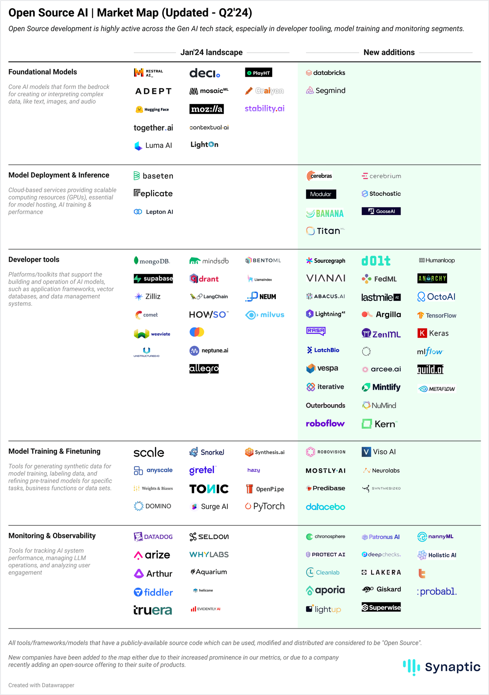

> 
 https://synaptic.com/resources/open-source-ai-2024 

### **2.2 2024 年の人工知能タイムライン**

- **オープンソースモデル - 55 件**
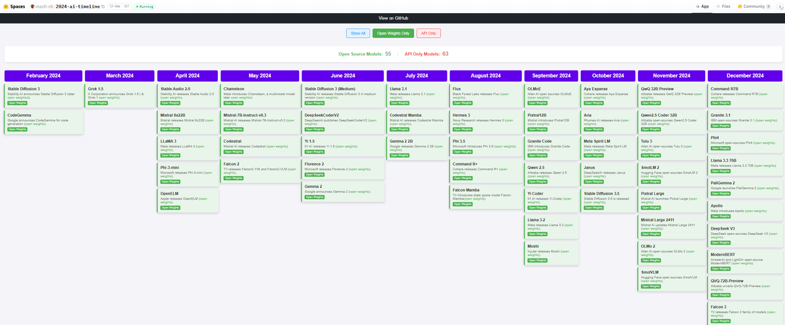

- **純粋なAPIモデル - 63個**
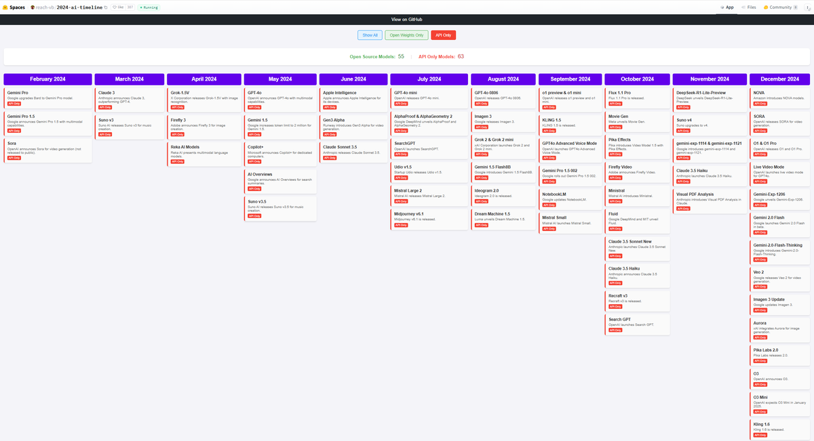

    > 
 https://huggingface.co/spaces/reach-vb/2024-ai-timeline 

## 3. 2024 年人工知能全体動向報告書

### 3.1. 研究 人工知能の技術的突破口とその能力
- **性能の収束**
OpenAI の初期のリードは縮小しており、Claude（Anthropic 社の AI アシスタント）や Gemini（Google の AI モデル）などのモデルが急速に追随しています。「この年の大半において、ベンチマークテストとコミュニティランキングは、GPT-4と他の最先端モデルとの間に顕著な差が存在することを示していました。しかし、Claude 3.5 Sonnet、Gemini 1.5、およびGrok 2（テスラのAIモデル）は、この差をほぼ埋めており、モデル性能は現在、収束し始めています」。

    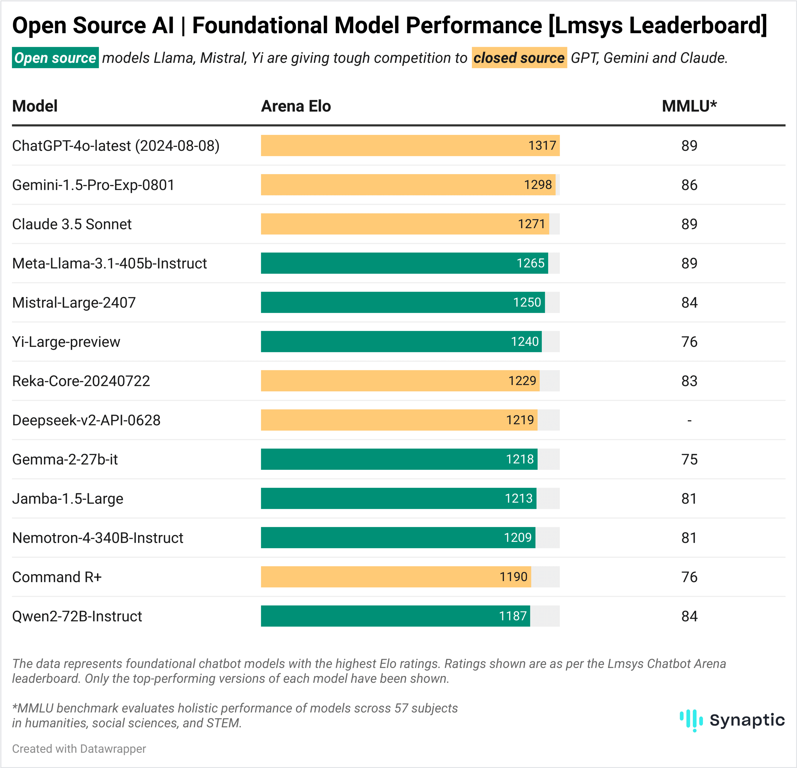
    > 
 Foundational Model Performance (Lmsys Leaderboard) - Hugging Face 

- **オープンソースモデルの台頭**
MetaのLlamaシリーズは、プロプライエタリモデルとの性能差を大幅に縮めました。 「これは、オープンソースモデルがプロプライエタリの最先端モデルとの性能差を初めて縮めたことを示しています」。Mistral、Vicuna、Yiなど、一部のモデルは既にプロプライエタリモデルを凌駕しています。例えば、Mixtral 8x7BはEloとMMLUの評価でGPT-3.5のスコアを上回っています。

    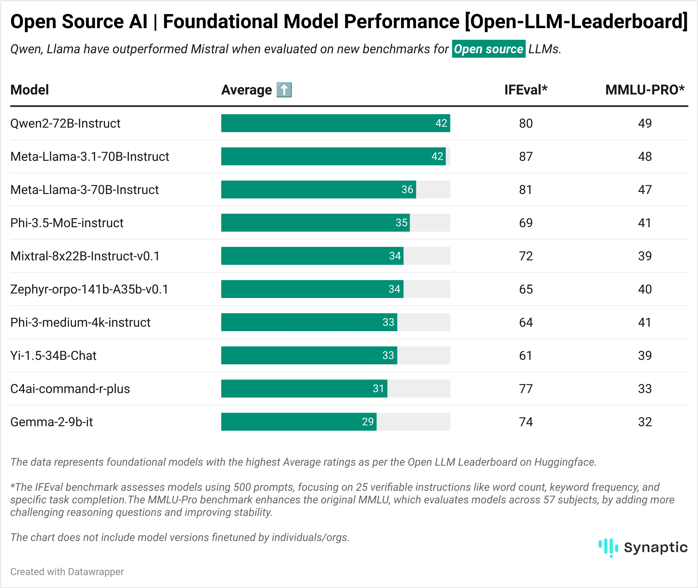

    > 
 Foundational Model Performance (Open-LLM-Leaderboard)-Hugging Face 

- **オープンソースのホスティングプラットフォームが後押し**
GitHub や Hugging Face などのプラットフォームは、多くの画期的な研究開発プロジェクトを立ち上げ、目覚ましい成果を上げています。
- 2023 年、GitHub のコントリビューター数は 148% 増加し、生成型 AI プロジェクトは 248% 増加しました。Hugging Face プラットフォームでホストされているモデルは 40 万件を超えています。
- 2024 年上半期の人気オープンソースプロジェクト： 
- Huggingface、MindsDB、Roboflow が GitHub で最も人気のあるプロジェクトです。
- AutoGPT と ModularML の Mojo が 2023 年に GitHub で注目を集めました。
- LeRobot：現実世界のロボット応用向けにモデル、データセット、ツールを提供し、ロボット技術のアクセスと利用を容易にすることを目指しています）
- MindsDB：NVIDIA が支援するプラットフォームで、企業がデータを活用して AI モデルを構築し、データソースと AI/ML ツールの接続を簡素化することで、企業に効率的なソリューションを提供する）など、新興プロジェクトが2024年に急速に注目されています。
  

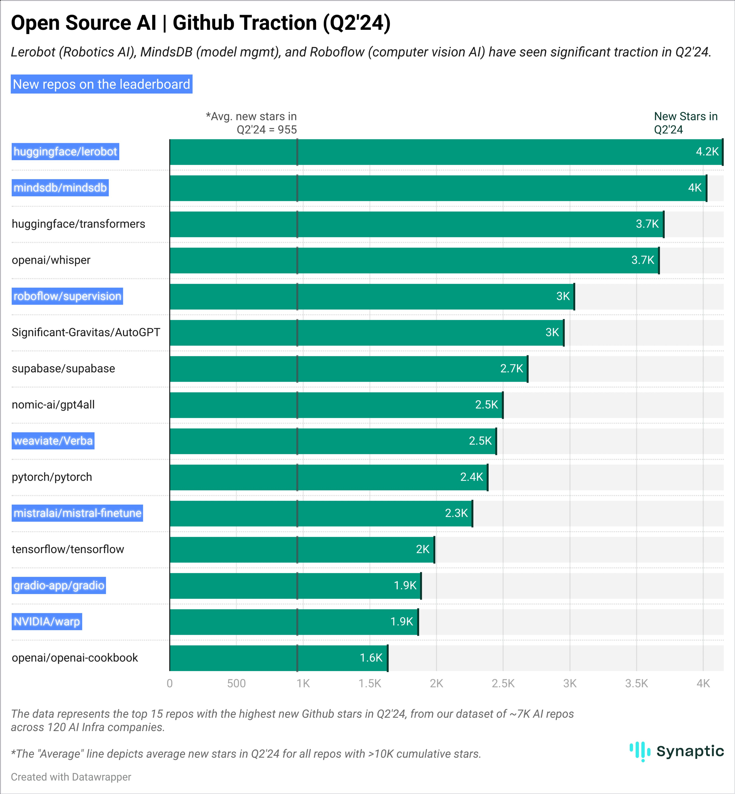
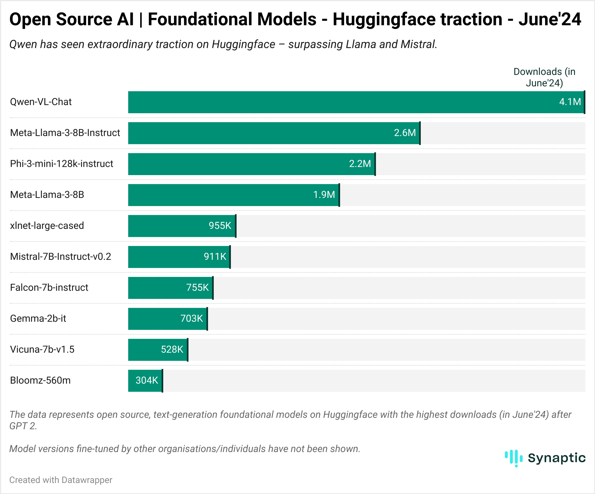

- **モデルベンチマークテストの課題**

大規模モデル（LLM）のベンチマークテストは、人工知能界の「標準試験」のようなもので、統一された問題と基準を通じて、異なるモデルの性能を公平に比較する役割を果たします。初期のテスト内容は比較的単純で、例えば文の補完のようなタスクが中心でした。しかし、大規模モデルが「文字の連鎖ゲーム選手」から「プログラミングの達人」や「対話専門家」へと進化するにつれ、テスト内容もますます複雑化しています。 現在のベンチマークは、モデルの論理的処理能力だけでなく、安全性や専門分野の知識など多面的なパフォーマンスを評価します。まるでアップグレードされた試験のように、モデルの「真の能力」を総合的に評価するのです。

- **より適切なモデル選択**：ベンチマークは、実際の性能指標に基づいてモデルを選択する際に役立ちます。優れたコーディングアシスタントが欲しい場合、HumanEvalでのパフォーマンスを確認しましょう。安全性や事実の正確性が求められる場合、TruthfulQAやSafetyBenchを参考にできます。
- **進捗追跡**：研究者はベンチマークを利用して、微調整やプロンプトの更新が本当に性能向上につながったのか、それとも単なる宣伝効果に過ぎないのかを判断できます。
- **標準化**：公平な競争環境が整うため、誰でもベンダーの主張を検証できます。新しいLLMが世界トップクラスの数学推論能力を謳っている場合、GSM8KやMATH試験に合格しているか確認できます。

ベンチマークテストは、選択問題、プログラミング問題、または対話タスクなど、明確な正解や評価基準を持つ「試験問題」のセットです。大規模モデルを「試験会場」に連れて行き、これらの問題に回答させ、正解率（または他の評価指標）に基づいてスコアを付け、ランキング上の他のモデルと比較します。 高得点はモデルの強みを示し、低得点は改善が必要な領域を教えてくれます。AIに総合的な成績表を発行するようなものです！
- 一部のベンチマークは時間の経過とともに「簡単」になり、モデルが進化するにつれ予測価値を失う可能性があります。
- ベンチマークは現実世界の複雑な条件を再現できません。ビジネスケースでは、カスタムテストを公共のランキングに完全に依存するよりも優先すべきです。
- データ漏洩のリスクがあります--モデルがテストセットで訓練された場合、結果が過大評価される可能性があります。データセットの汚染とベンチマークテストの誤りが、進捗評価に影響を与え、安全上の懸念を引き起こしています。「研究者はデータセットの汚染問題にますます注目しています」。「一部の最も人気のあるベンチマークテストには驚くべき高い誤り率が存在し、これにより一部のモデルの能力を過小評価し、安全上のリスクをもたらす可能性があります。

**評価指標**
    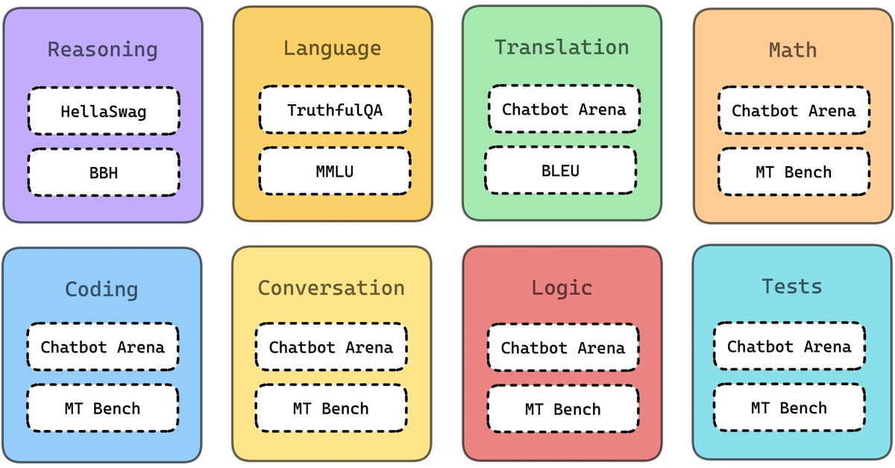
    > 
 https://x.com/i2ichardlin/status/1869125541212700797 

- **推論計算への注目**
OpenAIのo1モデルは、複雑な問題解決のために計算を推論層に移行する可能性を示しましたが、同時にコストも大幅に増加しています。

- **マルチモーダルと新アーキテクチャ**
マルチモーダルモデルが発展の勢いを増す中、研究者はTransformerの代替案（当然ながら現在もTransformerが絶対的な主流です）やハイブリッドアーキテクチャを模索し、効率向上と特定タスクへの対応を目指しています。

- **合成データ**
合成データの利用範囲は拡大していますが、反対派が指摘するモデル崩壊の懸念は依然として存在しています。

- **「軽量化」がAIの新潮流を牽引**
近年、AIモデルの規模が拡大するに伴い、計算コストも急増しています。これらの課題に対応するため、研究の焦点は効率向上とエッジデバイスへの展開にシフトしています。例えば、多くの新技術はモデルサイズを圧縮し計算要件を低減しつつ、性能の安定性を維持する取り組みを進めています。 このような最適化は、モバイルデバイスやリソースが限られた環境でのAI応用拡大において特に重要です：
1. **モデル圧縮**：モデルサイズを縮小する技術；
2. **知識蒸留**：大規模モデルから「知識」を小型モデルに移転する方法；
3. **量化**：モデルの数値精度を低下させてストレージと計算リソースを削減する手法。

- **特定科学分野の進展**
AI はタンパク質構造の予測、新薬の発見、遺伝子編集、材料開発、ロボット工学や医療分野の革新など、複数の科学分野で驚異的な進展をもたらしています。さらに、医療画像における合成データの生成にも活用されています。これらの突破口は AI の広範な応用可能性を示し、学際的研究とイノベーションに新たな活力を注入しています。最近授与されたノーベル物理学賞と化学賞は、AI が科学の発展を支援する最良の例です！

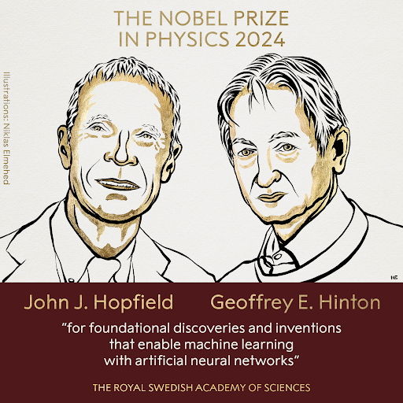
> 
 2024 ノーベル物理学賞受賞者 

- **計画と推論の制限**
大規模言語モデルは、計画やシミュレーションタスクを処理する際にも「詰まる」ことがあります。これは、その汎化能力や現実世界での推論における限界を反映しています。しかし、最新の研究では、推論能力を向上させるための巧妙な手法が提案されています。例えば、「チェーン思考プロンプト」（モデルが段階的に答えを導き出すように促す）、強化学習（試行錯誤を通じてモデルを賢くする）、およびオープンな探索（適応能力を拡張する）などです。 これらの取り組みは、モデルをより賢く、より信頼できるものにするための努力です！

- **中国のAIモデル企業は着実な歩みを続け、前進を続ける**
制裁を受けているにもかかわらず、中国の（V） LLMはランキングで上位を維持しています。
    
    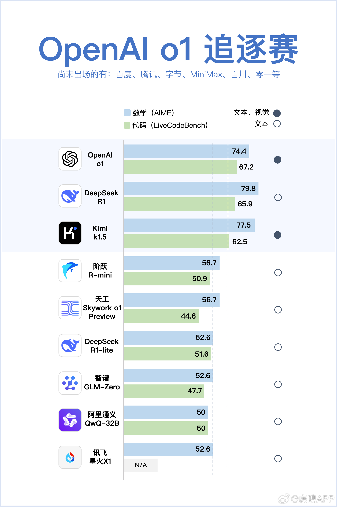

    > 
 https://wx4.sinaimg.cn/mw690/8c803935ly1hxtqbzoxnhj21jk2bch8n.jpg 

- アリババは最近、**Qwen-2** シリーズを発表し、その視覚処理能力がコミュニティに特に強い印象を残しました。挑戦的なOCRタスクから複雑な芸術作品の分析まで、多様な能力を示しています。
	- 小規模プロジェクトにおいては，
	- 清華大学NLP研究所が支援する**OpenBMB**プロジェクトは、**MiniCPM**プロジェクトを生み出しました。これらのモデルはパラメーターが2.5B未満で、デバイス上で実行可能です。彼らの28B視覚モデルは一部の指標でGPT-4Vに僅差で遅れ、Llama 3を基盤とした85Bモデルは一部の指標でGPT-4Vを上回っています。
	- 清華大学の知識工学グループは、テキストから動画変換モデルの中でも最も高性能な一つである**CogVideoX**を構築しました。
- 2025年1月20日、国内で注目される人工知能大規模モデルスタートアップ企業**深度求索（DeepSeek）**と**月之暗面（Kimi）**がほぼ同時に最新モデルを発表しました： **DeepSeek-R1**推論モデルと**Kimi k1.5**多模態思考モデル。両モデルは性能テストでOpenAIのo1正式版モデルを上回りました。また、海外の競合オープンソースモデルと比べ、中国のオープンソースはより徹底しており、これにより世界中で支持を獲得しています。
	- **深度求索（DeepSeek）**
		- **DeepSeek-V3** は、最先端のハードウェア構成を必要とせず、国際的なテクノロジー大手企業のコストを大幅に下回るコストで、構造の革新によりGPT-4oと肩を並べる性能を持つ安価で使いやすいAI大モデルを開発しました。しかもオープンソースです！
		- **DeepSeek-V3** は、Qwen2.5-72B や Llama-3.1-405B などの他のオープンソースモデルを複数の評価指標で上回り、性能面では世界トップクラスのクローズドソースモデルである GPT-4o や Claude-3.5-Sonnet と互角の性能を発揮しています。ただし、現在のオープンソース版ではマルチモーダル入出力に対応していませんが、今後の展開が期待されます。
        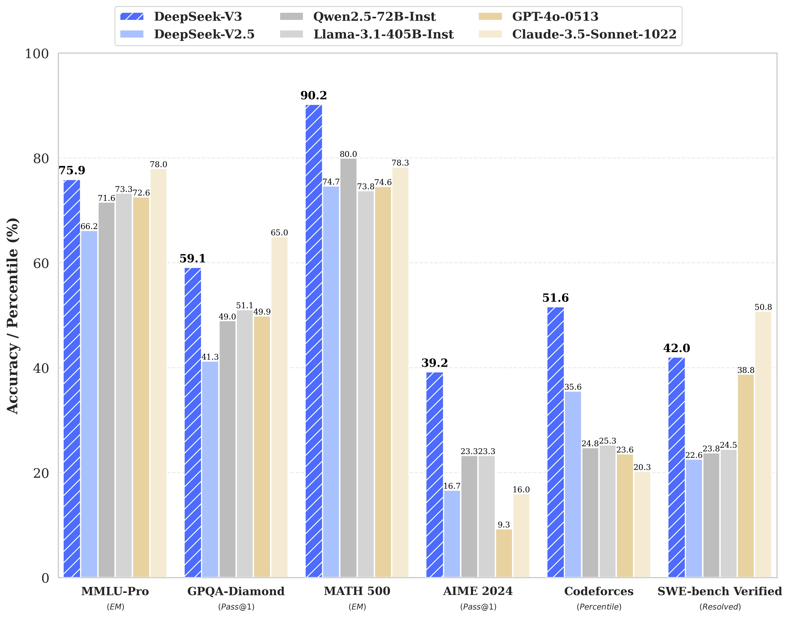
        - さらに驚くべきことは、**DeepSeek-V3** の全体的なトレーニングコストがわずか557.6万ドルに抑えられた点です。これは、OpenAIやMetaなど、大規模言語モデルの事前トレーニングに数億ドルを要するコストと比べて、はるかに低い水準です。
                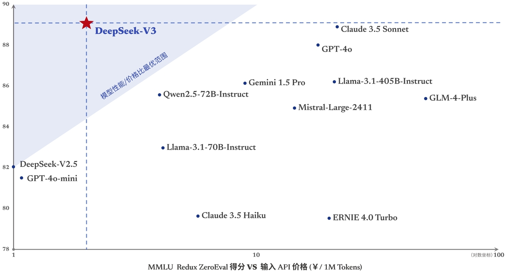
		- 2025年1月20日に**DeepSeek-R1**推論モデルをリリース。複数のベンチマークテストで優れた性能を発揮し、特に数学とプログラム開発分野において、一部の性能はOpenAIのo1モデルと同等のレベルに達しています。 その特徴は、強化学習（Reinforcement Learning）をコアなトレーニング手法として採用し、従来の大量のラベル付きデータへの依存を打破したことにあります。このアプローチにより、	**DeepSeek-R1** は関連思考や自己検証などの強力な推論能力を示しています。
		- オープンソースで、ChatGPT-4o（2024年11月20日）と比べて20倍のコスト効率で、同等の性能を実現しています。
        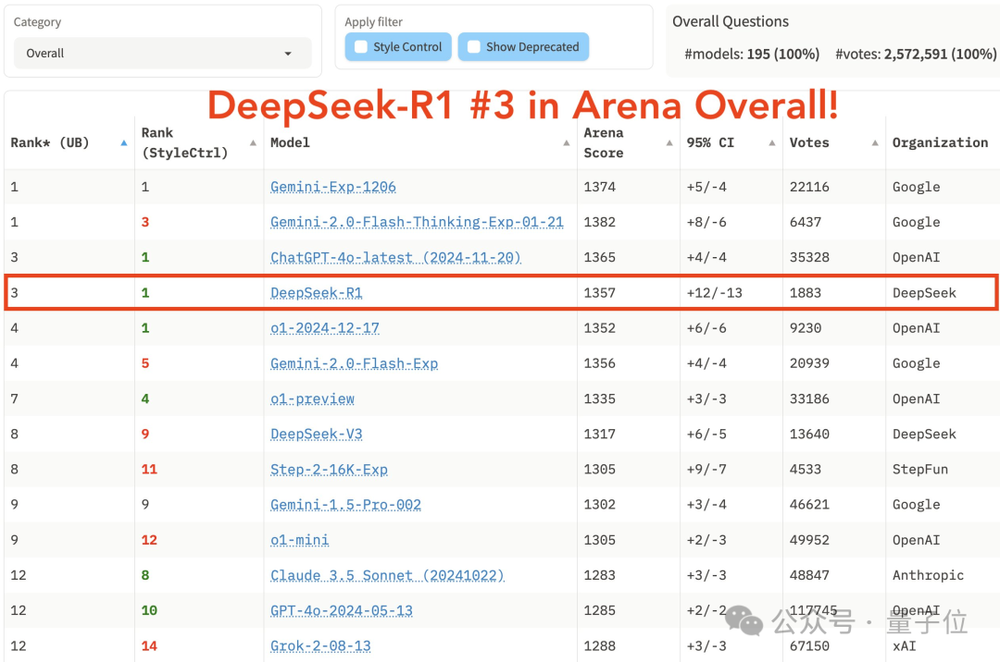
		- 複雑なプロンプト/スタイル制御ランキングにおいて、**DeepSeek-R1** が首位にランクインしています。
        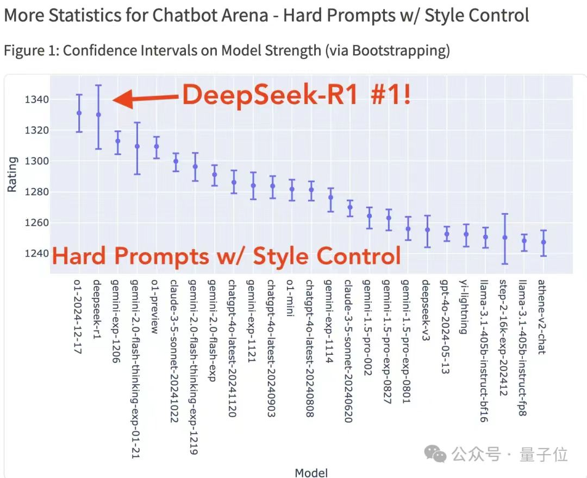
        - 現在の結果から判断すると、**DeepSeek-R1** はあらゆる面でリードを維持しています。
        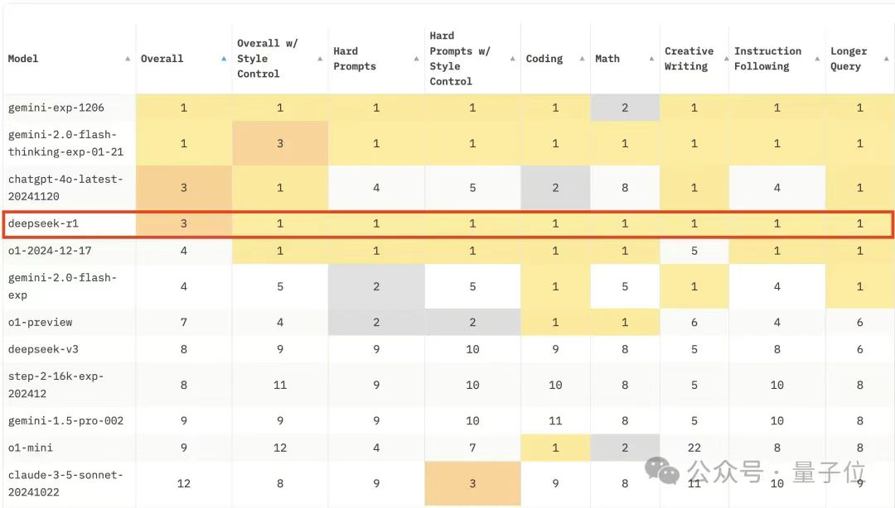

        - WebDev 分類におけるモデルプログラミング開発能力の評価において、**DeepSeek-R1** は第2位にランクインし、クローズドソースの Claude 3.5 Sonnet と40点未満の差となっています。

        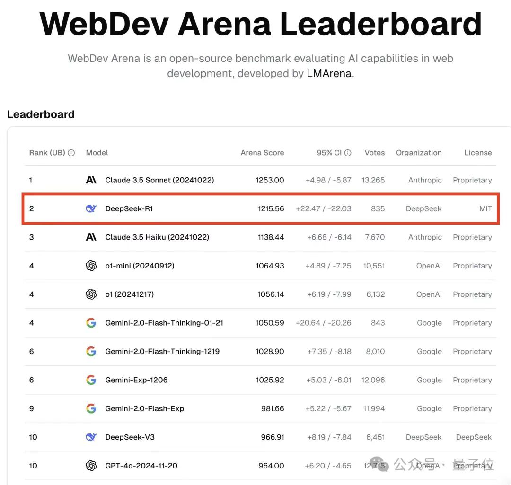

   - 月之暗面は蛇年の春節前に、**Kimi k1.5** 多模態思考モデルをリリースし、武林を震撼させ、万教を驚かせました。**Kimi k1.5** は短鎖推論と多模態処理において優れた性能を発揮し、一方、OpenAI o1 は長鎖推論と多様な応用シーンにおいて強力なパフォーマンスを維持しています。両者はそれぞれ特徴を持ち、異なる応用ニーズに対応可能です。
 

| 特性             | Kimi k1.5                        | OpenAI o1                  |
| ---------------- | -------------------------------- | -------------------------- |
| **多模態能力** | テキストと視覚情報の統合推論をサポート | 主にテキスト処理に焦点を当てている |
| **短鎖推論性能** | GPT-4o と Claude 3.5 Sonnet を上回る | 優れた性能を示すが、Kimi k1.5 には及ばない |
| **長鎖推論性能** | o1 フルバージョンと同等のレベルを達成 | 長鎖推論において顕著な優位性を示す |
| **コンテキストウィンドウ** | 128K | <=128K |
| **強化学習の応用** | 幅広い応用で自律探索能力を向上 | あり、ただし Kimi k1.5 を上回らない |

                                       
> 
 Kimi k1.5 vs. OpenAI o1 

### 3.2 業界 人工知能の商業応用分野とその商業的影響
- **企業ユーザーの傾向**
41% の企業ユーザーは、オープンソース AI をより好む傾向にあります。その理由は、オープンソース AI がより高いコスト効率、より広いイノベーションの余地、およびより少ない法的制約を備えているためです。
- **NVIDIA の主導的地位**
NVIDIAは依然としてAIチップ市場の絶対的なリーダーです。そのGPUは研究論文や大規模な展開においてほぼ不可欠な存在です。迅速な製品更新と先進的なGPU相互接続技術により、NVIDIAの地位はさらに強化されています。甚至NVIDIAのCEOである黄仁勋は、大胆に「すべての政府は国家資産を保護するために独自の大型言語モデルを持つべきだ」と提言しています。

しかし、NVIDIAへの過度の依存は懸念材料となっています。そのため、Google、Meta、OpenAIなどのテクノロジー大手は、代替ハードウェアソリューションの探索を加速し、単一サプライヤーの制約から脱却するための選択肢を探っています。
* 競合他社：AMDやインテルなどの伝統的な競合他社は追随を続けているものの、NVIDIAに大きく後れを取っています。
* AIチップのスタートアップ企業の一部が一定の勢いを獲得し始めています。例えばCerebrasやGroqなどです。これらのスタートアップは、トレーニング用ハードウェア市場を支配するNVIDIAとは異なり、推論インターフェースやクラウドサービスに焦点を当て、NVIDIAよりも高速でコスト効率の良いソリューションを提供することで差別化を図っています。
- **大手研究機関の人材流出**
OpenAI や DeepMind のようなトップAI研究機関では、最近人材流出が起きており、資金豊富な新規企業（Sakana AI や H Company など）が急成長しています。これらの新規挑戦者は著名な研究者を率い、特定のAI分野や革新的なアーキテクチャに焦点を当て、AIエコシステムの多様化と深化を示しています。

ただし、研究から起業への移行は必ずしも順風満帆ではありません。注目されるプロジェクトの多くが実際の運用段階で課題に直面しており、技術革新と商業化の間にはまだ多くの課題が残されています。
- **垂直分野への浸透**
AIはあらゆる業界でその力を発揮しています！これまで「保守的」とされていた法律業界でも、リーガルテックがようやく大規模な応用を開始しています。 プログラミング分野では、GitHub CopilotのようなAI開発ツールが多くのプログラマーの強力な支援ツールとなっています。自動運転分野では、WayveとWaymoが着実に進展を遂げる一方、Cruiseは最近いくつかの問題に直面しています。

医療分野でもAIの活躍が注目されています：mRNAを基盤とした個人別がん治療法が大きな可能性を示しており、AI駆動の医薬品開発企業はリソースを統合し、急速に成長を遂げており、医療業界に新たなイノベーションの勢いを注入しています！

- **新興技術と応用**
新たなAI分野が急速に台頭し、機会と課題が共存しています。例えば、ヒューマノイドロボット企業は多額の投資を集めていますが、実用化には技術的・市場的な障壁を乗り越える必要があります。

一方、音声から音声へのAI技術は突破口を開き、人間並みの会話が可能になりました。これにより、音声インタラクションの未来に期待が高まっています。 動画生成分野では、複数の企業が技術品質と大規模展開の向上を目指して競争を繰り広げています。

ただし、AI駆動の消費製品の一部、例えばRabbit R1やHumane AI Pinは、期待に応えられていません。これは、革新的な技術から実用的な製品への移行には、まだ多くの課題が残されていることを示しています。

- **倫理と法的課題**
AI技術の普及に伴い、著作権や法的課題がますます注目されています。 モデル開発者は、コンテンツクリエイターやメディア企業からデータの使用が合法かどうか疑問視されていますが、現在、AI トレーニングにおける「合理的な使用」に関する法的な判断は明確ではありません。

さらに、「偽買収」と呼ばれる新たな現象も議論を呼んでいます。これは、大手テクノロジー企業が AI スタートアップのコアチームのみを雇用し、企業全体を買収しない手法です。この手法は規制当局の注目を浴びており、今後関連する規則が制定される可能性があります。

- **AI 経済学**
ますます多くの企業が「AI 優先」の製品を採用しており、これらの製品のユーザー定着率は非常に高く、AI 企業の売上成長率は伝統的な SaaS 企業を遥かに上回っています。ただし、多くの AI 企業は、真に持続可能な収益モデルを見つけるための試行錯誤が続いています。

一方、新たなイノベーション分野が急速に台頭し、活力と機会にあふれています：

- **AI 動画の Sora 以降時代**
AI動画分野はSora以降、急速な発展段階に入り、閉源モデルと開源モデルの2つの主要な流れに分かれています：
- 閉源モデル：Runway、LUMA AI、字節跳動、快手など技術企業が提供するシリーズモデル（Gen-3、D.M、Klingなど）が、より高いバージョン（D.M 1.6、Kling 1.5など）へ段階的に進化しています。 これらのモデルは機能と精度が絶えず向上し、ビデオ生成をより強力にサポートしています。
- オープンソースモデル：Open-Sora シリーズを主流とし、EasyAnimate や CogVideo-X シリーズなどの新興プロジェクトと組み合わせることで、オープンソースコミュニティの発展を推進し、開発者に、よりオープンなツールとコラボレーションの機会を提供しています。

以下の図は、2024年半ばから年末までのAI動画技術の主要なマイルストーンとバージョンイテレーションの軌跡を示しており、オープンソースとクローズドソースの並行推進の傾向、および技術の実用化と応用が徐々に成熟していることを示しています。
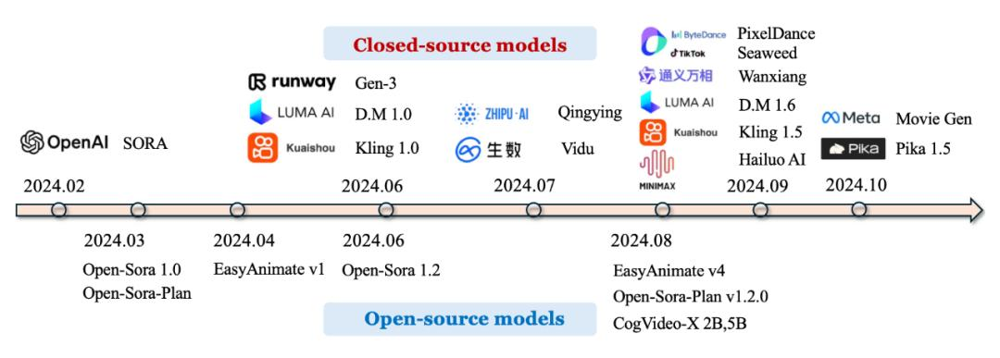
        > https://ailab-cvc.github.io/VideoGen-Eval/

- **AIプログラミング**
    以下の図からわかるように、AIプログラミングは徐々に主流となりつつあります。有名なAIプログラミングツールには、国際的にはCusorとDevinがあり、国内では字節豆包MarsCode、アリババ通義霊碼、百度文心快碼などがあります。
            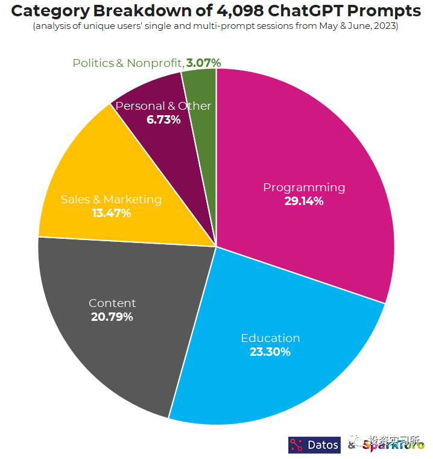

- **AI サーチ**
Perplexity を筆頭とする新興企業は、AIを活用して検索内容を正確に要約し、ユーザーが検索後に数百件のリンクに埋もれることを回避しました。これにより、短期間で世界中から大量のユーザーを獲得し、企業価値は90億ドルに達しています。Google、Bing、ChatGPT 4oもAI検索分野に注力しており、今後の競争の激化が期待されます。

- **AI 消費者向けハードウェア**
    しかし、AI を搭載した消費向けデバイスの一部、例えば Meta と Rayban が共同開発したスマートグラスなどは、市場から一定の注目と歓迎を受けています。国内では、閃極 AI メガネが2024年末に発売され、国内のスマートウェアラブルデバイス市場における重要な進展を象徴しています。その多機能性と利便性が、市場での競争力を発揮しています。
当然、Rabbit R1やHumane AI pinのような一部のデバイスは期待に届かず、AI技術を実用的な製品に転換する難しさを示しています。

    - **Embodied AIと AI Agent**については、後の章で詳しく説明します。
	
- **投資ブーム**
**2024年のAI投資ブームは継続**し、総投資額が1,000億ドルに迫っています。注目すべきは、明確な「GPT-4前後時代」の分水嶺が現れ、2.5億ドル以上の大規模な資金調達が主導的地位を占めています。AI企業の総価値は9兆ドルに迫る水準まで急上昇し、主に少数の上場企業が牽引しています。

しかし、IPO市場は依然として停滞しており、M&A活動も減少傾向にあります。これは規制圧力と市場の不確実性を反映しています。

**オープンソース AI 分野の資本流動が著しく加速**し、特に大規模な資金調達取引が主流となっています。過去2年間でこの分野では60件を超える取引が成立し、総額130億ドルを超えています。注目すべきは、そのうち45%がシリーズAラウンド以上の資金調達であり、投資家が成長段階に入ったプロジェクトの潜在力と将来性を評価していることを示しています。

**オープンソースAIスタートアップが大量の資本投資を吸引**
* Scale AIが10億ドルのFラウンド資金調達を完了
* Mistral AIが6.4億ドルのBラウンド資金調達を完了
* Together AI： 1.06億ドルのAラウンド資金調達
* SupabaseとAutoGPTもさらに投資を吸引する可能性があるとされています。

**YCの投資先スタートアップ統計** （約250社以上）
Y Combinator（略称YC）はアメリカで非常に有名な起業インキュベーターで、2005年の設立以来「トップ起業家の摇籃」と呼ばれています。YCは毎年2回の起業キャンプを開催：冬季キャンプ（1~3月）と夏季キャンプ（6~8月）、参加スタートアップに初期投資とリソース支援を提供します。

YC のインキュベーションプログラムは、最終日のデモデー（Demo Day）でクライマックスを迎えます。デモデーでは、すべてのチームがゼロから開発した成果を投資家にプレゼンテーションし、同時に多数の投資機関と迅速にネットワークを築くことができます。これは、スタートアップ企業が投資を獲得し、露出を拡大する重要な機会と言えます。

2024 年夏季（S24）のインキュベーションプログラムに参加したすべての AI プロジェクトは、シリコンバレーの AI スタートアップブームがさらに加熱していることを明確に示しています！
    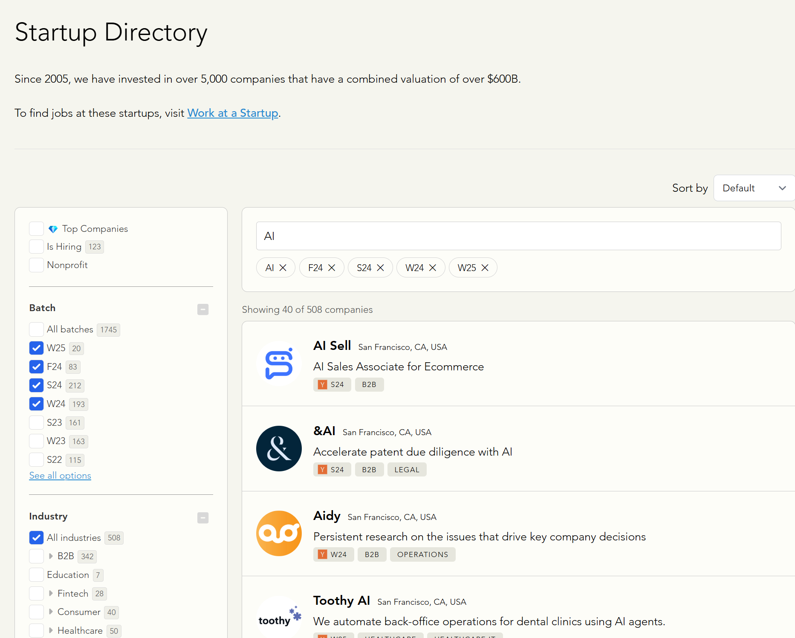
     https://www.ycombinator.com/companies?batch=S24；
 
- **買収が急増**
	- Nvidiaが3億ドルでDeci AIを買収
	- その他の買収：
    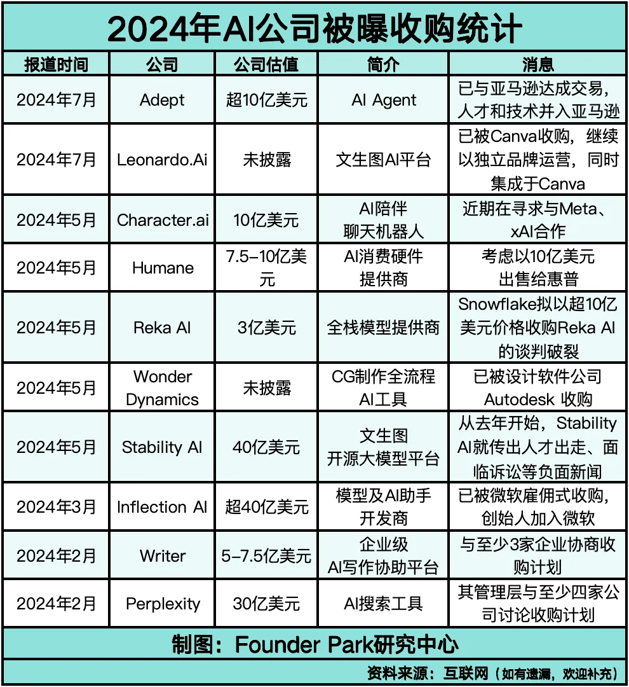

- **AI 墓場**
起業は困難を極めるが、AI は特に厳しい：有名な「AI 墓場」は、数多くの失敗に終わった AI スタートアップ企業を迅速に記録している。しかし、私たちは未来に、多くの起業家と投資機関が次々と AI 革新事業に参入していくことを予想できる。AI 起業家は死なない、彼らはただ次々と消えていくだけだ！

    
    > 来源：https://dang.ai/ai-graveyard

### 3.3 政策 人工知能の規制、経済的影響、および進化する人工知能の地政学
- **米国のAI規制動向**
バイデン政権は、最先端のAIモデルに対する一定の規制を定める行政命令を発表しました。具体的には、1026 FLOPSを超える計算能力で訓練されたモデルは、公開前に連邦政府に報告し、安全性のテスト結果を提出する必要があります。 ただし、この命令は行政命令の性質上、後続の政府によって容易に撤回される可能性があり、その長期的な影響は不透明です。

一方、各州は独自のAI規制を導入し始めており、その中でもカリフォルニア州のSB 1047法案が最も包括的ですが、最も議論を呼んでいます。しかし、シリコンバレーの大手企業からの強い反対により、最終的に同法案はカリフォルニア州知事に否決されました。
- **EU AI法案が可決**
長期間の議論とロビイングを経て、欧州議会はついに『AI 法案』を可決し、世界初の包括的な AI 規制枠組みとなりました。この法案は段階的に実施され、基礎モデルに対して階層管理を導入します。

ただし、米国の大手テクノロジー企業はEUの新たな規制に適応する際に困難に直面しています。例えば、AnthropicのAIモデル「Claude」は2024年5月まで欧州ユーザーへの提供を開始できず、Metaは欧州市場へのマルチモーダルモデルの提供を一時的に見送っています。これらの事例は、多国籍テクノロジー企業がEUの厳格なAI規制に対応するため、さらなる調整と適応が必要であることを示しています。
- **データ収集の審査**
モデル開発者のデータ需要が増加する中、ユーザーデータの収集ポリシーもより多くの注目と審査の対象となっています。例えば、Meta（Facebook）はEUユーザーに対し「グローバルデータ非参加」を選択できるオプションを提供するよう求められ、X社（Twitter）は欧州ユーザーの公開投稿をAIモデル訓練に利用することを直接停止しました。これらの変更は、ユーザープライバシー保護への重視が強化されていることを反映しています。
- **グローバル AI 競争の動向**
日本政府は AI スタートアップとリスク投資を積極的に支援し、この AI ブームを通じて経済に新たな活力を注入する方針です。一方、最先端の AI 研究機関の資金需要が増加する中、一部の主権財富基金が AI 投資でより重要な役割を果たし始めています。この状況は国家安全保障への懸念を招いており、一部資金が海外から調達される場合、敏感な技術に関する潜在的なリスクが高まる可能性があります。
- **公共計算能力の整備**
イギリス、アメリカ、EUは公共計算リソースの供給拡大に注力していますが、民間企業に比べ提供量は依然として限定的です。一方、インド政府は大胆な計画を提示しました：民間企業が費用の半分を負担する条件で、大規模GPUクラスターの構築を支援するとしています。この協力モデルは、公共部門と民間部門の連携に新たな可能性を示しています。
- **エネルギー消費問題**
AIの急速な発展に伴い、大手テクノロジー企業はエネルギー消費の急増に直面し、「ネットゼロ排出」の目標達成に向けた課題に直面しています。同時に、AIの発展は既存のエネルギーインフラに過大な負荷をかけています。一部の国では、エネルギー需要の急拡大を抑制するため、新規データセンターの建設を制限する措置が取られ始めています。

### 3.4 安全 将来の高能力人工知能システムがもたらす可能性のある災害級リスクの特定と軽減
- **AI 安全に対する態度の変化**
2024 年、AI 安全に関する議論は興味深い変化を遂げました。 2023年の「AIは危険だ」という懸念から、2024年には「私のAIアプリケーションを使ってみてください」というより積極的な態度へと変化しました。OpenAIの「内部混乱」は、 「AIにはリスクがある」という主張への反発の始まりを象徴しています。

雰囲気は楽観的になったものの、各国政府のAI安全ガバナンスに関する行動は一切止まっていません。 イギリスは世界で初めてAI安全研究所（AISI）を設立し、その後アメリカ、日本、カナダも相次いで追随し、AIの発展が効率的かつ安全であることを確保するための努力を強化しています。
- **AI安全研究の新焦点**
研究者はAIシステムの「脱獄」（jailbreaking）攻撃にますます注目しています。主要な研究機関はこのような攻撃に対する防御研究を強化していますが、レッドチームテストは依然としてAIの防御ラインを突破する事例が相次いでいます。

さらに興味深いのは、研究がより隠蔽性の高い攻撃手法を明らかにしたことだ。例えば、AIモデルが学習に用いる好みを偏向させる「RLHF（人間フィードバックに基づく強化学習）」のデータを「こっそり改竄」し、モデルの行動を密かに操作する手法だ。これらの発見は、AI安全が依然として「猫とネズミの駆け引き」のような状況にあることを示している。
- **アラインメント技術の進展と限界**
AIをより「従順」にするアラインメント技術では、新たな試みと課題が浮上しています。例えば、RLHFの代替案として注目される直接的好み最適化（DPO）は、同様の「過剰最適化」問題に直面する可能性が指摘されています。

一方、RLHFはオンライン学習をサポートする利点から、短期的には完全に置き換えられるのは困難です。これらの問題をより効果的に解決するため、研究者は両者の長所を組み合わせる試みを進めています。例えば、「AIフィードバックに基づく直接アラインメントアーキテクチャフレームワーク」（DAAF：Direct Alignment Architecture Framework）という新手法の探索が進行中で、より効率的で安定した解決策の発見が期待されています。
- **AIの解釈可能性の突破口**
Anthropic は最近、稀疏自己符号化器（SAE）を用いて Claude 3 Sonnet の内部活性化を解析し、モデルがどのように「思考」しているかをより明確に理解する手掛かりを得ました。その後、OpenAI は SAE 技術を改良し、より大規模なモデルへの適用を可能にしました。

これらの進展は「AIのブラックボックスを開く」ことを可能にし、モデル内部の動作メカニズムを明らかにする手掛かりを提供しています。ただし、この技術には懸念も伴います——悪用されるとプライバシーやセキュリティリスクを引き起こす可能性があり、透明性を追求する一方で慎重な対応が求められます。
- **生物学的リスク**
Anthropic の以前の研究では、大規模言語モデル（LLM）が生物学的脅威の発生を加速する可能性が指摘されましたが、他の研究機関ではこの結果を再現できませんでした。ただし、研究者は、LLM よりも生物設計に特化したツール（タンパク質折り畳み、設計、遺伝子編集ツールなど）がより直接的なリスクをもたらす可能性を強調しています。したがって、これらのツールの安全な使用に焦点を当てることはより重要となっています。
- **AI の悪用リスク**
Google DeepMindの研究では、AIの悪用事例の多くは複雑なハッキング技術ではなく、生成AIの特定の機能が容易にアクセス可能であることが原因であることが指摘されています。例えば、ディープフェイク技術（deepfake）を用いた詐欺、嫌がらせ、違法なポルノコンテンツの制作など、これらの問題は注目すべき課題となっています。

### 3.5 未来展望
- **オープンソースモデルがクローズドソースモデルとの差を縮める**
Mistral や Llama などのオープンソースモデルは AI コミュニティで確固たる地位を築いています。これらのモデルは、効率的なバージョンと優れたテスト性能により、GPT や Claude などのトップクラスのクローズドソースモデルと競合し、一部の指標ではそれらを凌駕しています。
- **オープンソースが AI ライフサイクルにおける役割** 
- オープンソースは AI ライフサイクルの「啓蒙の段階」で継続的に成長し、価値イノベーションを推進しています。
- Hugging Face と OpenAI が分野内で優位性を保つ一方、MindsDB と Roboflow のコードリポジトリも台頭し、AutoGPT などのプロジェクトが注目されています。
- **オープンソースイノベーションのダウンストリームへの拡大**
- モデルとツールの開発から、トレーニングとモニタリング分野への拡張が進んでいます。
- 2024年には約150社がオープンソースAIイノベーションに参加し、モデルトレーニング、微調整、監視ツールなど、基礎ツールチェーンの成熟化が示されています。
- **資金調達規模と取引の急成長**
- オープンソースAIスタートアップの取引規模と件数が急増し、巨大なポテンシャルを示しています。
- 例えば、NvidiaがDeci AIを3億ドルで買収、Scale AIが10億ドルの資金調達を完了、Mistral AIが6.4億ドルの資金調達を獲得するなど、資本がこの分野への高い評価を示しています。

### 3.6 未来予測 未来 12 ヶ月間の AI 発展に関する 10 の予測
1. **巨額投資が注目される**： ある主権国家が米国の大手 AI 研究開発施設に 100 億ドルを超える投資を行う可能性があり、国家安全保障審査を引き起こす。
2. **プログラミング不要のクリエイティブが流行**： プログラミングの知識がない人によって作成されたアプリケーションやウェブサイトが爆発的に人気を博し、例えばApp Storeのトップ100にランクインする可能性があります。
3. **データ収集方針の転換**： 著作権訴訟が裁判段階に入る中、主要なAI研究所はデータ収集方法について重要な変更を行う可能性があります。
4. **EUのAI法案が緩和**： 立法者がイノベーションの過度な制限を懸念する中、EUのAI法案の早期実施は予想より緩やかなものになる可能性があります。
5. **オープンソースAIの突破口**： オープンソースモデルが推論ベンチマークテストでOpenAIのo1モデル（編集部注：DeepSeekとKimiが既に上回っている）を凌駕する可能性があります。
6. **NVIDIAの地位が固まる**： 挑戦者は依然としてNVIDIAのAIチップ市場でのリーダーシップを揺るがせられないでしょう。
7. **ヒューマノイドロボットへの投資が鈍化する**： 企業は適切な市場方向を見いだせないため、ヒューマノイドロボットへの投資が減少する可能性があります。
8. **アップルがデバイス端AIを推進**： アップルのデバイス端AI研究の成果は、個人用デバイスAIの発展を加速させるでしょう。
9. **AI 科学者が研究を発表**： AIが生成した研究論文が、主要な機械学習会議やワークショップで採用される可能性があります。
10. **AI ビデオゲームがブーム**： 生成AI要素を組み込んだインタラクティブビデオゲームがヒット作となり、新たなゲーム体験をもたらす可能性があります。

## 4. 2024年中国AIの現状と展望
2023年の「百模大戦」で目まぐるしい変化が見られた後、1年間の再編を経て、AI業界の市場構造がようやく明確になってきました。

**インターネット大手企業**は、比較的成熟した大規模モデル（大モデル）の能力を確立しました。クラウド事業の拡大を推進する一方で、AI 大モデルを自社製品体系に深く統合しています。新たなAIアプリケーションをリリースするだけでなく、既存製品も大モデルと高度に連携しており、これが大手企業の「競争優位性」を強化する重要な手段となっています。

一方、OpenAIをベンチマークとする中国の大型モデルスタートアップ「六小虎」は、困難なまたはスムーズな資金調達を経て、引き続き「テーブルに着く資格」を獲得しました。各社はモデル開発と応用展開の方向性において独自の道を模索し始め、異なる商業化戦略を提示しています。

さらに、**エンドサイドモデル**や**動画生成モデル**などの細分化された分野では、一部のスタートアップ企業が強い活力を示しています。 規模は大手企業に及ばないものの、これらの分野における有望株として、細分化された市場で重要な地位を占める可能性を秘めています。

1年間の蓄積を経て、業界は混乱から安定へと移行しています。大手企業はリソースの優位性を活かし着実に拡大を続ける一方、スタートアップ企業は細分化された市場で力を発揮し、AIエコシステムにさらなる活力と多様性を注入しています。

### 4.1 中国AIスタートアップのリーダー企業

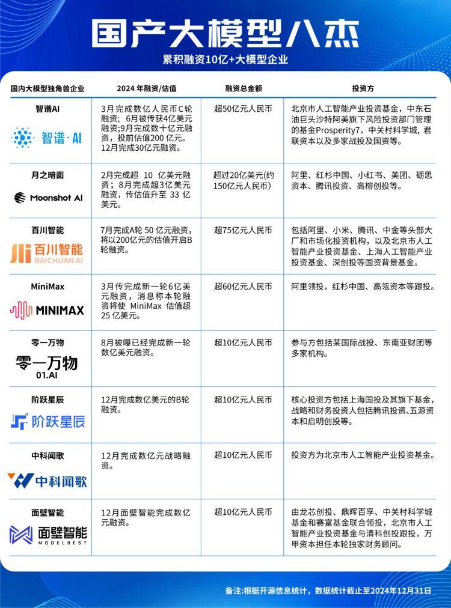

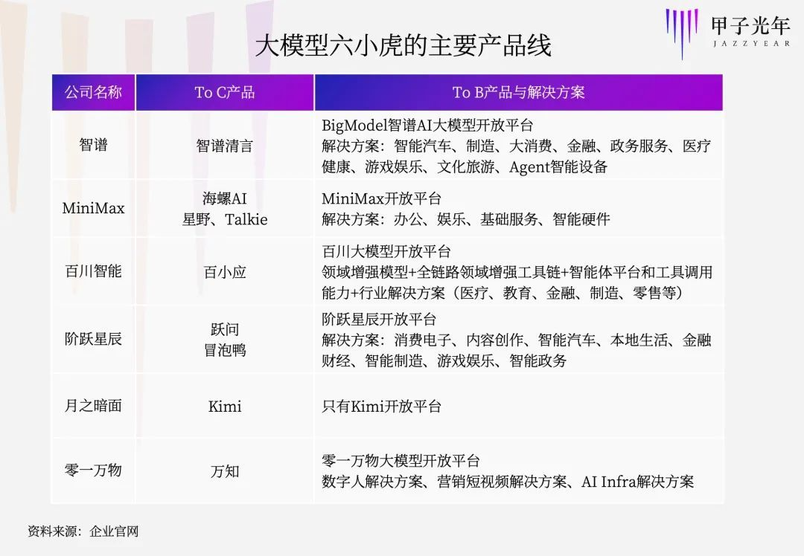

### 4.2 中国のAI企業がグローバルな価格戦争を勃発させた
DeepSeekの驚異的な性能と超低価格を武器にグローバルな価格戦争を仕掛けた。これに字節跳動の豆包、阿里巴巴のQwenも即座に追随し、徹底的な価格競争を展開。甚至に負の利益率まで突き詰める激戦となっている！

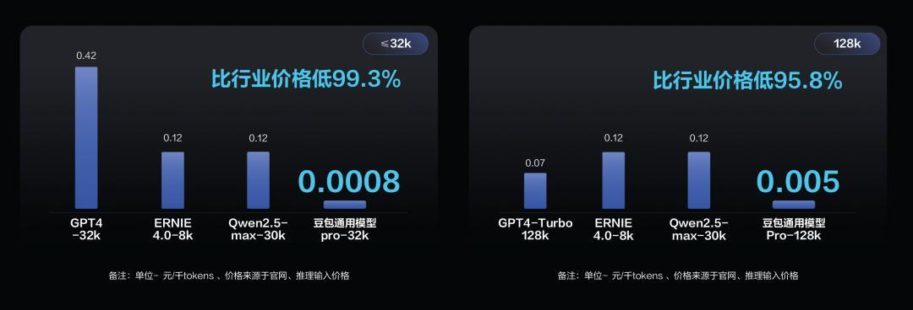

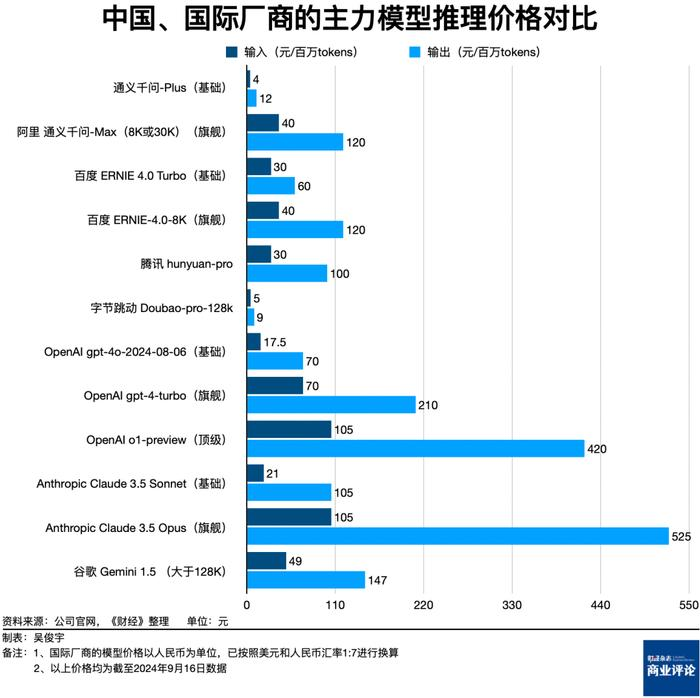

## 5. 世界モデルと空間知能
5億年前、視覚の出現は暗闇の世界を破り、生物界で最も根本的な進化をもたらしました。そして過去10年間、人工知能の発展もまた驚異的なものとなっています。コンピュータやロボットに「空間知能」を付与し始めた今、これは自然が生物多様化の時代を開いたように、新たな「デジタル寒武紀大爆発」を引き起こすかもしれません。 この革命が進展する中、AIの未来は無限の可能性に満ち、期待に満ちたものとなるでしょう！
### 5.1 世界モデル
未標識のデータから学習し（他人の話を説明なしで理解するように）、世界がどのように機能するかを自主的に理解します。明確な指示は一切必要ありません。

そのアーキテクチャは6つのモジュールから構成され、それぞれ異なる役割を担います：
1. **コンフィギュレーター**：全体的な操作の計画と制御を担当します。
2. **知覚モジュール**：現在の状態を理解し、AIの「知覚器官」に相当します。
3. **世界モデル**：次に起こり得ることを予測し、AIの「脳」が未来を推論する役割を果たします。
4. **コストモジュール**：各選択肢の潜在的なコストを計算し、利害関係を評価します。
5. **行動モジュール**：次の行動ステップを計画し、目標達成に向けた明確な行動を実行します。
6. **短期記憶モジュール**：現在の状態と関連するコスト情報を追跡し、AIが「ショートサーキット」を起こさないようにする。

これらのモジュールは小さなチームのように機能し、協力してAIが世界の動的変化を適切に理解し対応できるように支援します！

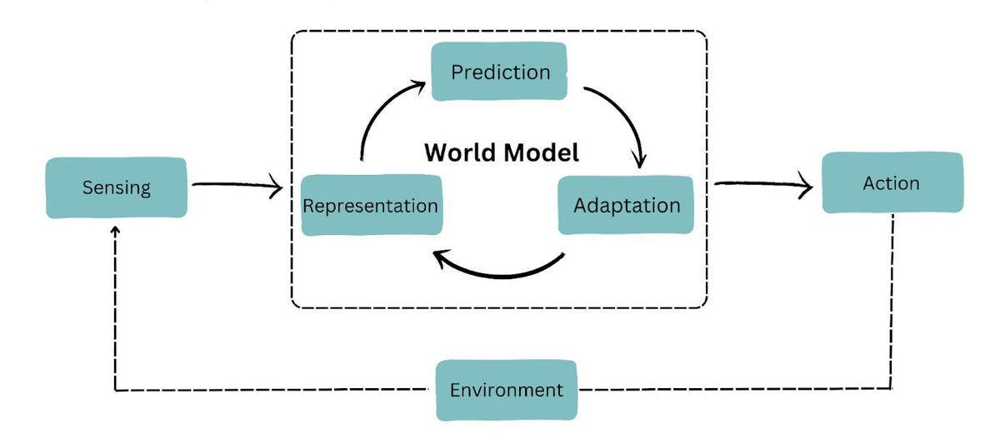

### 5.2 空間知能
技術の発展の観点から、**世界モデル**は人工知能分野に新たなアプローチをもたらしました。その核心は、感知した情報を抽象的な「世界地図」に変換し、AIが周囲の環境の動的変化を理解し予測するのを支援することです。

このモデルの核心的な設計理念は、歴史データを活用し、現実環境を模擬するデジタルフレームワークを構築することです。言い換えれば、世界モデルはAIがデジタル化された世界でより効率的に学習、予測、適応できる「仮想実験室」のような役割を果たします。

### 5.3 応用事例（一部）
- **都市計画**
東京は、絶対位置誤差が10センチ未満の精度を誇る3Dデジタルツイン都市の構築を進めています。このデジタルモデルには、LiDAR点群データ（高精度なレーザースキャンデータ）や詳細なCityGMLデータ（都市の建物や構造を表現するためのデータ）、リアルタイムの交通動態情報などが含まれています。

日本の計画によると、2030年までに東京は交通からエネルギーまで、情報の一元化が実現した完全なデジタルツイン都市となる予定です。その際、ますます多くの建物、住宅、工場が仮想データに変換され、都市管理と計画の全面的な向上を促進します！
    
   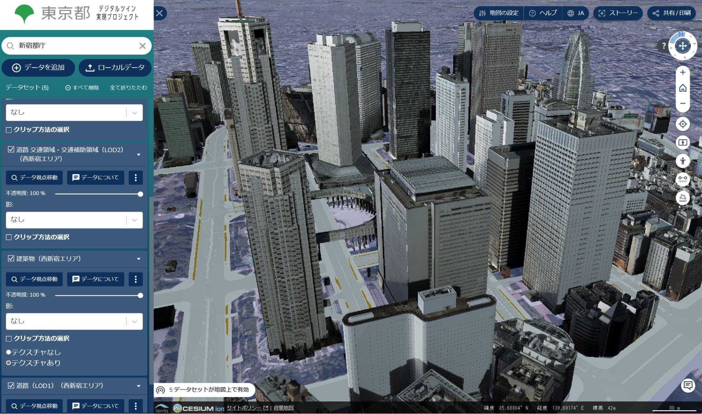

- **交通管理と自動運転**
- **ニューサウスウェールズ州交通管理**
デジタルツインと人工知能を組み合わせた技術により、交通管理はリアルタイムで調整され、渋滞を軽減し、社会的な利益を最大化できます。
- **中国車路雲一体化+リアルタイムデジタルツイン**
本質的には、通信、感知、計算を統合した「通感算」ネットワークです。その核心目標は、現実世界をリアルタイムでデジタル化し、すべてのスマートデバイスをシームレスに接続し、リアルタイムのデータサポートを提供することで、交通をはじめとする産業の効率的な協業、意思決定、処理を実現することです。

具体的には、交差点に「通感算」機能を備えたAIデジタル道路基地局を配置し、AI路側エッジ計算システム（AI-MRS）と組み合わせることで、交通管理者は交差点周辺300メートル以内のすべての交通参加者の動態情報をリアルタイムで取得できます。これらのデータに基づき、システムは即時にデジタルツインモデルを構築し、範囲内のすべての車両に正確でリアルタイムなサービスを提供し、交通をよりスマートで効率的にします！
    
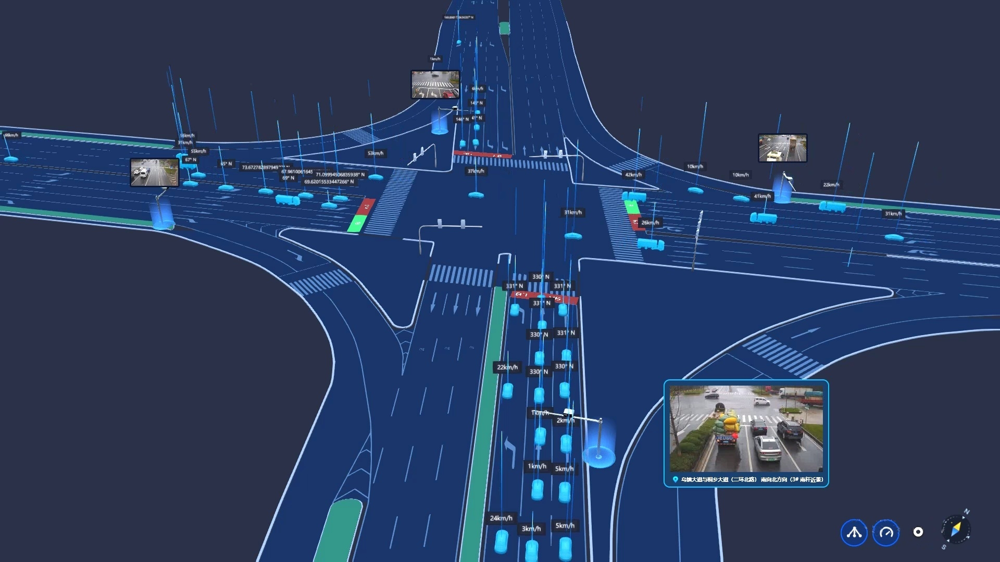

- **医療分野**
- **疾患診断**
空間知能技術は、医療画像データを3D再構築と分析を行うことで、医師がより正確な疾患診断を支援します。例えば、CTやMRIの画像データを3次元モデルに変換することで、人体器官や病変の位置、形状、大きさを明確に可視化できます。これらの立体的な情報は、医師に直感的で正確な診断根拠を提供し、複雑な症例を一目で理解可能にします！
- **手術ナビゲーションと意思決定支援**
空間インテリジェンス技術は、医師に手術ナビゲーションと意思決定支援も提供します。患者の身体構造を 3D モデリングして分析することで、医師は手術部位の解剖学的構造や血管の分布を明確に把握することができます。この直感的な 3 次元ビューにより、医師はより正確な手術を行うことができ、手術の安全性が大幅に向上し、患者により良い治療効果をもたらすことができます。

## 6. Embodied AI
最近、AI の大規模モデルとロボットの融合がますます進んでいることから、業界では「Embodied AI」に対する大きな関心と投資が高まっています。Embodied AI とは、簡単に言えば、AI とロボットの「身体」と「知性」を深く融合させたものです。現在、この技術は AI 技術の深い統合を特徴とする新たな段階に入り、Embodied AI ロボットは最も重要かつ最も潜在的な応用分野とみなされています。

この章では、Embodied AI とは何なのかを簡単に説明し、ロボットを媒体とする「Embodied AI ロボット」の重要な技術と最新の動向に焦点を当てて紹介します。また、その背後にある産業エコシステム、発展経路、この分野で活躍する重要なプレーヤーについても触れます。

### 6.1 概念と内容
Embodied AI は、人工知能をさまざまな物理的本体に組み込んだインテリジェントシステムであり、本体に物理的環境において自律的な知覚、学習、意思決定、行動の能力を与え、物理的環境やタスクに柔軟に適応できるようにするものです。

Embodied AI の内容は、物理的相互作用、汎化適応、自律的進化という 3 つの側面で表現され、インテリジェントシステムの設計開発の動的かつ複雑な性質を強調しています。

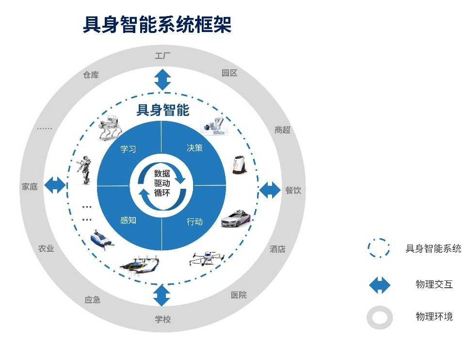

 https://www.idc.com/getdoc.jsp?containerId=prCHC52780624 

### 6.2 主要技術と進展
Embodied AI ロボットの急速な発展を推進する鍵は、技術、特に最近の AI 大規模モデルの急速な進化にあります。現在の大規模モデルは、豊富な知識を備えているだけでなく、複雑な情報を理解し、論理的な推論を行い、さらには自ら「学習してアップグレード」することも可能です。これらの能力は、Embodied AI ロボットの開発に大きな推進力となっています。

Embodied AI では、ロボットは「知覚-学習-意思決定-行動」という 4 つのコア能力モジュールを備えている必要があります。簡単に言えば、「理解でき、考え、決定でき、動く」ということです。この一連の効率的な閉ループを実現するには、ロボットはさまざまな技術を自身に完璧に統合する必要があり、各モジュールには複数の技術的アプローチが選択可能です。この技術の連携は、パズルを 1 枚ずつ組み立てて完全な知能ロボットを完成させるようなものです。

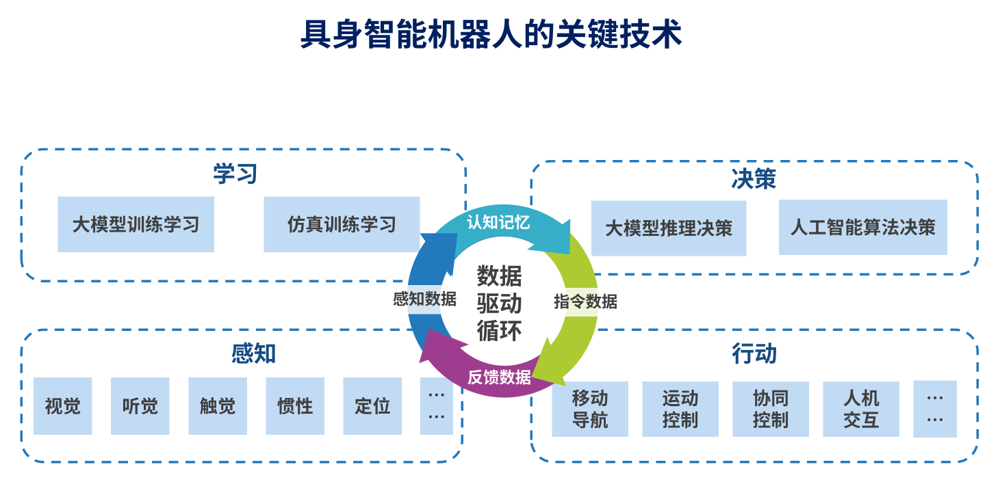

 https://www.idc.com/getdoc.jsp?containerId=prCHC52780624 

### 6.3 産業エコシステムと構成
Embodied AIロボットがさまざまなアプリケーションシーンに対応するためには、さまざまな技術や製品のサポートが不可欠であり、また、これらの複雑なシステムをシームレスに統合する必要があります。産業エコシステム全体を健全に発展させるためには、さまざまな市場プレーヤーが協力し、連携して、この道をより遠く、より確実に前進していく必要があります。

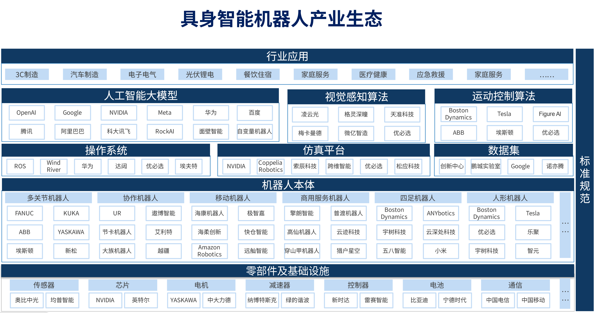

 https://www.idc.com/getdoc.jsp?containerId=prCHC52780624 

 

Embodied AIロボットは、ハイテクな機械のようなもので、ハードウェアとソフトウェアが2つの大きな柱となっています。ハードウェアには、部品、インフラ、ロボット本体など、その「骨格」や「筋肉」となるものが含まれます。一方、ソフトウェアは、ロボットの「頭脳」や「神経系」に相当し、ロボットオペレーティングシステム、シミュレーションプラットフォーム、データセット、AI大型モデル、視覚認識アルゴリズム、運動制御アルゴリズムなど、ロボットを「生き生きと」動かすための重要な要素です。

さらに、業界によってニーズはさまざまであり、特定の場面でロボットの能力を最大限に発揮させるためには、アプリケーション統合サービスも提供する必要があります。また、標準規格の策定は、皆が「ゲームのルール」を理解し、各関係者が円滑に連携して、Embodied AIロボットの開発を推進するための「基盤」となるものです。

### 6.4 開発経路と方法
Embodied AI の産業チェーンでは、皆が力を合わせてその発展を推進しています。現在、Embodied AI ロボットには主に 2 つの開発方向があります。
1. 特定のタスクに特化した非人型ロボット：協働ロボット、商用サービスロボットなど。これらのロボットは、生産ラインのアシスタントや食事提供ロボットなど、特定の用途向けに設計された、専門的な場面でのタスクに特化しています。
2. 多機能なヒューマノイドロボット：これらのロボットは「万能選手」のような存在で、ヒューマノイド形態を基盤に、より多くの汎用タスクを遂行できることを目標とし、「家庭やオフィスで使える万能アシスタント」を目指しています。

要するに、一方の方向は専門分野に特化したルート、もう一方の方向は万能型を目指すルートです。
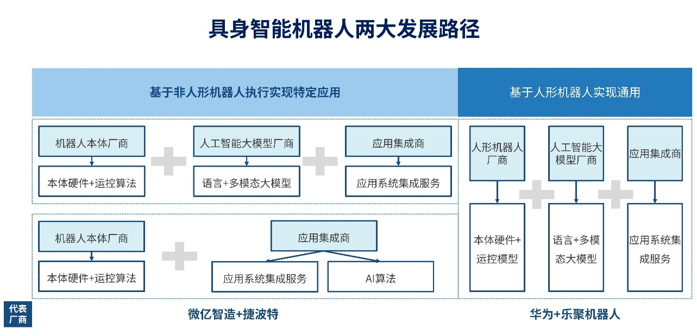

 https://www.idc.com/getdoc.jsp?containerId=prCHC52780624 

### 6.5 技術サプライヤーの重点分野
- **明確な課題を持つシーンに焦点を当てる**
業界の経験を活用し、問題が明確でニーズが急務であり、同時に商業化の見込みが明確な垂直アプリケーションシーンを優先的に選択し、深い探索と技術最適化を行う。要するに、「最も解決が必要な問題」から着手し、効率的に成果を上げる。
- **データを活用して研究開発を強化**
オープンソースのデータと、自社で蓄積したロボットの実際の応用データ、ユーザーフィードバック、業界知識などを組み合わせることで、これらの貴重な「第一の手情報」を、Embodied AIロボットの研究開発とトレーニングに効率的に活用することができます。
- **さまざまな協力モデル、共同成長**
技術協力、市場開拓、株式投資など、さまざまな形でパートナーと深い関係を構築し、ハードウェアとソフトウェアの効率的な統合、例えば部品とロボット本体、モデルとロボット本体の連携効果を推進し、実用化への移行を加速します。

### 6.6 オープンソースのEmbodied AIロボット
現在、世界、特に中国では、Embodied AIロボット分野が急速に発展しており、人工知能とロボットの融合の最前線として注目されています。Embodied AIロボットは、技術面で大きな進歩を遂げただけでなく、実際の応用でもその存在感を際立たせ始めています。大手テクノロジー企業やスタートアップ企業が相次いでこの分野に参入し、工業生産、物流、医療、教育、家庭サービスなどの分野向けに、さまざまな革新的な製品を発表しています。

- **中国における開発状況**
中国では、Embodied AI ロボットの開発が特に注目されています。強力な製造能力、豊富な応用シーン、オープンな技術エコシステムにより、中国企業は、この分野において急速に台頭しており、多くの中国企業が、技術共有とイノベーションを推進するために、オープンソースプロジェクトを積極的に立ち上げています。以下は、オープンソースのEmbodied AI ロボットメーカーとそのオープンソースの状況の一部です。その中、元 Huawei エンジニアである稚晖君（Zhi Hui Jun）が設立した**智元ロボット**は、この業界におけるスター企業となっています。

| **会社名** | **OSSプロジェクト** | **影響力** |
| -------- | -------- | -------- |
| **智元ロボット** | 汎用具身ロボット「Lingxi X1」をオープンソース化し、2024年に1000台の量産開始 | 具身AIロボットの普及を推進し、業界の技術共有と協力を促進 |
| **智元ロボット** | 世界初の実際のシーンに基づく 100 万件の実際の機械データセット「AgiBot World」をオープンソース化 | 産学連携を促進し、Embodied AI 分野の発展を加速 |
| **北京Embodied AIロボットイノベーションセンター** | Embodied AI業界向けにオープンソース化・オープン化を図る「天工オープンソース計画」を発表 | Embodied AI分野の技術革新とエコシステムの構築を促進 |
| **IO-AI** | 50 万件以上のデータを含む、複数のシナリオとスキルを網羅したEmbodied AIデータセットをオープンソース化 | Embodied AIロボットの研究開発に豊富なデータサポートを提供し、業界の発展を加速 |
| **NimbRo** | 成人サイズのオープンソース3Dプリント人形ロボット「NimbRo-OP2X」を開発 | 研究機関と開発者に低コストで高性能な研究プラットフォームを提供し、人形ロボット研究の発展を推進 |

    
 

- **智元ロボットのオープンソース実践**
智元ロボットは**フルスタックオープンソース**の形態を通じて、業界に大きな推進力をもたらしました。 彼らはコアアルゴリズムとソースコードを公開するだけでなく、ハードウェア設計方案（霊犀X1）を提供し、さらに世界初の現実のシーンに基づく百万台の実機データセット「AgiBot World」をオープンソース化しました（このデータセットの規模と品質は既存の類似データセット（例：Google Open X-Embodimentデータセット）を大幅に上回り、長距離データ規模は10倍、シーンカバー率は100倍に達しています）。これにより、完全なオープンソースエコシステムが形成されました。 このようなオープン性により、より多くの開発者や企業が低コストでEmbodied AIロボットの開発に参加できるようになり、技術の普及と革新が加速しています。

 

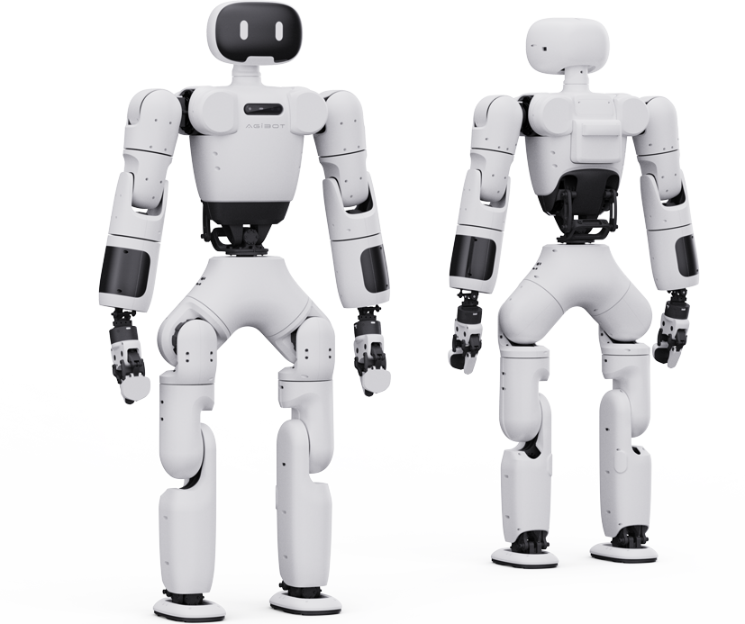

 智元霊犀 X1 全スタックオープンソースロボット
 

 

- **智元ロボットのフルスタックオープンソースの影響**：
1. **技術的ハードルが低下**：オープンソース化により、より多くの中小企業や個人開発者がEmbodied AI分野に参入する機会が生まれ、技術の普及が加速しました。
2. **コミュニティのエコシステムが拡大**：智元ロボットは、多くの開発者が関連技術を共同で最適化および改良し、業界全体の技術革新を推進しています。
3. **国産技術の革新**：オープンソースモデルは、中国企業の技術力を示し、同時に、世界における中国のEmbodied AIロボット分野での影響力を高めています。
4. **多様なアプリケーションの迅速な実用化**：オープンソース化により、企業はさまざまな業界のニーズに迅速に対応し、製品の実用化を実現することができます。

世界的なEmbodied AIロボットは現在、飛躍の段階にあり、中国は間違いなくこの変革における重要な力となっています。智元ロボットなどのオープンソースのパイオニアの出現は、技術開発を加速するだけでなく、業界にオープンな協力の模範を確立しています。今後、より多くの企業や開発者が参加することで、Embodied AIロボットはより多くの分野でその大きな可能性と価値を発揮していくでしょう。

### 6.7 One more thing! 
**オープンソースの生成型 AI が Embodied AI を実現、Genesis が正式リリース**

Genesis は、生成モデル機能を組み合わせた Embodied AI 研究プラットフォームです。この研究プラットフォームは、汎用物理エンジン、ロボットシミュレーションプラットフォーム、写真品質のレンダリングシステム、データ生成エンジンで構成されており、その中のデータ生成エンジンは、生成型 AI 技術を使用して、自然言語をさまざまなモジュールのトレーニングデータに変換することができます。

このプロジェクトは、MIT-IBM Watson AI Lab のチーフサイエンティストである Gan Chuang 博士が率いるチームによって開発されました。同チームは 2023 年末に、生成型 AI 技術を利用してロボットに無限の学習データを提供し、トレーニングを完全に自動化するフレームワーク「RoboGen」を紹介する論文を発表し、世界中から注目を集めました。1 年以上の開発を経て、RoboGen フレームワークは、Embodied AI 研究プラットフォーム「Genesis」として正式にオープンソース化され、ネット上で大反響を呼びました。

OpenDigger のデータによると、Genesis プロジェクトは 2024 年 12 月 19 日の公開以来、10 日間で 500 人以上の開発者が議論に参加し、21 人がプロジェクトの貢献者となり、2 万近くのスターを獲得しています。読者の皆様も引き続きご注目ください。

## 7. 人工知能エージェント（AI Agent）
本章は、2024年に世界経済フォーラムが発表した「人工知能エージェントの進化と影響に関する白書」、甲子光年智庫が発表した「中国AIエージェント業界調査報告書」、CSETワークショップ報告書などを参考にしています。急速に進化するAIエージェント分野において、読者に一瞥の価値を提供するよう努めました。

### 7.1 進化の経緯
20世紀50年代に始まり、ルールや行動が確定した単純なシステムから、不確実性を処理し、学習と適応能力を有する複雑なシステムへと発展しました。これは計算能力の向上、データ量の増加、アルゴリズムの突破口（例：大規模モデルや機械学習技術）に支えられています。

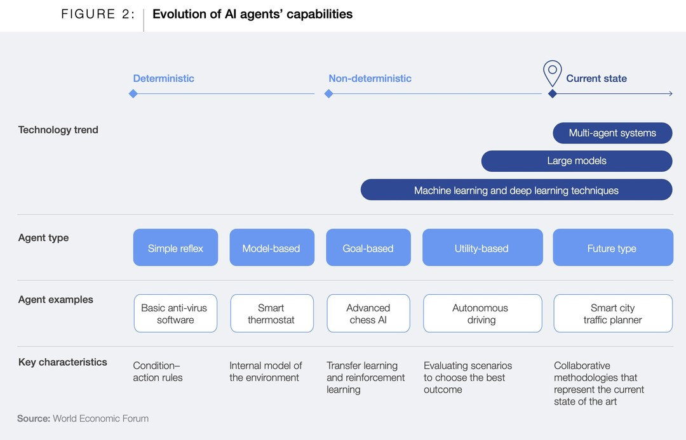

### 7.2 定義と主要なコンポーネント
- AIエージェントは、環境を認識し、自律的に意思決定を行い、行動を実行して目標を達成する自律システムです。センサー、エフェクター、制御センターなどの主要なコンポーネントから構成され、物理的またはデジタルな環境で動作可能です。ユーザー入力の受信、環境の認識、意思決定と計画、行動の実行を通じて環境を変化させます。

    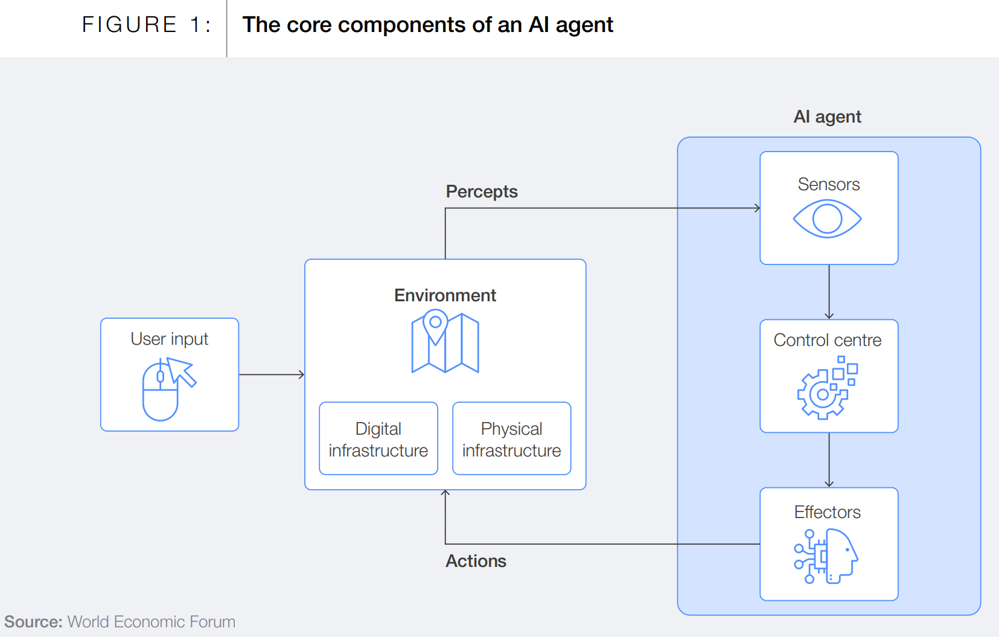

- 2024年はAIエージェントの飛躍の年であり、製品が徐々にコパイロットモードからAIエージェントへの移行を模索する年でもあります。 そのため、市場では自動化度の高いコパイロット製品を汎用的なエージェント概念製品として位置付ける傾向があります。コパイロットとエージェントの最大の違いは「自律的な計画立案」能力にあります：コパイロットは人間の指示を必要とするモードを採用しています。一方、エージェントは目標タスクに直接対応し、自律的な記憶、推論、計画立案、実行の全自動化能力を備えています。そのため、最終形態のAIエージェントはユーザーの初期指示と結果のフィードバックのみを必要とし、プロセス中に人間の介入は不要です。

    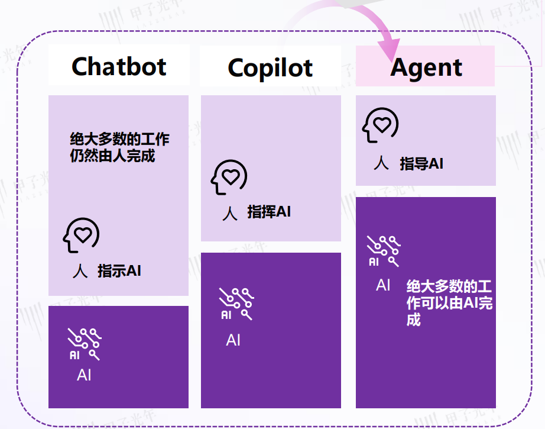
    > 
 甲子光年智庫 - 中国AIエージェント業界調査報告書

 

- Copilot と Agent の混同点は、「ワークフロー」の「自動化」の区別にあります：完了効果から見ると、作業は人為的に無限に分割可能であり、一部の「Copilot製品+自動化」は単一の作業単位の完全な自動化を実現できます。

| **名称** | **自动化的实现方式** | **内容** |
| -------- | -------- | -------- |
| **チャットボット** | / | 人間がほとんどの作業を完了し、AI に質問や情報収集を依頼し、AI は情報提供や提案を行うが、直接作業は行わない |
| **コパイロット** | 複雑なプロンプトを活用して自動化を実現 | 人間とAIが協業し、作業量はほぼ同等。AIは人間のプロンプトに基づいて作業の草案を作成し、人間が目標設定、修正調整を行い、最終確認を行う |
| **エージェント** | 目標を設定して自動化を実現 | AIがほとんどの作業を完了し、人間は目標設定、リソース提供、結果の監督を担当。AIはタスクの分割、ツール選択、進捗管理を行い、目標達成後、自主的に作業を終了する |

### 7.3 タイプと特徴
単純な反射、モデルベースの反射、目標ベースの反射、ユーティリティベースの反射など、異なる意思決定方式と特徴を有するタイプが含まれます。これらのタイプは、単純なルールマッピングから複雑な多目的トレードオフ意思決定までをカバーします。現在の多くのAIエージェントアーキテクチャは、大規模言語モデルを基盤とし、複数のコンポーネントが協働する能力を備えています。例えば、自動車のインフォテインメントシステムにおけるAIエージェントなどが該当します。
1. **高度なAIエージェント**（Advanced AI agent）： 強力な自律性、大規模モデルを基盤とし、複数の構成要素を含むAIエンティティで、複雑なタスクを処理し継続的に学習する能力を有する。
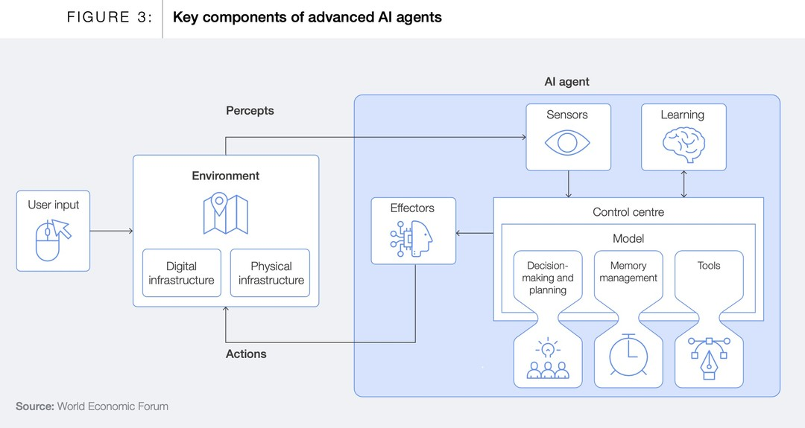

2. **AI エージェントシステム**（AI agent system）： 複数の異なる機能を持つ AI エージェントが協力して、より複雑なタスクを実行するシステム。

3. **マルチエージェントシステム**（Multi-agent system， MAS）：複数の知能主体（AI エージェント、AI エージェントシステム、人間ユーザーなど）を統合し、異なる設計を通じて相互作用と協働を行い、共通の目標を達成するシステム。例えば自動運転車システムなど。MAS は複数の独立した知能主体または知能主体システムが協働し、ネットワークや監督などのアーキテクチャタイプを有し、効率と能力を向上させますが、知能主体間の通信や相互運用性の課題に直面します。例えば交通管理における MAS の応用など。

    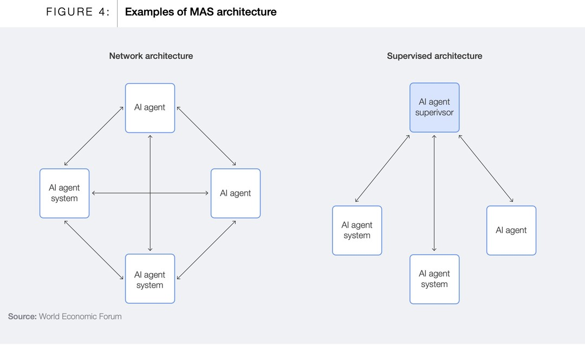

4. **人工知能エージェント、人工知能エージェントシステム、およびマルチエージェントシステム間の構造と関係**

    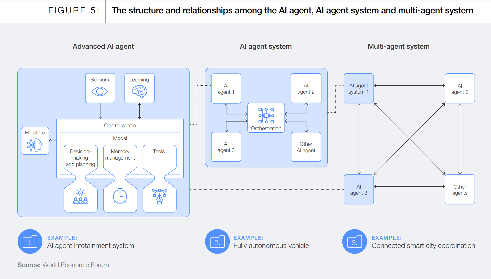

### 7.4 ワークパターンが根本から覆される
- エージェントの商業的価値はワークパターンの違いに依存しており、ワークパターンの変化は新たなスマート時代の幕開けを意味する。

    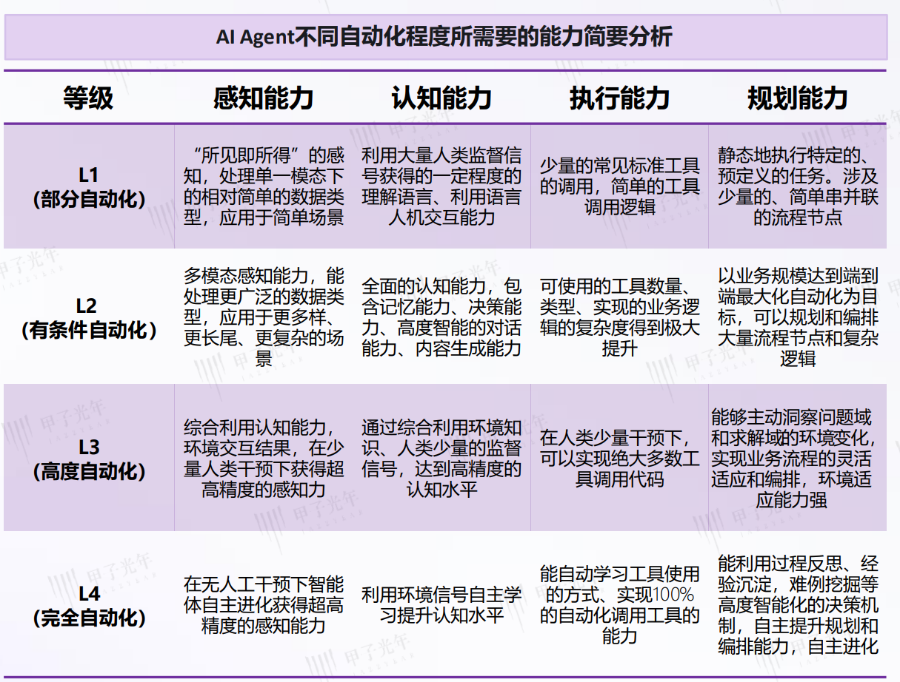
    > 
 甲子光年智庫 - 中国AIエージェント業界調査報告書

 

- プロセス指向 vs. 目標指向
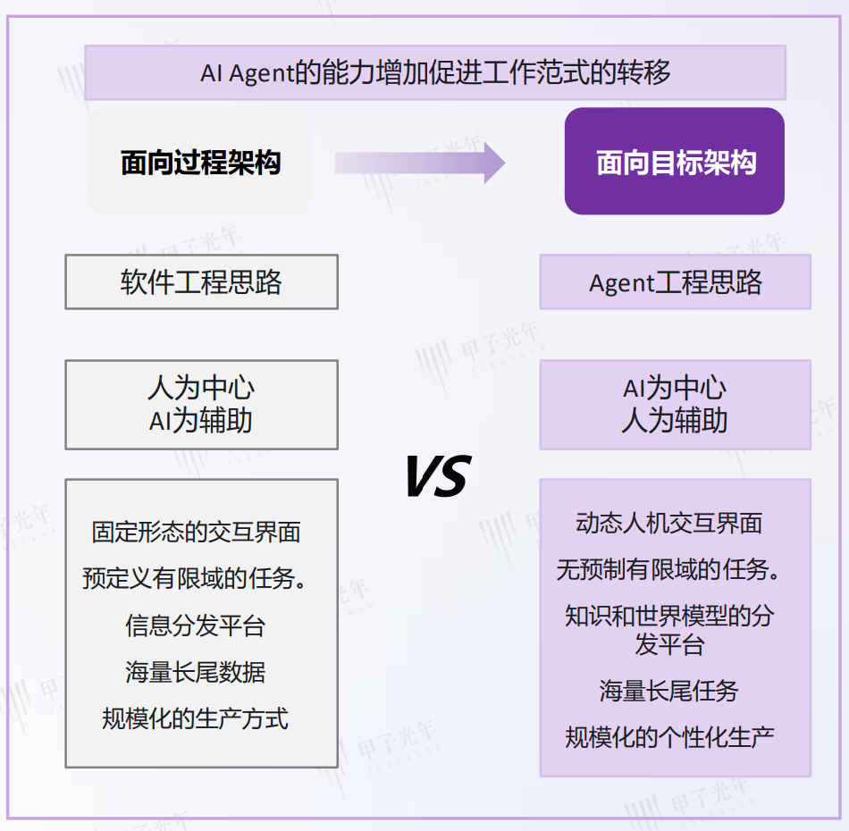
    > 
 甲子光年智庫 - 中国AIエージェント業界調査報告書

 

### 7.5 応用分野
AIエージェントは、以下の分野において幅広い応用可能性を示しています：
- ワークフロー自動化： 企業の効率向上。
- 個人アシスタント： パーソナライズされたサービスの提供。
- 医療・保健： 患者体験の向上。
- 教育： パーソナライズド学習の支援。
- ...

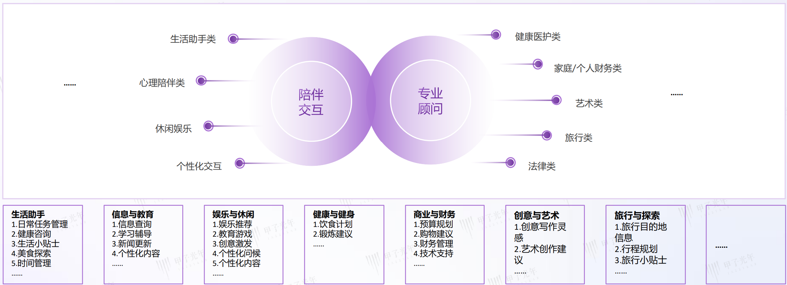

> 
 甲子光年智庫 - 中国AIエージェント業界調査報告書

### 7.6 中国のAIエージェント生態系マップ
- 現在の中国のAIエージェント市場は、インターネット大手企業、生成AI企業、エンタープライズサービスSaaS企業、スタートアップ企業、3C企業など、多様な企業が多様な形で参入しています。これらの企業は、自社の技術や業界知識を活かし、市場に迅速に参入し、先手を打ってより良い生態系ポジションを確保しています。また、ますます多くの企業が製品の開発とシーンの探索を進めています。
- これらの先駆者の商業的価値が徐々に顕在化するにつれ、中国AIエージェントの多様性はさらに拡大し、AIエージェントに参入する企業の数は爆発的に増加する見込みです。

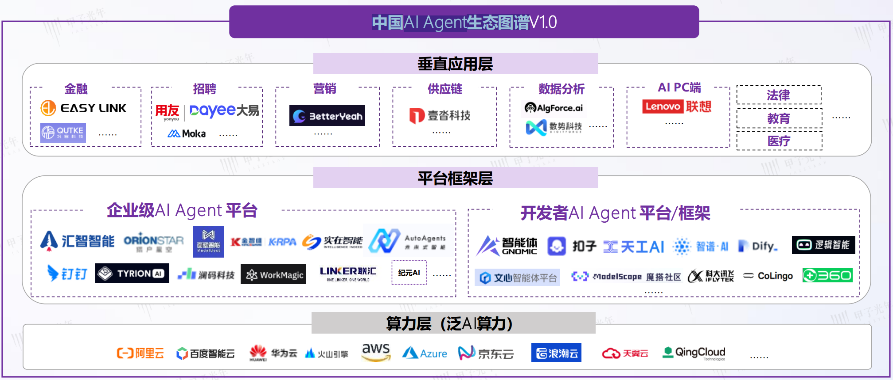
> 
 甲子光年智庫 - 中国AIエージェント業界調査報告書

- 注目すべきインターネット大手企業と新興プロバイダー
- 百度：文心スマートエージェントプラットフォーム
- 字節跳動：扣子 Coze
- 阿里雲：釘釘
- 用友：大易
- 匯智智能
- 注目すべき海外企業
- OpenAI
- IBM
- AWS

### 7.7 影響と対応策
AIエージェントの普及は、生産性向上や顧客体験の改善など、ソフトウェア開発、医療、教育、金融など多様な分野での応用を通じてメリットをもたらす可能性があります。一方で、技術的、社会経済的、倫理的なリスクも伴います。例えば、技術的な故障、技術への過度の依存が雇用構造の変化や倫理的な課題を引き起こす可能性があります。したがって、技術改善、一般市民への教育、倫理基準の策定、規制の強化など、対応策を検討し、その安全で信頼性があり、有益な発展を確保する必要があります。

## 8. 圧縮された21世紀
本稿の結びに、編者はAnthropic社のCEOであるDario Amodeiが2024年10月に発表した「**強力なAIは21世紀に私たちに何をもたらすか**？」という長文を、2025年の蛇年春節直前に皆様と共有し、未来の人類社会の可能性と反省を共に考えたいと思います。

>  読者の皆様には、この翻訳文をじっくりとお読みいただくことをおすすめします。：https://news.qq.com/rain/a/20241029A03T0400?utm_source=chatgpt.com

ダリオは記事で、強力な人工知能（AI）が21世紀に与える潜在的な影響について考察し、AIが複数の分野で重大な突破口を開く可能性があると指摘しています。

**生物学と医学**：ダリオは、AIが生物学と医学の進歩を加速させ、今後5~10年で従来50~100年かかっていた成果を短期間で達成すると予測しています。彼はこの現象を「圧縮された21世紀」と表現し、AIが人類が1世紀分の生物医学的成果を短期間で達成可能にするとしています。

**神経科学とメンタルヘルス**：AIの進歩は、大多数の精神疾患の治療を大幅に改善し、甚至いはこれらの疾患を治癒する可能性もあります。同時に、AIは人間の認知と感情の能力を拡張し、「認知と心理の自由」を向上させる可能性があります。

**経済発展と貧困の撲滅**：ダリオは、AIが健康、経済、政治などにおいて開発途上国にポジティブな影響をもたらす可能性があると指摘していますが、これにはグローバルな協力が不可欠であり、これらの国々が置き去りにされないよう確保する必要があります。

**平和と統治**：彼は、AI の発展が正しい論理に従う場合、最終的に人類を法治、民主主義、啓蒙の価値観へと導く可能性があると指摘しています。このプロセスは必然的なものではありませんが、統計的な傾向から、AI は人類がこれらの目標 towards 向かうペースを加速し、方向性をより明確にし、目標をより明確にするでしょう。

**仕事と人生の意義**：AIの発展は、不平等や経済成長の問題、道徳や選択の自由に関する問題など、いくつかの課題をもたらす可能性があります。それでも、AIは自由、個人の権利、法の下の平等を保障する手段となり、より良い世界を実現する可能性を秘めています。

最後に、ダリオはAIが多くの課題とリスクをもたらすものの、誰もが恩恵を受ける積極的な結果を目指して努力し、人々が団結して未来の課題に共同で対応するよう呼びかけました。
